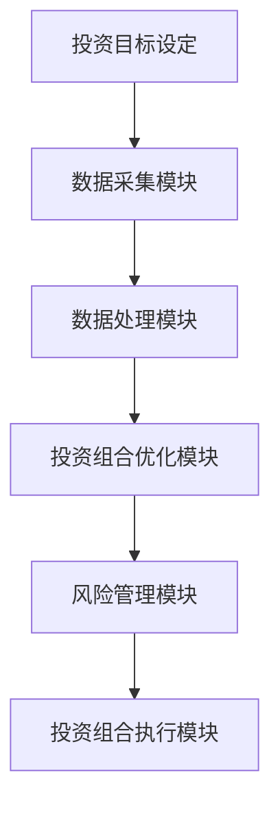
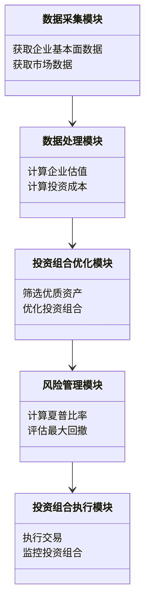
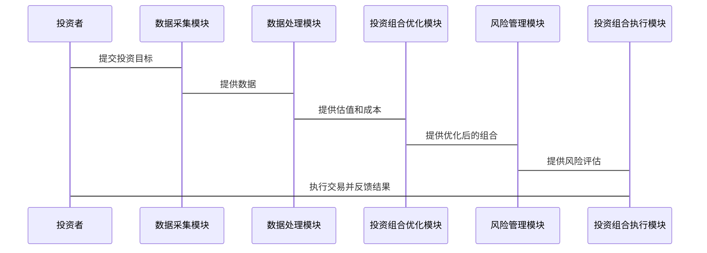

                 


# 约翰·博格尔的成本敏感型价值投资：长期回报的关键

---

## 关键词：成本敏感型价值投资，约翰·博格尔，价值投资，长期回报，投资策略，投资组合管理

---

## 摘要： 

约翰·博格尔是投资界的重要人物，他提出的成本敏感型价值投资理念，强调通过关注企业的基本面和长期价值，结合对投资成本的严格控制，以实现超越市场的长期回报。本文将从成本敏感型价值投资的定义、核心原理、数学模型、系统架构设计、项目实战等方面展开分析，深入探讨这一投资策略的内在逻辑和实际应用。

---

## 正文

### 第一部分：成本敏感型价值投资的背景与概念

#### 第1章：成本敏感型价值投资的概述

##### 1.1 成本敏感型价值投资的定义与核心要素

成本敏感型价值投资是一种以长期价值为导向的投资策略，其核心在于通过对企业基本面的深入分析，结合对投资成本的严格控制，挖掘具有可持续竞争优势的企业，从而实现超越市场平均水平的长期回报。以下是成本敏感型价值投资的核心要素：

1. **低费用率**：通过控制投资成本（如管理费、交易费用等），最大化投资组合的净收益。
2. **长期持有**：强调长期投资，避免频繁交易，降低交易成本和税收负担。
3. **安全边际**：通过买入价格低于企业内在价值的股票，确保投资的安全性。

##### 1.2 成本敏感型价值投资的历史发展

成本敏感型价值投资的理念起源于20世纪30年代，由本杰明·格雷厄姆提出，强调以低于内在价值的价格买入优质股票。约翰·博格尔在其基础上，进一步强调了成本控制的重要性。他指出，长期来看，投资成本是影响投资回报的关键因素之一。

##### 1.3 成本敏感型价值投资与传统价值投资的对比

| 对比维度                | 成本敏感型价值投资               | 传统价值投资                 |
|-------------------------|----------------------------------|-------------------------------|
| 核心理念                | 以成本控制为核心，挖掘长期优质资产 | 以企业基本面分析为核心       |
| 投资策略                | 强调低成本、长期持有的投资策略   | 强调买入低于内在价值的股票   |
| 风险管理                | 通过分散投资和成本控制降低风险   | 通过安全边际降低投资风险     |

---

### 第二部分：成本敏感型价值投资的核心原理

#### 第2章：成本敏感型价值投资的原理与方法

##### 2.1 成本敏感型价值投资的基本原理

成本敏感型价值投资的核心原理是：通过降低投资成本，最大化投资组合的长期回报。以下是其实现路径：

1. **降低管理成本**：通过选择低成本的指数基金或ETF，降低管理费用。
2. **降低交易成本**：通过长期持有，减少交易频率，降低交易成本和税收。
3. **提高投资效率**：通过精选优质资产，提高投资组合的收益能力。

##### 2.2 成本敏感型价值投资的关键方法

1. **企业基本面分析**：通过分析企业的财务报表、行业地位、竞争优势等因素，筛选出具有长期增长潜力的企业。
2. **企业估值方法**：通过市盈率、市净率等指标，评估企业的内在价值，确定买入价格。
3. **投资组合管理策略**：通过分散投资、定期再平衡等方法，降低投资组合的风险。

---

### 第三部分：成本敏感型价值投资的数学模型与算法

#### 第3章：成本敏感型价值投资的数学模型

##### 3.1 投资回报的计算公式

投资回报率（ROI）的计算公式如下：

$$ ROI = \frac{投资收益 - 投资成本}{投资成本} \times 100\% $$

其中，投资收益包括资本增值和股息收益，投资成本包括初始投资和交易费用。

##### 3.2 资产定价模型

资产定价模型（CAPM）用于评估资产的预期回报率：

$$ E(R_i) = R_f + \beta_i (E(R_m) - R_f) $$

其中：
- $R_f$ 是无风险利率
- $\beta_i$ 是资产的贝塔系数
- $E(R_m) - R_f$ 是市场预期回报率

##### 3.3 风险管理模型

通过夏普比率（Sharpe Ratio）评估投资组合的风险调整后收益：

$$ \text{夏普比率} = \frac{E(R_p) - R_f}{\sigma_p} $$

其中：
- $E(R_p)$ 是投资组合的预期回报率
- $R_f$ 是无风险利率
- $\sigma_p$ 是投资组合的收益标准差

---

### 第四部分：成本敏感型价值投资的系统分析与架构设计

#### 第4章：成本敏感型价值投资的系统架构

##### 4.1 系统架构概述

以下是成本敏感型价值投资系统的架构图：



##### 4.2 系统功能设计

以下是系统的功能模块图：



##### 4.3 系统接口设计

以下是系统接口设计：



---

### 第五部分：成本敏感型价值投资的项目实战

#### 第5章：成本敏感型价值投资的项目实战

##### 5.1 环境安装

要实现成本敏感型价值投资策略，首先需要安装以下工具和库：

1. Python编程语言
2. 数据分析库（Pandas、NumPy）
3. 可视化库（Matplotlib、Seaborn）
4. 量化投资库（Pymc、Pyfolio）

##### 5.2 核心代码实现

以下是实现成本敏感型价值投资的核心代码示例：

```python
import pandas as pd
import numpy as np
import matplotlib.pyplot as plt

# 数据采集模块
def get_data(tickers, start_date, end_date):
    # 获取股票数据
    pass

# 数据处理模块
def calculate_valuation(df):
    # 计算企业估值
    df['PE'] = df['Price'] / df['Earnings_per_share']
    return df

# 投资组合优化模块
def optimize_portfolio(returns, constraints):
    # 使用现代投资组合理论优化投资组合
    pass

# 风险管理模块
def calculate_sharpe_ratio(returns, risk_free_rate):
    excess_return = returns - risk_free_rate
    sharpe_ratio = excess_return.mean() / excess_return.std()
    return sharpe_ratio

# 投资组合执行模块
def execute_trades(portfolio, current_positions):
    # 执行交易并调整投资组合
    pass
```

##### 5.3 案例分析

假设我们有一个包含5只股票的投资组合，我们可以通过以下步骤进行分析：

1. 数据采集：获取5只股票的历史数据。
2. 数据处理：计算每只股票的市盈率（PE）。
3. 投资组合优化：根据PE值筛选出具有较低PE的股票。
4. 风险管理：计算投资组合的夏普比率。
5. 投资组合执行：根据优化结果执行交易。

##### 5.4 项目小结

通过以上步骤，我们可以实现一个简单但有效率的成本敏感型价值投资系统。需要注意的是，实际投资中还需要考虑更多的因素，如市场风险、流动性风险等。

---

### 第六部分：最佳实践、小结、注意事项、拓展阅读

#### 6.1 最佳实践

1. **分散投资**：通过分散投资降低风险。
2. **定期再平衡**：定期调整投资组合，确保符合投资目标。
3. **长期持有**：避免频繁交易，降低交易成本。

#### 6.2 小结

成本敏感型价值投资是一种以长期价值为导向的投资策略，其核心在于通过控制成本和精选优质资产，实现超越市场的长期回报。本文从理论到实践，详细介绍了这一投资策略的实现过程。

#### 6.3 注意事项

1. **市场波动**：投资市场存在不确定性，需做好心理准备。
2. **风险管理**：严格控制投资风险，避免过度杠杆。
3. **持续学习**：投资市场不断变化，需持续学习和调整策略。

#### 6.4 拓展阅读

1. 《The Intelligent Investor》——本杰明·格雷厄姆
2. 《The Index Investors’ Guide》——约翰·博格尔

---

### 结语

通过本文的分析，我们可以看到，成本敏感型价值投资不仅是一种投资策略，更是一种长期价值导向的投资理念。只要我们能够在实践中不断优化和完善，就能够实现超越市场的长期回报。

