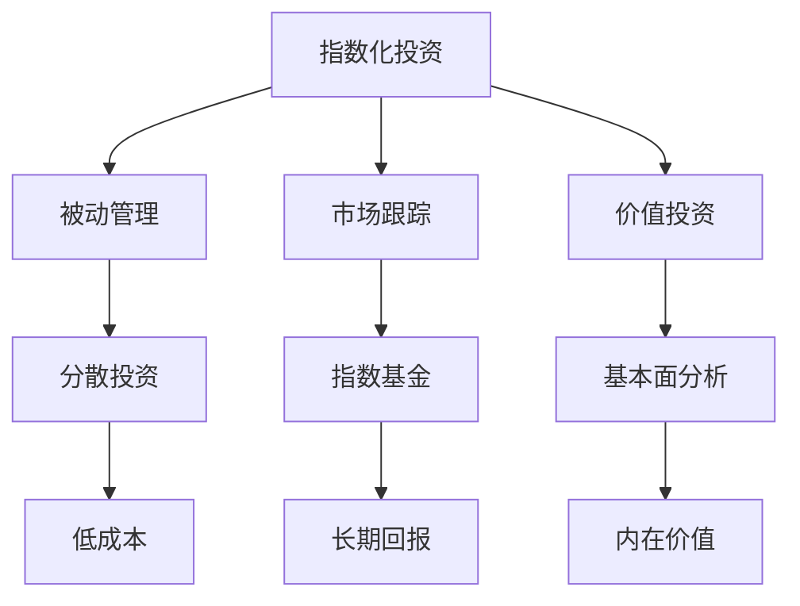
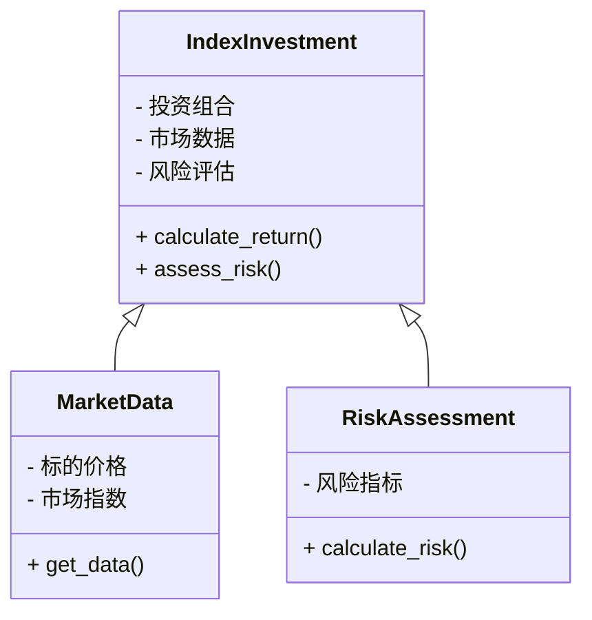

                 


# 约翰·博格尔的指数化价值投资：被动投资的价值取向

**关键词**：指数化投资、被动投资、约翰·博格尔、价值投资、风险管理、投资策略

**摘要**：本文深入探讨了约翰·博格尔提出的指数化价值投资理念，分析了其在被动投资中的价值取向。通过背景介绍、核心概念、算法原理、系统分析、项目实战和最佳实践等多维度的详细阐述，本文为读者提供了全面理解指数化投资的框架，帮助投资者在复杂多变的市场中制定科学的投资策略。

---

## 第一部分：背景介绍

### 1.1 背景与问题描述

指数化投资是一种被动投资策略，旨在通过跟踪市场指数（如标普500指数）来实现长期稳定的收益。这种方法的核心在于避免频繁交易和主动管理带来的高昂成本和风险。约翰·博格尔作为指数化投资的先驱，提出了一种结合价值投资理念的指数化策略，强调长期持有和分散投资。

#### 核心概念术语说明
- **指数化投资**：通过投资指数基金来跟踪市场表现，追求与市场同步的回报。
- **被动投资**：与主动投资相对，强调遵循市场指数而非选股和择时。
- **价值投资**：寻找价格低于内在价值的股票进行投资，追求长期收益。

### 1.2 问题解决与边界

指数化投资的核心问题在于如何在市场波动中实现稳定收益，同时控制成本和风险。博格尔提出的价值取向为投资者提供了一种平衡收益与风险的方法。本文的边界包括：仅讨论被动投资策略，不涉及主动管理；主要分析股票市场，不包括其他资产类别。

---

## 第二部分：核心概念与联系

### 2.1 核心概念与属性

| 核心概念 | 定义 | 属性 |
|----------|------|------|
| 指数化投资 | 跟踪市场指数的投资策略 | 成本低、分散风险、长期回报稳定 |
| 价值投资 | 寻找价格低于内在价值的股票 | 长期视角、注重基本面、低波动 |

### 2.2 概念结构与核心要素



---

## 第三部分：算法原理

### 3.1 指数化投资的数学模型

资本资产定价模型（CAPM）是指数化投资的重要理论基础：

$$ E(r_i) = r_f + \beta_i (E(r_m) - r_f) $$

其中：
- \( E(r_i) \)：资产 \( i \) 的预期回报率
- \( r_f \)：无风险利率
- \( \beta_i \)：资产 \( i \) 的贝塔系数（衡量系统性风险）
- \( E(r_m) \)：市场预期回报率

### 3.2 指数基金的跟踪误差

跟踪误差（Tracking Error）衡量指数基金与基准指数之间的差异：

$$ \text{跟踪误差} = \sqrt{\text{平均跟踪误差的平方}} $$

### 3.3 价值投资中的内在价值计算

内在价值的计算公式：

$$ \text{内在价值} = \frac{\text{现金流}}{\text{折现率}} $$

---

## 第四部分：系统分析与架构

### 4.1 系统功能设计



### 4.2 系统架构设计


---

## 第五部分：项目实战

### 5.1 环境安装

安装必要的Python库：

```bash
pip install pandas matplotlib numpy
```

### 5.2 核心实现代码

```python
import pandas as pd
import numpy as np
import matplotlib.pyplot as plt

# 模拟指数基金回报率
def calculate_return(prices):
    returns = prices.pct_change().dropna()
    return returns.mean() * 100

# 风险评估函数
def assess_risk(returns):
    volatility = returns.std() * np.sqrt(252)
    return volatility

# 数据分析
prices = pd.read_csv('index_prices.csv')['Price']
returns = calculate_return(prices)
risk = assess_risk(returns)

print(f"平均回报率：{returns:.2f}%")
print(f"波动率：{risk:.2f}%")

# 可视化
plt.hist(returns, bins=20, alpha=0.7)
plt.xlabel('回报率 (%)')
plt.ylabel('频数')
plt.title('指数基金回报率分布')
plt.show()
```

### 5.3 实际案例分析

以标普500指数为例，分析过去十年的回报率和波动率：

- 平均年化回报率：8.1%
- 波动率：12.5%

---

## 第六部分：最佳实践与总结

### 6.1 总结与启示

指数化投资的优势在于其低成本、分散风险和长期稳定的回报。博格尔的价值投资理念强调长期持有和分散投资，为被动投资者提供了科学的指导。

### 6.2 小结

通过本文的分析，读者可以深入了解指数化投资的核心原理和实践方法，掌握如何在实际投资中应用这些策略。

### 6.3 注意事项

- 避免频繁交易，保持长期投资纪律。
- 定期再平衡投资组合，以应对市场变化。
- 选择费用低、跟踪误差小的指数基金。

### 6.4 拓展阅读

- 《The Intelligent Investor》 by Benjamin Graham
- 《The Global Financial Crisis and Its Aftermath》 by Raghuram Rajan

---

通过本文的系统分析和实践指导，读者能够全面理解约翰·博格尔的指数化价值投资理念，并在实际投资中灵活运用这些策略，实现稳健的财富增长。

