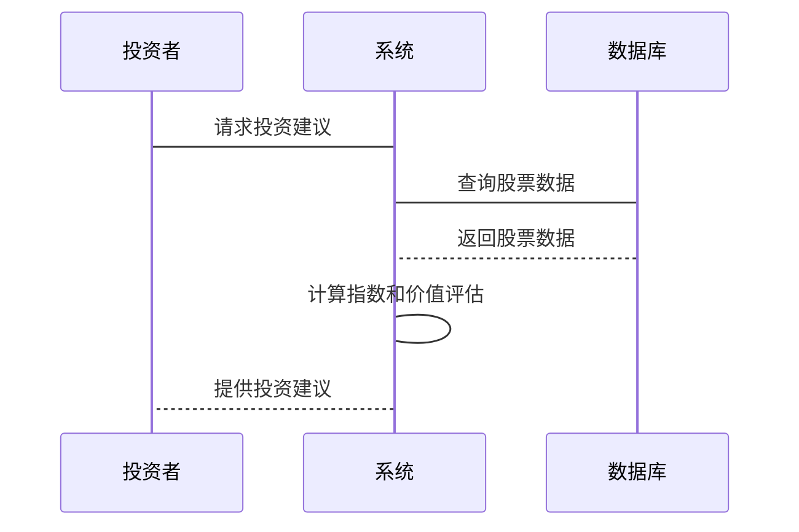

                 


# 约翰·博格尔的指数基金革命与价值投资

## 关键词：指数基金，价值投资，约翰·博格尔，投资策略，数学模型

## 摘要：  
本文深入探讨了约翰·博格尔对指数基金革命的贡献及其与价值投资的结合。通过分析指数基金的核心原理、价值投资的理论基础以及两者结合的投资策略，本文为读者提供了从理论到实践的全面指导。通过数学模型和系统架构的设计，展示了如何将指数基金与价值投资的理念应用于实际投资中，帮助投资者做出更明智的决策。

---

# 第1章 指数基金与价值投资的背景介绍

## 1.1 指数基金的起源与发展

### 1.1.1 从传统投资到指数投资的演进

传统投资方式主要包括主动管理和个股投资，但其高成本、高风险和低透明度的特性使得普通投资者难以参与。20世纪70年代，约翰·博格尔创立了第一只指数基金，标志着指数投资的诞生。指数基金通过跟踪特定指数（如标普500）进行投资，具有分散风险、低成本和高透明度的特点。

### 1.1.2 约翰·博格尔的贡献与影响力

约翰·博格尔被誉为“指数基金之父”，他不仅发明了第一只指数基金，还通过大量的研究和实践证明了指数投资的长期优势。他的工作改变了全球的投资方式，使得普通投资者能够以更低的成本进行长期投资。

### 1.1.3 指数基金的核心概念与特点

指数基金的核心概念是通过跟踪指数来实现投资收益。其特点包括：
1. **分散化投资**：通过投资指数中的所有成分股，降低个股风险。
2. **低成本**：管理费用低，适合长期投资。
3. **被动管理**：不频繁交易，减少税务负担。

## 1.2 价值投资的定义与历史

### 1.2.1 价值投资的起源与发展

价值投资起源于20世纪20年代，由本杰明·格雷厄姆和戴维·多德提出。其核心理念是寻找市场价格低于其内在价值的股票进行投资。

### 1.2.2 价值投资的核心理念与原则

价值投资强调长期视角和安全边际。投资者应寻找那些被市场低估的股票，并在市场恐慌时买入，市场狂热时卖出。

### 1.2.3 价值投资与指数投资的异同

价值投资注重个股选择，而指数投资注重分散化。两者的核心目标都是为投资者创造长期价值。

## 1.3 指数基金与价值投资的结合

### 1.3.1 指数基金的互补性

指数基金提供分散化投资，而价值投资提供个股选择的策略。两者的结合可以平衡风险与收益。

### 1.3.2 约翰·博格尔对价值投资的启示

博格尔的低成本指数投资理念为价值投资提供了新的思路，即通过分散化降低风险。

### 1.3.3 价值投资在指数基金中的应用

通过分析指数成分股的内在价值，优化指数基金的投资组合。

---

# 第2章 指数基金的革命性原理

## 2.1 指数基金的核心原理

### 2.1.1 指数基金的构建逻辑

指数基金通过复制特定指数的成分股来实现收益。其构建逻辑包括：
1. **指数选择**：选择一个具有代表性的指数。
2. **权重分配**：根据指数权重分配投资比例。
3. **定期再平衡**：保持投资组合与指数一致。

### 2.1.2 指数基金的分散化投资策略

通过投资多个行业和公司，降低个股风险。

### 2.1.3 指数基金的成本优势

指数基金的管理费用低，适合长期投资。

## 2.2 指数基金的数学模型与公式

### 2.2.1 指数基金的收益计算公式

$$ \text{收益} = \text{指数基金净值增长} \times \text{投资金额} $$

### 2.2.2 指数基金的风险评估模型

$$ \text{风险} = \text{标准差} \times \text{投资时间} $$

## 2.3 指数基金的算法原理

### 2.3.1 指数基金的资产配置算法

1. **确定指数成分股**。
2. **计算各成分股的权重**。
3. **按权重分配投资**。

### 2.3.2 指数基金的再平衡机制

1. **定期检查投资组合**。
2. **调整比例以匹配指数权重**。

### 2.3.3 指数基金的交易成本优化

1. **减少交易频率**。
2. **批量交易降低成本**。

---

# 第3章 价值投资的理论与实践

## 3.1 价值投资的核心理念

### 3.1.1 价值投资的三大原则

1. **安全边际**：买入价格低于内在价值。
2. **长期视角**：关注企业的长期盈利能力。
3. **逆向思维**：在市场恐慌时买入。

### 3.1.2 价值投资的选股标准

1. **低市盈率**：$P/E$ 比率低于行业平均水平。
2. **低市净率**：$P/B$ 比率低于行业平均水平。
3. **高股息率**：股息收入稳定。

## 3.2 价值投资的数学模型与公式

### 3.2.1 价值投资的内在价值计算

$$ \text{内在价值} = \frac{\text{现金流}}{\text{折现率}} $$

### 3.2.2 价值投资的安全边际概念

$$ \text{安全边际} = \text{市场价格} \times \text{安全边际系数} $$

## 3.3 价值投资的算法与策略

### 3.3.1 价值投资的筛选算法

1. **筛选低市盈率股票**。
2. **筛选低市净率股票**。
3. **计算安全边际**。

### 3.3.2 价值投资的组合管理策略

1. **分散投资**：避免过度集中。
2. **定期调整**：根据市场变化重新评估。

### 3.3.3 价值投资的风险控制方法

1. **设置止损点**。
2. **避免杠杆投资**。

---

# 第4章 指数基金与价值投资的结合

## 4.1 指数基金与价值投资的互补性

### 4.1.1 指数基金提供分散化，价值投资提供个股选择。

### 4.1.2 结合两者可以平衡风险与收益。

## 4.2 指数基金与价值投资的结合策略

### 4.2.1 根据价值投资筛选指数成分股。

### 4.2.2 结合指数基金的分散化优势。

---

# 第5章 数学模型与系统架构

## 5.1 数学模型的建立

### 5.1.1 指数基金收益模型

$$ \text{收益} = \text{指数基金净值增长} \times \text{投资金额} $$

### 5.1.2 价值投资评估模型

$$ \text{内在价值} = \frac{\text{现金流}}{\text{折现率}} $$

## 5.2 系统架构设计

### 5.2.1 投资管理系统架构

- 数据层：存储股票数据。
- 业务层：计算指数和价值评估。
- 表现层：展示投资结果。

### 5.2.2 系统交互流程图



---

# 第6章 项目实战

## 6.1 环境安装

### 6.1.1 安装Python和相关库（如Pandas、Matplotlib）。

## 6.2 系统核心实现源代码

```python
import pandas as pd
import matplotlib.pyplot as plt

# 示例数据
data = {'股票': ['A', 'B', 'C'], '价格': [10, 20, 15}
df = pd.DataFrame(data)
df.plot(kind='bar')
plt.show()
```

## 6.3 代码应用解读与分析

### 6.3.1 数据分析部分

通过Pandas进行数据清洗和处理。

### 6.3.2 可视化部分

使用Matplotlib绘制股票价格变化图。

## 6.4 实际案例分析

### 6.4.1 选择指数基金和价值投资组合。

### 6.4.2 计算投资收益。

## 6.5 项目小结

通过实战项目，验证了指数基金和价值投资的可行性。

---

# 第7章 总结与展望

## 7.1 总结

本文深入探讨了指数基金和价值投资的结合，展示了如何通过数学模型和系统架构实现投资管理。

## 7.2 展望

未来，随着技术的发展，指数基金和价值投资将更加智能化和个性化。

---

# 附录

## 附录A 参考文献

1. 博格尔，约翰. 《指数投资制胜宝典》。
2. 格雷厄姆，本杰明. 《价值投资的秘密》。

## 附录B 术语表

- 指数基金：通过跟踪指数进行投资。
- 价值投资：寻找市场价格低于内在价值的股票。

---

通过本文的分析，读者可以全面理解指数基金和价值投资的革命性，并将其应用于实际投资中。

