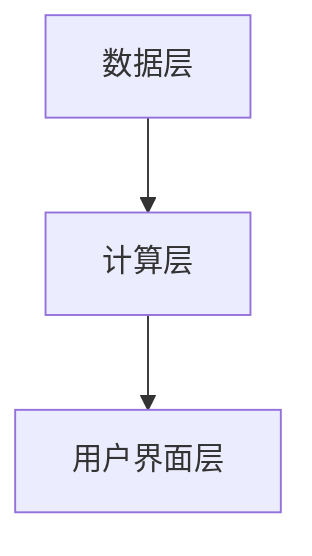

                 


# 约翰·奈夫的低市盈率投资法：简单而有效的价值策略

**关键词**：约翰·奈夫，低市盈率，投资策略，价值投资，股票分析，风险管理

**摘要**：  
本文深入探讨了约翰·奈夫的低市盈率投资法，分析了其核心概念、理论基础、实施策略以及与其它投资方法的对比。通过数学模型、系统架构和实际案例的详细解读，展示了低市盈率投资法的简单性与有效性。文章还探讨了该策略的风险管理、系统设计及最佳实践，为投资者提供了全面的指导。

---

## 第一部分：低市盈率投资法的背景与基础

### 第1章：低市盈率投资法的起源与发展

#### 1.1 低市盈率投资法的起源
低市盈率投资法是一种通过寻找市盈率低于市场平均水平的股票，来实现长期稳定收益的投资策略。该方法的核心在于识别市场低估的股票，利用其潜在的上升空间进行投资。

#### 1.2 约翰·奈夫的贡献
约翰·奈夫是低市盈率投资法的倡导者和实践者，他的研究成果为该策略的系统化和理论化奠定了基础。他强调通过基本面分析，选择具有合理估值和成长潜力的股票。

#### 1.3 低市盈率投资法的核心理念
- 市场波动性导致股票估值偏离其实际价值。
- 低市盈率股票通常具有较高的安全边际。
- 长期持有优质股票能够带来稳定收益。

---

### 第2章：低市盈率投资法的核心概念与原理

#### 2.1 低市盈率投资法的核心概念
- **市盈率（P/E Ratio）**：股票价格与每股收益的比率，是衡量股票估值的重要指标。
- **低估股票**：市盈率显著低于行业或市场平均水平的股票。
- **安全边际**：买入价格与内在价值的差距，确保投资的安全性。

#### 2.2 低市盈率投资法的核心原理
- 市场情绪影响股票估值：投资者情绪波动可能导致股票价格偏离其实际价值。
- 价值投资与成长投资的结合：低市盈率股票不仅具有合理的估值，还具备一定的成长潜力。
- 长期持有策略：通过长期持有优质股票，避免短期市场波动的影响。

---

### 第3章：低市盈率投资法与其他投资策略的对比

#### 3.1 与价值投资的对比
- **价值投资**：寻找市场价格低于内在价值的股票，注重基本面分析。
- **低市盈率投资法**：通过市盈率指标筛选低估股票，更注重估值的量化指标。

#### 3.2 与成长投资的对比
- **成长投资**：注重企业的成长潜力，愿意为高增长企业支付较高估值。
- **低市盈率投资法**：注重低估的估值，对企业的成长性有一定要求，但更关注安全边际。

---

### 第4章：低市盈率投资法的实施策略

#### 4.1 确定投资目标与风险偏好
- 投资目标：收益目标、风险承受能力。
- 风险偏好：选择与自身风险承受能力相符的股票。

#### 4.2 筛选低市盈率股票
- 筛选标准：市盈率低于市场平均水平。
- 具体指标：市盈率、市净率、股息率等。

#### 4.3 构建投资组合
- 分散化投资：避免过度集中于单一行业或股票。
- 定期调整：根据市场变化和企业基本面，进行适当的调整。

---

### 第5章：低市盈率投资法的数学模型与公式

#### 5.1 市盈率计算公式
$$市盈率 = \frac{股票价格}{每股收益}$$

#### 5.2 低市盈率股票筛选公式
$$市盈率 < 市场平均市盈率$$

#### 5.3 投资组合优化公式
$$最大收益 = \sum (权重_i \times 收益_i)$$

---

### 第6章：低市盈率投资法的系统分析与架构设计

#### 6.1 系统分析
- **问题场景**：投资者需要筛选低市盈率股票，构建投资组合。
- **系统功能设计**：数据采集、筛选、分析、组合优化。
- **系统架构设计**：数据层、计算层、用户界面层。

#### 6.2 系统架构设计


---

## 第二部分：低市盈率投资法的实战与优化

### 第7章：低市盈率投资法的实战案例

#### 7.1 环境安装
- 数据来源：获取历史市盈率数据。
- 工具选择：使用Python进行数据处理和分析。

#### 7.2 核心实现代码
```python
import pandas as pd

# 数据加载
df = pd.read_csv('stock_data.csv')

# 筛选低市盈率股票
low_pe_stocks = df[df['市盈率'] < df['市盈率'].mean()]

print(low_pe_stocks.head())
```

#### 7.3 案例分析
- 实际案例：筛选某行业内的低市盈率股票，分析其潜在收益。

---

### 第8章：低市盈率投资法的优化与改进

#### 8.1 策略优化
- 引入更多指标：市净率、股息率等。
- 动态调整：根据市场变化实时调整筛选标准。

#### 8.2 风险管理
- 设置止损点：避免重大损失。
- 分散投资：降低单一股票的风险。

---

## 第三部分：总结与展望

### 第9章：低市盈率投资法的优缺点

#### 9.1 优点
- 简单易懂，易于实施。
- 风险较低，适合保守型投资者。

#### 9.2 缺点
- 可能遗漏高成长性股票。
- 短期表现可能不如其他策略。

---

### 第10章：低市盈率投资法的未来展望

#### 10.1 技术进步
- 大数据和人工智能的应用，提升筛选效率和准确性。

#### 10.2 市场变化
- 全球化和市场波动对低市盈率投资法的影响。

---

## 附录

### 附录A：常用股票分析指标

### 附录B：低市盈率投资法的Python代码示例

---

**小结**：通过本文的详细解读，读者可以全面了解约翰·奈夫的低市盈率投资法，从理论到实践，从策略到系统设计，为投资者提供了科学的指导和实用的工具。

