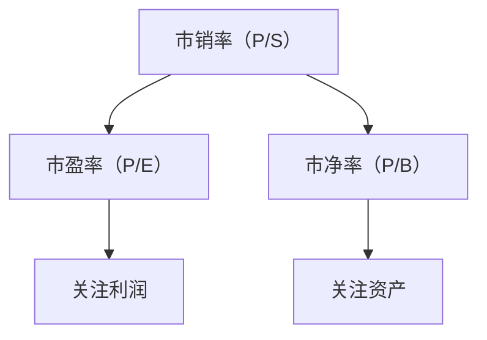
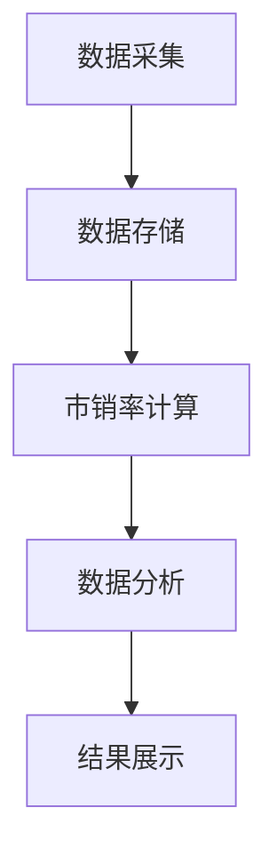

                 


# 《约翰·奈夫的低市销率价值投资：另一种选股视角》

## 关键词：低市销率、价值投资、约翰·奈夫、投资策略、市销率计算、投资组合优化、风险管理

## 摘要：  
本文探讨了约翰·奈夫提出的低市销率价值投资策略，从理论基础、计算方法、行业适用性到风险管理进行了全面分析，结合实际案例和系统设计，为投资者提供一种新的选股视角。

---

# 引言

低市销率价值投资是一种基于公司市销率（P/S）的选股策略，通过寻找市销率低于行业平均水平的公司，挖掘被市场低估的投资机会。本文将从价值投资的理论基础出发，逐步解析低市销率策略的逻辑、方法及应用。

---

# 第一部分：价值投资概述

## 第1章：价值投资的基本概念

### 1.1 价值投资的定义与历史发展

- **1.1.1 价值投资的起源与发展**  
  价值投资起源于20世纪初，由本杰明·格雷厄姆和戴维·多德提出，后被巴菲特发扬光大。它强调以低于内在价值的价格购买优质资产。

- **1.1.2 价值投资的核心理念**  
  格雷厄姆提出“安全边际”概念，即以低于内在价值的价格买入股票，以降低投资风险。

- **1.1.3 价值投资的主要流派**  
  - 格雷厄姆的防御性投资  
  - 巴菲特的成长型投资  
  - 彼得·林奇的混合型投资  

### 1.2 价值投资的理论基础

- **1.2.1 基本分析理论**  
  通过分析公司的财务报表、盈利能力、成长性和行业地位，评估其内在价值。

- **1.2.2 股价与内在价值的关系**  
  股价围绕内在价值波动，长期来看，股价会回归其内在价值。

- **1.2.3 投资者心态与市场情绪**  
  市场恐慌时，优质资产可能被低估，为价值投资者提供买入机会。

---

# 第二部分：低市销率价值投资策略

## 第2章：低市销率价值投资的定义与特点

### 2.1 低市销率价值投资的定义

- **2.1.1 市销率的定义与计算公式**  
  市销率（P/S）= 市值 / 营业收入  
  低市销率通常指 P/S < 1，表示公司市值低于其营业收入。

- **2.1.2 低市销率的判定标准**  
  不同行业标准不同，通常以行业平均值为参考。

### 2.2 低市销率投资的优势

- **2.2.1 低市销率公司的优势**  
  - 盈利能力稳定  
  - 估值被市场低估  
  - 抗风险能力强  

- **2.2.2 市场低估的机会**  
  在市场低迷时，低市销率公司可能被错误定价，提供投资机会。

- **2.2.3 投资风险的降低**  
  低市销率公司通常处于成熟行业，风险相对可控。

### 2.3 低市销率投资与其他投资策略的对比

- **2.3.1 与低市盈率投资的对比**  
  市盈率关注利润，市销率关注收入，两者各有优劣。

- **2.3.2 与低市净率投资的对比**  
  市净率关注资产，市销率关注收入，低市销率更适用于收入驱动型行业。

- **2.3.3 与成长型投资的对比**  
  成长型投资关注高增长，低市销率投资关注低估，适合不同市场周期。

---

## 第3章：市销率的计算与评估

### 3.1 市销率的计算公式

$$ \text{市销率（P/S）} = \frac{\text{市值}}{\text{营业收入}} $$

### 3.2 市销率评估方法

- **3.2.1 行业比较法**  
  将公司市销率与行业平均水平对比，判断其估值高低。

- **3.2.2 历史市销率分析**  
  比较公司历史市销率，判断当前估值是否合理。

- **3.2.3 市销率与收益能力的关系**  
  收益率高的公司可能市销率较低，反之亦然。

### 3.3 市销率与市盈率、市净率的对比分析

使用 Mermaid 图展示三者的差异：



---

# 第三部分：低市销率投资的行业分析

## 第4章：低市销率投资的适用行业

### 4.1 哪些行业适合低市销率投资

- **4.1.1 周期性行业**  
  如制造业、能源行业，周期底部时市销率较低。

- **4.1.2 稳定性行业**  
  如公用事业、消费品行业，收入稳定，市销率较低。

- **4.1.3 高市销率行业的反向投资机会**  
  在市场高估时，寻找低市销率公司进行套利。

### 4.2 行业分析方法

- **4.2.1 行业生命周期分析**  
  选择处于成熟期的行业，市销率较低。

- **4.2.2 行业竞争结构分析**  
  市场集中度高，龙头企业市销率可能更低。

- **4.2.3 行业财务指标分析**  
  重点关注收入增长和利润率。

### 4.3 行业案例分析

- **4.3.1 某行业的低市销率公司案例**  
  例如，某制造企业在行业低谷期市销率仅为0.8，具有投资价值。

- **4.3.2 案例分析与投资启示**  
  选择行业龙头，结合财务指标，判断投资机会。

---

# 第四部分：低市销率投资的风险管理

## 第5章：低市销率投资的风险与控制

### 5.1 低市销率投资的主要风险

- **5.1.1 行业风险**  
  行业周期性波动可能影响市销率。

- **5.1.2 财务风险**  
  公司收入下降可能导致市销率上升。

- **5.1.3 市场风险**  
  市场波动可能影响股价，进而影响市销率。

### 5.2 风险控制策略

- **5.2.1 分散投资**  
  通过投资多个行业和公司，降低风险。

- **5.2.2 设置止损点**  
  当市销率超过行业平均水平时，及时止损。

- **5.2.3 长期持有**  
  低市销率投资适合长期持有，避免短期波动影响。

---

# 第五部分：项目实战

## 第6章：低市销率投资的系统设计与实现

### 6.1 项目介绍

- 开发一个低市销率投资分析系统，帮助投资者快速筛选低市销率公司。

### 6.2 系统功能设计

- **6.2.1 数据采集模块**  
  收集公司市值、营业收入等数据。

- **6.2.2 市销率计算模块**  
  计算市销率并存储。

- **6.2.3 数据分析模块**  
  对比行业平均水平，筛选低市销率公司。

### 6.3 系统架构设计



### 6.4 代码实现

```python
import pandas as pd

# 数据加载
data = pd.read_csv('stock_data.csv')

# 市销率计算
data['市销率'] = data['市值'] / data['营业收入']

# 筛选低市销率公司
low_ps_companies = data[data['市销率'] < data['市销率行业平均']]
```

### 6.5 环境安装与运行

- **安装依赖**  
  ```bash
  pip install pandas
  ```

- **运行代码**  
  ```bash
  python investment_analysis.py
  ```

---

# 总结与展望

低市销率价值投资为投资者提供了另一种选股视角，通过关注市销率，投资者可以在市场低估时发现机会。未来，随着人工智能和大数据技术的发展，低市销率投资将更加精准和高效。

---

# 附录

## 附录A：市销率计算的详细方法

$$ \text{市销率} = \frac{\text{市值}}{\text{营业收入}} $$

## 附录B：投资组合管理策略

- 分散投资：降低风险。
- 定期调整：根据市场变化优化持仓。

---

# 参考文献

1. 格雷厄姆《 Intelligent Investor》
2. 巴菲特股东大会演讲
3. 约翰·奈夫的低市销率投资理论

---

以上是《约翰·奈夫的低市销率价值投资：另一种选股视角》的完整目录大纲和文章内容，涵盖了从理论到实践的各个方面，适合技术博客读者阅读和应用。

