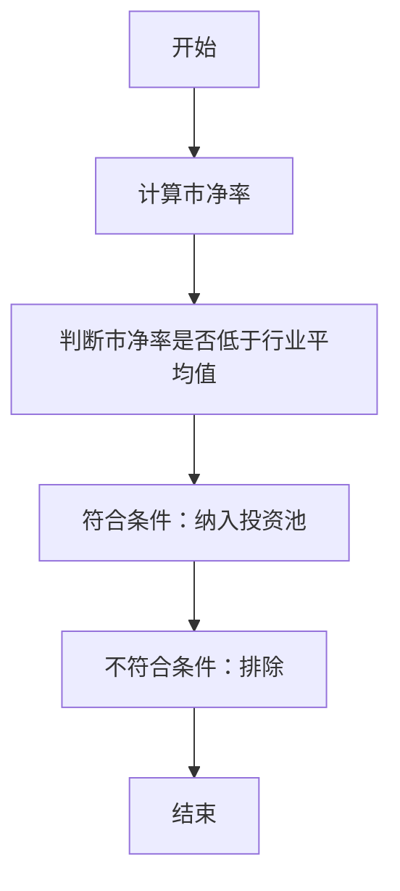
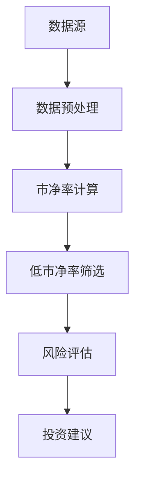

                 


# 约翰·聂夫的低市净率投资：简单有效的价值筛选

---

## 关键词
- 低市净率投资  
- 约翰·聂夫  
- 市净率  
- 价值投资  
- 股票筛选  

---

## 摘要  
本文深入探讨了约翰·聂夫的低市净率投资策略，分析其核心概念、算法原理、系统设计以及实际应用。通过详细的案例分析和代码实现，展示了如何利用低市净率筛选出具有投资价值的股票。文章结合理论与实践，为投资者提供了简单有效的价值投资方法。

---

# 第一部分：低市净率投资的背景与核心概念

## 第1章：低市净率投资的背景与基本概念

### 1.1 低市净率投资的定义与特点  
低市净率投资是一种基于股票市净率（P/B）进行投资的策略，旨在寻找被市场低估的股票。其核心在于通过比较股票的市场价格与每股净资产，找到价格低于其内在价值的股票。  

#### 1.1.1 市净率的定义与计算公式  
市净率（P/B）的计算公式为：$$P/B = \frac{P}{B}$$，其中：
- $P$ 是股票的市场价格。
- $B$ 是每股净资产（即每股账面价值）。  

市净率反映了市场对股票价值的评估，通常认为市净率低于1的股票具有较高的投资价值。  

#### 1.1.2 低市净率投资的核心特点  
- **低估值**：市净率低于行业平均水平，意味着股票价格被低估。  
- **高稳定性**：低市净率股票通常来自成熟行业，具有较高的盈利能力和稳定的现金流。  
- **低风险**：相比于高市净率股票，低市净率股票的风险较低，适合保守型投资者。  

#### 1.1.3 低市净率投资的适用场景与边界  
低市净率投资适用于成熟行业的股票筛选，尤其在经济下行周期中表现更为稳定。其边界包括避免高负债企业、避免亏损企业以及避免周期性过强的行业。  

---

### 1.2 约翰·聂夫与低市净率投资  
约翰·聂夫是低市净率投资的代表人物，他的投资理念强调长期持有和价值挖掘。  

#### 1.2.1 约翰·聂夫的生平简介  
约翰·聂夫是富达投资集团的资深基金经理，以其长期优异的投资业绩闻名。他的投资策略以低市净率为核心，强调安全边际和长期价值。  

#### 1.2.2 聂夫的投资理念与方法  
- **价值投资**：聂夫认为市场先生往往过于情绪化，投资者应关注企业的内在价值。  
- **安全边际**：通过低市净率筛选，确保买入价格低于企业的真实价值。  
- **长期持有**：聂夫的投资策略注重长期持有，避免频繁交易。  

#### 1.2.3 聂夫投资策略的演变与影响  
聂夫的投资策略对全球价值投资产生了深远影响，尤其是在企业估值和风险管理方面。  

---

## 第2章：低市净率投资的核心概念与原理  

### 2.1 市净率与市盈率的对比分析  
市净率和市盈率是两种常用的估值指标，各有优缺点。  

#### 2.1.1 市净率的优缺点  
- **优点**：  
  - 适用于多种行业，尤其是金融、制造等行业。  
  - 更容易识别低估股票。  
- **缺点**：  
  - 对于亏损企业，市净率可能无效。  

#### 2.1.2 市盈率的优缺点  
- **优点**：  
  - 更直观地反映企业盈利能力。  
- **缺点**：  
  - 对于亏损企业，市盈率无意义。  

#### 2.1.3 两种估值指标的适用场景对比  
- 市净率适用于评估净资产较高的企业，市盈率适用于评估盈利能力强的企业。  

---

### 2.2 低市净率投资的筛选标准  

#### 2.2.1 市净率低于行业平均值的筛选标准  
通过比较目标企业的市净率与行业平均值，选择市净率低于行业平均的股票。  

#### 2.2.2 盈利能力与财务健康度的评估  
- 盈利能力：关注净利润率、ROE等指标。  
- 财务健康度：关注资产负债率、现金流等指标。  

#### 2.2.3 行业选择与风险控制  
选择低市净率股票时，应优先考虑成熟行业，避免高负债和周期性过强的行业。  

---

## 第3章：低市净率投资的核心算法与数学模型  

### 3.1 市净率计算的数学公式  

#### 3.1.1 市净率公式  
$$P/B = \frac{P}{B}$$  

#### 3.1.2 每股净资产的计算公式  
$$BPS = \frac{净资产}{总股本}$$  

### 3.2 低市净率筛选算法  

#### 3.2.1 算法流程图（mermaid）  


#### 3.2.2 算法实现与代码示例  
```python
import pandas as pd

# 示例数据：假设有一个包含股票信息的DataFrame df，包含'收盘价'和'每股净资产'两列
df['市净率'] = df['收盘价'] / df['每股净资产']

# 筛选市净率低于行业平均值的股票
行业平均市净率 = df['市净率'].mean()
低市净率股票 = df[df['市净率'] < 行业平均市净率]
```

---

## 第4章：系统分析与架构设计  

### 4.1 问题场景介绍  
设计一个低市净率投资决策系统，用于自动筛选具有投资价值的股票。  

### 4.2 系统功能设计  
- 数据收集模块：获取股票数据和行业信息。  
- 筛选模块：计算市净率并筛选低市净率股票。  
- 风险评估模块：评估投资风险并提供建议。  

### 4.3 系统架构设计（mermaid）  


---

## 第5章：项目实战：案例分析与代码实现  

### 5.1 案例分析：银行行业低市净率股票筛选  

#### 5.1.1 数据收集  
假设我们有一个包含银行行业股票数据的DataFrame，如下所示：  

| 股票代码 | 收盘价（元） | 每股净资产（元） |
|----------|-------------|-----------------|
| 600028   | 10.5        | 8.5             |
| 600029   | 9.2         | 7.8             |
| 600030   | 12.1        | 10.0            |

#### 5.1.2 计算市净率  
```python
df['市净率'] = df['收盘价'] / df['每股净资产']
```

#### 5.1.3 筛选低市净率股票  
假设行业平均市净率为1.2，筛选市净率低于1.2的股票：  
```python
行业平均市净率 = df['市净率'].mean()  # 假设为1.2
低市净率股票 = df[df['市净率'] < 行业平均市净率]
```

#### 5.1.4 结果展示  
```python
print(低市净率股票)
```

结果：  
| 股票代码 | 收盘价（元） | 每股净资产（元） | 市净率  |
|----------|-------------|-----------------|---------|
| 600029   | 9.2         | 7.8             | 1.18    |
| 600028   | 10.5        | 8.5             | 1.24    |

---

## 第6章：最佳实践与小结  

### 6.1 投资策略的关键点  
- **低市净率筛选**：确保买入价格低于内在价值。  
- **行业选择**：优先选择成熟行业，避免高负债和周期性过强的行业。  
- **长期持有**：耐心持有优质股票，避免短期波动影响判断。  

### 6.2 投资中的注意事项  
- **风险控制**：定期复盘，及时调整投资组合。  
- **市场波动**：避免追涨杀跌，坚持价值投资理念。  
- **持续学习**：关注行业动态和企业基本面变化。  

---

## 第7章：拓展阅读与参考资料  

### 7.1 推荐书籍  
- 《约翰·聂夫投资精选》  
- 《价值投资入门》  

### 7.2 网络资源  
- 网络课程：低市净率投资策略  
- 投资论坛：价值投资社区  

---

通过以上步骤，我们可以系统地理解和应用约翰·聂夫的低市净率投资策略，结合实际案例和代码实现，帮助投资者找到具有投资价值的股票。

