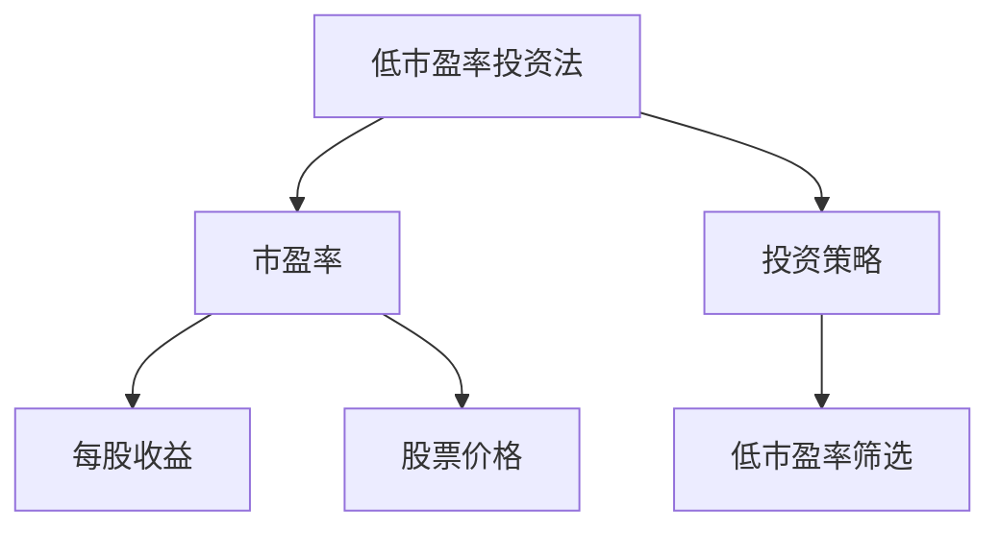
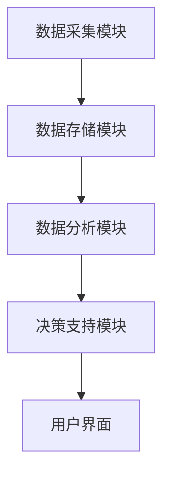

                 


# 约翰·聂夫的低市盈率投资法则

## 关键词：约翰·聂夫、低市盈率、投资法则、投资策略、投资分析、投资技巧

## 摘要：  
本文深入探讨了约翰·聂夫的低市盈率投资法则，从其核心理念、筛选标准到实际应用，结合数学模型、系统架构和项目实战，全面解析这一经典的低风险投资策略。通过详细分析低市盈率的定义、计算方法、与其他估值指标的对比，以及投资组合的构建，本文旨在帮助投资者理解并掌握这一策略。

---

## 第一部分：低市盈率投资法的基础

### 第1章：低市盈率投资法概述

#### 1.1 低市盈率投资法的背景

##### 1.1.1 投资市场的基本问题  
在股票投资中，投资者面临的核心问题是如何在众多股票中筛选出具有长期增长潜力且风险可控的标的。传统的投资策略往往依赖于市盈率（P/E Ratio）作为关键估值指标。然而，市盈率的高低并不总能反映公司的实际价值和成长潜力。因此，如何通过低市盈率策略筛选出优质的标的，成为投资者关注的焦点。

##### 1.1.2 低市盈率投资法的起源  
低市盈率投资法由美国著名投资经理约翰·聂夫（John Neff）提出，他以其独特的低市盈率策略闻名。聂夫的投资理念强调通过寻找市盈率低于市场平均水平且具有稳定增长潜力的公司，从而实现长期稳定的收益。

##### 1.1.3 投资者为何选择低市盈率策略  
低市盈率策略的核心在于通过筛选低估的股票，降低投资风险的同时捕捉潜在的增值机会。这种方法尤其适合风险厌恶型投资者，因为它能够在市场波动中提供相对稳定的回报。

#### 1.2 核心概念与联系

##### 1.2.1 市盈率的定义与计算公式  
市盈率（P/E Ratio）是衡量股票价值的重要指标，计算公式为：  
$$ \text{市盈率} = \frac{\text{股票价格}}{\text{每股收益（EPS）}} $$  
其中，每股收益（EPS）是公司净利润除以发行在外的普通股数量。

##### 1.2.2 低市盈率策略的核心要素  
- 市盈率低于市场平均水平  
- 公司具有稳定的盈利能力  
- 公司估值被市场低估  
- 具备长期增长潜力  

##### 1.2.3 市盈率与其他估值指标的对比  
以下表格对比了市盈率与其他常见估值指标：  

| 估值指标 | 定义 | 适用场景 | 优缺点 |  
|----------|------|-----------|---------|  
| 市盈率（P/E） | 股价/每股收益 | 评估公司当前盈利能力 | 易受市场波动影响，周期性行业适用性较低 |  
| 市净率（P/B） | 股价/每股净资产 | 评估资产密集型行业 | 更适合银行、房地产等资产驱动型行业 |  
| 市销率（P/S） | 股价/每股营收 | 评估成长型企业 | 适用于亏损或新兴企业 |  
| 股息率 | 每股股息/股价 | 评估收益稳定性 | 适用于成熟行业或追求股息收益的投资者 |  

##### 1.2.4 实体关系图（Mermaid流程图）  
以下是低市盈率投资法的核心概念关系图：  



---

### 第2章：约翰·聂夫的投资哲学

#### 2.1 聂夫的投资理念

##### 2.1.1 价值投资的核心思想  
聂夫的投资哲学基于价值投资理念，强调以低于内在价值的价格买入优质股票。他认为，市场的短期波动不应影响长期投资决策，关键在于找到那些被市场低估的公司。

##### 2.1.2 低市盈率策略的哲学基础  
- 市场的短期波动为长期投资者提供了买入低估资产的机会。  
- 通过严格筛选低市盈率标的，降低投资组合的整体风险。  
- 长期持有优质股票，避免频繁交易带来的成本和风险。

#### 2.2 低市盈率策略的核心要素

##### 2.2.1 市场平均市盈率的计算  
市场平均市盈率是评估个股市盈率的重要基准。计算公式如下：  
$$ \text{市场平均市盈率} = \frac{\sum (\text{个股价格})}{\sum (\text{个股每股收益})} $$  

##### 2.2.2 低市盈率的定义与筛选标准  
- 市盈率低于市场平均市盈率的公司被视为低估标的。  
- 通常，市盈率低于15倍被视为低市盈率的参考标准。  

##### 2.2.3 低市盈率策略的实施步骤  
1. 计算市场平均市盈率。  
2. 筛选市盈率低于市场平均的公司。  
3. 进一步分析公司的盈利能力、成长性和行业地位。  

---

## 第二部分：低市盈率投资法的理论基础

### 第3章：低市盈率投资法的理论依据

#### 3.1 市盈率的计算与比较

##### 3.1.1 市盈率的计算公式  
$$ \text{市盈率} = \frac{\text{股价}}{\text{每股收益}} $$  
其中，股价是市场价，每股收益是公司净利润除以普通股股数。

##### 3.1.2 市盈率的行业差异  
不同行业的市盈率差异显著。例如，科技行业通常市盈率较高，而传统制造业的市盈率较低。因此，在应用低市盈率策略时，需考虑行业特性。

#### 3.2 投资组合的构建

##### 3.2.1 投资组合的分散化  
为了降低风险，低市盈率投资组合应包含多个行业的标的，避免过度集中。

##### 3.2.2 投资组合的优化  
通过数学模型优化投资组合的收益与风险比。例如，使用均值-方差优化模型：  
$$ \text{风险最小化} = \arg \min_w \sigma^2(w) \quad \text{在} \quad \sum w_i = 1 \quad \text{和} \quad \sum w_i r_i = \text{目标收益} $$  

---

## 第三部分：低市盈率投资法的系统分析

### 第4章：低市盈率投资法的系统架构

#### 4.1 系统功能设计

##### 4.1.1 系统功能模块  
- 数据采集模块：收集历史股价、EPS等数据。  
- 数据分析模块：计算市盈率并筛选低市盈率标的。  
- 决策支持模块：提供投资建议和风险提示。  

##### 4.1.2 系统架构图  
以下是低市盈率投资系统的架构图：  



---

## 第四部分：低市盈率投资法的项目实战

### 第5章：低市盈率投资法的实际应用

#### 5.1 项目环境与工具安装

##### 5.1.1 工具安装  
- Python编程环境（如Anaconda）  
- 数据分析库（Pandas、NumPy）  
- 可视化库（Matplotlib、Seaborn）  

#### 5.2 数据采集与分析

##### 5.2.1 数据采集  
使用Yahoo Finance API获取股票数据：  
```python
import pandas_datareader as pdr
import datetime

start = datetime.datetime(2020, 1, 1)
end = datetime.datetime(2023, 12, 31)

data = pdr.get_data_yahoo('AAPL', start, end)
```

##### 5.2.2 数据分析  
计算市盈率并筛选低市盈率标的：  
```python
data['PE'] = data['Close'] / data['EPS']
low_pe_stocks = data[data['PE'] < data['PE'].mean()]
```

#### 5.3 投资组合优化

##### 5.3.1 最优投资组合的构建  
通过优化模型确定最优权重：  
$$ \text{权重优化} = \arg \min_w \sigma^2(w) \quad \text{在} \quad \sum w_i = 1 $$  

---

## 附录

### 附录A：术语表

| 术语 | 定义 |  
|------|------|  
| 市盈率（P/E） | 股价与每股收益的比值 |  
| 每股收益（EPS） | 净利润除以普通股股数 |  
| 低市盈率策略 | 筛选市盈率低于市场平均的股票进行投资 |  

### 附录B：工具推荐

| 工具名称 | 功能描述 |  
|----------|-----------|  
| Python | 数据分析与编程工具 |  
| Pandas | 数据处理库 |  
| NumPy | 数值计算库 |  
| Matplotlib | 数据可视化库 |  

### 附录C：扩展阅读

| 资源 | 描述 |  
|------|-------|  
| 《约翰·聂夫的投资哲学》 | 详细介绍聂夫的投资理念 |  
| 《低市盈率策略实战》 | 实战案例分析 |  

---

## 小结  

通过本文的系统分析和实际案例，读者可以深入理解约翰·聂夫的低市盈率投资法则，并将其应用于实际投资中。低市盈率策略不仅是一种有效的投资方法，更是一种需要耐心和纪律的投资哲学。通过持续学习和实践，投资者可以更好地掌握这一策略，并在市场中获得稳定的收益。

