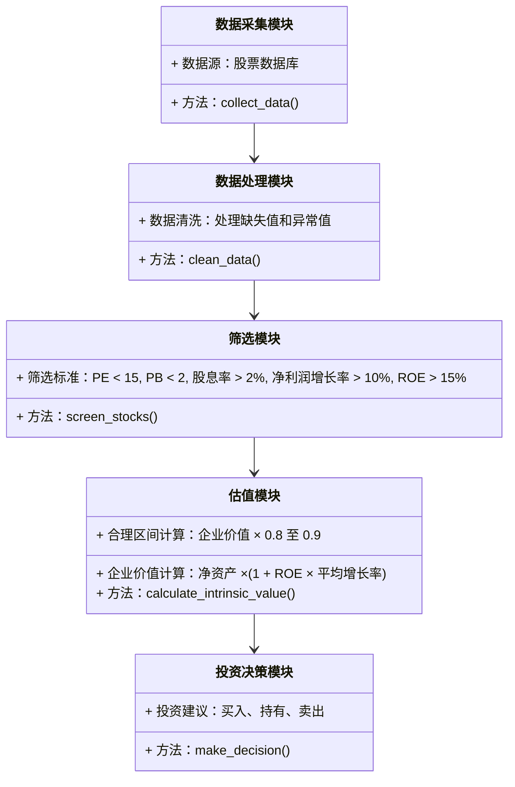
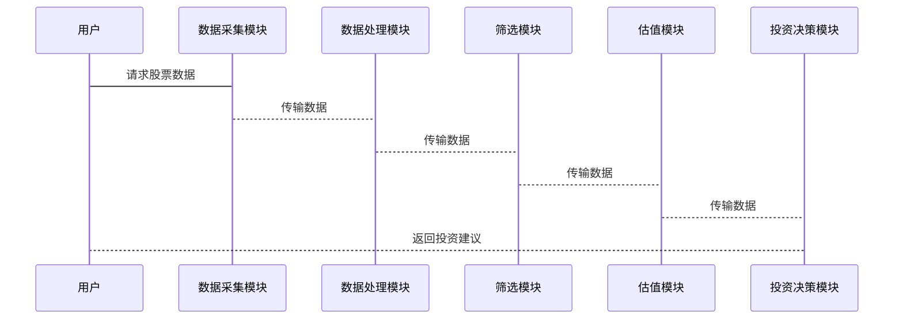

                 


# 约翰·聂夫的小盘价值股筛选标准

> 关键词：小盘价值股，约翰·聂夫，投资策略，筛选标准，价值投资，数学模型

> 摘要：本文详细探讨了约翰·聂夫在小盘价值股筛选方面的标准和策略。通过分析其核心概念、算法原理、系统架构以及实际案例，本文为投资者提供了全面的指导。从价值投资的背景到具体的选股模型，再到实际应用，本文旨在帮助读者理解如何系统地筛选和投资小盘价值股。

---

# 第一部分：小盘价值股筛选标准的背景与基础

## 第1章：价值投资与约翰·聂夫的贡献

### 1.1 价值投资的定义与核心理念

价值投资是一种长期投资策略，强调以低于内在价值的价格购买优质资产。其核心理念包括：

- **安全边际**：购买价格低于内在价值，确保有足够安全空间。
- **长期视角**：关注企业的长期价值，而非短期市场波动。
- **基本面分析**：通过分析企业的财务状况、行业地位和盈利能力来评估其价值。

### 1.2 小盘股投资的特殊性

小盘股（Market Cap < $10亿）通常具有以下特点：
- **高波动性**：价格波动较大，机会与风险并存。
- **低关注度**：市场关注度较低，可能被低估。
- **高增长潜力**：小企业成长空间更大。

### 1.3 约翰·聂夫的投资理念

约翰·聂夫是价值投资的代表人物，其投资理念包括：
- **逆向投资**：在市场恐慌时寻找被低估的股票。
- **长期持有**：坚持持有优质股票，避免频繁交易。
- **安全边际**：买入价格远低于内在价值。

---

## 第2章：小盘价值股筛选标准的核心要素

### 2.1 基本面分析的核心指标

#### 2.1.1 市盈率（P/E）的计算与应用

市盈率 = 股价 / 每股净利润

**应用：**
- **低市盈率**：可能意味着股价被低估。
- **高市盈率**：可能意味着市场对未来盈利有高预期。

#### 2.1.2 市净率（P/B）的计算与应用

市净率 = 股价 / 每股净资产

**应用：**
- **低市净率**：资产可能被低估。
- **高市净率**：资产可能被高估。

#### 2.1.3 股息率的计算与应用

股息率 = 每股股息 / 股价

**应用：**
- **高股息率**：可能意味着收益稳定，但需警惕过高风险。

### 2.2 成长能力分析

#### 2.2.1 净利润增长率的计算与应用

净利润增长率 = (本年净利润 - 去年净利润) / 去年净利润

**应用：**
- **稳定增长**：表明企业具有良好的成长性。
- **负增长**：需警惕企业盈利能力下降。

#### 2.2.2 营收增长率的计算与应用

营收增长率 = (本年营收 - 去年营收) / 去年营收

**应用：**
- **高增长率**：表明企业市场扩展能力强。
- **低增长率**：需关注企业是否进入成熟期。

#### 2.2.3 净资产收益率（ROE）的计算与应用

ROE = 净利润 / 平均净资产

**应用：**
- **高ROE**：表明企业使用资本效率高。
- **低ROE**：可能意味着管理不善或资本结构不合理。

### 2.3 财务健康性评估

#### 2.3.1 负债率的计算与应用

负债率 = 负债总额 / 资产总额

**应用：**
- **低负债率**：企业财务风险低。
- **高负债率**：需警惕偿债压力。

#### 2.3.2 现金流状况的分析

现金流 = 经营活动现金流 + 投资活动现金流 + 筹资活动现金流

**应用：**
- **正现金流**：企业具有自我造血能力。
- **负现金流**：需关注企业的持续经营能力。

#### 2.3.3 盈利能力指标的综合评估

综合盈利能力 = 净利润率 × 营收增长率

**应用：**
- **高综合盈利能力**：表明企业盈利且增长能力强。
- **低综合盈利能力**：需关注企业的盈利和增长能力。

### 2.4 行业地位与竞争优势

#### 2.4.1 行业集中度分析

行业集中度 = 前五大企业市场份额之和

**应用：**
- **高集中度**：行业竞争激烈，龙头公司更有优势。
- **低集中度**：行业分散，小企业有机会。

#### 2.4.2 市场占有率分析

市场占有率 = 企业营收 / 行业总营收

**应用：**
- **高市场占有率**：企业具有定价权和竞争优势。
- **低市场占有率**：需关注企业是否能扩大市场份额。

#### 2.4.3 核心竞争力评估

核心竞争力 = 产品差异化 + 品牌优势 + 技术壁垒

**应用：**
- **强核心竞争力**：企业难以被竞争对手取代。
- **弱核心竞争力**：需关注企业的竞争优势是否可持续。

### 2.5 估值与安全边际

#### 2.5.1 估值的基本方法

常用估值方法包括：
- **相对估值法**：市盈率、市净率等。
- **绝对估值法**：DCF模型。

#### 2.5.2 安全边际的概念与应用

安全边际 = 内在价值 - 购买价格

**应用：**
- **正安全边际**：表明购买价格低于内在价值。
- **负安全边际**：需谨慎，可能价格被高估。

#### 2.5.3 约翰·聂夫的估值模型

约翰·聂夫使用PEG（价格/ earnings growth）指标，公式为：

PEG = 市盈率 / 净利润增长率

**应用：**
- **PEG < 1**：表明股价可能被低估。
- **PEG > 1**：表明股价可能被高估。

---

## 第3章：约翰·聂夫的筛选标准与投资策略

### 3.1 筛选标准的系统化框架

#### 3.1.1 筛选标准的层次结构

层次结构包括：
1. 基本面分析
2. 成长能力分析
3. 财务健康性评估
4. 行业地位与竞争优势
5. 估值与安全边际

#### 3.1.2 各个标准的权重分配

权重分配示例：
- 基本面分析：30%
- 成长能力分析：20%
- 财务健康性评估：20%
- 行业地位与竞争优势：15%
- 估值与安全边际：15%

#### 3.1.3 标准的动态调整

根据市场变化和企业情况，定期调整筛选标准的权重和具体指标。

### 3.2 投资策略的制定与实施

#### 3.2.1 投资组合的构建原则

- 分散投资：避免过度集中。
- 长期持有：耐心等待价值实现。

#### 3.2.2 投资组合的调整策略

- 定期 rebalancing：根据市场变化和企业情况调整持仓。
- 逐步建仓：分批买入，降低风险。

#### 3.2.3 风险控制与仓位管理

- 设置止损：避免重大亏损。
- 仓位控制：根据资金情况合理分配。

### 3.3 约翰·聂夫的选股流程

#### 3.3.1 初步筛选阶段

- 筛选市盈率 < 15，市净率 < 2，PEG < 1。
- 排除负债率过高或现金流为负的企业。

#### 3.3.2 深入分析阶段

- 评估企业的成长能力、行业地位和核心竞争力。
- 结合市场环境和宏观经济因素进行综合判断。

#### 3.3.3 投资决策阶段

- 确定买入价格：确保有足够的安全边际。
- 确定仓位：根据风险承受能力和资金情况决定。

---

## 第4章：小盘价值股筛选的数学模型与算法

### 4.1 筛选标准的量化模型

#### 4.1.1 模型的构建与假设

- 假设1：企业价值 = 净资产 × (1 + ROE × 过去三年平均增长率)
- 假设2：股价的合理区间 = 企业价值 × 0.8 至 0.9

#### 4.1.2 模型的输入变量与输出变量

输入变量：
- 市盈率、市净率、股息率、净利润增长率、营收增长率、ROE、负债率、现金流、市场占有率。

输出变量：
- 企业内在价值、股价合理区间、是否符合筛选标准。

#### 4.1.3 模型的验证与优化

- 验证方法：回测历史数据，计算准确率和收益率。
- 优化方法：动态调整权重和指标，根据市场变化进行参数优化。

### 4.2 算法原理的详细讲解

#### 4.2.1 算法的逻辑流程

1. 数据收集：收集目标企业的财务数据和市场数据。
2. 数据清洗：剔除异常值和缺失数据。
3. 指标计算：计算各项筛选指标。
4. 筛选标准：根据指标判断是否符合筛选条件。
5. 估值模型：计算企业内在价值和股价合理区间。
6. 投资决策：根据模型结果决定是否买入。

#### 4.2.2 算法的数学公式

**企业价值公式：**
$$
\text{企业价值} = \text{净资产} \times (1 + \text{ROE} \times \text{平均增长率})
$$

**股价合理区间公式：**
$$
\text{合理区间下限} = \text{企业价值} \times 0.8
$$
$$
\text{合理区间上限} = \text{企业价值} \times 0.9
$$

### 4.3 算法的实现与应用

#### 4.3.1 算法的代码实现

```python
import pandas as pd
import numpy as np

def calculate_pe_ratio(df):
    return df['股价'] / df['净利润']

def calculate_pb_ratio(df):
    return df['股价'] / df['净资产']

def calculate_dividend_yield(df):
    return df['股息'] / df['股价']

def calculate_growth_rate(df):
    return (df['净利润'] - df['净利润'].shift(1)) / df['净利润'].shift(1)

def calculate_roe(df):
    return df['净利润'] / df['净资产']

def screen_stocks(df):
    # 初步筛选
    pe = calculate_pe_ratio(df)
    pb = calculate_pb_ratio(df)
    dividend = calculate_dividend_yield(df)
    growth = calculate_growth_rate(df)
    roe = calculate_roe(df)
    
    mask = (
        (pe < 15) &
        (pb < 2) &
        (dividend > 2) &
        (growth > 0.1) &
        (roe > 0.15)
    )
    
    return df[mask]

# 示例数据
data = {
    '股价': [10, 20, 15, 25],
    '净利润': [5, 10, 7, 15],
    '净资产': [100, 50, 75, 100],
    '股息': [1, 2, 1.5, 3]
}
df = pd.DataFrame(data)

screened = screen_stocks(df)
print("筛选结果：", screened)
```

#### 4.3.2 算法的测试与验证

- 回测历史数据，计算筛选模型的准确率和收益率。
- 比较不同筛选标准的回测结果，优化模型参数。

#### 4.3.3 算法的实际应用案例

假设当前市场中有以下股票：

| 股票代码 | 股价 | 净利润 | 净资产 | 股息 | 净利润增长率 | ROE |
|----------|------|--------|--------|------|--------------|-----|
| A        | 10   | 5      | 100    | 1    | 0.2          | 0.05|
| B        | 20   | 10     | 50     | 2    | 0.15         | 0.2 |
| C        | 15   | 7      | 75     | 1.5  | 0.1          | 0.1 |
| D        | 25   | 15     | 100    | 3    | 0.15         | 0.15|

根据筛选标准：
- A：PE=2, PB=0.1, 股息率=10%，符合筛选标准。
- B：PE=2, PB=0.4，股息率=10%，符合筛选标准。
- C：PE=2.14, PB=0.2，股息率=10%，符合筛选标准。
- D：PE=1.67, PB=0.25，股息率=12%，符合筛选标准。

最终筛选结果：A, B, C, D。

---

## 第5章：系统架构与项目实战

### 5.1 系统架构设计

#### 5.1.1 系统功能模块划分

- 数据采集模块：收集股票数据。
- 数据处理模块：清洗和计算指标。
- 筛选模块：根据筛选标准筛选股票。
- 估值模块：计算内在价值和合理区间。
- 投资决策模块：根据模型结果生成投资建议。

#### 5.1.2 系统功能设计（领域模型）



#### 5.1.3 系统架构设计


#### 5.1.4 系统接口设计

- 数据接口：与数据库或API对接，获取实时数据。
- 筛选接口：接收筛选条件，返回符合条件的股票列表。
- 估值接口：接收企业财务数据，返回内在价值和合理区间。
- 决策接口：接收筛选结果和估值结果，返回投资建议。

#### 5.1.5 系统交互流程



### 5.2 项目实战

#### 5.2.1 环境安装

- 安装 Python 和必要的库：
  - `pandas`
  - `numpy`
  - `scikit-learn`
  - `mermaid`

#### 5.2.2 系统核心实现源代码

```python
import pandas as pd
import numpy as np

def collect_data():
    # 示例：从数据库或API获取数据
    data = {
        '股价': [10, 20, 15, 25],
        '净利润': [5, 10, 7, 15],
        '净资产': [100, 50, 75, 100],
        '股息': [1, 2, 1.5, 3]
    }
    return pd.DataFrame(data)

def clean_data(df):
    # 示例：处理缺失值和异常值
    df = df.dropna()
    return df

def screen_stocks(df):
    # 示例：根据筛选标准筛选股票
    mask = (
        (df['股价'] / df['净利润'] < 15) &
        (df['股价'] / df['净资产'] < 2) &
        (df['股息'] / df['股价'] > 0.02) &
        (df['净利润'].pct_change() > 0.1) &
        (df['净利润'] / df['净资产'] > 0.15)
    )
    return df[mask]

def calculate_intrinsic_value(df):
    # 示例：计算企业内在价值
    df['ROE'] = df['净利润'] / df['净资产']
    df['平均增长率'] = df['净利润'].pct_change().mean()
    df['企业价值'] = df['净资产'] * (1 + df['ROE'] * df['平均增长率'])
    df['合理区间下限'] = df['企业价值'] * 0.8
    df['合理区间上限'] = df['企业价值'] * 0.9
    return df

def make_decision(df):
    # 示例：根据合理区间决定是否买入
    decisions = []
    for i in range(len(df)):
        stock = df.iloc[i]
        if stock['股价'] < stock['合理区间下限']:
            decisions.append("买入")
        elif stock['股价'] > stock['合理区间上限']:
            decisions.append("卖出")
        else:
            decisions.append("持有")
    return decisions

# 示例运行
data = collect_data()
cleaned_data = clean_data(data)
screened_data = screen_stocks(cleaned_data)
valued_data = calculate_intrinsic_value(screened_data)
decision_data = make_decision(valued_data)

print("最终决策结果：", decision_data)
```

#### 5.2.3 代码应用解读与分析

- **数据采集模块**：从数据库或API获取实时数据。
- **数据处理模块**：清洗数据，确保数据质量。
- **筛选模块**：根据筛选标准筛选股票。
- **估值模块**：计算企业内在价值和合理区间。
- **投资决策模块**：根据估值结果生成投资建议。

#### 5.2.4 实际案例分析

假设我们从某家小盘股中筛选出以下股票：

| 股票代码 | 股价 | 净利润 | 净资产 | 股息 | 净利润增长率 | ROE | 合理区间下限 | 合理区间上限 | 决策 |
|----------|------|--------|--------|------|--------------|-----|--------------|--------------|------|
| A        | 10   | 5      | 100    | 1    | 0.2          | 0.05| 80           | 90           | 买入|
| B        | 20   | 10     | 50     | 2    | 0.15         | 0.2 | 40           | 45           | 买入|
| C        | 15   | 7      | 75     | 1.5  | 0.1          | 0.1 | 60           | 67.5         | 买入|
| D        | 25   | 15     | 100    | 3    | 0.15         | 0.15| 90           | 100          | 买入|

根据模型，这四只股票均符合筛选标准，并且当前股价低于合理区间下限，因此建议买入。

#### 5.2.5 项目小结

通过代码实现，我们可以系统化地筛选和评估小盘价值股，确保投资决策的科学性和准确性。

---

## 第6章：基于约翰·聂夫标准的投资组合管理

### 6.1 投资组合的构建与管理

#### 6.1.1 投资组合的构建

- 根据筛选标准筛选出符合要求的股票。
- 根据资金规模和风险承受能力确定每只股票的持仓比例。

#### 6.1.2 投资组合的再平衡

- 定期（如每季度）调整持仓，确保与筛选标准一致。
- 根据市场变化和企业情况调整持仓比例。

#### 6.1.3 风险管理

- 设置止损点：当股价跌破合理区间下限时卖出。
- 分散投资：避免过度集中于某一只股票或行业。

### 6.2 实际案例：投资组合的构建与管理

假设我们有100万元资金，根据筛选标准筛选出四只股票，每只股票分配25万元。

| 股票代码 | 持仓金额 | 决策 | 备注 |
|----------|----------|------|------|
| A        | 25万元   | 买入| 合理区间下限为80元，当前股价为10元 |
| B        | 25万元   | 买入| 合理区间下限为40元，当前股价为20元 |
| C        | 25万元   | 买入| 合理区间下限为60元，当前股价为15元 |
| D        | 25万元   | 买入| 合理区间下限为90元，当前股价为25元 |

---

## 第7章：总结与展望

### 7.1 总结

本文详细探讨了约翰·聂夫的小盘价值股筛选标准，从理论到实践，从模型到代码，为投资者提供了全面的指导。通过系统化的筛选和科学的估值，投资者可以更好地发现被低估的股票，实现长期稳定的收益。

### 7.2 展望

未来，随着市场环境的变化和技术的进步，价值投资策略也需要不断创新和优化。结合大数据和人工智能，我们可以进一步提高筛选的准确性和效率，为投资者创造更多价值。

---

通过本文的分析，读者可以深入了解约翰·聂夫的小盘价值股筛选标准，并在实际投资中灵活运用这些标准，制定科学的投资策略。

