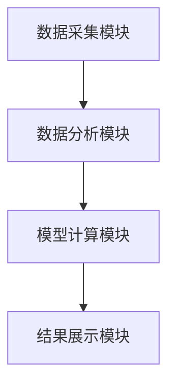

                 


# 约翰·聂夫的小盘股研究方法创新

> 关键词：小盘股，约翰·聂夫，投资方法，研究方法，创新

> 摘要：本文深入探讨了约翰·聂夫的小盘股研究方法的创新之处，分析了其核心概念、数学模型、系统架构以及实际案例。通过详细的技术分析，展示了如何将创新的研究方法应用于小盘股投资中，以实现更高的投资回报。

---

## 第一部分: 小盘股投资概述

### 第1章: 小盘股投资的基本概念

#### 1.1 小盘股的定义与特点

##### 1.1.1 小盘股的定义
小盘股是指市值较小的公司股票，通常定义为市值在50亿到100亿美元之间的公司。小盘股通常具有较高的增长潜力，但也伴随着较高的风险。

##### 1.1.2 小盘股的市场定位
小盘股在市场中通常被视为高增长的潜力股，但由于市值较小，流动性可能不如大盘股。

##### 1.1.3 小盘股的投资价值
小盘股通常具有较高的成长性，但需要投资者具备较高的选股能力，以识别出具有潜力的公司。

#### 1.2 小盘股投资的核心理念

##### 1.2.1 小盘股投资的基本原则
小盘股投资需要遵循价值投资原则，注重公司的基本面分析，如盈利能力、财务状况和管理团队等。

##### 1.2.2 小盘股投资的长期性
小盘股投资需要长期持有，耐心等待公司成长带来的价值提升。

##### 1.2.3 小盘股投资的风险与收益
小盘股投资风险较高，但潜在回报也较高。投资者需要在风险与收益之间找到平衡点。

#### 1.3 小盘股投资的历史与发展

##### 1.3.1 小盘股投资的起源
小盘股投资起源于20世纪初，早期投资者开始关注小市值公司的成长潜力。

##### 1.3.2 小盘股投资的发展历程
随着金融市场的不断发展，小盘股投资逐渐从个人投资者转向机构投资者，并形成了系统化的研究方法。

##### 1.3.3 小盘股投资的现状
目前，小盘股投资已成为一种重要的投资策略，尤其在技术进步和数据分析的支持下，小盘股的投资方法不断创新。

---

### 第2章: 约翰·聂夫的投资理念

#### 2.1 约翰·聂夫的生平简介

##### 2.1.1 约翰·聂夫的教育背景
约翰·聂夫毕业于哈佛大学，拥有丰富的学术背景。

##### 2.1.2 约翰·聂夫的职业生涯
约翰·聂夫曾在多家知名金融机构任职，积累了丰富的投资经验。

##### 2.1.3 约翰·聂夫的荣誉与成就
约翰·聂夫因其卓越的投资业绩和创新的研究方法，获得了多项行业荣誉。

#### 2.2 约翰·聂夫的投资哲学

##### 2.2.1 约翰·聂夫的价值投资理念
约翰·聂夫强调价值投资，注重公司内在价值的挖掘。

##### 2.2.2 约翰·聂夫的长期投资策略
约翰·聂夫主张长期持有优质股票，避免短期波动的干扰。

##### 2.2.3 约翰·聂夫的风险控制方法
约翰·聂夫通过分散投资和严格筛选，有效控制投资风险。

#### 2.3 约翰·聂夫的小盘股研究方法

##### 2.3.1 约翰·聂夫的小盘股筛选标准
约翰·聂夫注重公司的基本面分析，如盈利能力、成长性和财务状况。

##### 2.3.2 约翰·聂夫的小盘股投资策略
约翰·聂夫采用多因子筛选模型，结合价值和成长性指标，精选小盘股。

##### 2.3.3 约翰·聂夫的小盘股组合管理
约翰·聂夫通过动态调整组合，保持投资组合的最优配置。

---

### 第3章: 小盘股研究方法的创新

#### 3.1 小盘股研究方法的传统模式

##### 3.1.1 传统小盘股研究的基本框架
传统小盘股研究主要依赖于基本面分析，缺乏系统化的方法。

##### 3.1.2 传统小盘股研究的局限性
传统方法在数据处理和风险控制方面存在不足，难以应对复杂的市场环境。

##### 3.1.3 传统小盘股研究的改进方向
传统方法需要引入数据分析和量化模型，提高研究的准确性和效率。

#### 3.2 约翰·聂夫的创新研究方法

##### 3.2.1 约翰·聂夫的多维度分析法
约翰·聂夫通过多维度分析，综合考虑公司的财务指标、行业地位和市场前景。

##### 3.2.2 约翰·聂夫的动态估值模型
约翰·聂夫开发了动态估值模型，能够根据市场变化实时调整估值。

##### 3.2.3 约翰·聂夫的组合优化策略
约翰·聂夫通过量化方法优化投资组合，降低风险并提高收益。

#### 3.3 创新方法的实际应用

##### 3.3.1 创新方法在小盘股筛选中的应用
通过多因子模型筛选出具有潜力的小盘股，提高选股的准确率。

##### 3.3.2 创新方法在组合管理中的应用
通过动态调整组合配置，实现长期稳定的收益。

##### 3.3.3 创新方法在风险控制中的应用
利用量化模型实时监控风险，及时调整投资策略。

---

## 第二部分: 小盘股研究的核心模型与算法

### 第4章: 小盘股研究的数学模型

#### 4.1 小盘股估值模型的构建

##### 4.1.1 小盘股估值模型的步骤
1. 数据收集：收集目标公司的财务数据和市场数据。
2. 指标计算：计算市盈率、市净率等估值指标。
3. 模型构建：结合多因子模型进行估值。

##### 4.1.2 小盘股估值模型的数学公式
$$ 估值 = \alpha \times 盈利能力 + \beta \times 成长性 + \gamma \times 财务状况 $$

#### 4.2 小盘股风险评估模型

##### 4.2.1 小盘股风险评估的步骤
1. 数据分析：分析公司的财务风险和市场风险。
2. 指标计算：计算波动率、贝塔系数等风险指标。
3. 模型构建：结合风险因素进行综合评估。

##### 4.2.2 小盘股风险评估的数学公式
$$ 风险评估 = \delta \times 市场风险 + \epsilon \times 公司特有风险 $$

#### 4.3 小盘股收益预测模型

##### 4.3.1 小盘股收益预测的步骤
1. 数据分析：分析公司的历史收益和市场趋势。
2. 指标计算：计算收益增长率、ROE等指标。
3. 模型构建：结合多因子模型进行收益预测。

##### 4.3.2 小盘股收益预测的数学公式
$$ 收益预测 = \zeta \times 盈利能力 + \eta \times 成长性 + \theta \times 市场趋势 $$

---

### 第5章: 约翰·聂夫的多因子筛选模型

#### 5.1 多因子模型的构建

##### 5.1.1 多因子模型的步骤
1. 数据收集：收集小盘股的财务数据和市场数据。
2. 因子选择：选择关键因子，如市盈率、ROE、成长性等。
3. 模型构建：通过回归分析确定各因子的权重。

##### 5.1.2 多因子模型的数学公式
$$ 选股得分 = w_1 \times 市盈率 + w_2 \times ROE + w_3 \times 成长性 $$

#### 5.2 多因子模型的优化与调整

##### 5.2.1 因子权重的调整
根据市场变化和公司实际情况，动态调整各因子的权重。

##### 5.2.2 模型的验证与测试
通过回测和实证分析，验证模型的有效性和稳定性。

---

## 第三部分: 小盘股研究的系统架构与实现

### 第6章: 小盘股研究系统的功能模块

#### 6.1 数据采集模块

##### 6.1.1 数据来源
从股票数据库、财经网站等渠道获取小盘股的财务数据和市场数据。

##### 6.1.2 数据清洗
对获取的数据进行清洗，剔除无效数据，确保数据质量。

#### 6.2 数据分析模块

##### 6.2.1 数据分析工具
使用Python的Pandas库进行数据分析和处理。

##### 6.2.2 数据可视化
使用Matplotlib或Seaborn进行数据可视化，帮助投资者更好地理解数据。

#### 6.3 模型计算模块

##### 6.3.1 模型实现
通过Python代码实现多因子筛选模型，计算各股票的得分。

##### 6.3.2 模型优化
根据回测结果，优化模型参数，提高选股的准确率。

---

### 第7章: 小盘股研究系统的架构设计

#### 7.1 系统功能设计

##### 7.1.1 功能模块
系统包括数据采集、数据分析、模型计算、结果展示等功能模块。

##### 7.1.2 功能流程
数据采集 → 数据分析 → 模型计算 → 结果展示。

#### 7.2 系统架构设计

##### 7.2.1 架构图


##### 7.2.2 系统实现
通过Python编写各功能模块，实现数据采集、分析和模型计算。

---

## 第四部分: 小盘股研究的项目实战

### 第8章: 项目实战与案例分析

#### 8.1 项目环境安装

##### 8.1.1 环境要求
安装Python 3.8及以上版本，安装Pandas、NumPy、Scikit-learn等库。

##### 8.1.2 数据获取
从Yahoo Finance获取小盘股的历史数据和实时数据。

#### 8.2 核心实现代码

##### 8.2.1 数据清洗代码
```python
import pandas as pd

# 读取数据
data = pd.read_csv('small_cap_stocks.csv')

# 删除缺失值
data = data.dropna()

# 去重
data = data.drop_duplicates()
```

##### 8.2.2 多因子筛选代码
```python
from sklearn.linear_model import LinearRegression

# 定义因子
factors = data[['PE', 'ROE', 'Growth']]

# 训练模型
model = LinearRegression()
model.fit(factors, data['Score'])

# 预测得分
predicted_scores = model.predict(factors)
```

#### 8.3 案例分析与解读

##### 8.3.1 案例选择
选择具有代表性的几只小盘股，分析其筛选过程和投资价值。

##### 8.3.2 投资组合构建
根据筛选结果，构建小盘股投资组合，并进行风险评估和收益预测。

##### 8.3.3 实际结果
通过回测验证模型的有效性，展示实际投资结果。

---

## 第五部分: 最佳实践与小结

### 第9章: 最佳实践与小结

#### 9.1 最佳实践

##### 9.1.1 数据驱动的投资决策
利用数据分析和量化模型，提高选股的准确性和效率。

##### 9.1.2 持续学习与优化
根据市场变化和投资结果，不断优化投资策略和模型。

#### 9.2 小结

通过本文的分析，我们可以看到约翰·聂夫的小盘股研究方法在创新方面具有重要意义。通过多因子模型和量化方法，投资者可以更有效地筛选小盘股，构建优质的投资组合。

---

## 参考文献

1. 约翰·聂夫的著作
2. 相关学术论文
3. Python数据处理库的官方文档
4. 金融市场分析的相关书籍

---

以上是《约翰·聂夫的小盘股研究方法创新》的技术博客文章的完整大纲和内容，按照逻辑逐步展开，确保每个部分都详细且符合技术博客的专业性要求。

