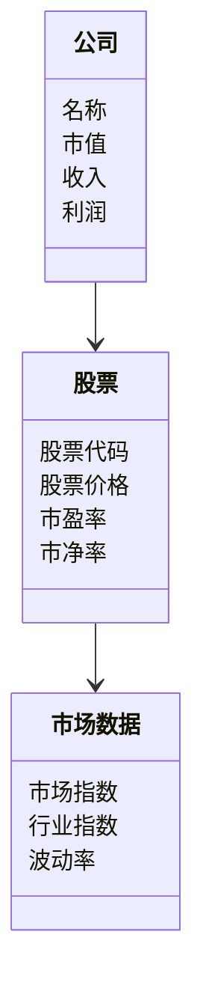

                 


# 约翰·聂夫的小盘股研究方法论

> 关键词：小盘股、基本面分析、估值方法、风险管理、投资策略、约翰·聂夫

> 摘要：本文详细探讨了约翰·聂夫的小盘股研究方法，从基本面分析、估值方法、风险管理到投资策略，结合实际案例和系统架构设计，为读者提供了全面的分析和见解。

---

# 第一部分: 小盘股研究的背景与基础

## 第1章: 小盘股的定义与特点

### 1.1 小盘股的定义与分类

#### 1.1.1 小盘股的定义
小盘股是指市值较小的公司股票，通常在10亿美元以下。小盘股的公司规模较小，业务灵活，但风险较高。

#### 1.1.2 小盘股的分类标准
- **市值标准**：通常以公司市值划分，市值在10亿到20亿美元之间。
- **流动性标准**：交易量较低，市场流动性较差。
- **行业分布**：多集中在新兴行业或细分市场。

#### 1.1.3 小盘股与大盘股的对比
| 属性      | 小盘股            | 大盘股            |
|-----------|-------------------|-------------------|
| 市值       | 较小              | 较大              |
| 流动性     | 较低              | 较高              |
| 风险       | 较高              | 较低              |
| 增长潜力   | 较高              | 较稳定            |

### 1.2 小盘股市场的特点

#### 1.2.1 小盘股市场的波动性
小盘股市场的波动性较高，价格受市场情绪影响较大。

#### 1.2.2 小盘股市场的流动性
小盘股市场的流动性较低，买卖价差较大。

#### 1.2.3 小盘股市场的投资机会
小盘股市场潜力巨大，尤其是新兴行业和创新型企业。

### 1.3 小盘股投资的价值与风险

#### 1.3.1 小盘股投资的价值
- 高增长潜力
- 估值较低
- 投资机会多样

#### 1.3.2 小盘股投资的风险
- 流动性风险
- 市场波动风险
- 财务不稳定风险

#### 1.3.3 小盘股投资的边界与外延
- 投资范围：聚焦于小盘股，避免过度分散。
- 投资目标：追求长期资本增值。

### 1.4 小盘股研究的核心要素

#### 1.4.1 小盘股研究的基本框架
- 数据采集：收集公司财务数据和市场数据。
- 分析方法：运用基本面分析、估值方法、风险管理等。

#### 1.4.2 小盘股研究的关键指标
- 财务指标：收入、利润、现金流。
- 估值指标：市盈率（P/E）、市净率（P/B）。
- 风险指标：波动率、beta值。

#### 1.4.3 小盘股研究的流程与方法
1. 数据采集与清洗。
2. 基本面分析。
3. 估值方法应用。
4. 风险评估与投资策略制定。

---

## 第2章: 小盘股基本面分析

### 2.1 小盘股基本面分析的原理

#### 2.1.1 小盘股基本面分析的定义
基本面分析是通过研究公司的财务数据和行业环境，评估其内在价值。

#### 2.1.2 小盘股基本面分析的核心要素
- 财务状况：收入、利润、现金流。
- 行业地位：市场占有率、竞争能力。
- 管理团队：领导层的素质和战略。

#### 2.1.3 小盘股基本面分析的流程
1. 数据采集：收集公司的财务报表。
2. 财务指标计算：如净利润率、毛利率。
3. 行业分析：了解公司所在行业的现状和趋势。
4. 综合评估：结合财务和行业分析结果，评估公司基本面。

### 2.2 小盘股基本面分析的关键指标

#### 2.2.1 财务指标分析
- 净利润率：$$\text{净利润率} = \frac{\text{净利润}}{\text{收入}}$$
- 毛利率：$$\text{毛利率} = \frac{\text{毛利}}{\text{收入}}$$

#### 2.2.2 市盈率（P/E）分析
- 市盈率公式：$$\text{市盈率} = \frac{\text{股票价格}}{\text{每股收益}}$$

#### 2.2.3 市净率（P/B）分析
- 市净率公式：$$\text{市净率} = \frac{\text{股票价格}}{\text{每股净资产}}$$

### 2.3 小盘股基本面分析的案例

#### 2.3.1 某小盘股公司的财务分析
- 公司名称：XYZ公司。
- 收入：100 million。
- 净利润：10 million。
- 净利润率：10%。

#### 2.3.2 某小盘股公司的估值分析
- 市盈率：20。
- 市净率：1.5。

#### 2.3.3 某小盘股公司的风险评估
- 波动率：高。
- beta值：1.5。

### 2.4 小盘股基本面分析的注意事项

#### 2.4.1 数据的准确性
确保数据来源可靠，避免错误分析。

#### 2.4.2 方法的适用性
根据不同行业和公司特点，选择合适的分析方法。

#### 2.4.3 结果的可操作性
分析结果应具有实际指导意义，避免纸上谈兵。

---

## 第3章: 小盘股估值方法

### 3.1 估值方法的原理与分类

#### 3.1.1 估值方法的定义
估值方法是通过财务数据和市场数据，评估公司股票的内在价值。

#### 3.1.2 估值方法的分类
- 常用方法：市盈率法、市净率法、现金流折现法。
- 其他方法：指数模型、套利定价模型。

#### 3.1.3 估值方法的优缺点对比
| 方法      | 优点                     | 缺点                     |
|-----------|--------------------------|--------------------------|
| 市盈率法   | 简单易懂                 | 不适合亏损公司           |
| 市净率法   | 考虑资产价值             | 不适合轻资产公司         |
| 现金流折现法 | 精确性高                 | 计算复杂                 |

### 3.2 常用小盘股估值方法详解

#### 3.2.1 市盈率法
- 计算公式：$$\text{目标股价} = \text{目标市盈率} \times \text{每股收益}$$
- 示例：假设目标市盈率为15，每股收益为2，目标股价为30。

#### 3.2.2 市净率法
- 计算公式：$$\text{目标股价} = \text{目标市净率} \times \text{每股净资产}$$
- 示例：假设目标市净率为2，每股净资产为15，目标股价为30。

#### 3.2.3 现金流折现法
- 计算公式：$$\text{目标股价} = \frac{\text{自由现金流}}{\text{折现率}}$$
- 示例：假设自由现金流为10 million，折现率为10%，目标股价为100 million。

### 3.3 小盘股估值方法的案例分析

#### 3.3.1 某小盘股的市盈率估值
- 公司名称：ABC公司。
- 每股收益：2。
- 目标市盈率：15。
- 目标股价：30。

#### 3.3.2 某小盘股的市净率估值
- 公司名称：DEF公司。
- 每股净资产：10。
- 目标市净率：1.5。
- 目标股价：15。

#### 3.3.3 某小盘股的现金流折现估值
- 公司名称：GHI公司。
- 自由现金流：5 million。
- 折现率：10%。
- 目标股价：50 million。

### 3.4 小盘股估值方法的注意事项

#### 3.4.1 数据的准确性
确保财务数据准确无误。

#### 3.4.2 方法的适用性
根据不同公司特点选择合适的方法。

#### 3.4.3 结果的可操作性
估值结果应具有实际指导意义。

---

## 第4章: 小盘股风险管理与投资策略

### 4.1 风险管理的原理与方法

#### 4.1.1 风险管理的定义
风险管理是通过识别、评估和控制风险，降低投资损失。

#### 4.1.2 风险管理的分类
- 市场风险：价格波动带来的损失。
- 信用风险：公司违约带来的损失。
- 流动性风险：无法快速变现带来的损失。

#### 4.1.3 风险管理的流程
1. 风险识别：识别可能的风险因素。
2. 风险评估：评估风险的影响程度。
3. 风险控制：制定风险控制措施。

### 4.2 小盘股投资策略的设计

#### 4.2.1 小盘股投资策略的定义
投资策略是根据市场情况和公司基本面，制定的投资计划。

#### 4.2.2 小盘股投资策略的核心要素
- 投资目标：追求长期资本增值。
- 投资范围：聚焦小盘股。
- 投资期限：中长期。

#### 4.2.3 小盘股投资策略的实施步骤
1. 确定投资目标。
2. 选择合适的小盘股。
3. 制定投资计划。
4. 定期评估和调整。

### 4.3 小盘股风险管理的案例分析

#### 4.3.1 某小盘股的风险评估
- 公司名称：JKL公司。
- 主要风险：市场波动风险。
- 风险控制措施：分散投资。

#### 4.3.2 某小盘股的风险管理
- 公司名称：MNO公司。
- 主要风险：流动性风险。
- 风险控制措施：保持充足流动性。

### 4.4 小盘股投资策略的注意事项

#### 4.4.1 数据的准确性
确保数据来源可靠。

#### 4.4.2 方法的适用性
根据不同市场环境调整策略。

#### 4.4.3 结果的可操作性
策略应具有实际指导意义。

---

## 第5章: 小盘股研究的系统架构设计

### 5.1 系统功能设计

#### 5.1.1 领域模型
- 实体：公司、股票、市场数据。
- 关系：公司与股票的关系，股票与市场数据的关系。



#### 5.1.2 系统架构
- 分层架构：数据层、业务逻辑层、用户界面层。
- 技术选型：Python、Django、Flask。

```mermaid
architectural
    外部系统 ---(1)->> 数据层
    数据层 ---(2)->> 业务逻辑层
    业务逻辑层 ---(3)->> 用户界面层
```

### 5.2 系统接口设计

#### 5.2.1 数据接口
- 数据接口：从数据库或API获取数据。
- 数据清洗：处理缺失值和异常值。

#### 5.2.2 分析接口
- 分析接口：调用估值方法和风险管理模型。
- 结果展示：显示分析结果。

### 5.3 系统交互设计

#### 5.3.1 交互流程
1. 用户输入查询条件。
2. 系统调用数据接口获取数据。
3. 系统调用分析接口进行分析。
4. 系统展示分析结果。

#### 5.3.2 交互案例
- 用户查询某小盘股的市盈率。
- 系统返回市盈率数据和分析结果。

---

## 第6章: 小盘股研究的项目实战

### 6.1 环境安装

#### 6.1.1 Python环境
- 安装Python 3.x。
- 安装相关库：pandas、numpy、scipy。

#### 6.1.2 数据库安装
- 安装MySQL或PostgreSQL。
- 创建数据库和表。

### 6.2 核心实现

#### 6.2.1 数据采集
- 使用pandas读取CSV文件。
- 使用requests库获取API数据。

#### 6.2.2 数据分析
- 使用pandas进行数据清洗。
- 使用numpy进行数值计算。

#### 6.2.3 数据可视化
- 使用matplotlib绘制图表。
- 使用seaborn进行数据可视化。

### 6.3 实际案例分析

#### 6.3.1 数据采集与清洗
```python
import pandas as pd
import requests

# 从CSV文件读取数据
df = pd.read_csv('stock_data.csv')

# 从API获取数据
response = requests.get('http://api.example.com/stock')
api_data = response.json()

# 合并数据
merged_data = pd.merge(df, pd.DataFrame(api_data))
```

#### 6.3.2 数据分析与可视化
```python
import matplotlib.pyplot as plt

# 绘制市盈率分布图
plt.hist(merged_data['PE'], bins=10)
plt.xlabel('PE')
plt.ylabel('Frequency')
plt.title('PE Distribution')
plt.show()
```

### 6.4 项目总结

#### 6.4.1 项目成果
- 实现了小盘股研究的系统。
- 提供了数据采集、分析和可视化的功能。

#### 6.4.2 项目经验
- 数据清洗和处理是关键。
- 选择合适的分析方法至关重要。

#### 6.4.3 项目优化
- 提高系统的运行效率。
- 增加更多的分析功能。

---

## 第7章: 总结与展望

### 7.1 总结

约翰·聂夫的小盘股研究方法论涵盖了基本面分析、估值方法和风险管理等多个方面。通过系统化的研究和分析，投资者可以更好地把握小盘股的投资机会。

### 7.2 未来展望

随着市场的不断发展，小盘股研究将更加依赖于数据和算法。未来的研究可以结合人工智能和大数据技术，进一步提高研究的效率和准确性。

---

## 参考文献

1. 约翰·聂夫：《小盘股投资策略》
2. 《投资学基础》
3. 《Python数据处理与分析》

---

通过以上结构，我们可以看到约翰·聂夫的小盘股研究方法论是一个复杂但有序的过程，涵盖了从数据采集到分析、从策略制定到风险管理的多个环节。希望这篇文章能够为读者提供有价值的参考和启发。

