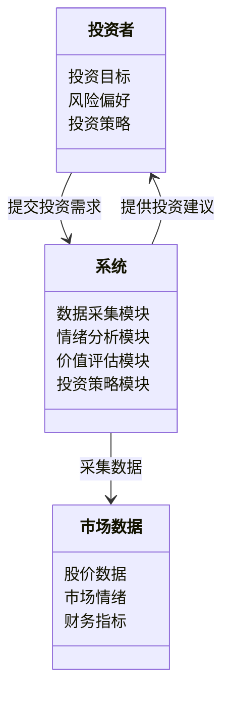
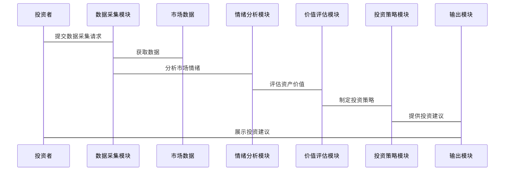

                 


# 约翰·邓普顿的危机投资策略：在恐慌中寻找机会

## 关键词：约翰·邓普顿，危机投资，市场恐慌，投资策略，价值投资，恐慌情绪，投资机会

## 摘要：本文深入探讨了约翰·邓普顿的危机投资策略，分析了他在市场恐慌时期如何寻找投资机会的方法。通过详细讲解其投资理念、策略和实际案例，结合技术分析和系统设计，为读者提供了在恐慌中寻找投资机会的实用指南。

---

## 第一部分：约翰·邓普顿的投资哲学

### 第1章：约翰·邓普顿的生平简介

#### 1.1 约翰·邓普顿的生平与成就
- **1.1.1 早年经历与投资起步**
  - 约翰·邓普顿于1922年出生于加拿大，早年在英国接受教育。
  - 1940年代开始投资生涯，最初投资于英国市场，后来扩展到全球市场。
- **1.1.2 投资生涯中的重要转折点**
  - 1954年创立邓普顿成长基金，成为全球首批共同基金之一。
  - 在1960年代至1980年代，邓普顿通过逆向投资策略，成功捕捉市场恐慌中的机会。
- **1.1.3 对投资界的贡献与影响**
  - 被誉为“共同基金之父”，他的投资理念影响了全球无数投资者。
  - 邓普顿基金在多个经济危机期间表现出色，验证了其投资策略的有效性。

#### 1.2 约翰·邓普顿的投资理念
- **1.2.1 价值投资的核心思想**
  - 强调购买低于内在价值的资产，长期持有，等待市场回归理性。
  - 看重资产的内在价值，而非市场情绪。
- **1.2.2 投资中的逆向思维**
  - 在市场恐慌时买入，在市场狂热时卖出。
  - 逆向投资的关键在于识别市场情绪的极端情况。
- **1.2.3 长期投资与耐心的价值**
  - 长期持有优质资产，避免短期市场的波动干扰。
  - 耐心是投资成功的重要因素，市场恐慌时更需要冷静判断。

---

### 第2章：市场恐慌与投资机会

#### 2.1 市场恐慌的定义与特征
- **2.1.1 市场恐慌的多维度分析**
  - 市场恐慌是投资者情绪的极端表现，通常发生在市场下跌或经济危机期间。
  - 焦虑、恐惧和贪婪是市场恐慌的主要驱动因素。
- **2.1.2 市场恐慌的周期性与波动性**
  - 市场恐慌具有周期性，通常与经济周期密切相关。
  - 波动性是市场恐慌的外在表现，反映在资产价格的剧烈波动上。
- **2.1.3 市场恐慌对投资者心理的影响**
  - 投资者在恐慌时往往做出非理性决策，如盲目抛售资产。
  - 市场恐慌导致资产价格与内在价值的偏离，为逆向投资者提供机会。

#### 2.2 危机投资的背景介绍
- **2.2.1 经济危机与市场恐慌的关系**
  - 经济危机通常是市场恐慌的催化剂，如1987年股灾、2008年金融危机。
  - 经济危机期间，市场恐慌达到顶峰，资产价格大幅下跌。
- **2.2.2 危机投资的典型场景**
  - 投资者在恐慌中抛售资产，导致市场流动性枯竭。
  - 资产价格的超跌为长期投资者提供了买入机会。
- **2.2.3 危机投资的边界与外延**
  - 危机投资不仅限于经济危机，还包括市场恐慌的局部事件。
  - 危机投资需要结合市场环境和资产特性进行判断。

---

### 第3章：恐慌中的投资机会

#### 3.1 理解市场恐慌的来源
- **3.1.1 市场恐慌的驱动因素**
  - 经济基本面恶化，如高失业率、企业盈利下滑。
  - 市场情绪的传染效应，投资者的恐慌情绪相互影响。
  - 媒体的负面报道和舆论引导，加剧市场恐慌。
- **3.1.2 市场恐慌与资产价格的关系**
  - 市场恐慌导致资产价格短期偏离内在价值。
  - 资产价格的超跌为价值投资者提供了买入机会。
- **3.1.3 市场恐慌的传染机制**
  - 市场恐慌从一个资产类别传染到另一个，如股市下跌引发债市抛售。
  - 投资者恐慌性抛售导致流动性危机，进一步加剧市场恐慌。

#### 3.2 理解恐慌中的投资机会
- **3.2.1 投资者情绪与市场定价的偏差**
  - 市场恐慌导致定价失灵，优质资产价格被低估。
  - 投资者情绪的非理性是市场机会的来源。
- **3.2.2 寻找被市场低估的资产**
  - 通过基本面分析，识别具有潜在价值的资产。
  - 关注资产负债表健康、现金流稳定的公司。
- **3.2.3 危机中的价值发现策略**
  - 买入具有长期竞争优势的公司股票。
  - 投资于被市场错杀的优质资产。

---

## 第四部分：约翰·邓普顿的危机投资策略

### 第4章：约翰·邓普顿的危机投资策略

#### 4.1 约翰·邓普顿的危机投资方法
- **4.1.1 在恐慌中寻找机会的基本原则**
  - 识别市场恐慌的根源，判断其持续时间和影响程度。
  - 确定资产的内在价值，评估其与市场价格的偏离程度。
  - 制定投资计划，分阶段逐步建仓，避免一次性投入。
- **4.1.2 突破传统投资思维的关键点**
  - 逆向思维是危机投资的核心，市场恐慌时寻找机会。
  - 避免随大流，独立思考，做出与市场情绪相反的决策。
  - 保持耐心，市场恐慌的恢复需要时间，长期持有才能获得收益。
- **4.1.3 突破传统投资思维的具体策略**
  - 通过基本面分析，识别被市场低估的资产。
  - 选择具有长期竞争优势的公司，等待市场回归理性。
  - 在市场恐慌时，逐步增加仓位，分散投资降低风险。

---

## 第五部分：系统分析与架构设计方案

### 第5章：系统分析与架构设计方案

#### 5.1 问题场景介绍
- 投资者在市场恐慌时，如何系统性地识别投资机会？
- 如何利用技术手段辅助投资决策？

#### 5.2 项目介绍
- 开发一个基于约翰·邓普顿策略的危机投资系统。
- 系统目标：帮助投资者在市场恐慌时识别被低估的资产。
- 系统功能：市场数据采集、情绪分析、价值评估、投资建议。

#### 5.3 系统功能设计（领域模型）


#### 5.4 系统架构设计


#### 5.5 系统接口设计和交互流程


---

## 第六部分：项目实战

### 第6章：项目实战

#### 6.1 环境安装
- **安装Python环境**
  ```bash
  # 使用Anaconda安装Python环境
  conda create -n investment_strategy python=3.8
  conda activate investment_strategy
  ```

- **安装依赖库**
  ```bash
  pip install pandas numpy matplotlib scikit-learn
  ```

#### 6.2 系统核心实现源代码
- **数据处理代码**
  ```python
  import pandas as pd
  import numpy as np

  # 读取市场数据
  df = pd.read_csv('market_data.csv')

  # 计算恐慌指数
  def calculate_panic_index(data):
      # 示例计算方法
      return np.std(data['returns'])
  
  panic_index = calculate_panic_index(df)
  ```

- **价值评估模型代码**
  ```python
  # 示例价值评估模型
  def value_assessment(price, intrinsic_value):
      return price < intrinsic_value

  # 示例计算内在价值
  def calculate_intrinsic_value(financials):
      # 示例计算方法
      return financials['revenue'] / financials['pe_ratio']
  
  intrinsic_value = calculate_intrinsic_value(financials)
  ```

- **投资策略代码**
  ```python
  # 示例投资策略
  def investment_strategy(panic_index, value_assessment):
      if panic_index > threshold and value_assessment:
          return '买入'
      elif panic_index < threshold and not value_assessment:
          return '卖出'
      else:
          return '持有'
  
  strategy = investment_strategy(panic_index, value_assessment(price, intrinsic_value))
  ```

#### 6.3 代码应用解读与分析
- **数据处理**
  - 读取市场数据，计算恐慌指数，识别市场波动性。
- **价值评估**
  - 通过模型计算资产的内在价值，判断市场价格是否被低估。
- **投资策略**
  - 结合恐慌指数和价值评估结果，制定投资决策，如买入、卖出或持有。

#### 6.4 实际案例分析和详细讲解剖析
- **案例：2008年金融危机**
  - 市场恐慌指数急剧上升，资产价格大幅下跌。
  - 价值评估模型显示部分资产价格被低估。
  - 投资策略建议在恐慌中逐步建仓，长期持有优质资产。

#### 6.5 项目小结
- 通过系统设计和代码实现，投资者可以系统性地识别市场恐慌中的投资机会。
- 系统结合数据采集、情绪分析和价值评估，提供科学的投资决策支持。
- 实际案例验证了系统的有效性和实用性。

---

## 第七部分：总结与展望

### 第7章：总结与展望

#### 7.1 最佳实践 tips
- 在市场恐慌时，保持冷静，避免非理性决策。
- 通过系统分析和价值评估，识别被低估的资产。
- 分阶段投资，分散风险，避免一次性投入。

#### 7.2 小结
- 本文深入探讨了约翰·邓普顿的危机投资策略，分析了市场恐慌中的投资机会。
- 结合系统设计和项目实战，为投资者提供了科学的投资方法。

#### 7.3 注意事项
- 投资有风险，需谨慎评估市场环境和资产特性。
- 系统设计需结合实际情况，避免过于依赖单一模型。

#### 7.4 拓展阅读
- 建议阅读约翰·邓普顿的原著《The Winning Investment Habits of Billionaire John D. Rockefeller》。
- 参考其他投资大师的策略，如沃伦·巴菲特、彼得·林奇的投资理念。

---

通过本文的系统分析和实战指导，读者可以更好地理解约翰·邓普顿的危机投资策略，并在实际投资中灵活运用这些方法，抓住市场恐慌中的投资机会，实现长期稳健的投资回报。

