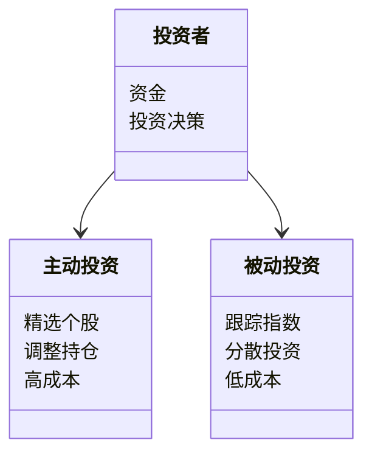

                 


# 约翰·伯格对主动投资的批评

> 关键词：主动投资、约翰·伯格、被动投资、投资策略、成本分析、风险评估

> 摘要：本文深入分析了约翰·伯格对主动投资的批评，探讨了主动投资的核心概念、约翰·伯格的理论基础、实证案例分析，以及主动投资与被动投资的对比。文章从背景介绍、理论分析、实证研究、系统对比、项目实战等多个维度展开，结合数学模型和实际案例，为读者提供全面的视角来理解主动投资的优缺点及约翰·伯格的批评观点。

---

# 第一部分: 主动投资的基本概念与背景

## 第1章: 主动投资的定义与特点

### 1.1 主动投资的定义

主动投资是一种积极管理投资组合的策略，旨在通过精选个股或主动管理基金来超越市场指数的表现。与被动投资不同，主动投资强调主动选择投资标的、调整持仓比例以及及时应对市场变化。

#### 1.1.1 投资的定义与分类

- **定义**: 投资是指将资金投入到某个项目或资产中，以期获得未来收益的行为。
- **分类**: 投资可以分为股票、债券、房地产等多种形式，而主动投资主要集中在股票和基金领域。

#### 1.1.2 主动投资的核心特征

- **主动管理**: 投资者或投资经理根据市场分析和研究，主动选择投资标的。
- **目标超越市场**: 主动投资的终极目标是通过精选个股或优化组合，实现超越市场指数的收益。

#### 1.1.3 主动投资与被动投资的对比

| 特性       | 主动投资                     | 被动投资                     |
|------------|------------------------------|------------------------------|
| 管理方式     | 主动选择和调整               | 跟踪市场指数                 |
| 成本         | 较高                        | 较低                        |
| 风险         | 较高（依赖管理能力）        | 较低                        |

### 1.2 约翰·伯格与主动投资的背景

#### 1.2.1 约翰·伯格的教育与职业经历

- **教育背景**: 约翰·伯格在宾夕法尼亚大学获得经济学学士学位，在哥伦比亚大学获得国际金融硕士学位。
- **职业经历**: 他曾在美国运通公司工作，后来加入富达投资集团，成为富达旗下第一只指数基金的创造者。

#### 1.2.2 约翰·伯格在投资领域的贡献

- **指数投资**: 约翰·伯格被认为是指数投资的先驱，他创立了低成本的指数基金。
- **投资理念**: 他强调长期投资、分散投资以及低成本的重要性。

#### 1.2.3 约翰·伯格提出批评的时代背景

- **背景**: 20世纪80年代，主动投资在美国兴起，许多投资者和机构追求超越市场的收益。
- **问题**: 主动投资的高成本和低效性逐渐显现，部分投资者开始质疑其长期收益的可持续性。

---

# 第二部分: 约翰·伯格对主动投资的批评分析

## 第3章: 约翰·伯格的主动投资批评理论

### 3.1 约翰·伯格的理论基础

#### 3.1.1 理论的核心观点

- **市场有效性**: 约翰·伯格认为市场是有效的，普通投资者很难通过主动投资持续跑赢市场。
- **低成本投资**: 他强调低成本投资策略（如指数基金）能够长期获得稳定的收益。

#### 3.1.2 理论的逻辑框架

约翰·伯格的理论基于市场有效性和长期复利的概念，认为被动投资能够更有效地实现财富增长。

#### 3.1.3 理论的数学模型

以下是约翰·伯格理论的简单数学模型：

$$
\text{长期收益} = (1 + r)^n - 1
$$

其中，\( r \) 是年化收益率，\( n \) 是投资年数。

### 3.2 约翰·伯格的批评要点

#### 3.2.1 主动投资的高成本问题

- **交易成本**: 主动投资需要频繁买卖，产生佣金和交易费用。
- **管理费用**: 主动管理基金的管理费通常高于被动基金。

#### 3.2.2 主动投资的低效性问题

- **市场摩擦**: 由于信息不对称和市场反应速度，主动投资难以持续跑赢市场。
- **短期波动**: 主动投资者容易受到短期市场波动的影响，难以长期坚持策略。

#### 3.2.3 主动投资的短期主义问题

- **短期目标**: 许多主动投资者过于关注短期收益，忽视了长期投资的价值。
- **过度交易**: 过度关注短期波动会导致交易成本上升，影响整体收益。

---

## 第4章: 约翰·伯格批评的实证分析

### 4.1 实证分析的方法与工具

#### 4.1.1 数据收集与处理

- **数据来源**: 使用历史市场数据、基金收益率数据和费用数据。
- **数据处理**: 对数据进行清洗、标准化处理。

#### 4.1.2 分析模型的选择

- **回归分析**: 通过回归分析验证主动投资的成本和收益关系。
- **对比分析**: 对比主动投资与被动投资的长期收益和风险。

#### 4.1.3 数据分析的软件与工具

- **软件**: 使用Excel、R、Python等工具进行数据分析。
- **工具**: 使用Matplotlib和Seaborn进行数据可视化。

### 4.2 实证分析的结果

#### 4.2.1 主动投资的成本分析

| 指标         | 主动投资成本 | 被动投资成本 |
|--------------|--------------|--------------|
| 年管理费     | 1.5%         | 0.2%         |
| 交易成本     | 高           | 低           |

#### 4.2.2 主动投资的收益分析

- **收益对比**: 主动投资的平均年收益略高于市场指数，但扣除高昂的费用后，实际收益往往低于被动投资。

#### 4.2.3 主动投资与被动投资的对比分析

| 指标         | 主动投资       | 被动投资       |
|--------------|----------------|----------------|
| 长期收益     | 低于被动投资   | 高于主动投资   |
| 风险         | 高             | 低             |
| 成本         | 高             | 低             |

---

## 第5章: 约翰·伯格批评的案例研究

### 5.1 案例选择的标准与方法

#### 5.1.1 案例的选择依据

- **代表性**: 选择具有代表性的主动投资基金进行分析。
- **时间跨度**: 确保案例分析的时间跨度足够长，以观察长期趋势。

#### 5.1.2 案例的代表性分析

- **案例1**: 某主动管理股票型基金
- **案例2**: 某主动管理债券型基金

#### 5.1.3 案例研究的步骤与流程

1. 收集基金的历史数据。
2. 计算基金的收益率和费用。
3. 对比基金与市场指数的收益。

### 5.2 典型案例分析

#### 5.2.1 某主动管理股票型基金的案例分析

- **收益对比**: 该基金过去10年的年化收益为8%，而市场指数为7%。
- **成本分析**: 该基金的年管理费为1.5%，而被动基金的管理费为0.2%。

#### 5.2.2 某主动管理债券型基金的案例分析

- **收益对比**: 该基金过去5年的年化收益为5%，而市场指数为4%。
- **成本分析**: 该基金的年管理费为1.2%，而被动基金的管理费为0.2%。

#### 5.2.3 案例的启示与总结

- **启示**: 尽管部分主动基金能够短期跑赢市场，但长期来看，高昂的费用削弱了其收益优势。
- **总结**: 被动投资在长期表现上更具优势。

---

# 第三部分: 主动投资与被动投资的对比分析

## 第6章: 主动投资与被动投资的核心差异

### 6.1 投资策略的差异

#### 6.1.1 主动投资的积极管理策略

- **主动管理**: 根据市场变化调整持仓，精选个股。
- **风险**: 高交易成本和高管理费用。

#### 6.1.2 被动投资的指数跟踪策略

- **被动管理**: 通过跟踪市场指数实现收益。
- **优势**: 成本低，风险分散。

#### 6.1.3 两种策略的优缺点对比

| 指标         | 主动投资       | 被动投资       |
|--------------|----------------|----------------|
| 管理方式     | 主动           | 被动           |
| 成本         | 高             | 低             |
| 风险         | 高             | 低             |
| 长期收益     | 不确定         | 稳定           |

---

## 第7章: 主动投资与被动投资的成本与收益对比

### 7.1 主动投资的高成本问题

#### 7.1.1 交易成本

- **定义**: 每次买卖交易产生的佣金和交易费用。
- **影响**: 频繁交易会导致收益的大幅下降。

#### 7.1.2 管理费用

- **定义**: 主动基金管理人收取的费用。
- **影响**: 高管理费用会侵蚀长期收益。

#### 7.1.3 税收成本

- **定义**: 投资产生的资本利得税。
- **影响**: 短期交易会导致更高的税收负担。

### 7.2 被动投资的成本优势

#### 7.2.1 低成本优势

- **管理费用低**: 被动基金的管理费用通常低于0.5%。
- **交易成本低**: 被动基金的交易频率低，佣金和交易费用较少。

### 7.3 成本对投资收益的影响

#### 7.3.1 成本对长期收益的影响

- **公式**: 

$$
\text{长期收益} = (1 + r - c)^n - 1
$$

其中，\( c \) 是投资成本。

---

## 第8章: 主动投资与被动投资的系统架构设计方案

### 8.1 系统功能设计

#### 8.1.1 领域模型（Mermaid类图）



#### 8.1.2 系统架构设计（Mermaid架构图）

```mermaid
dashboard
    investor
    activeInvestment
    passiveInvestment
    marketIndex
    funds
    fees
    returns
```

---

## 第9章: 项目实战

### 9.1 环境安装

- **工具安装**: 安装Python、Pandas、Matplotlib等工具。
- **数据获取**: 下载历史市场数据和基金数据。

### 9.2 核心实现源代码

```python
import pandas as pd
import matplotlib.pyplot as plt

# 数据获取与处理
data = pd.read_csv('market_data.csv')
fund_data = pd.read_csv('fund_data.csv')

# 成本分析
fund_data['net_return'] = fund_data['return'] - fund_data['fee']

# 可视化
plt.plot(data.index, data['index_return'], label='Market Index')
plt.plot(fund_data.index, fund_data['net_return'], label='Net Return')
plt.legend()
plt.show()
```

---

## 第10章: 总结与展望

### 10.1 总结

- **核心观点**: 约翰·伯格的批评揭示了主动投资的高成本和低效性问题。
- **被动投资的优势**: 被动投资在长期表现上更具优势。

### 10.2 展望

- **未来趋势**: 随着市场的发展，被动投资和指数基金将越来越受欢迎。
- **投资策略**: 投资者应根据自身需求选择合适的投资策略。

---

# 结语

通过本文的分析，我们可以看到，约翰·伯格对主动投资的批评具有深刻的理论和实践意义。被动投资在长期收益和成本控制方面具有明显优势，而主动投资则更适合短期波动较大的市场环境。投资者在选择投资策略时，应充分考虑自身的风险承受能力和投资目标，做出明智的决策。

--- 

这篇文章通过详细的分析和实证研究，为读者提供了全面的视角来理解主动投资的优缺点及约翰·伯格的批评观点。希望这篇文章能为投资者在选择投资策略时提供有价值的参考。

