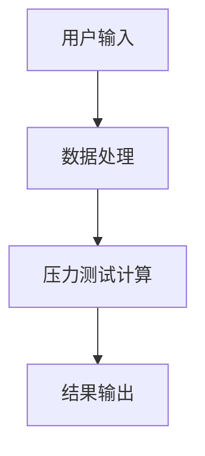
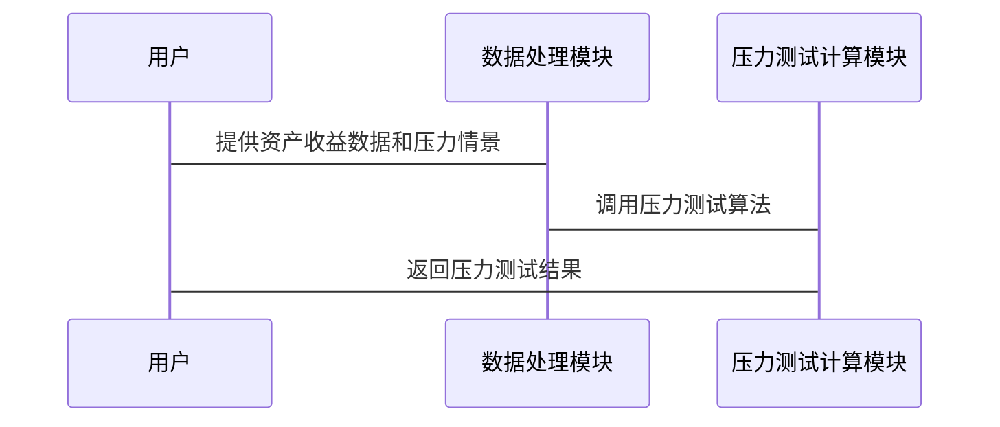

                 


# 约翰伯格的'压力测试'：评估投资组合的抗风险能力

## 关键词
压力测试, 投资组合, 风险管理, 风险度量, VaR, CVaR, 系统架构

## 摘要
压力测试是评估投资组合在极端市场条件下抗风险能力的重要工具。本文详细介绍了压力测试的核心概念、数学模型、系统架构以及实战应用，帮助读者全面理解并掌握压力测试的理论与实践。

---

## 第一章：压力测试的概述

### 1.1 什么是压力测试
压力测试是一种用于评估投资组合在极端市场条件下表现的分析方法。它通过模拟各种不利的市场情景，如市场崩盘、经济衰退或突发事件，来测试投资组合的抗风险能力。

#### 问题背景
- 投资者和机构需要在不确定的市场环境中做出决策，但传统的历史数据分析无法涵盖所有可能的极端情况。
- 单一资产或组合在极端情况下的表现可能差异显著，需要系统化的方法来评估。

#### 问题解决
- 通过压力测试，可以识别投资组合在极端条件下的潜在损失和脆弱性，帮助制定应对策略。

### 1.2 压力测试的核心概念
压力测试的核心在于模拟极端市场情景，评估投资组合在这些情景下的表现。

#### 1.2.1 风险因素
- 市场风险：价格波动、利率变化等。
- 信用风险：债券违约风险。
- 流动性风险：资产难以快速变现。

#### 1.2.2 压力情景
- 市场崩盘：资产价格大幅下跌。
- 利率上升：债券价格下跌。
- 经济衰退：企业盈利下降，违约率上升。

### 1.3 压力测试的重要性
- 帮助机构识别和量化潜在风险。
- 为投资决策提供支持，优化投资组合结构。
- 在极端市场条件下，确保投资组合的稳定性。

---

## 第二章：压力测试的核心概念

### 2.1 风险因素与压力情景
- 风险因素：影响投资组合价值的因素。
- 压力情景：模拟极端市场条件下的投资组合表现。

#### 案例分析
假设我们有一个包含股票、债券和现金的投资组合。在市场崩盘的情景下，股票价格下跌30%，债券价格下跌20%，现金保持不变。我们需要评估投资组合在这种情况下的损失。

### 2.2 压力测试模型的原理
压力测试模型通过模拟极端情景，计算投资组合在这些情景下的潜在损失。

#### 算法步骤
1. 确定压力情景。
2. 计算各资产在压力情景下的表现。
3. 组合这些表现，计算投资组合的总损失。

#### 代码示例
```python
import numpy as np

def compute_stress_test_loss(asset_returns, correlation_matrix, scenarios):
    # 计算各资产在压力情景下的表现
    for scenario in scenarios:
        # 生成压力情景下的资产收益
        stress_asset_returns = generate_stress_returns(asset_returns, correlation_matrix, scenario)
        # 计算投资组合在该情景下的损失
        portfolio_loss = np.dot(portfolio_weights, stress_asset_returns)
        # 记录损失
        losses.append(portfolio_loss)
    return losses
```

### 2.3 压力测试模型的假设与限制
- 假设市场情景是已知的。
- 假设资产之间的关系在压力情景下保持不变。

---

## 第三章：压力测试的数学模型

### 3.1 风险度量的基本概念
风险度量是用来量化投资组合风险的指标。

#### VaR模型
- 定义：在给定置信水平下，投资组合的最大可能损失。
- 公式：$$VaR = \alpha \times \sigma$$
  - $\alpha$：分位数。
  - $\sigma$：标准差。

#### CVaR模型
- 定义：在给定置信水平下，超过VaR的平均损失。
- 公式：$$CVaR = \frac{1}{1-\alpha} \times \int_{\alpha}^{1} VaR d\alpha$$

### 3.2 压力测试的数学模型
压力测试通常结合VaR和CVaR模型，以全面评估投资组合的风险。

#### 案例分析
假设我们有一个投资组合，其资产收益服从正态分布。我们可以通过VaR和CVaR模型来评估其在极端情景下的风险。

---

## 第四章：压力测试的系统架构

### 4.1 系统功能设计
- 输入：资产收益数据、压力情景、投资组合权重。
- 输出：压力测试结果，包括VaR和CVaR值。

#### 系统架构图


### 4.2 系统接口设计
- 输入接口：接收资产收益数据和压力情景。
- 输出接口：输出压力测试结果。

### 4.3 系统交互流程


---

## 第五章：压力测试的项目实战

### 5.1 安装环境
- 安装Python和相关库（如numpy、pandas、scipy）。

### 5.2 核心代码实现
```python
import numpy as np

def compute_var(asset_returns, alpha):
    sorted_returns = np.sort(asset_returns)
    index = int(alpha * len(sorted_returns))
    var = sorted_returns[index]
    return var

def compute_cvar(asset_returns, alpha):
    sorted_returns = np.sort(asset_returns)
    index = int(alpha * len(sorted_returns))
    cvar = np.mean(sorted_returns[index:])
    return cvar
```

### 5.3 案例分析
假设我们有一个股票组合，其历史收益率如下：
```
returns = [0.02, 0.03, -0.01, 0.05, -0.02]
```
计算95%置信水平下的VaR和CVaR。

---

## 第六章：最佳实践与总结

### 6.1 小结
- 压力测试是评估投资组合抗风险能力的重要工具。
- 通过模拟极端情景，可以帮助投资者识别潜在风险。

### 6.2 注意事项
- 压力测试结果仅供参考，需结合实际市场情况。
- 定期更新压力情景和模型参数。

### 6.3 拓展阅读
- "The Theory and Practice of Risk Management" by John C. Hull
- "Stress Testing in Financial Institutions" by Allen M. Malz

---

## 结语
通过本文的详细介绍，读者可以全面理解压力测试的概念、方法和应用。压力测试是投资组合风险管理中的重要工具，能够帮助投资者在复杂多变的市场环境中做出更明智的决策。

