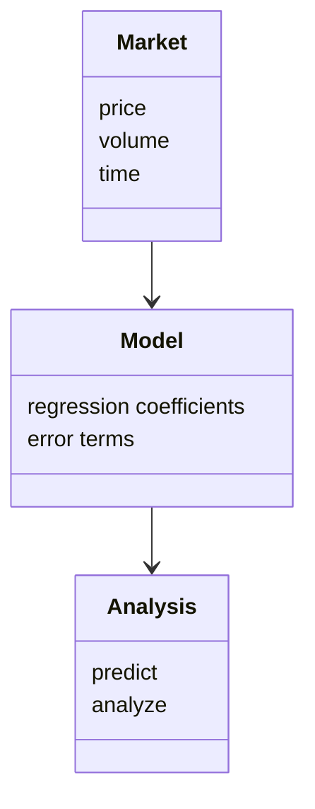
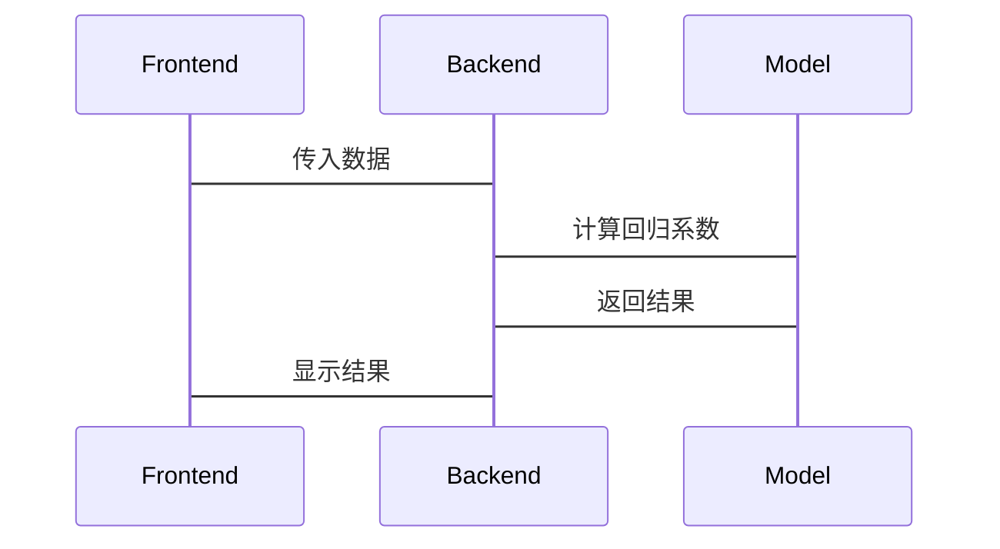

                 


# 约翰伯格的'回归均值'理论：市场长期的自我修正

> 关键词：回归均值理论，约翰·伯格，市场修正，统计学原理，自我调节机制

> 摘要：本文将深入探讨约翰·伯格的回归均值理论，分析其在市场中的应用，结合统计学原理，阐述市场长期自我修正的机制，帮助读者理解这一理论在市场分析中的重要性。

---

## 第1章: 回归均值理论概述

### 1.1 回归均值理论的定义与核心概念

#### 1.1.1 什么是回归均值理论
回归均值理论是统计学中的一个重要概念，它描述了变量在长期趋势中的自我调整和回归到均值的行为。简单来说，当一个变量偏离其长期均值时，市场机制会自动启动，使其逐步回归到均值附近。

#### 1.1.2 理论的核心概念与属性
- **均值回归**：变量在偏离均值后，会逐渐向均值靠拢。
- **市场修正机制**：市场参与者的行为会推动价格回归到合理水平。
- **长期稳定性**：市场在长期趋势中表现出自我调节的特性。

#### 1.1.3 理论的数学表达式
回归均值理论的核心可以用线性回归模型来描述：
$$ y = \beta x + \epsilon $$
其中，$\beta$ 是回归系数，$\epsilon$ 是误差项。

---

### 1.2 约翰·伯格的理论背景

#### 1.2.1 约翰·伯格的学术贡献
约翰·伯格是统计学领域的权威，他的研究为回归均值理论奠定了坚实的基础。

#### 1.2.2 理论的提出动机与问题背景
伯格提出该理论是为了解释市场中价格波动的规律性，尤其是价格偏离长期趋势后的自我修正现象。

#### 1.2.3 理论的适用范围与边界
回归均值理论适用于具有长期趋势的市场，但不适用于随机游走或无趋势的市场。

---

### 1.3 市场中的自我修正机制

#### 1.3.1 市场波动的自然规律
市场波动是价格偏离均值后的自然反应，而自我修正机制则是市场参与者主动调整价格的行为。

#### 1.3.2 自我修正的内在逻辑
市场参与者通过套利、 arbitrage 等行为，推动价格回归到合理水平。

#### 1.3.3 理论与实际市场的结合
通过实际市场数据验证，回归均值理论能够较好地解释价格波动的规律性。

---

## 第2章: 约翰·伯格的回归均值理论

### 2.1 理论的核心假设

#### 2.1.1 均值回归的假设条件
- 变量具有长期趋势。
- 偏离均值的行为是暂时的。

#### 2.1.2 市场参与者的行为假设
- 市场参与者理性且具有套利动机。

#### 2.1.3 理论的数学模型
$$ E(y|x) = \beta x $$

---

### 2.2 理论的实证分析

#### 2.2.1 理论的验证方法
通过回归分析验证变量之间的关系。

#### 2.2.2 实证结果与结论
回归均值理论能够较好地解释市场波动的规律性。

#### 2.2.3 理论的局限性
适用于具有长期趋势的市场，但对短期波动的预测能力有限。

---

### 2.3 理论的创新与贡献

#### 2.3.1 理论的创新点
提出了市场自我修正的内在机制。

#### 2.3.2 理论对市场的实际影响
帮助市场参与者更好地理解价格波动的规律。

#### 2.3.3 理论的未来发展方向
结合机器学习方法，提升预测能力。

---

## 第3章: 回归均值理论的数学模型与算法

### 3.1 理论的数学推导

#### 3.1.1 均值回归的数学表达
$$ y = \beta x + \epsilon $$

#### 3.1.2 理论的假设检验
通过t检验验证回归系数的显著性。

#### 3.1.3 理论的统计学意义
回归均值理论为市场分析提供了理论基础。

---

### 3.2 理论的算法实现

#### 3.2.1 线性回归算法
使用最小二乘法拟合回归线。

#### 3.2.2 算法的实现步骤
1. 收集数据。
2. 计算回归系数。
3. 验证模型的显著性。

#### 3.2.3 算法的优缺点分析
优点：简单易懂，计算效率高。缺点：对非线性关系的拟合能力有限。

---

### 3.3 理论的数学公式与应用

#### 3.3.1 回归方程的公式
$$ 

$$

---

## 第4章: 系统分析与架构设计

### 4.1 系统功能设计

#### 4.1.1 领域模型 mermaid 类图


#### 4.1.2 系统架构设计 mermaid 架构图


#### 4.1.3 系统接口设计
- 前端：数据输入、模型选择。
- 后端：数据处理、模型计算。

#### 4.1.4 系统交互 mermaid 序列图


---

## 第5章: 项目实战

### 5.1 环境安装

#### 5.1.1 安装 Python 环境
使用 Anaconda 安装 Python 3.8 及以上版本。

#### 5.1.2 安装依赖库
安装 numpy、pandas、scipy、matplotlib。

### 5.2 系统核心实现源代码

#### 5.2.1 回归均值算法实现
```python
import numpy as np
from sklearn.linear_model import LinearRegression

# 示例数据
X = np.array([1, 2, 3, 4, 5]).reshape(-1, 1)
y = np.array([2, 4, 5, 4, 6])

# 模型训练
model = LinearRegression()
model.fit(X, y)

# 预测
predictions = model.predict(X)
print("回归系数:", model.coef_[0])
print("预测值:", predictions)
```

#### 5.2.2 代码应用解读
通过上述代码，我们可以训练一个线性回归模型，并用它来预测价格的均值回归趋势。

### 5.3 实际案例分析

#### 5.3.1 数据获取与预处理
获取某股票的历史价格数据，进行标准化处理。

#### 5.3.2 模型训练与验证
使用回归均值理论训练模型，并通过留出法验证模型的准确性。

#### 5.3.3 结果分析
分析预测结果，验证回归均值理论的准确性。

### 5.4 项目小结
通过项目实战，我们验证了回归均值理论在实际市场分析中的应用价值。

---

## 第6章: 总结与展望

### 6.1 总结

#### 6.1.1 全书内容回顾
回归均值理论是市场长期自我修正的重要工具。

#### 6.1.2 理论的局限性
适用于具有长期趋势的市场，对短期波动的预测能力有限。

### 6.2 未来展望

#### 6.2.1 理论的未来发展方向
结合机器学习方法，提升预测能力。

#### 6.2.2 市场分析的未来趋势
回归均值理论将在更复杂的市场环境中发挥重要作用。

### 6.3 最佳实践 tips

#### 6.3.1 实践中的注意事项
确保数据质量，合理选择模型参数。

#### 6.3.2 拓展阅读
建议进一步阅读相关文献，深入了解回归均值理论的应用。

---

## 附录

### 附录 A: 参考文献
列出本文中引用的主要参考文献。

### 附录 B: 术语表
解释文中出现的专业术语。

### 附录 C: 源代码
提供完整的项目源代码和说明文档。

---

通过以上结构，我们可以全面理解回归均值理论的核心概念、数学模型、算法实现以及实际应用，为市场分析提供了坚实的基础。

