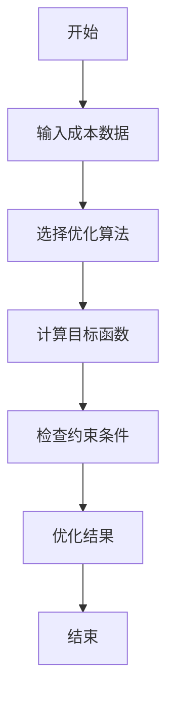

                 


# 目录大纲：约翰伯格的'成本意识'：为什么每一分投资费用都重要

## 第一部分：成本意识的背景与核心概念

### 第1章：成本意识的定义与重要性
#### 1.1 成本意识的定义
- 1.1.1 成本意识的核心概念
- 1.1.2 成本意识的内涵与外延
- 1.1.3 成本意识与投资回报的关系

#### 1.2 成本意识的重要性
- 1.2.1 成本意识在投资决策中的作用
- 1.2.2 成本意识对企业管理的影响
- 1.2.3 成本意识对个人决策的意义

### 第2章：成本意识的核心要素
#### 2.1 成本构成的分析
- 2.1.1 成本的分类与属性
- 2.1.2 成本的驱动因素
- 2.1.3 成本的生命周期

#### 2.2 成本优化的边界与外延
- 2.2.1 成本优化的边界
- 2.2.2 成本优化的外延
- 2.2.3 成本优化与效率的关系

### 第3章：成本意识与投资费用的关系
#### 3.1 投资费用的定义与分类
- 3.1.1 投资费用的分类
- 3.1.2 投资费用的构成
- 3.1.3 投资费用的生命周期

#### 3.2 投资费用对成本意识的影响
- 3.2.1 投资费用对成本控制的影响
- 3.2.2 投资费用对投资回报的影响
- 3.2.3 投资费用对风险管理的影响

## 第二部分：成本意识的核心概念与联系

### 第4章：成本意识的核心概念与联系
#### 4.1 成本意识的核心概念原理
- 4.1.1 成本意识的核心要素
- 4.1.2 成本意识的逻辑结构
- 4.1.3 成本意识的系统性特征

#### 4.2 成本意识与相关概念的对比
- 4.2.1 成本意识与成本控制的对比
- 4.2.2 成本意识与投资决策的对比
- 4.2.3 成本意识与风险管理的对比

#### 4.3 成本意识的ER实体关系图
```mermaid
erDiagram
    actor 投资者 {
        attribute 姓名
        attribute 投资金额
        attribute 投资目标
    }

    actor 管理者 {
        attribute 管理策略
        attribute 管理目标
        attribute 管理范围
    }

    entity 成本 {
        key 属性 成本ID
        attribute 成本类型
        attribute 成本金额
        attribute 成本时间
    }

    entity 投资费用 {
        key 属性 投资费用ID
        attribute 费用类型
        attribute 费用金额
        attribute 费用时间
    }

    investor -> cost : 产生
    investor -> investment_cost : 发生
    manager -> cost : 监控
    manager -> investment_cost : 优化
```

## 第三部分：成本意识的算法原理

### 第5章：成本优化的算法原理
#### 5.1 成本优化算法概述
- 5.1.1 算法的目标与约束
- 5.1.2 算法的输入与输出

#### 5.2 成本优化的数学模型
- 5.2.1 目标函数
- 5.2.2 约束条件
- 5.2.3 求解方法

#### 5.3 成本优化的流程图


#### 5.4 算法的Python实现
```python
import numpy as np

def cost_optimization(costs, constraints):
    # 简单的线性规划实现
    # costs: 成本数组
    # constraints: 约束条件
    # 返回优化后的成本
    pass

# 示例代码
costs = [100, 200, 300]
constraints = {'max_cost': 500}
result = cost_optimization(costs, constraints)
print(result)
```

## 第四部分：系统架构与设计

### 第6章：成本优化系统的架构设计
#### 6.1 系统功能设计
- 6.1.1 系统功能模块
- 6.1.2 功能模块的交互
- 6.1.3 功能模块的实现

#### 6.2 系统架构设计
- 6.2.1 系统架构图
- 6.2.2 系统组件的交互
- 6.2.3 系统的可扩展性

#### 6.3 系统接口设计
- 6.3.1 接口定义
- 6.3.2 接口的实现
- 6.3.3 接口的测试

## 第五部分：项目实战与案例分析

### 第7章：项目实战
#### 7.1 环境配置
- 7.1.1 系统环境
- 7.1.2 软件环境
- 7.1.3 数据准备

#### 7.2 系统核心实现
- 7.2.1 代码实现
- 7.2.2 代码解读
- 7.2.3 代码优化

#### 7.3 案例分析
- 7.3.1 案例背景
- 7.3.2 案例分析
- 7.3.3 案例总结

## 第六部分：总结与展望

### 第8章：总结与展望
#### 8.1 小结
- 成本意识的重要性
- 成本优化的方法
- 系统设计的价值

#### 8.2 注意事项
- 成本优化的局限性
- 算法选择的影响
- 系统维护的重要性

#### 8.3 未来展望
- 成本意识的未来发展
- 算法的改进方向
- 系统设计的创新

---

### 关键词：成本意识，投资费用，优化算法，系统架构，项目实战，风险管理

### 摘要：  
本书《约翰伯格的'成本意识'：为什么每一分投资费用都重要》深入探讨了成本意识在投资决策中的核心地位，从定义、核心概念到算法原理、系统设计和项目实战，全面分析了如何通过成本意识优化投资费用，提升投资回报。通过丰富的理论与实践结合，帮助读者掌握成本意识的本质和应用方法，实现更高效的投资决策和资源管理。

