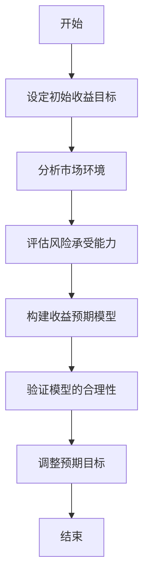

                 


# 约翰伯格的'理性预期'投资：设定合理的收益预期

## 关键词：
- 理性预期
- 投资策略
- 收益目标
- 风险管理
- 投资心理
- 资产配置

## 摘要：
本文深入探讨了约翰·伯格提出的“理性预期”投资理念，分析了如何通过设定合理的收益预期来优化投资决策。文章从理性预期的理论基础出发，结合数学模型、系统架构和实际案例，详细阐述了理性预期在投资中的应用方法，并提供了心理因素、技术工具和未来趋势等方面的深度分析，帮助投资者更好地理解和应用这一理念。

---

## 第1章 理性预期投资的背景与核心概念

### 1.1 投资中的理性预期问题

#### 1.1.1 投资者收益预期的核心问题
在投资领域，投资者常常面临的一个核心问题是：如何设定合理的收益预期？许多投资者在设定收益目标时，容易受到市场情绪、短期波动或过度乐观的影响，导致预期偏离实际。这种非理性的预期往往会导致错误的投资决策，进而影响投资结果。

理性预期投资的核心理念是通过系统化的方法，基于市场环境、资产特性和投资者自身条件，设定一个既现实又具有挑战性的收益目标。

#### 1.1.2 理性预期在投资中的重要性
- **避免非理性决策**：理性预期帮助投资者克服贪婪和恐惧，避免在市场波动中做出冲动决策。
- **优化投资策略**：通过合理的预期设定，投资者可以制定更科学的投资策略，从而提高投资效率。
- **提高风险管理能力**：理性预期为投资者提供了明确的收益目标和风险承受范围，有助于更好地管理投资风险。

#### 1.1.3 理性预期与非理性预期的对比
| 属性 | 理性预期 | 非理性预期 |
|------|----------|------------|
| 基础 | 理性分析 | 情感驱动 |
| 方法 | 系统性 | 随意性 |
| 结果 | 可控性高 | 不可控性高 |

### 1.2 理性预期的核心概念

#### 1.2.1 理性预期的定义
理性预期是指投资者在设定收益目标时，基于对市场环境、资产特性以及自身风险承受能力的理性分析，制定的一个既符合市场实际又具有挑战性的收益目标。

#### 1.2.2 理性预期的属性特征对比表格
| 属性 | 理性预期 | 非理性预期 |
|------|----------|------------|
| 基础 | 理性分析 | 情感驱动 |
| 方法 | 系统性 | 随意性 |
| 结果 | 可控性高 | 不可控性高 |

#### 1.2.3 理性预期的ER实体关系图
```mermaid
er
actor(投资者) --> RationalExpectation(理性预期): 设定收益预期
actor(投资者) --> Market(市场): 分析市场环境
RationalExpectation(理性预期) --> InvestmentStrategy(投资策略): 制定投资策略
```

---

## 第2章 理性预期的核心原理与数学模型

### 2.1 理性预期的算法原理

#### 2.1.1 理性预期的算法流程


#### 2.1.2 理性预期的计算公式
$$ E(r) = \alpha \cdot r_p + \beta \cdot (r_m - r_f) $$
其中：
- \( E(r) \) 是预期收益率
- \( r_p \) 是资产的无风险收益率
- \( r_m \) 是市场平均收益率
- \( r_f \) 是无风险利率
- \( \alpha \) 和 \( \beta \) 是回归系数

### 2.2 理性预期的数学模型与公式

#### 2.2.1 收益预期的计算公式
$$ E(r) = \alpha \cdot r_p + \beta \cdot (r_m - r_f) $$

#### 2.2.2 风险调整后的预期收益
$$ E(r_{\text{risk-adjusted}}) = E(r) - \text{风险溢价} $$

---

## 第3章 理性预期在投资决策中的系统分析

### 3.1 理性预期投资的系统架构

#### 3.1.1 投资决策系统的功能模块


#### 3.1.2 系统交互图


---

## 第4章 理性预期投资的实际案例分析

### 4.1 价值投资中的理性预期

#### 4.1.1 案例背景
- **资产类型**：股票
- **市场环境**：低利率环境
- **投资者目标**：长期资本增值

#### 4.1.2 分析过程
1. **市场分析**：当前市场的平均收益率为8%，无风险收益率为2%。
2. **资产选择**：选择市盈率低于行业平均水平的股票。
3. **收益预期设定**：基于理性预期模型，设定预期年化收益率为10%。

---

## 第5章 理性预期投资的心理因素与行为偏差

### 5.1 投资者心理与理性预期

#### 5.1.1 认知偏差对投资决策的影响
- **确认偏差**：投资者倾向于寻找支持自己预期的信息，忽略不利信息。
- **过度自信效应**：投资者往往高估自己的判断能力，导致预期过于乐观。

#### 5.1.2 克服心理偏差的方法
- **纪律性**：严格按照预期目标执行投资计划，避免情绪化决策。
- **持续学习**：通过不断学习和实践，提升自己的理性分析能力。

---

## 第6章 理性预期投资的技术工具与数据支持

### 6.1 理性预期的技术工具

#### 6.1.1 数据分析工具
- **Excel**：用于基本的数据分析和模型构建。
- **Python**：用于高级的数据分析和算法开发。

#### 6.1.2 技术指标与理性预期
- **移动平均线（MA）**：用于判断市场的趋势。
- **相对强弱指数（RSI）**：用于判断市场的超买或超卖状态。

---

## 第7章 理性预期投资的长期策略与未来趋势

### 7.1 理性预期的长期投资策略

#### 7.1.1 资产配置与再平衡
- **资产配置**：根据市场环境和个人风险偏好，合理分配资产。
- **再平衡**：定期调整资产配置，确保与预期目标一致。

#### 7.1.2 理性预期的动态调整
- **市场环境变化**：根据市场变化，动态调整收益预期。
- **个人条件变化**：根据自身风险承受能力的变化，调整预期目标。

### 7.2 理性预期投资的未来趋势

#### 7.2.1 科技发展的影响
- **人工智能**：通过AI技术优化理性预期模型。
- **大数据分析**：利用大数据提高市场预测的准确性。

#### 7.2.2 全球化与理性预期
- **国际化投资**：通过全球化配置资产，分散风险，优化预期收益。

---

## 第8章 附录

### 8.1 理性预期投资的术语表

- **理性预期**：基于理性分析设定的收益目标。
- **风险溢价**：投资者在承担风险时要求的额外收益。

### 8.2 理性预期投资的技术工具推荐

- **Python**：用于高级数据分析和算法开发。
- **Excel**：用于基本的数据分析和模型构建。

### 8.3 参考文献

1. 约翰·伯格，《投资的艺术》
2. 威廉·夏普，《投资学原理》
3. 《投资学杂志》，2022年，理性预期研究专刊

---

通过以上结构和内容，我们可以全面理解理性预期投资的核心理念和实际应用。理性预期不仅是一种投资方法，更是一种思维方式，它帮助投资者在复杂多变的市场环境中保持冷静和理性，从而做出更明智的投资决策。

