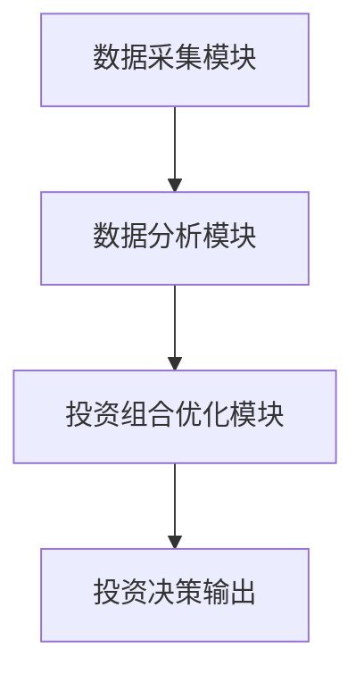

                 


# 约翰伯格的低成本投资理念：为什么费用很重要

> 关键词：低成本投资，投资费用，约翰伯格，投资回报，复利效应

> 摘要：本文深入探讨了约翰伯格的低成本投资理念，重点分析了投资费用对投资回报的影响。通过系统化的分析和实际案例，本文揭示了低成本投资的核心原理、策略和实际应用，帮助投资者理解为什么费用在投资中至关重要。

---

# 引言

## 1.1 低成本投资的背景与重要性

### 1.1.1 投资市场的基本概念

投资市场是一个复杂的系统，涉及金融资产的买卖和管理。投资者通过购买股票、债券、基金等资产，期望获得超过投资本金的回报。然而，投资市场的波动性和不确定性使得投资决策变得复杂。

### 1.1.2 费用对投资回报的影响

投资费用是投资者在购买和管理资产时需要支付的成本。这些费用包括管理费、交易费、托管费等。尽管费用看似微小，但随着时间的推移，它们会对投资回报产生显著影响。例如，假设两个投资者分别投资10000元，一个每年支付1%的管理费，另一个支付0.5%，长期来看，费用较低的投资组合将获得更高的回报。

### 1.1.3 约翰伯格的贡献与理念

约翰伯格是低成本投资的倡导者，他创立了先锋集团（Vanguard），并推广指数基金的投资理念。他认为，长期投资和低成本是实现超额回报的关键。伯格强调，投资者应关注长期回报，而不是短期市场波动。

## 1.2 本书的目的与结构

### 1.2.1 本书的核心目标

本文旨在通过系统化的分析，揭示低成本投资的核心理念，帮助读者理解为什么费用在投资中如此重要。我们将从理论分析、策略制定、系统设计和实战案例四个方面展开讨论。

### 1.2.2 书籍结构概述

- **第二章**：低成本投资的核心理念
- **第三章**：费用对投资回报的影响
- **第四章**：约翰伯格的投资策略
- **第五章**：系统分析与架构设计
- **第六章**：项目实战与案例分析
- **第七章**：总结与展望

---

# 第二章: 低成本投资的核心理念

## 2.1 投资费用的定义与分类

### 2.1.1 费用的定义

投资费用是指投资者在购买、持有和卖出资产过程中产生的各种成本。常见的费用包括管理费、交易费、托管费和营销费用。

### 2.1.2 费用的分类与影响

- **管理费**：按资产规模的一定比例收取，通常在0.5%-2%之间。
- **交易费**：每次交易产生的佣金费用。
- **托管费**：保管资产所需的费用。
- **隐性费用**：包括交易滑点和市场冲击成本。

### 2.1.3 费用与投资回报的关系

费用会直接从投资回报中扣除，影响最终的净收益。高费用的投资组合可能会侵蚀长期回报，尤其是在复利效应下。

## 2.2 约翰伯格的投资哲学

### 2.2.1 长期投资的重要性

伯格认为，短期市场波动无法预测，但长期趋势可以通过分散投资和低成本策略来优化。

### 2.2.2 分散投资的风险控制

通过分散投资，投资者可以降低特定资产或市场的风险。指数基金是一种有效的分散投资工具。

### 2.2.3 低成本投资的优势

低成本投资的核心优势在于减少费用侵蚀，使投资组合能够更多地保留收益，从而实现长期增值。

---

# 第三章: 费用对投资的影响

## 3.1 费用对投资回报的复利效应

### 3.1.1 复利计算公式

复利计算公式为：
$$\text{终值} = \text{本金} \times (1 + \text{收益率})^{\text{时间}}$$

假设两个投资者分别投资10000元，一个支付1%的年管理费，另一个支付0.5%的年管理费。经过30年，费用较低的投资组合将显著跑赢费用较高的组合。

### 3.1.2 费用对长期投资的影响

长期投资中，费用的累积效应会显著影响回报。例如，如果管理费为1%，每年的回报率为7%，那么实际可分配的收益为6%。

### 3.1.3 如何选择低成本投资工具

选择低成本投资工具时，应关注以下指标：
- 基金费用比率（TER）
- 交易费用
- 隐性费用

---

# 第四章: 约翰伯格的投资策略

## 4.1 约翰伯格的投资方法

### 4.1.1 指数基金投资

指数基金通过跟踪市场指数（如标普500）进行投资，具有分散风险和低成本的特点。

### 4.1.2 长期持有策略

伯格倡导长期持有投资，避免频繁交易，从而降低交易费用和市场冲击成本。

## 4.2 投资组合的构建

### 4.2.1 分散投资的重要性

通过投资不同资产类别和地理区域，投资者可以降低特定风险。

### 4.2.2 风险管理的技巧

风险管理包括设定止损点和定期调整投资组合。

## 4.3 投资决策的系统化方法

### 4.3.1 投资决策流程

1. 确定投资目标和风险承受能力。
2. 选择低成本投资工具。
3. 定期监控和调整投资组合。

### 4.3.2 数据分析的重要性

通过数据分析，投资者可以评估历史表现、费用比率和风险指标。

---

# 第五章: 系统分析与架构设计

## 5.1 投资决策系统的构建

### 5.1.1 系统目标与范围

投资决策系统的目的是帮助投资者制定和优化投资策略。

### 5.1.2 系统功能设计

- 数据采集模块：收集市场数据和费用信息。
- 数据分析模块：计算费用影响和投资回报。
- 投资组合优化模块：推荐低成本投资组合。

### 5.1.3 系统架构图



## 5.2 投资组合优化的数学模型

### 5.2.1 最小化费用的优化目标

$$\text{最小化} \sum_{i=1}^{n} w_i \times c_i$$

其中，$w_i$ 是第$i$个资产的权重，$c_i$ 是第$i$个资产的费用率。

### 5.2.2 投资组合优化的约束条件

$$\sum_{i=1}^{n} w_i = 1$$

$$w_i \geq 0, \forall i$$

---

# 第六章: 项目实战与案例分析

## 6.1 项目环境安装

### 6.1.1 工具安装

- Python编程环境
- 数据分析库（Pandas、NumPy）
- 可视化库（Matplotlib、Seaborn）

### 6.1.2 数据来源

- 市场数据：Yahoo Finance API
- 费用数据：基金公司公开信息

## 6.2 核心代码实现

### 6.2.1 数据获取与处理

```python
import pandas as pd
import requests

# 获取市场数据
url = "https://query1.finance.yahoo.com..."
data = requests.get(url).json()
df = pd.DataFrame(data)
```

### 6.2.2 费用影响分析

```python
def calculate_fee_impact(principal, rate, fees):
    return principal * (1 + rate - fees) ** years

# 示例计算
principal = 10000
rate = 0.07
fees = 0.01
years = 30
print(calculate_fee_impact(principal, rate, fees))
```

## 6.3 案例分析

### 6.3.1 投资组合优化

假设投资者有10000元，目标是优化投资组合的费用。

### 6.3.2 实际案例解读

通过具体案例分析，展示低成本投资策略的实际效果。

## 6.4 项目小结

通过项目实战，我们验证了低成本投资策略的有效性，并掌握了投资组合优化的基本方法。

---

# 第七章: 总结与展望

## 7.1 本章总结

本文系统地分析了约翰伯格的低成本投资理念，揭示了费用对投资回报的影响，并通过实际案例展示了低成本投资的优势。

## 7.2 未来展望

随着金融科技的发展，低成本投资工具将更加普及，投资者可以通过技术手段进一步优化投资策略。

---

# 最佳实践 Tips

- **长期投资**：坚持长期持有，避免频繁交易。
- **分散投资**：通过指数基金分散风险。
- **关注费用**：选择低成本投资工具，减少费用侵蚀。

通过本文的分析，读者可以更好地理解为什么费用在投资中如此重要，并掌握低成本投资的核心策略。

