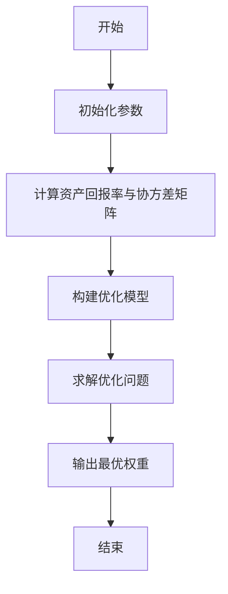
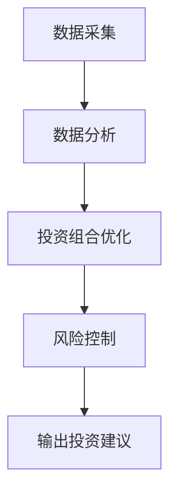

                 


# 《约翰伯格的低成本投资策略》

> **关键词**：低成本投资，约翰伯格，投资策略，投资组合优化，费用率，风险控制，长期收益

> **摘要**：本文深入探讨了约翰伯格提出的低成本投资策略，从理论基础到实践应用进行了全面分析。文章首先介绍了低成本投资的背景与核心概念，包括费用率与投资收益的关系、投资组合优化的数学模型等。接着，从系统设计的角度详细讲解了低成本投资策略的实现，包括系统架构设计、功能模块划分等。最后，通过实际案例分析了低成本投资策略的应用效果，并提出了最佳实践建议，为投资者提供了切实可行的操作指南。

---

## 第一部分：低成本投资策略的背景与核心概念

### 第1章：低成本投资的起源与意义

#### 1.1 投资市场的基本问题

##### 1.1.1 投资市场的不确定性与风险
- 投资市场的本质：市场的不确定性和波动性。
- 投资者的心理：贪婪与恐惧的双重影响。
- 投资市场的基本问题：信息不对称、市场的不可预测性。

##### 1.1.2 问题背景：传统投资策略的高成本与低效性
- 传统投资策略的特点：主动管理、频繁交易。
- 传统投资策略的缺点：高昂的管理费、交易成本，以及难以跑赢市场的问题。

##### 1.1.3 问题解决：低成本投资的核心理念
- 低成本投资的核心理念：降低费用率，追求长期稳定收益。
- 低成本投资的优势：长期复利效应、风险分散。

##### 1.1.4 边界与外延：低成本投资的适用范围与限制
- 低成本投资的适用范围：适合长期投资者，尤其是机构投资者和个人投资者。
- 低成本投资的限制：短期市场波动的影响、市场环境的变化。

##### 1.1.5 核心要素：低成本、长期收益、风险控制
- 成本控制：降低管理费、交易费等。
- 长期收益：通过复利效应实现财富增长。
- 风险控制：分散投资、避免过度集中。

#### 1.2 约翰·伯格的低成本投资理念

##### 1.2.1 伯格的投资哲学
- 伯格的投资哲学：长期投资、价值投资、分散投资。
- 伯格的核心理念：通过低成本指数基金实现长期稳定的收益。

##### 1.2.2 低成本投资的起源与发展
- 低成本投资的起源：20世纪70年代，伯格创立先锋集团，推出低成本指数基金。
- 低成本投资的发展：从被动投资到主动投资的平衡。

##### 1.2.3 伯格投资策略的核心要素
- 低成本：通过降低管理费和交易费，提高净收益。
- 长期视角：注重长期投资，避免短期波动的干扰。
- 分散投资：通过投资指数基金实现资产分散。

#### 1.3 低成本投资与传统投资的对比

##### 1.3.1 投资策略对比表格
| 投资策略 | 传统投资 | 低成本投资 |
|----------|----------|------------|
| 管理方式 | 主动管理 | 被动管理    |
| 成本     | 高       | 低         |
| 收益     | 不稳定   | 稳定       |
| 风险     | 高       | 低         |

##### 1.3.2 投资收益对比分析
- 传统投资的收益：依赖基金经理的能力，收益不稳定。
- 低成本投资的收益：通过长期复利效应实现稳定增长。

##### 1.3.3 风险控制对比分析
- 传统投资的风险：集中投资导致高风险。
- 低成本投资的风险：分散投资降低风险。

---

### 第2章：低成本投资的核心概念与原理

#### 2.1 费用率与投资收益的关系

##### 2.1.1 费用率的定义与计算公式
- 费用率的定义：投资产品的管理费、托管费等费用的总和。
- 费用率的计算公式：$$费用率 = \frac{管理费 + 托管费 + 其他费用}{资产规模}$$

##### 2.1.2 费用率对投资收益的影响
- 费用率对投资收益的长期影响：$$最终收益 = 初始资金 \times (1 + 收益率 - 费用率)^n$$，其中n为投资年数。

##### 2.1.3 费用率与投资期限的关系
- 长期投资中，费用率的累积效应更加明显。

#### 2.2 投资组合优化的数学模型

##### 2.2.1 现代投资组合理论（MPT）的简要介绍
- MPT的核心思想：通过资产组合优化，实现收益与风险的最佳平衡。

##### 2.2.2 投资组合优化的数学公式
- 最优化目标：最大化收益，最小化风险。
- 数学公式：$$\min \sigma^2 \quad \text{subject to} \quad \mathbf{w}^T \mathbf{1} = 1$$，其中$$\sigma^2$$为投资组合的方差，$$\mathbf{w}$$为权重向量。

##### 2.2.3 投资组合优化的算法流程图


#### 2.3 股票选择与市场时机的权衡

##### 2.3.1 股票选择的数学模型
- 股票选择的优化目标：$$\max \sum_{i=1}^n w_i r_i$$，其中$$w_i$$为第i只股票的权重，$$r_i$$为第i只股票的预期回报率。

##### 2.3.2 市场时机预测的挑战
- 市场时机预测的不确定性：难以准确预测市场的短期波动。

##### 2.3.3 股票选择与市场时机的权衡分析
- 长期投资中，市场时机的重要性较低，股票选择更重要。

---

## 第二部分：低成本投资策略的系统分析与架构设计

### 第3章：低成本投资系统的设计与实现

#### 3.1 系统功能需求分析

##### 3.1.1 投资者需求分析
- 投资者的核心需求：低成本、长期稳定收益、风险控制。
- 投资者的次要需求：实时监控、定期调整。

##### 3.1.2 系统功能模块划分
| 功能模块 | 功能描述 |
|----------|----------|
| 数据采集 | 采集市场数据、基金信息等。 |
| 数据分析 | 分析数据，生成投资建议。 |
| 投资组合优化 | 根据数据分析结果，优化投资组合。 |
| 风险控制 | 监控投资组合的风险，及时调整。 |

##### 3.1.3 功能需求的优先级排序
- 优先级排序：数据采集 > 数据分析 > 投资组合优化 > 风险控制。

#### 3.2 系统架构设计

##### 3.2.1 系统架构的模块划分
- 数据采集模块、数据分析模块、投资组合优化模块、风险控制模块。

##### 3.2.2 系统架构的流程图


##### 3.2.3 系统接口的设计
- 数据接口：与数据源（如金融数据库）对接。
- 用户接口：提供给投资者使用的前端界面。

#### 3.3 系统实现的代码框架

##### 3.3.1 系统环境安装说明
- Python 3.8及以上版本。
- 安装必要的库：Pandas、NumPy、Matplotlib、Scipy。

##### 3.3.2 系统核心代码实现
```python
import pandas as pd
import numpy as np

# 数据采集
data = pd.read_csv('market_data.csv')

# 数据分析
returns = data.pct_change().dropna()

# 投资组合优化
def optimize_portfolio(returns):
    n = returns.shape[1]
    cov_matrix = returns.cov()
    mu = returns.mean()
    # 使用MPT进行优化
    from scipy.optimize import minimize
    def objective(weights):
        return weights.T @ cov_matrix @ weights
    constraints = [{'type': 'eq', 'fun': lambda w: sum(w) - 1}]
    bounds = [(0, 1) for _ in range(n)]
    result = minimize(objective, np.ones(n)/n, bounds=bounds, constraints=constraints)
    return result.x

# 风险控制
def risk_control(weights, returns):
    portfolio_variance = weights.T @ returns.cov() @ weights
    return portfolio_variance
```

##### 3.3.3 代码功能分析与优化建议
- 代码功能分析：实现数据采集、数据分析、投资组合优化和风险控制。
- 优化建议：引入并行计算、优化算法效率。

---

## 第三部分：低成本投资策略的项目实战

### 第4章：低成本投资组合的构建与优化

#### 4.1 数据收集与分析

##### 4.1.1 数据来源与采集方法
- 数据来源：金融数据库（如Yahoo Finance）、政府机构数据。

##### 4.1.2 数据清洗与预处理
- 去除缺失值、异常值。
- 标准化数据。

##### 4.1.3 数据分析与可视化
- 使用Matplotlib进行数据可视化，分析资产回报率、波动率等。

#### 4.2 投资组合的优化实现

##### 4.2.1 投资组合优化的代码实现
```python
# 数据分析
returns = data.pct_change().dropna()

# 投资组合优化
weights = optimize_portfolio(returns)
```

##### 4.2.2 优化结果的分析与解读
- 优化结果：最优权重分布。
- 收益与风险的平衡。

##### 4.2.3 优化策略的调整与改进
- 根据市场变化调整优化模型。
- 引入新的资产类别。

#### 4.3 实战案例分析

##### 4.3.1 案例背景介绍
- 案例目标：构建低成本投资组合。
- 案例时间跨度：5年。

##### 4.3.2 案例分析与实现
- 数据分析：历史回报率、波动率。
- 投资组合优化：使用上述代码实现。

##### 4.3.3 案例总结与反思
- 成功经验：低成本策略的有效性。
- 优化建议：定期再平衡投资组合。

---

## 第四部分：低成本投资策略的最佳实践与小结

### 第5章：低成本投资的最佳实践

#### 5.1 投资策略的执行要点

##### 5.1.1 投资策略的执行步骤
1. 设定投资目标。
2. 构建投资组合。
3. 定期调整组合。

##### 5.1.2 投资组合的定期调整
- 定期再平衡：每年调整一次。
- 调整依据：市场变化、个人财务状况变化。

##### 5.1.3 风险控制的具体措施
- 分散投资：避免过度集中。
- 设置止损点：防止重大损失。

#### 5.2 投资者的心理与行为管理

##### 5.2.1 投资者心理分析
- 过度自信：容易导致错误决策。
- 恐慌与贪婪：影响投资行为。

##### 5.2.2 行为偏差的克服方法
- 避免情绪化决策。
- 建立投资纪律。

#### 5.3 长期投资与短期波动的平衡

##### 5.3.1 长期投资的策略选择
- 选择优质资产。
- 长期持有。

##### 5.3.2 短期波动的应对方法
- 保持耐心。
- 避免频繁交易。

##### 5.3.3 长期与短期的平衡点
- 长期视角主导，短期波动为辅。

### 第6章：低成本投资的总结与展望

#### 6.1 本书的核心内容回顾

##### 6.1.1 核心概念的总结
- 低成本投资的核心理念。
- 投资组合优化的数学模型。

##### 6.1.2 投资策略的总结
- 低成本策略的优势。
- 投资组合优化的关键步骤。

##### 6.1.3 系统设计的总结
- 系统架构设计。
- 代码实现要点。

#### 6.2 低成本投资的未来发展趋势

##### 6.2.1 低成本投资的未来方向
- 数字化投资。
- 智能化投资。

##### 6.2.2 数字化与智能化的结合
- 人工智能在投资中的应用。
- 数字化工具的普及。

##### 6.2.3 未来投资策略的创新
- 新型资产类别的引入。
- 新的投资模型的开发。

#### 6.3 投资者的自我提升建议

##### 6.3.1 投资知识的持续学习
- 关注市场动态。
- 学习投资理论。

##### 6.3.2 投资技能的不断精进
- 提高数据分析能力。
- 熟练掌握投资工具。

##### 6.3.3 投资心态的自我修炼
- 保持冷静。
- 坚持长期视角。

### 第7章：附录与拓展阅读

#### 7.1 附录

##### 7.1.1 相关公式与表格
- 投资组合优化的数学公式。
- 投资策略对比表格。

##### 7.1.2 数

