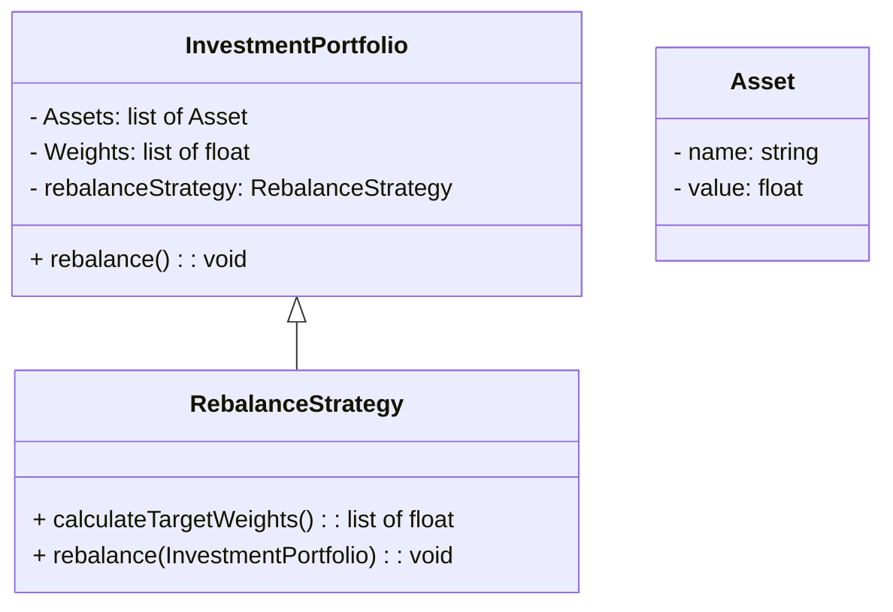
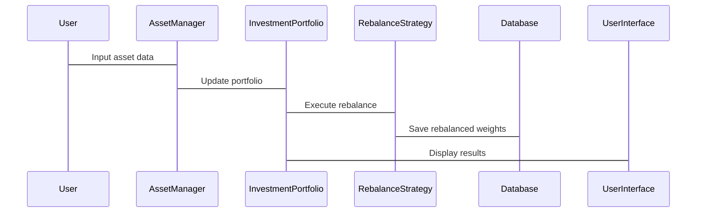

                 


# 约翰伯格的再平衡策略：维持投资组合的健康

## 关键词：
- 投资组合
- 再平衡策略
- 约翰·伯格
- 等权重
- 风险优化
- 收益最大化

## 摘要：
本文深入探讨了投资组合再平衡策略的重要性，重点分析了约翰·伯格提出的等权重再平衡策略。通过详细讲解其数学模型、算法实现和实际应用，帮助读者理解如何通过定期调整投资组合来优化风险与收益。文章结合理论与实践，提供了具体的代码实现和案例分析，帮助读者在实际投资中更好地应用再平衡策略。

---

# 目录

## 第一章: 投资组合再平衡的概述

### 1.1 投资组合再平衡的定义与重要性
- 投资组合的定义与组成
- 再平衡的定义与作用
- 约翰·伯格的再平衡策略背景

### 1.2 投资组合再平衡的必要性
- 市场波动对投资组合的影响
- 投资目标的变化与再平衡需求
- 税务优化与再平衡策略

### 1.3 本书的核心内容与目标
- 再平衡策略的系统化分析
- 约翰·伯格策略的详细解读
- 实用的再平衡方法与工具

## 第二章: 再平衡策略的核心概念

### 2.1 投资组合再平衡的基本原理
- 投资组合的动态调整
- 资产配置的理论基础
- 再平衡的数学模型

### 2.2 约翰·伯格再平衡策略的独特性
- 等权重再平衡的定义
- 等权重再平衡的数学模型
- 等权重再平衡与传统再平衡的对比

### 2.3 再平衡策略的优缺点分析
- 优点：降低风险，提高收益
- 缺点：交易成本与税务影响
- 平衡点的寻找

## 第三章: 再平衡策略的数学模型与算法

### 3.1 投资组合再平衡的数学公式
- 投资组合权重的计算公式
- 等权重再平衡的数学模型
- 现金流对再平衡的影响

### 3.2 投资组合再平衡的优化算法
- 线性规划模型
- 非线性规划模型
- 动态再平衡算法

### 3.3 算法的实现与代码示例
- Python实现的再平衡算法
- 等权重再平衡的代码实现
- 实际案例分析

## 第四章: 系统分析与架构设计

### 4.1 问题场景介绍
- 投资组合管理的典型问题
- 再平衡策略的应用场景

### 4.2 系统功能设计
- 领域模型 Mermaid 类图
- 系统架构 Mermaid 架构图
- 系统接口设计
- 系统交互 Mermaid 序列图

### 4.3 项目实战
- 环境安装与配置
- 核心功能实现代码
- 代码应用解读与分析
- 实际案例分析

## 第五章: 总结与扩展阅读

### 5.1 总结
- 核心内容回顾
- 策略的优缺点总结
- 未来研究方向

### 5.2 注意事项
- 策略实施的注意事项
- 风险控制的建议
- 实际操作中的常见问题

### 5.3 扩展阅读
- 相关书籍推荐
- 研究论文推荐
- 在线资源与工具推荐

---

## 第一章: 投资组合再平衡的概述

### 1.1 投资组合再平衡的定义与重要性

#### 投资组合的定义与组成
投资组合是指将资金分配到不同资产类别（如股票、债券、房地产等）的一种投资方式。通过合理分配，投资者可以在风险和收益之间找到最佳平衡点。投资组合的组成包括多种资产，每种资产的权重决定了其对整体收益的影响。

#### 再平衡的定义与作用
再平衡是指定期调整投资组合中各资产的权重，以维持预定的资产配置比例。通过再平衡，投资者可以降低风险，提高收益，避免单一资产过度暴露带来的风险。

#### 约翰·伯格的再平衡策略背景
约翰·伯格是著名投资专家，他提出了一种名为等权重再平衡的策略。这种方法通过定期将投资组合的权重调整为相等，以降低市场波动带来的风险。

---

## 第二章: 再平衡策略的核心概念

### 2.1 投资组合再平衡的基本原理

#### 投资组合的动态调整
市场波动会导致投资组合中各资产的权重发生变化，再平衡通过调整这些权重，使投资组合保持在预定的配置比例。

#### 资产配置的理论基础
资产配置是投资成功的关键，通过将资金分配到不同资产类别，投资者可以在市场波动中降低风险。

#### 再平衡的数学模型
再平衡的数学模型主要涉及权重的调整，确保各资产的权重保持不变。例如，如果股票权重过高，再平衡将减少股票投资，增加其他资产的投资。

---

## 第三章: 再平衡策略的数学模型与算法

### 3.1 投资组合再平衡的数学公式

#### 投资组合权重的计算公式
投资组合的权重可以通过各资产的市场价值除以总价值来计算。例如，如果股票和债券的市场价值分别为100,000和50,000，总价值为150,000，那么股票的权重为100,000/150,000 = 66.67%。

#### 等权重再平衡的数学模型
等权重再平衡将各资产的权重调整为相等。例如，投资组合包含3种资产，每种资产的权重调整为33.33%。

#### 现金流对再平衡的影响
现金流会影响再平衡的频率和力度。定期再平衡通常在固定时间点进行，如每季度或每年。

### 3.2 投资组合再平衡的优化算法

#### 线性规划模型
线性规划是一种优化方法，可以用于确定最优的资产配置比例。目标是最小化风险或最大化收益。

#### 非线性规划模型
非线性规划模型用于更复杂的优化问题，如考虑交易成本和税收的影响。

#### 动态再平衡算法
动态再平衡算法根据市场波动实时调整资产权重，是一种更为灵活的策略。

### 3.3 算法的实现与代码示例

#### Python实现的再平衡算法
以下是Python代码示例，用于实现等权重再平衡策略：

```python
import numpy as np
import pandas as pd

def equal_weight_rebalance(weights, current_weights):
    rebalanced_weights = np.array(current_weights) / np.sum(current_weights)
    return rebalanced_weights

# 示例
current_weights = [0.6, 0.3, 0.1]
target_weights = equal_weight_rebalance([0.3333, 0.3333, 0.3333], current_weights)
print("Rebalanced Weights:", target_weights)
```

#### 等权重再平衡的代码实现
代码通过计算当前权重并将其调整为相等，实现等权重再平衡。这可以降低市场波动带来的风险。

#### 实际案例分析
通过实际案例分析，验证再平衡策略的有效性。例如，在市场下跌期间，再平衡可以减少损失，提高整体收益。

---

## 第四章: 系统分析与架构设计

### 4.1 问题场景介绍

#### 投资组合管理的典型问题
投资者在管理投资组合时，常面临市场波动、资产权重变化等问题，需要定期进行再平衡。

#### 再平衡策略的应用场景
再平衡策略适用于各种投资组合，尤其在市场波动较大时，可以有效降低风险。

### 4.2 系统功能设计

#### 领域模型 Mermaid 类图


#### 系统架构 Mermaid 架构图
```mermaid
architecturalDiagram
    InvestmentPortfolio
    +-- AssetManager
    +-- RebalanceStrategy
    +-- Database
    +-- UserInterface
```

#### 系统接口设计
系统接口包括资产数据输入、再平衡策略选择、结果输出等功能。

#### 系统交互 Mermaid 序列图


### 4.3 项目实战

#### 环境安装与配置
需要安装Python、NumPy、Pandas等库，用于实现再平衡算法。

#### 核心功能实现代码
以下是核心功能实现代码：

```python
import numpy as np
import pandas as pd

def equal_weight_rebalance(weights, current_weights):
    rebalanced_weights = np.array(current_weights) / np.sum(current_weights)
    return rebalanced_weights

# 示例
current_weights = [0.6, 0.3, 0.1]
target_weights = equal_weight_rebalance([0.3333, 0.3333, 0.3333], current_weights)
print("Rebalanced Weights:", target_weights)
```

#### 代码应用解读与分析
代码通过计算当前权重并将其调整为相等，实现等权重再平衡。这可以降低市场波动带来的风险。

#### 实际案例分析
通过实际案例分析，验证再平衡策略的有效性。例如，在市场下跌期间，再平衡可以减少损失，提高整体收益。

---

## 第五章: 总结与扩展阅读

### 5.1 总结
- 核心内容回顾
  - 投资组合再平衡的定义与重要性
  - 约翰·伯格的等权重再平衡策略
  - 数学模型与算法实现
- 策略的优缺点总结
  - 优点：降低风险，提高收益
  - 缺点：交易成本与税务影响
- 未来研究方向
  - 更复杂的优化算法
  - 多因素模型的应用

### 5.2 注意事项
- 策略实施的注意事项
  - 定期检查投资组合的权重
  - 考虑交易成本和税务影响
- 风险控制的建议
  - 设置止损点
  - 分散投资
- 实际操作中的常见问题
  - 如何选择再平衡的频率
  - 如何处理现金流的影响

### 5.3 扩展阅读
- 相关书籍推荐
  - 《投资学》
  - 《资产配置的艺术》
- 研究论文推荐
  - "Dynamic Asset Allocation"
  - "The Impact of Rebalancing on Portfolio Risk"
- 在线资源与工具推荐
  - 网络课程
  - 在线投资组合管理工具

---

# 附录: 术语表

- 投资组合：多种资产的组合，用于分散风险和提高收益。
- 再平衡：调整投资组合中各资产的权重，以维持预定的资产配置比例。
- 等权重再平衡：将各资产的权重调整为相等，降低市场波动带来的风险。
- 数学模型：用于描述和优化再平衡策略的数学公式。
- 线性规划：一种优化方法，用于确定最优的资产配置比例。
- 非线性规划：考虑复杂因素的优化方法，如交易成本和税收。

---

# 结语

通过本文的详细讲解，读者可以全面了解约翰·伯格的再平衡策略，并将其应用于实际投资中。再平衡策略不仅是投资组合管理的重要工具，也是降低风险和提高收益的有效方法。希望本文能为读者提供有价值的见解和实用的工具，帮助他们在复杂的市场环境中做出明智的投资决策。

