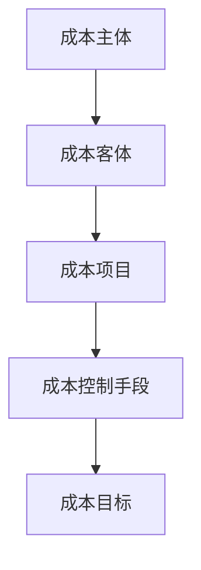
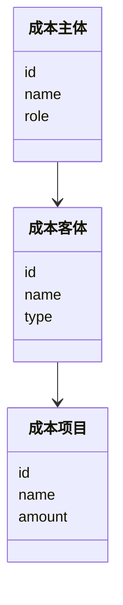
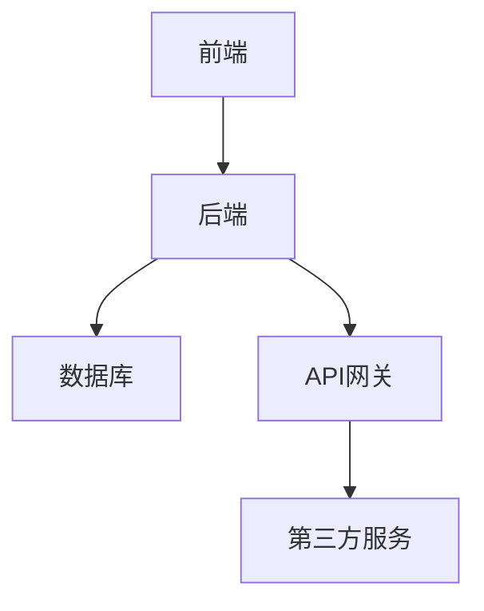
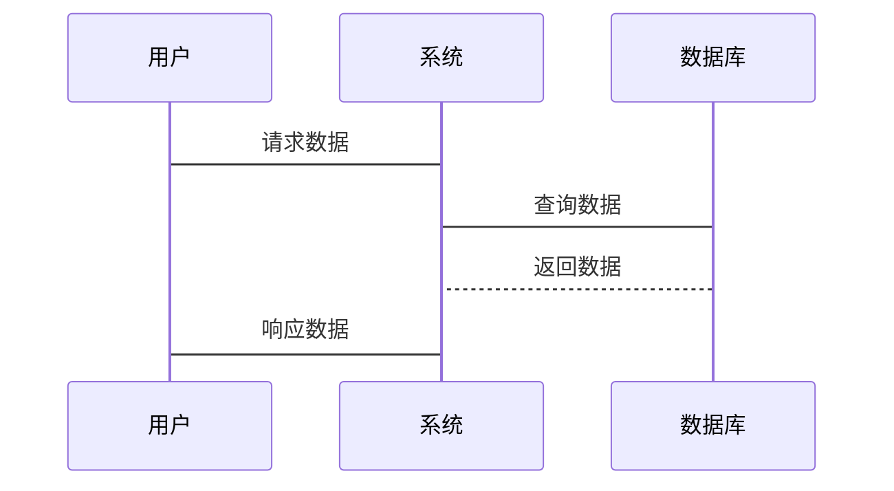

                 


# 约翰伯格的成本控制理念

## 关键词：
成本控制，约翰伯格，管理理念，优化算法，系统架构，项目实战

## 摘要：
本文深入探讨了约翰伯格的成本控制理念，从核心概念、算法原理、系统架构到项目实战，全面剖析了成本控制的理论与实践。文章通过详细的背景介绍、对比分析、数学模型和实际案例，帮助读者理解并应用这一理念，提升企业成本管理效率。

---

# 第1章: 成本控制的基本概念

## 1.1 成本控制的定义与背景

### 1.1.1 成本控制的定义

成本控制是指通过规划、预测、监控和调整，确保企业在生产和运营过程中合理利用资源，以最小化成本，同时实现企业目标。约翰伯格的成本控制理念强调在不牺牲质量的前提下，通过优化资源配置，实现成本的最小化。

### 1.1.2 成本控制的背景与重要性

随着市场竞争的加剧，企业需要在保证产品质量的同时，尽可能降低成本。成本控制不仅是企业生存的关键，更是提升企业竞争力的重要手段。约翰伯格的理念在这一背景下应运而生，为企业提供了系统的成本管理方法。

### 1.1.3 约翰伯格的成本控制理念的核心思想

约翰伯格认为，成本控制不是简单的削减开支，而是通过优化流程、提升效率和创新管理方式，实现成本的最优配置。他强调，成本控制应与企业的战略目标相结合，注重长期效益而非短期利益。

---

## 1.2 成本控制的基本原则

### 1.2.1 成本效益分析

成本效益分析是成本控制的重要工具，用于评估不同成本控制方案的经济效益。通过比较投入与产出，企业可以选择最优方案。

### 1.2.2 成本与质量的平衡

在成本控制中，质量是核心要素之一。约翰伯格提出，降低成本不应以牺牲产品质量为代价，而应在保证质量的前提下，寻找成本的最小化。

### 1.2.3 成本控制的长期与短期目标

成本控制需要兼顾短期和长期目标。短期目标是降低即时成本，长期目标是通过优化流程和管理，实现持续的成本节约。

---

## 1.3 成本控制的关键要素

### 1.3.1 成本控制的主体

成本控制的主体包括企业内部的各个部门，如财务部、生产部和销售部等。每个部门在成本控制中都有其特定的角色和责任。

### 1.3.2 成本控制的对象

成本控制的对象是企业的各项成本，包括原材料、人工、设备折旧等。通过分析和优化这些成本，企业可以实现整体成本的降低。

### 1.3.3 成本控制的手段与方法

成本控制的手段包括预算管理、成本分析、差异分析等。约翰伯格提倡使用多种方法，如ABC成本法和价值工程，来实现成本的全面控制。

---

## 1.4 本章小结

本章从基本概念、原则和关键要素三个方面，详细介绍了成本控制的理论基础和约翰伯格的成本控制理念。理解这些内容是进一步分析成本控制的核心概念和算法原理的基础。

---

# 第2章: 成本控制的核心概念与联系

## 2.1 成本控制的主体与客体

### 2.1.1 成本控制的主体分析

成本控制的主体是企业的各个部门和员工。财务部门负责整体成本的规划和监控，生产部门负责生产过程中的成本控制，员工则在日常工作中参与成本节约。

### 2.1.2 成本控制的客体分析

成本控制的客体是企业的各项成本，包括直接成本和间接成本。直接成本如原材料，间接成本如设备折旧，都需要纳入成本控制的范畴。

## 2.2 成本控制的手段与方法

### 2.2.1 成本控制的手段对比

约翰伯格提出的成本控制手段包括预算控制、标准成本法、差异分析等。这些手段各有优缺点，企业在实践中需要根据具体情况选择合适的组合。

### 2.2.2 成本控制的方法分类

成本控制的方法可以分为预防性控制和 detective control。预防性控制通过优化流程和管理来预防成本超支， detective control则通过事后分析来发现和解决问题。

## 2.3 成本控制的核心要素

### 2.3.1 成本目标的设定

成本目标的设定是成本控制的关键。企业应根据实际情况，设定合理且可实现的成本目标，并通过定期评估和调整，确保目标的实现。

### 2.3.2 成本预测与预算

成本预测是成本控制的前提。通过预测未来成本的变化趋势，企业可以制定合理的预算，并在实际操作中进行调整。

### 2.3.3 成本监控与反馈

成本监控是成本控制的重要环节。企业需要通过实时监控和定期报告，了解成本的实际发生情况，并根据反馈信息进行调整。

## 2.4 成本控制的ER实体关系图

以下是成本控制的ER实体关系图：



---

## 2.5 本章小结

本章从主体与客体、手段与方法、核心要素三个方面，详细分析了成本控制的核心概念及其相互关系。通过ER实体关系图，展示了成本控制的整体架构，为后续的算法分析奠定了基础。

---

# 第3章: 成本控制的算法原理与数学模型

## 3.1 成本预测模型

### 3.1.1 线性回归模型

线性回归是一种常用的成本预测方法。通过分析历史成本数据，建立成本与影响因素之间的线性关系，预测未来成本。

```python
# 成本预测线性回归模型示例代码
import numpy as np
from sklearn.linear_model import LinearRegression

# 数据准备
X = np.array([i for i in range(100)]).reshape(-1, 1)
y = np.array([2*i + 1 for i in range(100)])

# 模型训练
model = LinearRegression()
model.fit(X, y)

# 预测
predicted_y = model.predict(X)
```

### 3.1.2 时间序列分析

时间序列分析适用于预测具有趋势或周期性变化的成本数据。通过分析历史数据的特征，建立预测模型。

## 3.2 成本优化算法

### 3.2.1 线性规划模型

线性规划是一种优化技术，适用于有明确约束条件的成本优化问题。

```latex
$$
\text{目标函数：} \min Z = c_1x_1 + c_2x_2 + \dots + c_nx_n
$$

$$
\text{约束条件：} 
\begin{cases}
a_{11}x_1 + a_{12}x_2 + \dots + a_{1n}x_n \geq b_1 \\
a_{21}x_1 + a_{22}x_2 + \dots + a_{2n}x_n \geq b_2 \\
\vdots \\
a_{m1}x_1 + a_{m2}x_2 + \dots + a_{mn}x_n \geq b_m \\
x_i \geq 0
\end{cases}
$$
```

### 3.2.2 动态规划算法

动态规划适用于复杂的问题，通过分解问题为子问题，逐步求解，最终得到全局最优解。

## 3.3 成本控制的数学模型

### 3.3.1 成本函数的定义

成本函数描述了成本与相关变量之间的关系。

$$
C(x) = a + bx
$$

其中，\( C(x) \) 是总成本，\( a \) 是固定成本，\( b \) 是单位变动成本，\( x \) 是产量。

### 3.3.2 成本优化的约束条件

成本优化需要考虑资源限制、技术要求等因素，建立数学约束条件。

### 3.3.3 数学公式与实例

通过具体实例，展示如何利用数学模型进行成本预测和优化。

## 3.4 算法实现与代码示例

### 3.4.1 Python代码实现

以下是线性回归模型的实现代码：

```python
import numpy as np
from sklearn.linear_model import LinearRegression

# 数据准备
X = np.array([i for i in range(100)]).reshape(-1, 1)
y = np.array([2*i + 1 for i in range(100)])

# 模型训练
model = LinearRegression()
model.fit(X, y)

# 预测
predicted_y = model.predict(X)
```

---

## 3.5 本章小结

本章通过数学模型和算法实现，详细介绍了成本控制的理论基础和实际应用。通过具体的代码示例，展示了如何利用线性回归和线性规划等技术进行成本预测和优化。

---

# 第4章: 系统分析与架构设计方案

## 4.1 问题场景介绍

### 4.1.1 项目背景

以一家制造企业为例，描述其在生产过程中面临的成本控制问题。

### 4.1.2 项目目标

通过系统设计，实现对企业成本的全面监控和优化。

## 4.2 系统功能设计

### 4.2.1 领域模型mermaid类图

以下是领域模型的类图：



### 4.2.2 系统架构设计

以下是系统架构图：



### 4.2.3 系统接口设计

系统需要提供API接口，供其他系统或用户调用。

### 4.2.4 系统交互mermaid序列图

以下是系统交互的序列图：



---

## 4.3 本章小结

本章通过系统分析和架构设计，展示了如何将成本控制理念应用于实际系统中。通过类图、架构图和序列图，详细描述了系统的整体结构和交互过程。

---

# 第5章: 项目实战

## 5.1 环境安装

### 5.1.1 安装Python

安装Python 3.8及以上版本。

### 5.1.2 安装依赖库

安装所需的依赖库，如numpy、pandas、scikit-learn。

## 5.2 系统核心实现源代码

### 5.2.1 成本预测模型实现

以下是线性回归模型的实现代码：

```python
import numpy as np
from sklearn.linear_model import LinearRegression

# 数据准备
X = np.array([i for i in range(100)]).reshape(-1, 1)
y = np.array([2*i + 1 for i in range(100)])

# 模型训练
model = LinearRegression()
model.fit(X, y)

# 预测
predicted_y = model.predict(X)
```

### 5.2.2 成本优化算法实现

以下是线性规划模型的实现代码：

```python
import numpy as np
from scipy.optimize import linprog

# 目标函数系数
c = np.array([2, 3])

# 约束条件系数
A = np.array([[1, 2]])
b = np.array([10])

# 非负约束
x_bounds = (0, None)

# 模型求解
result = linprog(c, A_ub=A, b_ub=b, bounds=x_bounds, method='highs')

# 输出结果
print(result.x)
```

## 5.3 代码应用解读与分析

### 5.3.1 成本预测模型解读

通过线性回归模型，企业可以预测未来的成本，并制定相应的预算。

### 5.3.2 成本优化算法解读

线性规划模型帮助企业找到最优的资源配置方式，实现成本的最小化。

## 5.4 实际案例分析

### 5.4.1 项目背景

以某制造企业的成本控制项目为例，描述项目的实施背景和目标。

### 5.4.2 实施过程

详细描述项目的实施过程，包括数据收集、模型选择、系统设计和代码实现。

### 5.4.3 分析与优化

通过对实际数据的分析，验证模型的有效性，并根据结果进行优化。

## 5.5 项目小结

本章通过一个实际案例，详细展示了如何将约翰伯格的成本控制理念应用于实际项目中。通过代码实现和案例分析，验证了理论的有效性和实用性。

---

# 第6章: 最佳实践、小结、注意事项和拓展阅读

## 6.1 最佳实践

### 6.1.1 理论与实践相结合

在成本控制中，理论是基础，实践是关键。企业应结合自身实际情况，灵活运用各种方法和技术。

### 6.1.2 持续优化

成本控制是一个持续优化的过程。企业应定期评估和调整成本控制策略，以适应市场变化和内部需求。

## 6.2 小结

本文从理论到实践，全面探讨了约翰伯格的成本控制理念。通过系统的分析和实际案例的展示，证明了这一理念在现代企业管理中的重要性和有效性。

## 6.3 注意事项

### 6.3.1 数据的准确性和完整性

数据是成本控制的基础。企业应确保数据的准确性和完整性，以保证模型的预测和优化结果的有效性。

### 6.3.2 模型的适用性

不同的企业有不同的特点和需求，企业在选择和应用成本控制模型时，应充分考虑自身的实际情况，选择合适的模型和方法。

## 6.4 拓展阅读

### 6.4.1 成本控制相关的书籍

推荐一些与成本控制相关的书籍，供读者进一步学习。

### 6.4.2 约翰伯格的其他管理理念

简要介绍约翰伯格的其他管理理念，拓宽读者的知识面。

---

# 附录: 知识点总结与参考文献

## 附录A: 知识点总结

总结本文的主要知识点，包括成本控制的基本概念、核心理念、算法原理和系统架构等。

## 附录B: 参考文献

列出本文参考的相关文献和资料，供读者查阅。

---

通过以上内容，本文全面探讨了约翰伯格的成本控制理念，从理论到实践，为读者提供了系统的知识和实际的应用方法。希望本文能帮助企业在激烈的市场竞争中，通过科学的成本控制，实现可持续发展。

