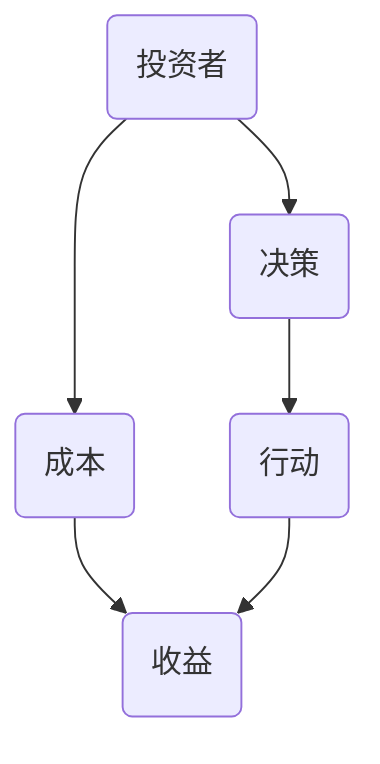
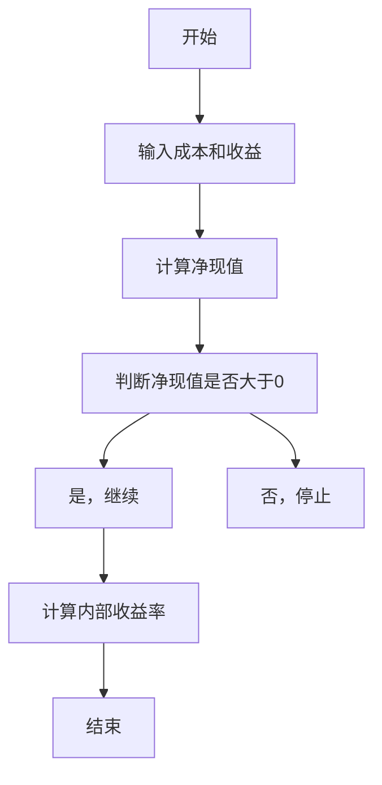
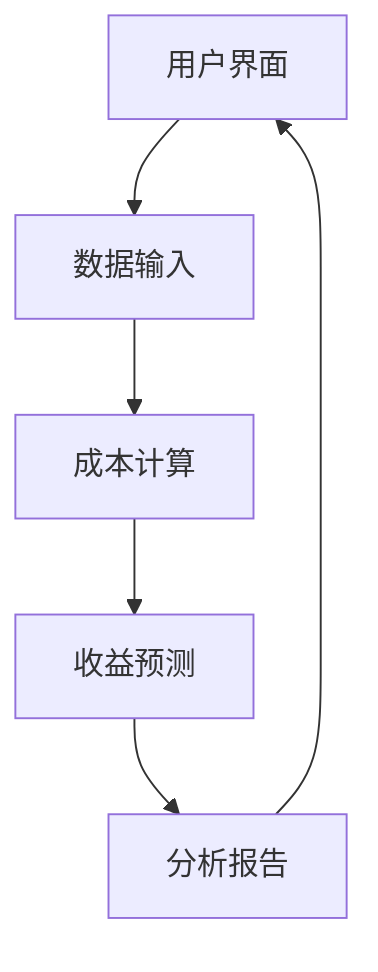

                 


# 约翰伯格的投资成本意识

## 关键词：投资成本意识，成本分析，投资决策，数学模型，系统架构，项目实战

## 摘要

本文深入探讨了约翰伯格的投资成本意识，分析了投资成本的核心概念、数学模型、系统架构及实际应用。通过详细讲解投资成本的构成、成本与收益的关系、成本分析的算法、系统设计和项目实战，帮助读者掌握投资成本意识的理论与实践。本文适合投资专业人士、金融分析师及技术开发者阅读，旨在提升投资决策的科学性和准确性。

---

## 第一部分：投资成本意识概述

### 第1章：投资成本意识的背景与重要性

#### 1.1 投资成本意识的背景

投资成本意识是指在投资决策过程中，对各种成本因素的识别、评估和控制的意识。随着市场竞争的加剧，成本在投资决策中的作用日益凸显。投资者需要准确评估各项成本，以优化投资回报。

#### 1.2 投资成本意识的重要性

投资成本意识的重要性体现在以下几个方面：

1. **降低投资风险**：通过准确评估成本，投资者可以更全面地了解项目可行性，降低投资失败的风险。
2. **提高投资回报率**：成本控制直接影响投资收益，有效的成本管理能够提升整体回报率。
3. **优化资源配置**：投资成本意识帮助投资者合理分配资源，避免资源浪费，提高效率。

#### 1.3 投资成本意识与投资决策的关系

投资成本意识贯穿于投资决策的全过程，从项目选择、成本估算到收益预测，每个环节都离不开对成本的深入分析。准确的成本评估为投资决策提供数据支持，帮助投资者做出明智的选择。

---

## 第二部分：投资成本的核心概念与联系

### 第2章：投资成本的核心概念原理

#### 2.1 成本与收益的关系分析

成本与收益的关系是投资分析的核心。成本的增加通常会带来收益的变化，但两者并非线性关系。以下是成本与收益关系的关键点：

1. **成本的增加与收益的关系**：增加的成本不一定带来相等的收益增长，存在边际收益递减的现象。
2. **成本与收益的平衡点**：找到成本与收益的平衡点，是投资决策的关键。

#### 2.2 成本的属性特征对比

以下是不同成本类型的对比表：

| 成本类型 | 特性 | 例子 |
|----------|------|------|
| 固定成本 | 不随产量变化 | 厂房租金 |
| 变动成本 | 随产量变化 | 原材料费用 |
| 直接成本 | 直接相关 | 直接人工成本 |
| 间接成本 | 间接相关 | 管理人员工资 |

### 第3章：投资成本的实体关系架构

#### 3.1 实体关系图（ER图）

以下是投资成本分析的ER图：



---

## 第三部分：投资成本分析的数学模型与算法

### 第4章：投资成本分析的数学模型

#### 4.1 投资成本计算模型

##### 4.1.1 总成本计算公式

$$
TC = \sum_{i=1}^{n} C_i
$$

其中，TC为总成本，$C_i$为第i项成本。

##### 4.1.2 单位成本计算公式

$$
UC = \frac{TC}{Q}
$$

其中，UC为单位成本，Q为产量。

##### 4.1.3 成本与收益的比率模型

$$
CR = \frac{C}{R}
$$

其中，CR为成本收益比率，C为总成本，R为总收益。

#### 4.2 成本收益分析模型

##### 4.2.1 净现值计算公式

$$
NPV = \sum_{t=0}^{n} \frac{CF_t}{(1 + r)^t}
$$

其中，NPV为净现值，$CF_t$为第t期的现金流，r为折现率。

##### 4.2.2 内部收益率计算公式

$$
IRR = r \text{ 使得 } NPV = 0
$$

### 第5章：算法原理与流程图

#### 5.1 成本收益分析算法



---

## 第四部分：系统分析与架构设计方案

### 第6章：投资成本分析系统架构

#### 6.1 系统功能设计

##### 6.1.1 数据输入模块

负责接收投资者输入的成本和收益数据。

##### 6.1.2 成本计算模块

根据输入数据，计算总成本和单位成本。

##### 6.1.3 收益预测模块

基于历史数据和模型，预测未来的收益情况。

##### 6.1.4 成本收益分析模块

结合成本和收益数据，生成分析报告，包括净现值和内部收益率。

#### 6.2 系统架构设计

以下是系统架构的mermaid图：



---

## 第五部分：项目实战

### 第7章：投资成本分析项目实战

#### 7.1 环境安装

需要安装Python和相关库，如numpy和pandas。

#### 7.2 核心实现源代码

以下是成本分析的Python代码示例：

```python
import numpy as np
import pandas as pd

# 输入数据
costs = [100, 200, 300]
quantities = [10, 20, 30]

# 计算总成本
total_cost = sum(costs)
print(f"总成本: {total_cost}")

# 计算单位成本
unit_cost = total_cost / sum(quantities)
print(f"单位成本: {unit_cost}")

# 计算净现值
discount_rate = 0.1
cash_flows = [1000, 2000, 3000]
npv = np.npv(discount_rate, cash_flows)
print(f"净现值: {npv}")
```

#### 7.3 案例分析

以一个简单的投资项目为例，分析成本与收益的关系，计算净现值和内部收益率，评估项目可行性。

---

## 第六部分：小结与展望

### 第8章：小结与展望

#### 8.1 小结

本文系统地介绍了投资成本意识的核心概念、数学模型、系统架构及实际应用。通过理论与实践相结合，帮助读者掌握投资成本分析的方法和技巧。

#### 8.2 注意事项

- 数据的准确性对成本分析至关重要，需确保输入数据的可靠性。
- 模型的选择应根据实际情况调整，避免生搬硬套。
- 定期复核和更新模型参数，以适应市场变化。

#### 8.3 未来展望

随着人工智能和大数据技术的发展，投资成本分析将更加智能化和精准化。未来的研究可以进一步探索机器学习在成本预测中的应用，以及多维度的成本效益分析方法。

---

通过本文的学习，读者能够深入理解投资成本意识的重要性，并能够应用相关的数学模型和系统架构进行实际投资分析，提升投资决策的科学性和准确性。

