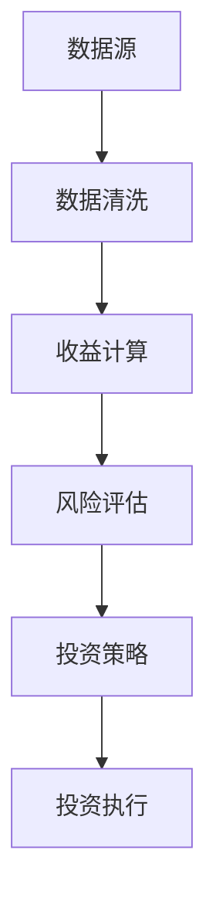
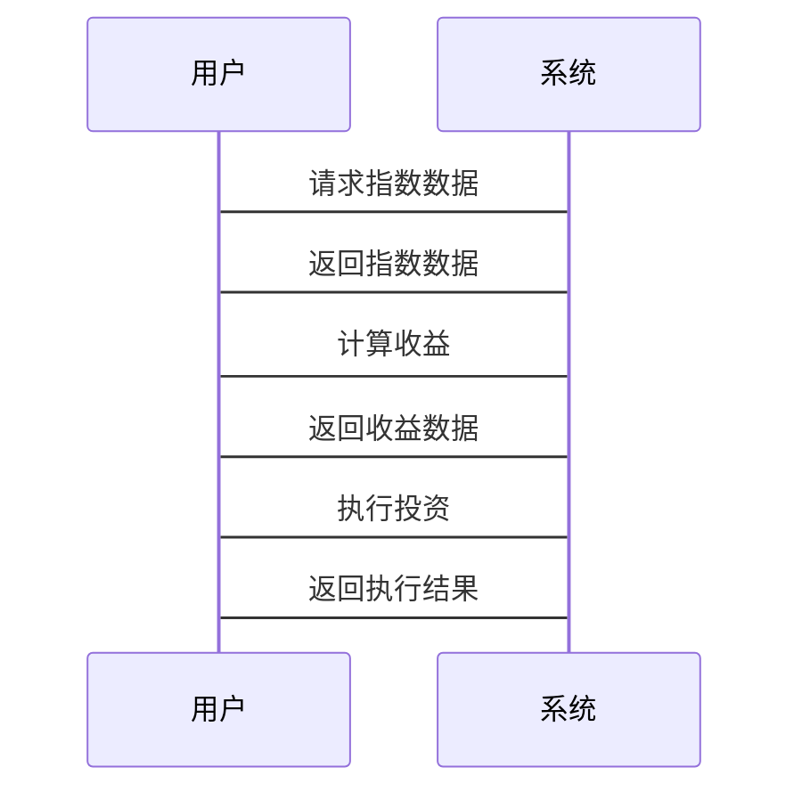

                 


# 约翰伯格的指数投资策略：为什么简单有效

## 关键词：指数投资、约翰伯格、被动投资、指数基金、投资策略

## 摘要：本文深入分析了约翰伯格的指数投资策略，探讨其简单有效的背后原因。从指数投资的核心概念、数学模型、系统架构到实际案例，全面解读其成功的关键因素，揭示长期投资、分散风险和成本控制的重要性。

---

# 第一部分: 指数投资的核心概念

## 第1章: 指数投资的背景与定义

### 1.1 指数投资的背景

#### 1.1.1 传统投资与指数投资的对比
- 传统投资：主动管理、选股、择时、高成本
- 指数投资：被动跟踪指数、分散化、低成本、长期持有
- 数据对比：主动投资与被动投资的长期收益和成本对比表格（见下文）

#### 1.1.2 约翰·伯格的贡献
- 约翰·伯格的指数基金创新
- 基金管理行业的变革

#### 1.1.3 指数投资的核心理念
- 分散化投资：降低风险
- 长期持有：避免短期波动
- 低成本策略：费用率对收益的影响

### 1.2 指数投资的理论基础

#### 1.2.1 资本资产定价模型（CAPM）
- 公式：$$R_i = R_f + β_i (R_m - R_f)$$
- β系数的含义：系统性风险的衡量

#### 1.2.2 现代投资组合理论（MPT）
- 投资组合收益公式：$$E(R_p) = \sum w_i E(R_i)$$
- 投资组合风险公式：$$\sigma_p^2 = \sum \sum w_i w_j \sigma_i \sigma_j \rho_{ij}$$

#### 1.2.3 市场有效性的假设
- 强有效市场与弱有效市场的区别
- 指数投资在有效市场中的表现

---

## 第2章: 约翰·伯格的指数投资策略

### 2.1 投资哲学

#### 2.1.1 长期投资的重要性
- 长期持有 vs 短期交易
- 时间复利的威力

#### 2.1.2 分散投资的核心作用
- 投资分散化与风险降低的关系
- 指数基金如何实现分散化

#### 2.1.3 成本控制的策略
- 基金费用率对收益的影响公式：$$R = r - (费用率 + 税费)$$
- 低成本策略的优势

### 2.2 指数基金的选择标准

#### 2.2.1 基金费用率的重要性
- 简单费用率与总费用率的对比
- 低成本基金的长期收益优势

#### 2.2.2 基金跟踪误差的分析
- 跟踪误差公式：$$\sigma = \sqrt{(实际收益 - 指数收益)^2}$$
- 低跟踪误差的意义

#### 2.2.3 基金规模与流动性的影响
- 大盘基金 vs 小盘基金：流动性与风险的权衡
- 基金规模对流动性的影响

---

## 第3章: 指数投资的核心优势

### 3.1 简单有效的投资策略

#### 3.1.1 简单性：降低决策复杂度
- 简单策略 vs 复杂策略：长期表现的对比
- 分散化投资的自动化实现

#### 3.1.2 有效性：长期收益的最大化
- 指数基金的长期收益表现
- 短期波动与长期收益的关系

#### 3.1.3 稳定性：风险的最小化
- 风险分散化与投资组合的稳定性
- 系统性风险与非系统性风险的对比

### 3.2 指数投资的长期表现

#### 3.2.1 历史数据的分析
- 指数基金与主动管理基金的长期收益对比
- 不同经济周期中的表现

#### 3.2.2 对比传统投资的收益
- 主动投资与被动投资的收益与风险对比表格

---

## 第4章: 指数投资的数学模型与公式

### 4.1 资本资产定价模型（CAPM）的详细解读

#### 4.1.1 公式：$$R_i = R_f + β_i (R_m - R_f)$$
- 各变量的解释
- β系数的计算方法

### 4.2 现代投资组合理论（MPT）的实现

#### 4.2.1 投资组合收益公式：$$E(R_p) = \sum w_i E(R_i)$$
- 如何计算投资组合的期望收益

#### 4.2.2 投资组合风险公式：$$\sigma_p^2 = \sum \sum w_i w_j \sigma_i \sigma_j \rho_{ij}$$
- 如何计算投资组合的风险

### 4.3 指数基金的跟踪误差

#### 4.3.1 跟踪误差公式：$$\sigma = \sqrt{(实际收益 - 指数收益)^2}$$
- 如何优化跟踪误差

---

## 第5章: 指数投资的系统分析与架构设计

### 5.1 投资决策系统框架

#### 5.1.1 数据获取模块
- 市场数据：股票价格、指数数据
- 如何获取数据：API接口、数据清洗

#### 5.1.2 计算模块
- 收益计算：如何计算单只股票和投资组合的收益
- 风险评估：如何计算波动率和夏普比率

#### 5.1.3 策略执行模块
- 如何根据指数投资策略自动执行投资

### 5.2 系统架构设计

#### 5.2.1 系统功能设计
- 数据获取、计算、策略执行
- 用户界面设计

#### 5.2.2 系统架构图（使用mermaid）


### 5.3 系统接口设计

#### 5.3.1 API接口
- 数据接口：获取指数数据
- 计算接口：计算收益和风险
- 执行接口：根据策略执行投资

### 5.4 系统交互设计

#### 5.4.1 交互流程图（使用mermaid）


---

## 第6章: 指数投资的项目实战

### 6.1 环境安装

#### 6.1.1 安装Python和必要的库
- pip install numpy pandas matplotlib

#### 6.1.2 安装数据获取工具
- 使用Yahoo Finance API

### 6.2 核心实现源代码

#### 6.2.1 数据获取与清洗
```python
import pandas as pd
import numpy as np

# 获取指数数据
def get_index_data(ticker):
    # 示例代码，实际需要使用API获取数据
    return pd.DataFrame({'日期': ['2023-01-01', '2023-01-02'], '收盘价': [100, 101]})

# 数据清洗
def clean_data(df):
    df = df.dropna()
    return df
```

#### 6.2.2 计算收益和风险
```python
import numpy as np

def calculate_return(prices):
    returns = prices.pct_change().dropna()
    return returns

def calculate_volatility(returns):
    return returns.std()
```

#### 6.2.3 指数基金选择
```python
import pandas as pd

def select_index_fund(funds):
    # 筛选低成本、低跟踪误差的基金
    funds = funds.sort_values('费用率')
    return funds.head(5)
```

### 6.3 实际案例分析

#### 6.3.1 案例背景
- 投资目标：长期增值
- 投资金额：10万元

#### 6.3.2 数据分析
- 数据来源：某指数的收盘价数据
- 计算过程：收益计算、风险评估

#### 6.3.3 投资组合构建
- 选择低成本指数基金
- 定期定额投资

### 6.4 项目小结

---

## 第7章: 最佳实践与小结

### 7.1 最佳实践

#### 7.1.1 长期投资的重要性
- 避免短期波动的影响

#### 7.1.2 分散投资的风险
- 通过指数基金实现分散化

#### 7.1.3 成本控制的技巧
- 选择低成本基金的重要性

### 7.2 注意事项

#### 7.2.1 避免过度分散
- 分散化与过度分散的界限

#### 7.2.2 风险管理的重要性
- 如何应对市场崩盘

#### 7.2.3 税务规划的注意事项
- 投资收益的税务影响

### 7.3 拓展阅读

#### 7.3.1 推荐书籍
- 《投资学》
- 《指数基金投资指南》

#### 7.3.2 推荐博客和资源
- 指数投资论坛和专业博客

---

## 总结

约翰伯格的指数投资策略以简单、低成本和长期持有为核心，通过分散化投资实现风险最小化和收益最大化。本文从理论到实践，详细分析了指数投资的优势和实现方法，帮助投资者理解其简单有效的原因，并为实际操作提供了指导。

