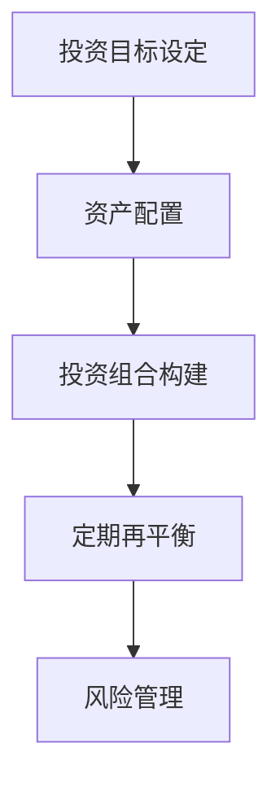
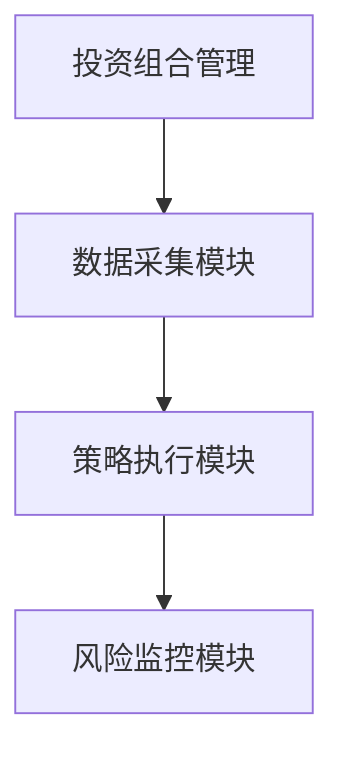

                 


# 《约翰伯格的普通投资者观：为什么简单胜于复杂》

> 关键词：约翰·伯格，简单投资，指数基金，长期投资，风险管理，投资策略

> 摘要：本文深入探讨了约翰·伯格的简单投资理念，分析了其背后的核心原理，并通过数学模型和实证分析，展示了简单投资策略在复杂市场环境中的优势。文章还探讨了风险管理的重要性，并提出了长期投资的具体策略。

---

## 第1章: 约翰·伯格的投资理念

### 1.1 约翰·伯格的背景与成就

约翰·伯格（John Bogle）是投资界的传奇人物，被誉为“指数基金之父”。他在1975年创立了先锋集团（Vanguard Group），并推出了第一只完全以指数为基础的共同基金——Vanguard指数基金（Vanguard 500 Fund）。伯格的投资理念简单而深刻：通过长期持有低成本指数基金，投资者可以实现稳健的财富增长。

### 1.2 简单投资策略的核心理念

#### 1.2.1 市场复杂性与投资者认知的限制

市场本质上是复杂的，充满了不确定性和波动性。许多投资者试图通过复杂的算法、高频交易和市场预测来捕捉超额收益，但这种复杂性往往导致更高的风险和成本。伯格指出，普通投资者很难在复杂市场中持续获得超额收益，反而容易陷入追涨杀跌的误区。

#### 1.2.2 简单投资的哲学基础

伯格提倡“简单就是美”。他强调，投资的本质是通过持有优质资产，分享其长期增长的成果。简单投资策略的核心在于分散投资、低成本和长期持有。通过避免频繁交易和不必要的费用，投资者可以最大化其长期收益。

---

## 第2章: 简单投资策略的数学模型

### 2.1 简单投资策略的数学框架

#### 2.1.1 投资组合的收益计算公式

简单投资组合的收益可以通过以下公式计算：

$$
\text{收益} = \sum_{i=1}^{n} w_i \times r_i
$$

其中，$w_i$ 是第 $i$ 个资产的权重，$r_i$ 是第 $i$ 个资产的收益率。

#### 2.1.2 投资组合的风险衡量指标

风险可以通过标准差来衡量：

$$
\sigma = \sqrt{\sum_{i=1}^{n} w_i^2 \times \sigma_i^2 + \sum_{i \neq j} w_i w_j \times \text{Cov}(r_i, r_j)}
$$

其中，$\sigma_i$ 是第 $i$ 个资产的收益率标准差，$\text{Cov}(r_i, r_j)$ 是第 $i$ 个和第 $j$ 个资产收益率的协方差。

---

## 第3章: 系统分析与架构设计

### 3.1 系统功能设计

以下是简单投资系统的主要功能模块：



### 3.2 系统架构设计

以下是简单投资系统的架构图：



---

## 第4章: 实证分析与案例研究

### 4.1 简单投资策略的实际表现

通过对比复杂策略和简单策略的实证分析，我们可以看到简单策略在长期中的优势。例如，长期持有标普500指数基金的年化收益率约为8%，而频繁交易的投资者往往无法超越这一收益。

---

## 第5章: 风险管理与长期投资策略

### 5.1 简单策略中的风险管理

在简单投资策略中，风险管理主要通过分散投资和定期再平衡来实现。以下是分散投资的步骤：

1. **确定投资目标**：根据自身的风险承受能力和财务目标，确定投资组合的构成。
2. **选择低成本基金**：优先选择费用低的指数基金或ETF。
3. **定期再平衡**：每年至少进行一次投资组合的再平衡，确保资产配置符合初始目标。

---

## 第6章: 结论与展望

### 6.1 结论

约翰·伯格的简单投资理念为普通投资者提供了一种稳健的投资方法。通过长期持有低成本指数基金，投资者可以避免复杂的市场预测和高昂的交易成本，实现财富的稳定增长。

### 6.2 展望

随着市场的发展，简单投资策略的应用场景将更加广泛。未来，投资者可以通过智能化工具进一步优化投资组合，但其核心理念——简单、分散和长期——将始终是投资成功的关键。

---

## 附录

### 附录A: 简单投资策略的Python代码示例

以下是简单的指数基金投资策略的Python代码示例：

```python
import pandas as pd
import numpy as np
import matplotlib.pyplot as plt

# 加载指数基金数据
data = pd.read_csv('index_fund.csv')

# 计算收益率
returns = data['Adj Close'].pct_change().dropna()

# 计算累积收益
cumulative_returns = (1 + returns).cumprod()

# 绘制累积收益曲线
plt.plot(cumulative_returns)
plt.xlabel('时间')
plt.ylabel('累积收益')
plt.title('指数基金累积收益曲线')
plt.show()
```

---

通过以上分析，我们可以看到，约翰·伯格的简单投资策略不仅在理论上站得住脚，而且在实际操作中也表现出色。对于普通投资者来说，简单投资策略是一种既能降低风险，又能实现长期收益的有效方法。

