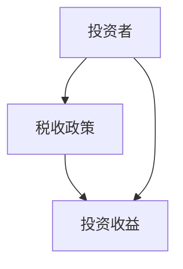
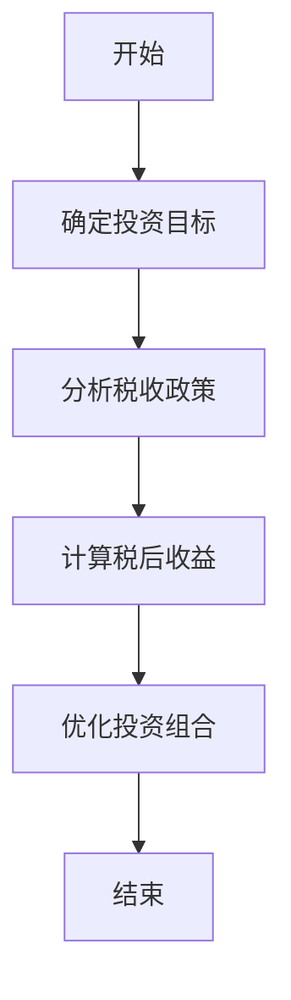
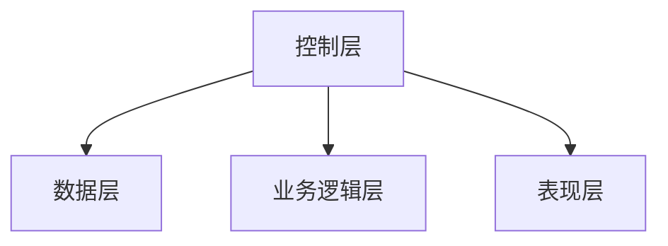
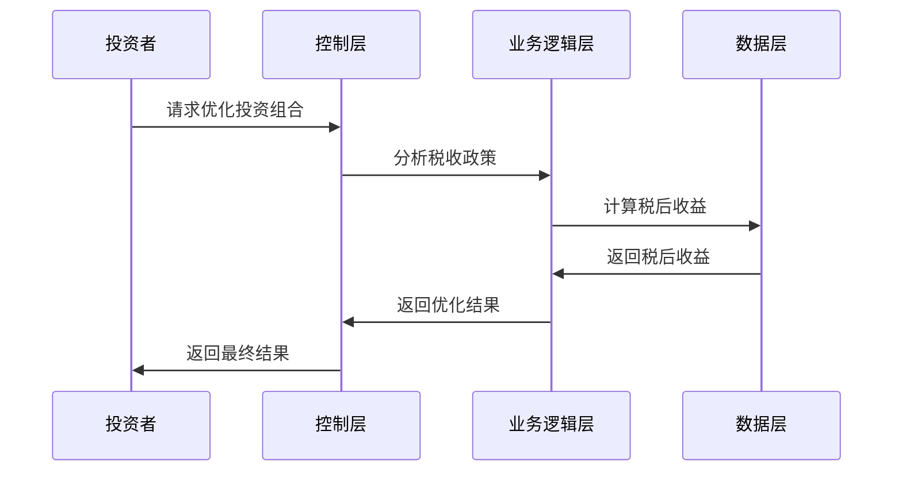

                 


# 约翰伯格的税收效率投资

> 关键词：税收效率投资、约翰伯格、投资优化、税收政策、收益最大化、风险控制

> 摘要：本文深入探讨了约翰伯格提出的税收效率投资理念，分析了其核心概念、数学模型、算法实现及系统架构，结合实际案例，详细阐述了如何通过优化税务策略实现投资收益的最大化，并提出了具体的实现方法和注意事项。

---

# 第一部分：税收效率投资的背景与重要性

## 第1章：税收效率投资的背景与重要性

### 1.1 税收效率投资的定义与概念

#### 1.1.1 税收效率投资的基本概念
税收效率投资是指通过优化税务策略，降低税收支出，从而在相同的投资金额下，实现更高的净收益。这种投资方式的核心在于在合法合规的前提下，最大化投资收益与税收支出之间的优化平衡。

#### 1.1.2 税收效率投资的核心目标
税收效率投资的目标是通过合理规划税务，减少不必要的税收支出，从而在投资活动中实现收益的最大化。具体目标包括：
1. 最小化税收支出。
2. 最大化投资净收益。
3. 符合国家税收政策。

#### 1.1.3 税收效率投资的边界与外延
税收效率投资的边界在于合法合规的前提下进行优化，外延则包括各种投资形式，如股票、债券、房地产等。

### 1.2 税收效率投资的背景与问题背景

#### 1.2.1 税收在投资中的作用与影响
税收是影响投资收益的重要因素之一。不同的投资方式和资产类型，其税收政策和税率可能不同，这直接影响投资的净收益。

#### 1.2.2 当前税收政策对投资效率的影响
当前税收政策对投资的影响主要体现在以下几个方面：
1. 股票投资的资本利得税。
2. 债券投资的利息税。
3. 房地产投资的土地增值税和房产税。

#### 1.2.3 税收效率投资的必要性与重要性
随着市场竞争的加剧，投资者需要通过优化税务策略来提高投资效率和收益。税收效率投资的必要性体现在：
1. 降低投资成本。
2. 提高投资净收益。
3. 增强投资竞争力。

### 1.3 税收效率投资的现状与挑战

#### 1.3.1 当前税收政策的现状分析
当前税收政策的现状分析包括以下几个方面：
1. 税收政策的复杂性。
2. 税收政策的变化性。
3. 税收政策的地区差异性。

#### 1.3.2 投资者面临的税收效率问题
投资者在税收效率方面面临的主要问题包括：
1. 税收支出过大。
2. 税收政策变化带来的不确定性。
3. 税收优化策略缺乏系统性。

#### 1.3.3 税收效率投资的挑战与机遇
税收效率投资的挑战主要在于税收政策的复杂性和变化性，而机遇则在于通过优化税务策略提高投资收益。

---

## 第2章：税收效率投资的核心概念与联系

### 2.1 核心概念原理

#### 2.1.1 税收效率投资的基本原理
税收效率投资的基本原理在于通过优化税务策略，降低税收支出，从而在相同的投资金额下，实现更高的净收益。

#### 2.1.2 税收与投资收益的关系
税收与投资收益的关系可以通过以下公式表示：
$$ 净收益 = 投资收益 - 税收支出 $$

#### 2.1.3 税收效率优化的数学模型
税收效率优化的数学模型可以表示为：
$$ \min_{x} \text{税收支出} $$
$$ \text{subject to} \quad R(x) \geq R_{\text{min}} $$
其中，$x$ 是投资组合，$R(x)$ 是投资收益。

### 2.2 核心概念属性特征对比表格

| 概念          | 特征1         | 特征2         | 特征3         |
|---------------|---------------|---------------|---------------|
| 税收效率投资  | 最小化税收支出 | 最大化投资收益 | 符合税收政策   |

### 2.3 ER实体关系图


---

## 第3章：税收效率投资的算法原理

### 3.1 税收效率优化算法



### 3.2 算法实现代码

```python
def tax_efficiency_optimization(investment, tax_policy):
    # 分析税收政策
    tax_rate = tax_policy['tax_rate']
    investment_value = investment['value']
    
    # 计算税后收益
    tax_expense = investment_value * tax_rate
    net_income = investment_value - tax_expense
    
    # 优化投资组合
    optimized_portfolio = {
        'investment': investment,
        'tax_expense': tax_expense,
        'net_income': net_income
    }
    
    return optimized_portfolio
```

### 3.3 算法原理的数学模型与公式

税收效率优化的数学模型可以表示为：
$$ \min_{x} \text{税收支出} $$
$$ \text{subject to} \quad R(x) \geq R_{\text{min}} $$

其中，$x$ 是投资组合，$R(x)$ 是投资收益。

---

## 第4章：税收效率投资的系统分析与架构设计

### 4.1 系统分析

#### 4.1.1 问题场景介绍
在实际投资中，投资者需要考虑税收政策的变化和投资收益的不确定性。

#### 4.1.2 项目介绍
本项目旨在通过优化税务策略，提高投资效率和收益。

### 4.2 系统功能设计

#### 4.2.1 领域模型


#### 4.2.2 系统架构设计


#### 4.2.3 系统接口设计


---

## 第5章：税收效率投资的项目实战

### 5.1 环境安装

#### 5.1.1 系统环境
- 操作系统：Linux/Windows/MacOS
- Python版本：3.8及以上
- 开发工具：PyCharm/Jupyter Notebook

#### 5.1.2 依赖安装
```bash
pip install numpy pandas matplotlib
```

### 5.2 系统核心实现源代码

```python
import numpy as np
import pandas as pd

def calculate_tax_expense(value, tax_rate):
    return value * tax_rate

def calculate_net_income(value, tax_rate):
    tax_expense = calculate_tax_expense(value, tax_rate)
    return value - tax_expense

# 示例数据
investment_values = np.array([100000, 200000, 300000])
tax_rate = 0.15

# 计算税后收益
net_income = np.array([calculate_net_income(value, tax_rate) for value in investment_values])

print("投资金额：", investment_values)
print("税后收益：", net_income)
```

### 5.3 代码应用解读与分析

#### 5.3.1 投资金额与税后收益的对比分析
通过上述代码，我们可以看到投资金额越大，税后收益也越大，但税收支出占总投资金额的比例保持不变。

#### 5.3.2 案例分析
以投资金额为200,000元，税率为15%为例：
$$ \text{税后收益} = 200000 \times (1 - 0.15) = 170000 \text{元} $$

### 5.4 项目小结

---

## 第6章：总结与注意事项

### 6.1 小结
通过本文的分析与实践，我们可以看出，税收效率投资是一种通过优化税务策略，提高投资收益的有效方法。

### 6.2 注意事项
1. 税收政策的变化可能会影响投资策略。
2. 投资者需要根据自身情况调整投资组合。
3. 税收效率投资需要结合其他风险管理手段。

### 6.3 拓展阅读
1. 约翰伯格的其他投资理念。
2. 税收政策对不同投资类型的影响。
3. 全球化背景下的税收效率投资。

---

通过以上分析，我们可以看到税收效率投资是一种通过优化税务策略，提高投资收益的有效方法。希望本文的内容能够为投资者提供有价值的参考。

