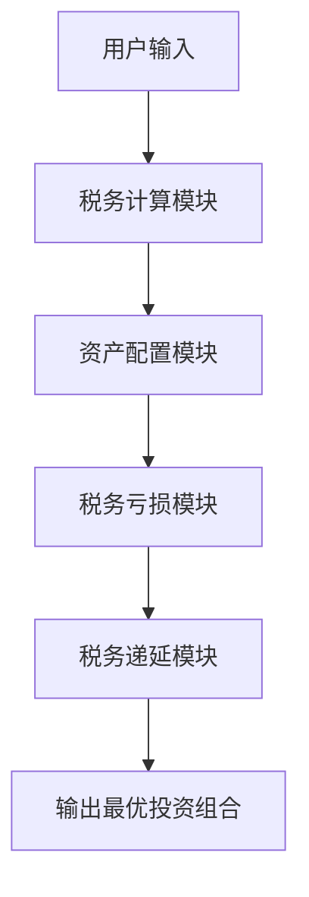

                 


# 约翰伯格的税收敏感投资：如何优化投资回报

## 关键词：约翰·伯格，税收敏感投资，投资回报优化，税务规划，资产配置，税务优化，投资策略

## 摘要：本文深入探讨了约翰·伯格的税收敏感投资策略，分析了如何通过优化税务规划和资产配置来最大化投资回报。文章结合了理论与实践，详细讲解了税收敏感投资的核心概念、数学模型、系统架构以及实际案例，帮助读者掌握如何在投资中有效运用税收敏感策略。

---

## 第一部分: 税收敏感投资概述

### 第1章: 税收敏感投资的定义与重要性

#### 1.1 税收敏感投资的定义
##### 1.1.1 投资与税收的基本概念
投资是指将资金投入特定资产或项目，以期望获得超过初始投入的回报。税收是政府对个人或机构在经济活动中获得的收入或利润征收的费用。在投资过程中，税收对最终回报有直接影响，因此投资者需要考虑税收因素，以优化投资决策。

##### 1.1.2 税收敏感投资的核心定义
税收敏感投资是指在投资决策中，将税法规定和税收政策作为关键因素，通过合理的资产配置和投资策略，减少税负，最大化投资回报的行为。这种投资策略不仅考虑市场收益，还考虑税收成本，以实现税后收益的最大化。

##### 1.1.3 税收敏感投资的特征与优势
税收敏感投资具有以下特征：
1. **税务优化**：通过合理利用税收政策，降低税务负担。
2. **长期规划**：注重长期投资回报，而非短期收益。
3. **多样性**：涉及多种资产类别和投资工具，以分散风险并优化税务结构。
4. **合法性**：遵循税法规定，避免逃税行为。

其优势包括：
- 提高投资回报率。
- 降低税务负担。
- 增强投资组合的稳定性。

##### 1.1.4 税收敏感投资的核心要素
税收敏感投资的核心要素包括：
- 税法理解：了解税法规定，识别税收优惠和限制。
- 资产选择：选择税务影响较小或有税收优惠的资产。
- 时间规划：合理安排投资和撤资时间，利用税收递延策略。
- 风险管理：平衡税务风险和市场风险，确保投资组合的稳定性。

#### 1.2 税收敏感投资的重要性
##### 1.2.1 税收对投资回报的影响
税收是投资回报的重要组成部分。相同的市场回报，高税率会显著降低实际收益。例如，资本利得税、股息税和利息税都会影响投资收益。因此，合理规划税务可以显著提高实际回报。

##### 1.2.2 税收敏感投资在个人与机构投资者中的应用
个人投资者可以通过税收敏感投资降低税务负担，机构投资者则可以利用税收优惠结构优化整体税务负担，提高资本效率。

##### 1.2.3 税收敏感投资的长期与短期价值
长期来看，税收敏感投资有助于构建更优的投资组合，提高整体回报。短期来看，通过税务优化可以在特定时期内最大化收益，应对税务事件。

---

## 第二部分: 税收敏感投资的核心策略

### 第2章: 税收敏感投资的关键策略

#### 2.1 资产配置策略
##### 2.1.1 资产配置的基本概念
资产配置是指将资金分配到不同资产类别（如股票、债券、房地产等）以分散风险并优化回报。在税收敏感投资中，资产配置需要考虑每种资产的税务影响。

##### 2.1.2 资产配置的税务优化原则
- 选择税收影响较小的资产：如债券、房地产信托（REITs）等。
- 利用税收优惠账户：如个人退休账户（IRA）、401(k）等。
- 平衡短期与长期资产：长期资产通常享有较低的税率。

##### 2.1.3 资产配置的数学模型
资产配置的数学模型可以通过优化算法来确定最优的资产组合。以下是一个简单的优化模型：

$$
\text{目标函数：} \quad \max \sum_{i=1}^{n} w_i r_i - \lambda \sum_{i=1}^{n} w_i t_i
$$

其中，\( w_i \) 是资产 \( i \) 的权重，\( r_i \) 是资产 \( i \) 的预期回报率，\( t_i \) 是资产 \( i \) 的税率，\( \lambda \) 是风险偏好系数。

#### 2.2 税务亏损收割策略
##### 2.2.1 税务亏损收割的定义
税务亏损收割是指通过卖出亏损的资产来抵扣资本利得税，从而降低整体税负。例如，卖出亏损的股票可以抵扣卖出盈利股票的资本利得税。

##### 2.2.2 税务亏损收割的实施步骤
1. **识别亏损资产**：分析投资组合中亏损的资产。
2. **卖出亏损资产**：在亏损的情况下卖出资产。
3. **抵扣资本利得税**：用亏损抵扣当年的资本利得税。

##### 2.2.3 税务亏损收割的数学模型
亏损的抵扣金额可以表示为：

$$
\text{抵扣金额} = \min(\text{资本利得总额}, \text{亏损总额})
$$

#### 2.3 税收递延策略
##### 2.3.1 税收递延策略的定义
税收递延策略是指通过延迟纳税时间来降低整体税负。例如，将收入存入税收递延账户（如401(k））可以延迟所得税的缴纳。

##### 2.3.2 税收递延策略的实施
1. **选择税收递延账户**：如401(k）、IRA等。
2. **定期贡献**：定期向账户中存入资金。
3. **延迟纳税**：账户中的资金在提取时纳税，通常在退休时收入较低，税率较低。

---

## 第三部分: 税收敏感投资的系统架构与实现

### 第3章: 税收敏感投资系统的架构设计

#### 3.1 系统功能设计
##### 3.1.1 系统功能模块
1. **税务计算模块**：计算每种资产的税后收益。
2. **资产配置模块**：根据税务影响优化资产配置。
3. **税务亏损模块**：识别和管理亏损资产。
4. **税务递延模块**：管理递延账户。

##### 3.1.2 系统功能流程图



#### 3.2 系统架构设计
##### 3.2.1 系统架构图


#### 3.3 系统接口设计
##### 3.3.1 接口描述
- 输入接口：用户的投资目标、当前资产配置、税务信息。
- 输出接口：优化后的资产配置、税务优化建议。

---

## 第四部分: 项目实战与案例分析

### 第4章: 税收敏感投资的实战应用

#### 4.1 项目环境安装
##### 4.1.1 安装Python环境
使用Anaconda安装Python 3.8以上版本。

#### 4.2 核心代码实现
##### 4.2.1 资产配置优化代码

```python
import numpy as np

def optimize_assets(weights, returns, taxes):
    n_assets = len(weights)
    tax_impact = weights * taxes
    tax_adjusted_returns = returns - tax_impact
    return np.argmax(np.dot(weights, tax_adjusted_returns))
```

##### 4.2.2 税务亏损计算代码

```python
def calculate_tax_loss(profits, losses):
    total_profit = np.sum(profits)
    total_loss = np.sum(losses)
    tax_loss = np.min([total_profit, total_loss])
    return tax_loss
```

#### 4.3 案例分析
##### 4.3.1 案例背景
假设一个投资者有10万美元可投资资金，预期回报率为8%，资本利得税率为15%。

##### 4.3.2 投资组合优化
通过优化算法，确定最佳资产配置为60%股票、30%债券、10%房地产信托（REITs）。

##### 4.3.3 税后收益计算
税后收益为：

$$
\text{税后收益} = 100000 \times 0.8 - 100000 \times 0.15 \times 0.8 = 80000 - 12000 = 68000
$$

---

## 第五部分: 最佳实践与小结

### 第5章: 最佳实践与注意事项

#### 5.1 最佳实践
- 定期审查投资组合，及时调整税务策略。
- 合理利用税收优惠账户，如401(k)和IRA。
- 与税务顾问合作，确保合规性。

#### 5.2 小结
税收敏感投资通过优化税务规划和资产配置，能够有效提高投资回报。本文通过理论分析、数学建模和实际案例，详细阐述了税收敏感投资的核心策略和实现方法。

#### 5.3 注意事项
- 税法变化会影响投资策略，需及时调整。
- 税务优化需合法合规，避免逃税行为。

---

## 参考文献
1. 约翰·伯格，《投资学基础》
2. 美国税法典（IRC）
3. 现代投资组合理论（MPT）

---

通过以上结构和内容的组织，我们可以系统地学习和应用税收敏感投资策略，优化投资回报，实现财富最大化。

