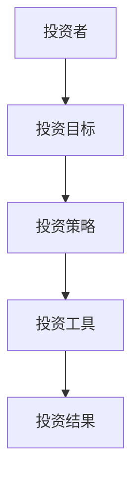
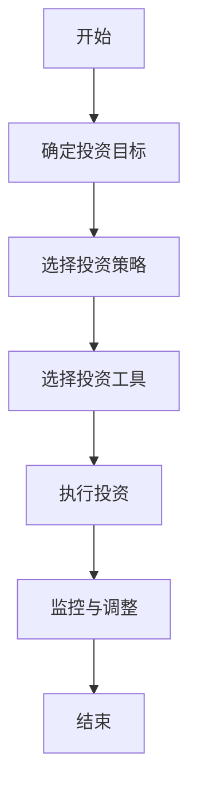
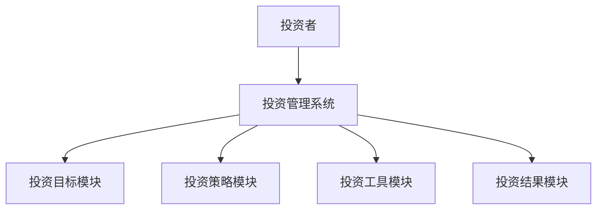

                 


# 目录大纲：《约翰伯格的简单投资法则》

## # 引言：约翰·伯格与简单投资法则

### ## 1.1 约翰·伯格的背景与成就
#### ### 1.1.1 约翰·伯格的生平简介
#### ### 1.1.2 伯格在投资界的贡献
#### ### 1.1.3 简单投资法则的核心理念

### ## 1.2 投资的基本问题与解决方案
#### ### 1.2.1 投资问题的背景与挑战
#### ### 1.2.2 简单投资法则的提出与目标
#### ### 1.2.3 简单投资法则的边界与外延

## # 核心概念：简单投资法则的理论基础

### ## 2.1 简单投资法则的核心要素
#### ### 2.1.1 长期投资的概念与特征
#### ### 2.1.2 分散投资的原理与优势
#### ### 2.1.3 低成本投资的重要性

### ## 2.2 核心概念的联系与对比
#### ### 2.2.1 核心概念的属性特征对比表格
#### ### 2.2.2 简单投资法则的ER实体关系图


## # 算法原理：简单投资法则的应用流程

### ## 3.1 简单投资法则的算法流程


### ## 3.2 投资组合优化的数学模型
$$
\text{目标函数：} \quad \text{最大化} \quad \sum_{i=1}^{n} w_i r_i - \lambda \sum_{i=1}^{n} w_i^2
$$
$$
\text{约束条件：} \quad \sum_{i=1}^{n} w_i = 1, \quad w_i \geq 0
$$
其中，\( w_i \) 是第 \( i \) 个资产的权重，\( r_i \) 是预期收益率，\( \lambda \) 是风险惩罚因子。

## # 系统分析：投资管理系统架构

### ## 4.1 投资管理系统的功能设计
#### ### 4.1.1 问题场景介绍
#### ### 4.1.2 系统功能需求
#### ### 4.1.3 领域模型类图


### ## 4.2 系统架构设计
#### ### 4.2.1 系统架构图


## # 项目实战：简单投资法则的应用

### ## 5.1 投资环境安装与配置
#### ### 5.1.1 投资工具的选择与安装

### ## 5.2 投资组合核心代码实现
#### ### 5.2.1 投资回报率计算代码
```python
def calculate_return(weights, returns):
    return weights.dot(returns.mean())
```

### ## 5.3 投资组合再平衡策略实现
#### ### 5.3.1 再平衡触发条件与实现代码
```python
def rebalance(weights, target_weights, tolerance=0.01):
    if max(abs(weights - target_weights)) < tolerance:
        return weights
    else:
        return target_weights
```

### ## 5.4 投资案例分析与解读
#### ### 5.4.1 案例分析步骤与结果解读
#### ### 5.4.2 投资结果与绩效评估

## # 总结与展望：简单投资法则的实践智慧

### ## 6.1 总结与反思
#### ### 6.1.1 核心要点回顾
#### ### 6.1.2 投资理念的深层思考

### ## 6.2 最佳实践 tips
#### ### 6.2.1 风险管理的关键作用
#### ### 6.2.2 持续学习与适应市场变化的重要性

### ## 6.3 小结与注意事项
#### ### 6.3.1 避免常见错误的注意事项
#### ### 6.3.2 保持纪律与耐心的必要性

### ## 6.4 拓展阅读与深入学习
#### ### 6.4.1 进一步阅读的书籍与资源
#### ### 6.4.2 其他相关投资策略的探讨

---

### 关键词：
- 约翰·伯格，简单投资法则，长期投资，分散投资，低成本投资，指数基金，风险管理，投资组合优化，系统架构，项目实战

### 摘要：
《约翰伯格的简单投资法则》系统阐述了约翰·伯格的投资理念，重点分析了其简单投资法则的核心要素、算法流程、系统架构及实际应用。通过理论与实践相结合的方式，深入探讨了长期投资、分散投资和低成本投资的策略，并通过数学模型、系统架构图和实际案例，帮助读者理解如何在复杂多变的市场中实现稳健的投资回报。

