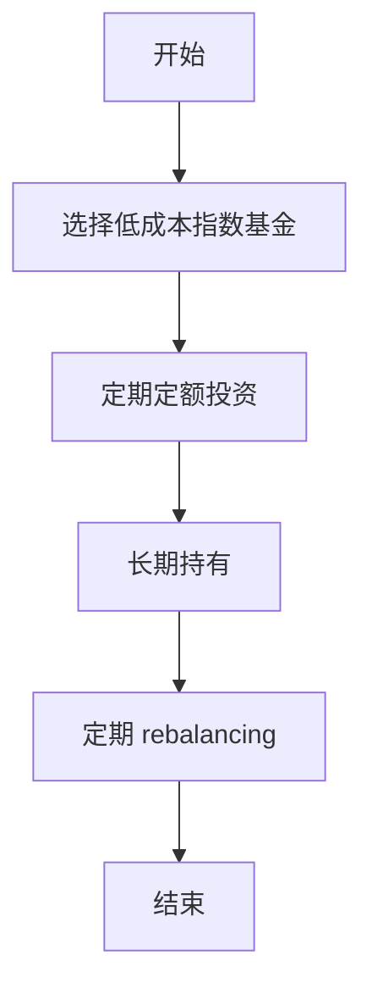
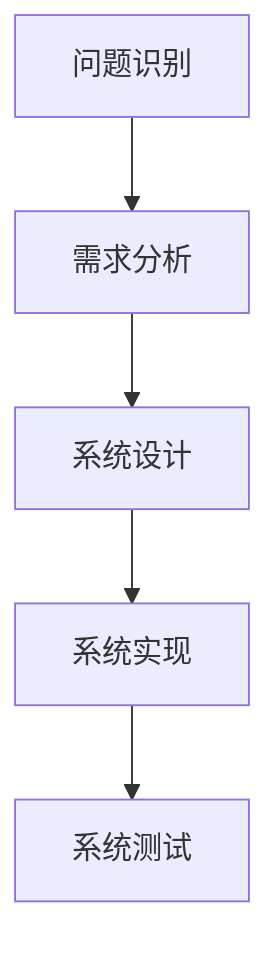

                 


# 《约翰伯格的简单投资法则：为什么复杂不等于好》

> **关键词**：约翰·伯格、简单投资、复杂投资、投资法则、投资策略

> **摘要**：本文深入探讨了约翰·伯格的简单投资法则，分析了复杂投资策略的局限性，并通过系统分析和项目实战展示了简单投资法则的实际应用。文章从理论到实践，层层递进，为读者提供了清晰的投资思路和方法。

---

## 第一部分：投资领域的复杂化与简单化的背景

### 第1章：投资领域的现状与问题

#### 1.1 投资领域的复杂化问题

投资领域正经历着从简单到复杂的转变。随着金融市场的快速发展，投资者面临着越来越多复杂的工具和策略。指数基金、对冲基金、量化交易等复杂工具的出现，使得投资决策变得越来越复杂。然而，这种复杂化并非没有代价。投资者需要面对更多的信息噪音和决策干扰，这不仅增加了投资成本，还可能导致决策失误。

#### 1.2 投资领域复杂化带来的问题

复杂的投资策略可能导致以下问题：
1. **投资决策的不透明性**：复杂的工具和策略使得投资者难以理解其背后的逻辑和风险。
2. **投资成本的增加**：复杂的策略通常需要更多的资源和时间来执行和监控。
3. **投资风险的放大**：复杂的策略可能引入更多的不确定性，增加投资组合的风险。

#### 1.3 约翰·伯格的简单投资法则背景

约翰·伯格是投资领域的传奇人物，他的简单投资法则强调长期投资和分散投资。他主张通过低成本的指数基金实现财富增长，避免复杂的交易策略和市场预测。简单投资法则的核心理念是“简单就是美”，通过减少复杂性来降低风险和成本。

---

## 第二部分：约翰·伯格简单投资法则的核心概念

### 第2章：简单投资法则的核心要素

#### 2.1 简单投资法则的定义与内涵

简单投资法则是一种基于长期持有低成本指数基金的投资策略。其核心理念包括：
1. **长期投资**：避免频繁交易，降低交易成本和税收负担。
2. **分散投资**：通过投资指数基金实现资产分散，降低风险。
3. **低成本**：选择低费率的基金，减少管理费用对投资收益的影响。

#### 2.2 简单投资法则与复杂投资的对比

通过对比表格和ER实体关系图，我们可以更清晰地理解简单投资法则的优势。

| 对比维度 | 简单投资 | 复杂投资 |
|----------|-----------|-----------|
| 投资策略 | 长期持有低成本指数基金 | 复杂的交易策略和市场预测 |
| 风险控制 | 分散投资，降低系统性风险 | 高风险，依赖市场预测和复杂策略 |
| 成本 | 低成本，费用低 | 高成本，费用高 |

ER实体关系图（Mermaid）：

```mermaid
erDiagram
    actor 投资者
    actor 市场
    actor 简单投资
    actor 复杂投资
    simple_investor --> simple_strategy : 长期持有低成本指数基金
    complex_investor --> complex_strategy : 复杂的交易策略和市场预测
```

---

### 第2.3 简单投资法则的数学模型

简单投资法则的数学模型可以通过以下公式表示：

$$ \text{投资收益} = \text{指数基金回报率} \times \text{投资金额} \times \text{投资期限} $$

指数基金的回报率可以通过以下公式计算：

$$ \text{指数基金回报率} = \frac{\text{指数基金最终价值} - \text{指数基金初始价值}}{\text{指数基金初始价值}} \times 100\% $$

---

## 第三部分：简单投资法则的算法原理

### 第3章：简单投资法则的算法实现

#### 3.1 简单投资法则的算法流程

以下是简单投资法则的算法流程图（Mermaid）：



#### 3.2 简单投资法则的数学模型

简单投资法则的数学模型可以通过以下公式表示：

$$ \text{投资收益} = \text{指数基金回报率} \times \text{投资金额} \times \text{投资期限} $$

指数基金的回报率可以通过以下公式计算：

$$ \text{指数基金回报率} = \frac{\text{指数基金最终价值} - \text{指数基金初始价值}}{\text{指数基金初始价值}} \times 100\% $$

---

## 第四部分：简单投资法则的系统分析与架构设计

### 第4章：简单投资法则的系统分析

#### 4.1 系统分析与设计

系统分析流程图（Mermaid）：



#### 4.2 系统架构设计

系统架构图（Mermaid）：

```mermaid
subgraph 投资者
    A[投资者]
end
subgraph 系统
    B[投资策略]
    C[投资组合]
    D[风险管理]
end
A --> B
B --> C
B --> D
```

---

## 第五部分：简单投资法则的项目实战

### 第5章：简单投资法则的项目实现

#### 5.1 项目环境的安装与配置

以下是安装和配置投资系统的步骤：

1. 安装Python环境（推荐使用Anaconda）。
2. 安装必要的库：`pandas`, `numpy`, `matplotlib`。

#### 5.2 项目核心实现

以下是简单投资法则的Python实现代码：

```python
import pandas as pd
import numpy as np
import matplotlib.pyplot as plt

# 定义指数基金回报率计算函数
def calculate_return(initial_value, final_value):
    return (final_value - initial_value) / initial_value * 100

# 定义投资收益计算函数
def calculate_profit(initial_value, final_value, investment):
    return investment * (final_value - initial_value) / initial_value

# 示例数据
initial_value = 1000
final_value = 1500
investment = 10000

# 计算指数基金回报率
return_rate = calculate_return(initial_value, final_value)
print(f"指数基金回报率：{return_rate}%")

# 计算投资收益
profit = calculate_profit(initial_value, final_value, investment)
print(f"投资收益：{profit}")
```

---

## 第六部分：简单投资法则的最佳实践

### 第6章：简单投资法则的最佳实践

#### 6.1 简单投资法则的实践技巧

1. **选择低成本指数基金**：避免高费用，降低投资成本。
2. **定期定额投资**：坚持长期投资，分散投资风险。
3. **定期 rebalancing**：定期调整投资组合，保持资产配置合理。

#### 6.2 简单投资法则的注意事项

1. **风险控制**：尽管简单投资风险较低，但仍需注意市场波动。
2. **长期视角**：简单投资需要长期坚持，避免短期波动影响决策。
3. **持续学习**：保持对投资市场的关注，及时调整投资策略。

---

## 第七部分：总结

约翰·伯格的简单投资法则通过减少复杂性和成本，为投资者提供了一种高效的投资方式。通过长期持有低成本指数基金，投资者可以实现财富的稳定增长。本文从理论到实践，详细讲解了简单投资法则的核心概念、算法原理和系统设计，并通过项目实战展示了其实际应用。希望读者能够从中获得启发，制定适合自己的投资策略。

---

**小结**：简单不等于低效，复杂不等于优秀。约翰·伯格的简单投资法则证明了，有时候，最简单的方法才是最有效的。

