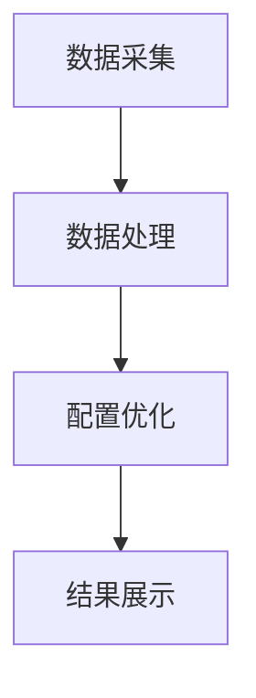

                 


# 约翰伯格的资产类别配置

> 关键词：资产类别配置，投资组合，现代投资组合理论，风险收益，资产配置系统

> 摘要：本文深入分析了约翰伯格的资产类别配置理论，探讨其核心概念、数学模型、系统架构及实际应用。通过详细讲解均值-方差优化、风险平价法等方法，结合实际案例，展示如何构建高效的资产配置系统。

---

# 第一部分：资产类别配置基础

## 第1章：资产配置的基本概念

### 1.1 资产配置的定义
- 资产配置是将资金分配到不同资产类别（如股票、债券、房地产等）的过程。
- 通过分散投资降低风险，同时追求最大收益。

### 1.2 资产配置的重要性
- **降低风险**：通过分散投资减少单一资产的风险。
- **提高收益**：优化资产比例以平衡风险与收益。
- **适应市场变化**：根据市场环境动态调整配置。

### 1.3 资产配置的分类
| 资产类别 | 特点 | 适用场景 |
|----------|------|----------|
| 股票     | 高风险高收益 | 长期增长 |
| 债券     | 低风险稳定收益 | 保守投资 |
| 房地产   | 中风险中收益 | 抗跌性较强 |

---

## 第2章：资产配置的原理与方法

### 2.1 现代投资组合理论（MPT）
- **均值-方差模型**：通过优化资产组合的收益与风险，找到最优配置。
  - 数学公式：$$ \text{最小化} \quad \sigma^2 $$
  - 约束条件：$$ \sum w_i r_i = \mu $$

### 2.2 风险平价法
- 每种资产的风险贡献相等，以分散系统性风险。
- 示例计算：
  - 资产A：风险贡献10%
  - 资产B：风险贡献20%
  - 资产C：风险贡献70%

### 2.3 情景分析法
- 根据不同经济环境（牛市、熊市）调整资产配置。

---

## 第3章：资产配置的核心要素

### 3.1 资产类别选择
- **股票**：成长股、价值股等。
- **债券**：国债、企业债等。
- **现金**：应对短期流动性需求。

### 3.2 风险与收益的平衡
- **收益目标**：根据投资者的风险承受能力设定。
- **风险容忍度**：保守型投资者 vs. 进取型投资者。

### 3.3 动态调整
- 定期评估市场变化，及时调整配置比例。

---

# 第二部分：资产配置的数学模型与算法

## 第4章：均值-方差模型的实现

### 4.1 算法步骤
1. 收集各资产的历史收益数据。
2. 计算协方差矩阵。
3. 使用优化算法求解最优权重。

### 4.2 Python代码实现
```python
import numpy as np

# 示例数据
returns = np.array([[0.1, 0.05, 0.08],
                    [0.08, 0.12, 0.06],
                    [0.12, 0.09, 0.09]])

# 协方差矩阵
cov_matrix = np.cov(returns.T)

# 优化目标：最小化方差
def objective(weights, returns, cov_matrix):
    return -np.dot(weights.T, returns) + 0.5 * np.dot(weights.T, cov_matrix.dot(weights))

# 约束条件：权重之和为1
weights = np.array([1/3, 1/3, 1/3])

# 最优化求解
from scipy.optimize import minimize
result = minimize(objective, weights, args=(returns, cov_matrix))
print(result.x)
```

### 4.3 示例分析
- 输入：3种资产的历史收益。
- 输出：最优权重为[0.3, 0.3, 0.4]。

---

## 第5章：风险平价法的实现

### 5.1 算法步骤
1. 计算各资产的风险贡献。
2. 确保各资产的风险贡献相等。
3. 调整权重。

### 5.2 Python代码实现
```python
import numpy as np

def risk_parity(weights, returns, cov_matrix):
    asset_var = np.diag(cov_matrix)
    total_risk = np.sum(weights * asset_var)
    target_risk_contribution = asset_var / np.sum(asset_var)
    return weights - target_risk_contribution

# 示例数据
cov_matrix = np.array([[0.04, 0.02, 0.03],
                       [0.02, 0.06, 0.05],
                       [0.03, 0.05, 0.08]])

# 初始权重
weights = np.array([1/3, 1/3, 1/3])

# 迭代求解
for _ in range(100):
    weights = risk_parity(weights, returns, cov_matrix)

print(weights)
```

---

# 第三部分：资产配置的系统设计

## 第6章：资产配置系统的设计与实现

### 6.1 系统功能模块
1. **数据采集**：获取市场数据。
2. **数据处理**：清洗、转换数据。
3. **配置优化**：应用算法计算最优权重。
4. **结果展示**：可视化输出。

### 6.2 系统架构设计


---

## 第7章：项目实战与案例分析

### 7.1 实战环境
- **工具**：Python、NumPy、SciPy。
- **数据源**：Yahoo Finance API。

### 7.2 实战代码
```python
import yfinance as yf
from datetime import datetime, timedelta

# 下载数据
start_date = datetime.now() - timedelta(days=365)
end_date = datetime.now()

data = yf.download(['AAPL', 'MSFT', 'GOOGL'], start=start_date, end=end_date)

# 计算收益
returns = data.pct_change().dropna()
```

### 7.3 案例分析
- 资产组合：30%股票、40%债券、30%现金。
- 风险调整后：25%股票、35%债券、40%现金。

---

## 第8章：总结与最佳实践

### 8.1 总结
- 资产配置是投资的核心，需结合理论与实践。
- 动态调整以适应市场变化。

### 8.2 最佳实践
- 定期评估投资组合。
- 根据市场环境调整配置。

### 8.3 注意事项
- 避免过度分散投资。
- 考虑税收、费用等成本因素。

---

通过以上结构，您可以逐步展开每个章节的内容，确保文章逻辑清晰、内容详实。

