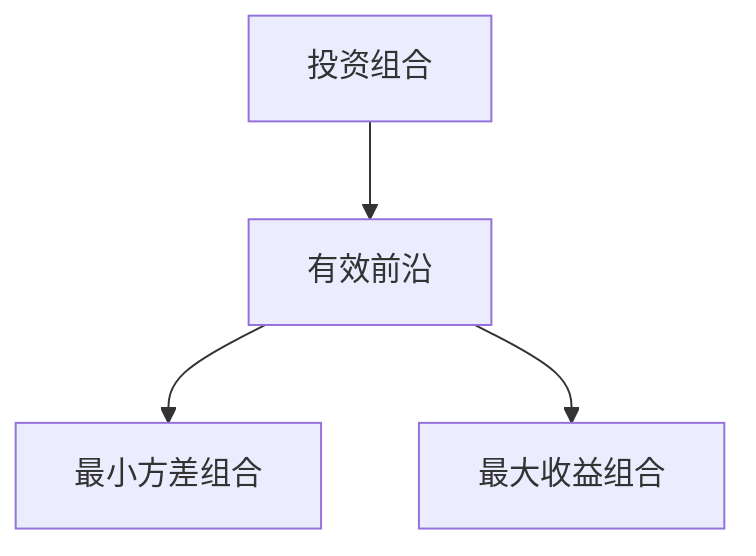

                 

# 约翰伯格的资产配置建议

## 关键词
- 资产配置，投资策略，指数基金，风险管理，投资组合

## 摘要
《约翰伯格的资产配置建议》一书深入探讨了个人投资者如何通过科学的资产配置策略实现长期财务目标。文章从资产配置的基本概念入手，结合约翰·伯格的经典投资理念，详细分析了现代投资组合理论、股债平衡配置、风险管理等核心内容，并通过实际案例和数学模型提供可操作的建议。

---

# 第一部分：资产配置的基本概念

## 第1章：资产配置的重要性

### 1.1 资产配置的核心概念

#### 1.1.1 资产配置的定义
资产配置是指将资金分配到不同资产类别（如股票、债券、现金等）中的过程，旨在在风险可控的前提下实现收益最大化。资产配置是投资组合管理的核心，决定了投资组合的收益和风险特征。

#### 1.1.2 资产配置的目标与意义
- **目标**：通过合理分配资产比例，降低投资风险，提高收益稳定性。
- **意义**：资产配置帮助投资者在不同市场环境下保持投资组合的稳定性，避免过度集中在某一资产类别带来的风险。

#### 1.1.3 资产配置与投资收益的关系
资产配置直接影响投资组合的收益和风险。通过合理的资产配置，投资者可以在不同市场环境下平衡风险与收益，实现长期稳健的投资回报。

### 1.2 不同类型资产的特点

#### 1.2.1 股票、债券、现金等资产的分类
- **股票**：权益类资产，风险高，收益潜力大。
- **债券**：固定收益类资产，风险较低，收益相对稳定。
- **现金**：流动性最强，风险最低，但收益也最低。

#### 1.2.2 各类资产的风险与收益特征对比
| 资产类别 | 风险 | 收益 | 流动性 |
|----------|------|------|--------|
| 股票     | 高   | 高   | 低     |
| 债券     | 中   | 中   | 中     |
| 现金     | 低   | 低   | 高     |

#### 1.2.3 资产配置中的多元化原则
多元化是降低风险的有效手段，通过将资金分配到不同资产类别，可以降低单一资产波动带来的影响。

---

## 第2章：如何进行个性化的资产配置

### 2.1 确定自身的风险承受能力

#### 2.1.1 风险承受能力的评估方法
- **风险承受能力问卷**：通过回答问题了解投资者的风险偏好。
- **财务状况分析**：评估投资者的财务稳定性，包括收入、储蓄、债务等。

#### 2.1.2 不同风险偏好的投资者类型
- **保守型**：低风险承受能力，追求稳定收益。
- **稳健型**：中等风险承受能力，注重收益与风险的平衡。
- **进取型**：高风险承受能力，追求高收益。

#### 2.1.3 如何选择适合自己的风险等级
- 根据财务状况、投资目标和心理承受能力综合判断。

### 2.2 设定明确的财务目标

#### 2.2.1 短期与长期财务目标的区分
- **短期目标**：1-3年，如应急资金、旅行费用。
- **长期目标**：5年以上，如购房、退休储蓄。

#### 2.2.2 资产配置如何支持财务目标
- 通过合理的资产配置，平衡短期和长期目标的资金需求。

#### 2.2.3 目标与资产配置的关系
资产配置是实现财务目标的工具，需要根据目标的紧迫性和规模调整配置比例。

### 2.3 制定资产配置计划

#### 2.3.1 资产配置的基本步骤
1. 确定投资目标和风险承受能力。
2. 分配资产到不同类别，如股票、债券、现金等。
3. 定期评估和调整配置比例。

#### 2.3.2 不同目标下的配置策略
- **短期目标**：增加现金或货币市场基金的比例。
- **长期目标**：增加股票和房地产等高收益资产的比例。

#### 2.3.3 如何动态调整配置比例
根据市场变化和个人财务状况，定期评估和调整资产配置。

---

# 第二部分：资产配置策略与模型

## 第3章：现代投资组合理论（MPT）

### 3.1 MPT的核心原理

#### 3.1.1 有效投资组合的概念
有效投资组合是在给定风险水平下收益最高的组合，或在给定收益下风险最低的组合。

#### 3.1.2 风险与收益的最优平衡
通过分散投资，降低非系统性风险，实现收益与风险的最佳平衡。

#### 3.1.3 均值-方差分析的数学模型

##### 3.1.3.1 投资组合的期望收益计算
$$ E(r_p) = \sum w_i E(r_i) $$

##### 3.1.3.2 投资组合的方差计算
$$ \sigma_p^2 = \sum w_i^2 \sigma_i^2 + 2 \sum w_i w_j \sigma_{ij} $$

#### 3.1.4 MPT的图形化展示
使用Mermaid图表展示有效前沿的概念。

### 3.2 MPT的数学公式

#### 3.2.1 投资组合的期望收益
$$ E(r_p) = \sum w_i E(r_i) $$

#### 3.2.2 投资组合的方差
$$ \sigma_p^2 = \sum w_i^2 \sigma_i^2 + 2 \sum_{i < j} w_i w_j \sigma_{ij} $$

### 3.3 实际应用中的考虑因素

#### 3.3.1 市场风险与非系统性风险的区分
- **市场风险**：影响整个市场的风险，如经济衰退。
- **非系统性风险**：特定资产或行业的风险，可通过分散化降低。

#### 3.3.2 资产之间的相关性影响
相关性高的资产会增加投资组合的风险，需选择相关性较低的资产进行配置。

#### 3.3.3 实际操作中的简化假设
在实际操作中，MPT假设市场是有效的，且投资者是理性的。

---

## 第4章：股债平衡配置策略

### 4.1 股票与债券的基本特征

#### 4.1.1 股票的风险与收益特性
股票具有较高的收益潜力，但波动性也较大。

#### 4.1.2 债券的收益与流动性特征
债券收益相对稳定，流动性较好，但收益较低。

#### 4.1.3 股债配置的互补性
股票在牛市中表现优异，债券在熊市中提供稳定收益，两者互补。

### 4.2 股债配置的比例确定

#### 4.2.1 基于年龄的配置比例建议
- 年龄较低的投资者可增加股票比例，年龄较高的投资者应增加债券比例。

#### 4.2.2 根据市场环境调整比例
在市场牛市中增加股票比例，在市场熊市中增加债券比例。

#### 4.2.3 如何平衡风险与收益
通过动态调整股债比例，保持投资组合的稳定性。

### 4.3 股债配置的动态调整

#### 4.3.1 定期评估与再平衡
每年至少评估一次投资组合，根据市场变化和个人情况调整比例。

#### 4.3.2 市场波动中的再平衡策略
在市场大幅波动时，及时调整股债比例，避免过度偏离目标配置。

---

## 第5章：长期投资策略

### 5.1 长期视角的重要性

#### 5.1.1 长期投资的核心理念
长期投资注重复利效应，忽略短期市场波动，专注于长期收益。

#### 5.1.2 如何实现长期投资目标
通过持续定投和分散化配置，降低短期波动的影响。

### 5.2 复利效应的数学模型

#### 5.2.1 复利公式
$$ A = P (1 + r)^t $$

### 5.3 如何应对通货膨胀

#### 5.3.1 通货膨胀的影响
通货膨胀会侵蚀固定收益资产的购买力，需通过投资实物资产或通胀保值债券来应对。

#### 5.3.2 股票的抗通胀能力
股票作为通胀对冲工具，长期来看能够抵御通货膨胀的影响。

---

# 第三部分：风险管理与投资组合优化

## 第6章：风险管理策略

### 6.1 风险管理的核心理念

#### 6.1.1 风险管理的目标
通过识别和控制风险，保护投资本金，实现稳健收益。

#### 6.1.2 风险管理的工具与方法
- **止损策略**：设定止损点，避免重大损失。
- **分散投资**：通过多样化配置降低风险。
- **定期评估**：及时发现和调整投资组合中的问题。

### 6.2 风险管理的数学模型

#### 6.2.1 风险价值（VaR）
VaR是用来度量投资组合潜在损失的指标，计算在一定置信水平下的最大可能损失。

$$ VaR = \text{损失的金额} $$

---

## 第7章：投资组合优化

### 7.1 投资组合优化的核心思想

#### 7.1.1 优化目标
最大化收益，最小化风险。

#### 7.1.2 优化方法
使用数学模型和算法，如均值-方差优化、风险中性优化等。

### 7.2 优化算法的实现

#### 7.2.1 均值-方差优化
使用优化算法计算最优的资产配置比例。

#### 7.2.2 线性规划模型
$$ \min \sigma_p^2 $$
$$ \text{subject to } \sum w_i = 1, \sum w_i E(r_i) = T \text{ return} $$

---

# 第四部分：总结与实践

## 第8章：总结与最佳实践

### 8.1 总结
资产配置是投资成功的关键，通过合理分配资产比例，平衡风险与收益，实现长期稳健的投资回报。

### 8.2 最佳实践

#### 8.2.1 定期评估与再平衡
每年至少评估一次投资组合，根据市场变化和个人情况调整配置比例。

#### 8.2.2 保持长期视角
忽略短期市场波动，专注于长期投资目标的实现。

#### 8.2.3 分散化投资
通过多样化配置降低投资风险，避免过度集中在某一种资产。

---

通过以上章节的详细分析，我们可以看到，约翰·伯格的资产配置建议为投资者提供了一套科学的投资方法，帮助他们在复杂多变的市场环境中实现稳健的财务目标。

