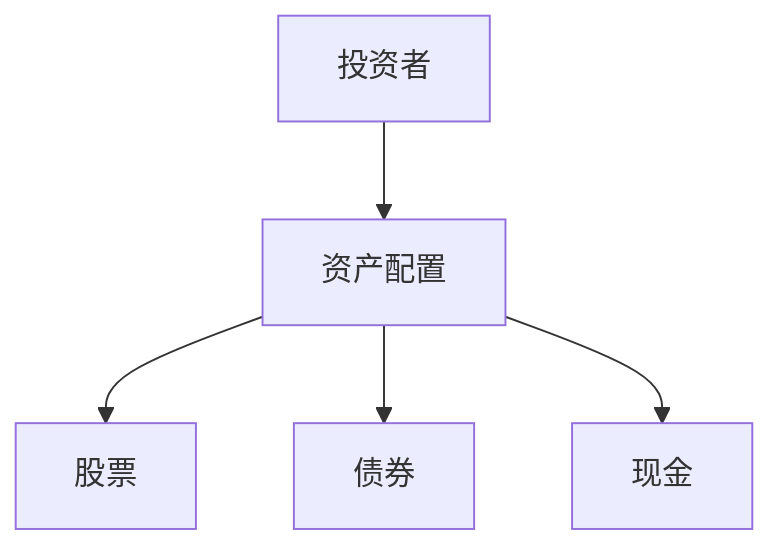
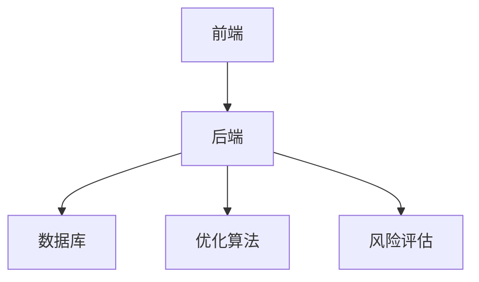
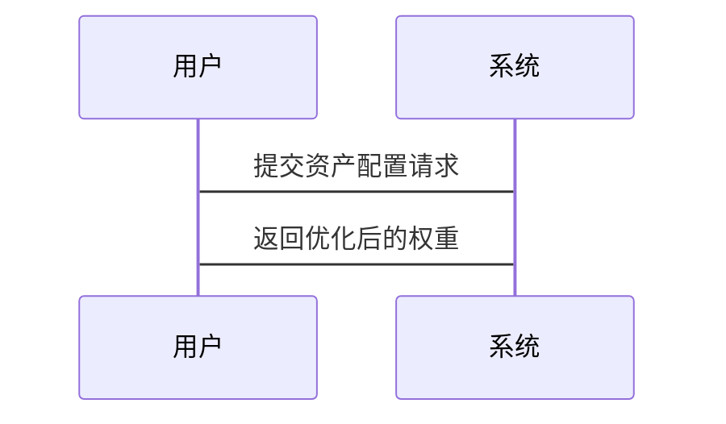

                 


# 约翰伯格的资产配置理论：平衡风险与收益

> 关键词：资产配置，风险收益平衡，投资组合优化，约翰·伯格理论，数学模型

> 摘要：本文详细阐述了约翰·伯格的资产配置理论，探讨了如何通过科学的资产分配来平衡投资风险与收益。文章从理论背景、核心概念、算法原理、数学模型、系统架构、项目实战以及最佳实践等多个维度进行深入分析，结合实际案例和代码实现，为读者提供全面的理论与实践指导。

---

## 第一部分: 资产配置理论的背景与核心概念

### 第1章: 资产配置的基本概念与重要性

#### 1.1 资产配置的定义与背景
- **资产配置的定义**：资产配置是指将资金分配到不同资产类别（如股票、债券、房地产等）中的过程，旨在在风险可控的前提下实现收益最大化。
- **资产配置的重要性**：通过分散投资，降低投资组合的整体风险，同时优化收益结构。
- **资产配置的边界与外延**：资产配置不仅限于金融资产，还包括实物资产和其他金融工具。

#### 1.2 约翰·伯格的资产配置理论
- **约翰·伯格的生平与贡献**：伯格是投资界的重要人物，提出了许多经典的资产配置理论。
- **理论的核心思想与特点**：强调长期投资、分散化和成本控制。
- **理论的适用场景与限制**：适用于长期投资者，但在市场波动剧烈时可能需要调整。

#### 1.3 资产配置与风险收益平衡
- **风险与收益的基本关系**：收益与风险正相关，高风险可能带来高收益，但也有更高的亏损风险。
- **资产配置对风险收益的影响**：通过合理分配资产类别，平衡整体风险和收益。
- **平衡风险收益的核心原则**：分散投资、动态调整、长期视角。

---

### 第2章: 资产配置的核心概念解析

#### 2.1 资产类别与权重分配
- **主要资产类别分析**：股票、债券、现金、房地产等。
- **资产权重分配的原则**：根据风险承受能力和投资目标确定各资产的比例。
- **权重与风险收益的关系**：权重高的资产对整体收益和风险影响更大。

#### 2.2 风险与收益的量化分析
- **风险的度量方法**：波动率、VaR（在险价值）等。
- **收益的度量方法**：预期收益率、夏普比率等。
- **风险收益比的计算**：收益与风险的比值，用于评估投资效率。

#### 2.3 资产相关性与配置优化
- **资产相关性的定义与计算**：资产之间收益变化的相关性，用协方差和相关系数表示。
- **相关性对资产配置的影响**：相关性高的资产分散效果差，应选择相关性较低的资产。
- **优化资产配置的数学模型**：构建优化模型，考虑相关性、风险和收益。

#### 2.4 核心概念对比表
| 资产类别 | 风险 | 收益 | 相关性 |
|----------|------|------|--------|
| 股票     | 高   | 高   | 高     |
| 债券     | 中   | 中   | 中     |
| 现金     | 低   | 低   | 低     |

#### 2.5 实体关系图（Mermaid）


---

## 第二部分: 资产配置的算法与数学模型

### 第3章: 算法原理与数学模型

#### 3.1 均值-方差优化算法
- **算法概述**：通过优化投资组合的期望收益和方差，找到最优资产分配。
- **优化目标**：最小化方差，同时最大化收益。
- **数学公式**：
  - 期望收益：$$ E(r) = \sum w_i E(r_i) $$
  - 方差：$$ Var(r) = \sum w_i w_j \sigma_i \sigma_j \rho_{ij} $$
- **优化步骤**：使用拉格朗日乘数法求解优化问题。

#### 3.2 优化算法实现
- **Python代码示例**：
```python
import numpy as np

# 假设资产的收益和相关系数矩阵
returns = np.array([0.1, 0.08, 0.05])
cov_matrix = np.array([[0.01, 0.005, 0.002],
                        [0.005, 0.02, 0.005],
                        [0.002, 0.005, 0.03]])

# 使用numpy求解权重
def optimize_weights(cov, returns):
    n = len(returns)
    cov = cov / (cov.max() + 1e-9)
    w = np.linalg.solve(cov, returns)
    w = w / w.sum()
    return w

weights = optimize_weights(cov_matrix, returns)
print("Optimal Weights:", weights)
```

#### 3.3 数学模型详细推导
- **协方差矩阵**：$$ \Sigma = \begin{bmatrix} \sigma_1^2 & \sigma_{12} & \sigma_{13} \\ \sigma_{21} & \sigma_2^2 & \sigma_{23} \\ \sigma_{31} & \sigma_{32} & \sigma_3^2 \end{bmatrix} $$
- **优化问题**：$$ \min_w \quad w^T \Sigma w $$
  $$ \text{s.t.} \quad \sum w_i = 1 $$
- **拉格朗日函数**：$$ L(w, \lambda) = w^T \Sigma w - \lambda (w^T \mathbf{1} - 1) $$

---

### 第4章: 系统分析与架构设计

#### 4.1 投资管理系统概述
- **系统功能**：资产配置、风险评估、收益预测、组合优化。
- **系统架构**：前端（用户界面）+ 后端（计算引擎）+ 数据库。

#### 4.2 系统架构图（Mermaid）


#### 4.3 系统接口设计
- **API接口**：RESTful接口，用于资产数据获取和优化结果返回。

#### 4.4 系统交互流程（Mermaid）


---

## 第三部分: 项目实战与最佳实践

### 第5章: 项目实战

#### 5.1 项目环境与工具
- **工具安装**：安装Python、numpy、pandas等库。
- **数据来源**：使用Yahoo Finance获取历史数据。

#### 5.2 核心实现代码
```python
import pandas as pd
import numpy as np

# 获取资产数据
def get_data(tickers):
    data = pd.DataFrame()
    for t in tickers:
        data[t] = pd.read_csv(f"data/{t}.csv")['Close']
    return data

# 计算协方差矩阵
def calculate_covariance(data):
    return data.cov()

# 简单优化算法实现
def simple_optimization(data):
    n = len(data.columns)
    weights = np.ones(n) / n
    return weights

# 优化后的权重
weights = simple_optimization(get_data(['AAPL', 'GOOGL', 'MSFT']))
print("Optimal Weights:", weights)
```

#### 5.3 实际案例分析
- **案例背景**：假设投资于三只股票，目标是优化权重。
- **数据收集与处理**：收集过去一年的股价数据，计算收益和协方差矩阵。
- **优化结果分析**：通过代码计算出最优权重，并进行回测分析。

#### 5.4 优化结果与分析
- **回测收益**：计算投资组合的历史收益与实际收益对比。
- **风险分析**：比较优化前后的风险指标（如波动率、VaR）。

---

### 第6章: 最佳实践与小结

#### 6.1 最佳实践
- **动态调整**：定期审视和调整资产配置，以应对市场变化。
- **风险管理**：使用止损策略和风险指标（如VaR）控制风险。
- **技术工具**：利用Python和机器学习模型提升优化效率。

#### 6.2 小结
- **总结**：约翰·伯格的理论为资产配置提供了科学的方法，但在实际操作中需要结合市场环境和投资者需求进行调整。
- **展望**：未来可以通过引入机器学习和大数据分析，进一步优化资产配置策略。

---

### 附录
- **附录A**：数学公式详细推导
- **附录B**：Python代码实现细节
- **附录C**：相关图表与数据表格

---

通过以上结构，文章从理论到实践，详细分析了约翰·伯格的资产配置理论，并结合实际案例和代码实现，为读者提供了全面的指导。

