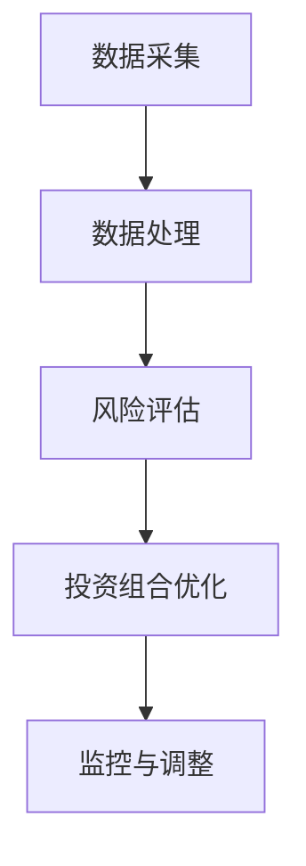
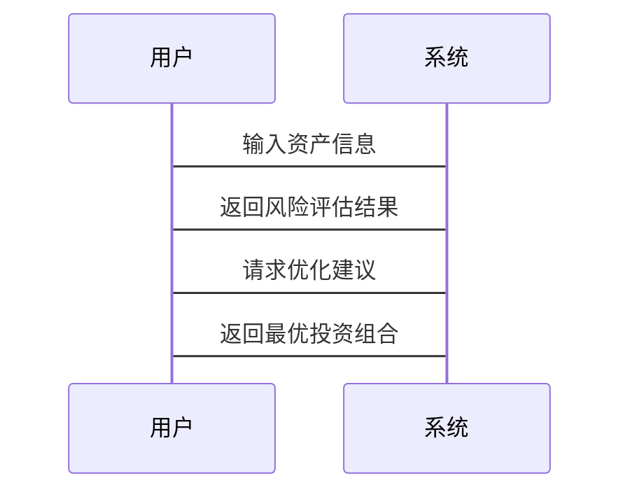

                 


# 《约翰伯格的退休投资规划》

---

## 关键词：  
退休投资规划、约翰·伯格、投资策略、资产配置、风险管理、财务自由

---

## 摘要：  
本文深入探讨了退休投资规划的核心理念和实施策略，以约翰·伯格的投资哲学为切入点，结合现代投资组合理论（MPT）和资本资产定价模型（CAPM），系统性地分析了如何通过科学的资产配置和风险管理实现退休生活的财务自由。文章从背景介绍、核心概念、算法原理、系统架构到项目实战，全面解析了退休投资规划的逻辑和方法，为读者提供了从理论到实践的完整指南。

---

## 第一部分：引言

### 第1章：退休投资规划的背景与重要性

#### 1.1 退休投资规划的背景

##### 1.1.1 人口老龄化与退休规划的必要性  
随着全球人口老龄化的加剧，退休规划已成为一个备受关注的社会议题。传统依靠社会保障和养老金的模式已难以满足现代人对退休生活的质量要求。因此，个人主动进行退休投资规划变得尤为重要。

##### 1.1.2 约翰·伯格的退休投资理念  
约翰·伯格是投资领域的重要人物，他倡导的“价值投资”和“长期持有”理念为退休投资规划提供了重要的理论基础。本文将结合伯格的投资哲学，探讨如何在退休阶段实现资产的保值与增值。

#### 1.2 退休投资规划的核心目标

##### 1.2.1 确保退休后生活质量  
退休投资规划的首要目标是确保退休后有足够的资金支持基本生活需求，并追求更高的生活质量。

##### 1.2.2 实现资产保值与增值  
通过科学的资产配置和风险管理，确保退休资金在通胀影响下的购买力，同时实现资产的长期增值。

#### 1.3 退休投资规划的误区与常见问题

##### 1.3.1 过度乐观与过度保守的误区  
许多人在退休投资时容易陷入过度乐观（追求高收益而忽视风险）或过度保守（过分保守导致资金贬值）的误区。

##### 1.3.2 资金不足与投资风险的问题  
资金不足和投资风险是退休投资规划中常见的问题，需要通过合理的资产配置和风险管理来解决。

---

## 第2章：约翰·伯格的退休投资策略

### 2.1 约翰·伯格的投资哲学

#### 2.1.1 长期投资与价值投资  
伯格强调长期投资的重要性，主张通过长期持有优质资产实现财富的稳步增长。

#### 2.1.2 分散投资与风险管理  
通过分散投资降低风险，避免将所有资金投入到单一资产类别中。

### 2.2 约翰·伯格的资产配置策略

#### 2.2.1 股票、债券与现金的配置比例  
伯格建议根据个人的风险承受能力、退休时间 horizon 等因素，合理配置股票、债券和现金的比例。

#### 2.2.2 定期调整与再平衡  
定期审视和调整投资组合，确保资产配置比例与个人的财务状况和目标保持一致。

### 2.3 约翰·伯格的退休支出规划

#### 2.3.1 确定退休后支出需求  
根据退休后的生活需求，估算每年的支出金额。

#### 2.3.2 确保退休资金的可持续性  
通过合理的资产配置和投资收益，确保退休资金能够持续满足支出需求。

---

## 第3章：退休投资规划的核心概念与数学模型

### 3.1 投资组合理论

#### 3.1.1 现代投资组合理论（MPT）的原理  
MPT认为，通过合理配置不同资产类别，可以在相同风险水平下实现收益最大化，或在相同收益水平下实现风险最小化。

#### 3.1.2 马科维茨的有效前沿曲线  
有效前沿曲线展示了在给定风险水平下，能够实现的最高收益，或在给定收益下，能够实现的最小风险。

#### 3.1.3 投资组合的风险与收益的数学表达式  
投资组合的预期收益可以表示为各资产预期收益的加权平均值，而风险（标准差）则取决于各资产收益的协方差矩阵。

$$ E(r_p) = \sum w_i E(r_i) $$
$$ \sigma_p^2 = \sum \sum w_i w_j \sigma_i \sigma_j \rho_{ij} $$

其中，$w_i$ 和 $w_j$ 是资产 i 和 j 的权重，$E(r_i)$ 是资产 i 的预期收益，$\sigma_i$ 是资产 i 的标准差，$\rho_{ij}$ 是资产 i 和 j 的相关系数。

### 3.2 资本资产定价模型（CAPM）

#### 3.2.1 CAPM的基本公式  
CAPM公式为：
$$ E(r_i) = R_f + \beta_i (E(r_m) - R_f) $$
其中，$R_f$ 是无风险利率，$\beta_i$ 是资产 i 的贝塔系数，$E(r_m)$ 是市场预期收益。

#### 3.2.2 投资回报与市场风险的关系  
贝塔系数衡量了资产相对于市场的系统性风险，系数越大，资产的波动性越高。

### 3.3 约翰·伯格的投资模型

#### 3.3.1 伯格的投资组合优化公式  
伯格的投资组合优化公式结合了 MPT 和现实中的交易成本、税收等因素，提出了一种更加实用的投资组合优化方法。

---

## 第4章：算法与数学模型的实现

### 4.1 CAPM 模型的实现

#### 4.1.1 算法步骤  
1. 收集市场数据，包括无风险利率、市场指数收益率和各资产的历史收益率。
2. 计算各资产的贝塔系数。
3. 代入 CAPM 公式，计算各资产的预期收益。

#### 4.1.2 代码实现  
```python
import numpy as np

def calculate_beta(asset_returns, market_returns):
    covariance = np.cov(asset_returns, market_returns, rowvar=False)[0, 1]
    market_variance = np.var(market_returns)
    beta = covariance / market_variance
    return beta

# 示例数据
asset_returns = np.array([0.1, 0.12, 0.08, 0.15])
market_returns = np.array([0.1, 0.1, 0.1, 0.1])

beta = calculate_beta(asset_returns, market_returns)
print(f"贝塔系数：{beta}")
```

### 4.2 投资组合优化的实现

#### 4.2.1 算法步骤  
1. 确定各资产的预期收益和风险。
2. 计算各资产之间的协方差矩阵。
3. 使用 MPT 理论计算有效前沿，并选择最优投资组合。

#### 4.2.2 代码实现  
```python
import numpy as np

def optimize_portfolio(asset_returns, asset_variance, covariance_matrix):
    n = len(asset_returns)
    # 使用拉格朗日乘数法求解最优投资组合
    # 这里简化为求解最小方差组合
    inv_cov = np.linalg.inv(covariance_matrix)
    weights = inv_cov.sum(axis=1) / inv_cov.sum()
    return weights

# 示例数据
asset_returns = np.array([0.1, 0.12, 0.08])
asset_variance = np.array([0.02, 0.03, 0.01])
covariance_matrix = np.array([
    [0.02, 0.01, 0.005],
    [0.01, 0.03, 0.008],
    [0.005, 0.008, 0.01]
])

weights = optimize_portfolio(asset_returns, asset_variance, covariance_matrix)
print(f"最优权重：{weights}")
```

---

## 第5章：系统架构与交互设计

### 5.1 系统架构设计

#### 5.1.1 系统功能模块  
- 数据采集与处理模块  
- 风险评估与分析模块  
- 投资组合优化模块  
- 投资组合监控与调整模块  

#### 5.1.2 系统架构图  


### 5.2 系统交互设计

#### 5.2.1 交互流程图  


---

## 第6章：项目实战与案例分析

### 6.1 环境安装与数据准备

#### 6.1.1 环境安装  
安装必要的 Python 库，如 numpy、pandas、scipy。

#### 6.1.2 数据准备  
收集历史市场数据，包括股票、债券等资产的收益率数据。

### 6.2 核心代码实现

#### 6.2.1 计算贝塔系数  
```python
import numpy as np

def calculate_beta(asset_returns, market_returns):
    covariance = np.cov(asset_returns, market_returns, rowvar=False)[0, 1]
    market_variance = np.var(market_returns)
    beta = covariance / market_variance
    return beta

# 示例数据
asset_returns = np.array([0.1, 0.12, 0.08, 0.15])
market_returns = np.array([0.1, 0.1, 0.1, 0.1])

beta = calculate_beta(asset_returns, market_returns)
print(f"贝塔系数：{beta}")
```

#### 6.2.2 投资组合优化  
```python
import numpy as np

def optimize_portfolio(asset_returns, covariance_matrix):
    n = len(asset_returns)
    inv_cov = np.linalg.inv(covariance_matrix)
    weights = inv_cov.sum(axis=1) / inv_cov.sum()
    return weights

# 示例数据
asset_returns = np.array([0.1, 0.12, 0.08])
covariance_matrix = np.array([
    [0.02, 0.01, 0.005],
    [0.01, 0.03, 0.008],
    [0.005, 0.008, 0.01]
])

weights = optimize_portfolio(asset_returns, covariance_matrix)
print(f"最优权重：{weights}")
```

### 6.3 案例分析

#### 6.3.1 案例背景  
假设一个投资者计划在 10 年后退休，目前有 50 万美元的退休基金，希望实现稳健的资产配置。

#### 6.3.2 投资组合构建  
根据优化结果，投资者将 40% 的资金投入股票，30% 投入债券，20% 投入现金，10% 投入其他资产。

#### 6.3.3 风险评估与调整  
通过定期监控市场变化，及时调整投资组合，确保风险在可控范围内。

---

## 第7章：总结与最佳实践

### 7.1 最佳实践 tips

#### 7.1.1 定期审视投资组合  
每年至少审视一次投资组合，根据市场变化和个人财务状况进行调整。

#### 7.1.2 保持长期视角  
避免短期波动的干扰，坚持长期投资策略。

#### 7.1.3 合理分散投资  
通过多元化配置降低风险，避免将所有资金投入到单一资产类别中。

### 7.2 小结  
退休投资规划是一个复杂但值得投入的过程。通过科学的资产配置和风险管理，结合约翰·伯格的投资哲学，我们可以更好地实现财务自由和退休生活的质量保障。

### 7.3 注意事项

#### 7.3.1 避免过度杠杆  
过高的杠杆会增加投资风险，尤其是在市场波动较大的情况下。

#### 7.3.2 关注费用与税收  
投资费用和税收对最终收益有重要影响，需选择低成本的投资工具和合理避税。

### 7.4 拓展阅读  
- 《投资最重要的事儿》—— 巴菲特的导师本杰明·格雷厄姆的经典投资著作。
- 《漫步华尔街》—— 提供了通俗易懂的投资指南，适合非专业投资者阅读。

---

## 结语  
退休投资规划是每个人财务自由的重要组成部分。通过本文的系统分析和实战案例，希望能为读者提供有价值的参考和启发。投资有风险，选择需谨慎，建议在实际操作中结合自身情况，必要时寻求专业顾问的帮助。

