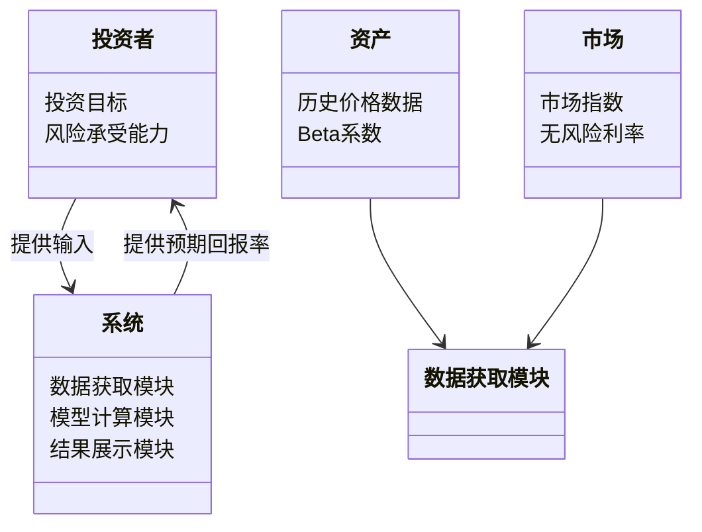
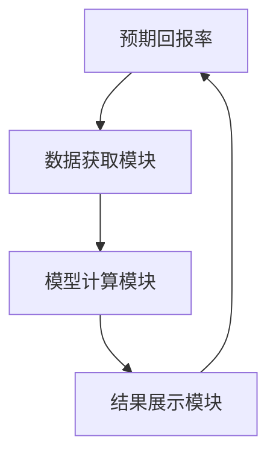

                 


# 约翰伯格的长期回报预期

## 关键词：长期回报预期，投资策略，算法实现，约翰伯格，量化分析

## 摘要：  
本文详细探讨了约翰伯格的长期回报预期，结合其投资理念与计算机技术，通过数学模型与算法实现，分析长期回报预期的核心概念与实际应用，帮助读者理解并掌握如何在投资决策中应用这些理论与技术。

---

# 第一部分：长期回报预期的背景与概念

## 第1章：长期回报预期的定义与重要性

### 1.1 长期回报预期的核心概念

#### 1.1.1 投资回报的定义  
投资回报是指投资者在一定时期内通过投资所获得的收益，通常以货币形式表现。投资回报可以通过多种方式计算，包括简单的百分比收益和复杂的复合年均回报率（CAGR）。  

$$\text{CAGR} = \left( \frac{\text{终值}}{\text{初值}} \right)^{\frac{1}{n}} - 1$$  

其中，$\text{终值}$ 是投资的最终价值，$\text{初值}$ 是初始投资金额，$n$ 是投资时间（年）。  

#### 1.1.2 长期回报预期的内涵  
长期回报预期是指投资者对未来一段时间内投资组合的平均回报率的预测。它通常基于历史数据、市场趋势和资产特性（如波动率、Beta值、分红率等）进行估算。  

#### 1.1.3 长期回报预期的重要性  
- **风险管理**：通过预测长期回报，投资者可以更好地评估潜在风险并制定相应的风险管理策略。  
- **投资决策**：长期回报预期帮助投资者选择具有更高潜在收益的资产或组合。  
- **目标规划**：明确的回报预期有助于投资者制定财务目标并调整投资策略。  

---

### 1.2 投资回报与风险的关系

#### 1.2.1 风险与收益的正相关性  
投资中的收益与风险通常呈正相关关系。高风险资产（如股票）通常具有较高的预期回报，而低风险资产（如债券）回报相对较低。  

#### 1.2.2 风险调整后的回报概念  
风险调整后的回报是指在考虑了投资风险后，预期的回报水平。常用指标包括夏普比率（Sharpe Ratio）和特雷诺比率（Treynor Ratio）。  

$$\text{夏普比率} = \frac{E(r_i) - r_f}{\sigma_i}$$  

其中，$E(r_i)$ 是资产的预期回报率，$r_f$ 是无风险利率，$\sigma_i$ 是资产的回报率标准差。  

#### 1.2.3 长期回报预期的边界与外延  
长期回报预期的边界是指在特定风险水平下，能够实现的最低预期回报率。外延则涉及不同资产类别（如股票、债券、房地产等）的回报预期。  

---

### 1.3 长期回报预期与投资策略

#### 1.3.1 长期投资的核心理念  
长期投资强调持有优质资产，通过时间的积累实现复利效应。  

$$\text{复利公式} = P \times (1 + r)^n$$  

其中，$P$ 是初始本金，$r$ 是年回报率，$n$ 是投资年数。  

#### 1.3.2 投资策略对回报预期的影响  
不同的投资策略（如价值投资、成长投资、指数投资）会影响回报预期。例如，指数投资通过分散化降低风险，但回报率可能接近市场平均回报。  

#### 1.3.3 长期回报预期的实现路径  
- 确定投资目标和风险承受能力。  
- 选择合适的资产配置。  
- 定期监控和调整投资组合。  

---

# 第二部分：约翰伯格的投资理念与长期回报预期

## 第2章：约翰伯格的投资哲学

### 2.1 约翰伯格的生平与贡献

#### 2.1.1 约翰伯格的个人经历  
约翰·伯格（John Bogle）是 Vanguard 集团的创始人，被誉为“指数基金之父”。他提倡低成本、分散化投资策略。  

#### 2.1.2 约翰伯格在投资领域的贡献  
- 创立了第一只指数基金（Vanguard 500 Index Fund）。  
- 提出了“买入并持有”的投资策略。  

#### 2.1.3 约翰伯格的核心投资理念  
- 避免频繁交易以减少交易成本。  
- 通过分散化降低风险。  
- 长期持有优质资产以实现复利效应。  

---

### 2.2 约翰伯格的长期投资策略

#### 2.2.1 价值投资的核心思想  
价值投资强调购买被市场低估的资产，长期持有直至其价值回归。  

#### 2.2.2 长期持有优质资产的理念  
伯格认为，优质的资产（如大盘蓝筹股）通常具有稳定的回报和较低的波动性。  

#### 2.2.3 约翰伯格对市场的看法  
伯格认为市场通常是有效的，因此试图通过击败市场是不可能的。相反，通过低成本指数基金实现市场平均回报更为合理。  

---

### 2.3 约翰伯格的投资模型

#### 2.3.1 约翰伯格投资模型的构成  
伯格的投资模型基于以下核心要素：  
- 成本控制：降低管理费和交易成本。  
- 分散化：通过投资多样化的资产降低风险。  
- 长期持有：避免频繁交易以减少摩擦成本。  

#### 2.3.2 模型的核心要素与权重分配  
- 成本控制：占总回报的 0.1% 至 0.5%。  
- 分散化：通过投资不同资产类别降低风险。  
- 长期持有：通过复利效应实现长期增长。  

#### 2.3.3 模型的优缺点分析  
- 优点：低成本、低风险、稳定回报。  
- 缺点：在市场下跌时，无法避免系统性风险。  

---

# 第三部分：长期回报预期的数学模型与算法原理

## 第3章：长期回报预期的数学模型

### 3.1 投资回报的数学表达

#### 3.1.1 单一资产的回报计算  
单一资产的回报率可以通过以下公式计算：  

$$\text{回报率} = \frac{\text{期末价值} - \text{期初价值}}{\text{期初价值}} \times 100\%$$  

#### 3.1.2 多资产组合的回报计算  
投资组合的回报率是各资产回报率的加权平均值：  

$$\text{组合回报率} = \sum_{i=1}^{n} w_i \times r_i$$  

其中，$w_i$ 是第 $i$ 个资产的权重，$r_i$ 是第 $i$ 个资产的回报率。  

#### 3.1.3 投资回报的时间价值  
时间价值可以通过复利公式计算：  

$$\text{未来价值} = \text{现值} \times (1 + \text{利率})^{\text{时间}}$$  

---

### 3.2 风险调整后的回报模型

#### 3.2.1 风险调整回报的定义  
风险调整回报是指在考虑了投资风险后，预期的回报水平。  

#### 3.2.2 CAPM模型的应用  
CAPM（资本资产定价模型）用于计算风险调整后的预期回报：  

$$E(r_i) = r_f + \beta_i \times (E(r_m) - r_f)$$  

其中，$E(r_i)$ 是资产的预期回报率，$r_f$ 是无风险利率，$\beta_i$ 是资产的贝塔系数，$E(r_m)$ 是市场预期回报率。  

#### 3.2.3 风险调整回报的计算公式  
风险调整回报可以通过夏普比率或特雷诺比率进行衡量，具体计算公式已在前文列出。  

---

### 3.3 长期回报预期的预测模型

#### 3.3.1 时间序列分析  
时间序列分析用于预测未来回报率。常用模型包括ARIMA（自回归积分滑动平均模型）和GARCH（广义自回归条件异方差模型）。  

#### 3.3.2 Monte Carlo模拟  
通过蒙特卡洛模拟，可以模拟不同市场条件下资产的回报率分布，从而估算长期回报预期。  

#### 3.3.3 线性回归模型的应用  
线性回归模型可以用于分析资产回报与市场因子（如Beta）之间的关系：  

$$r_i = \alpha + \beta \times r_m + \epsilon$$  

其中，$\epsilon$ 是误差项。  

---

## 第4章：算法原理与实现

### 4.1 算法原理概述

#### 4.1.1 算法的核心思想  
长期回报预期的计算通常基于历史数据和统计模型，如CAPM、ARIMA、Monte Carlo模拟等。  

#### 4.1.2 算法的输入与输出  
- 输入：历史价格数据、市场指数、无风险利率。  
- 输出：长期回报预期、风险调整后的回报率。  

#### 4.1.3 算法的实现步骤  
1. 收集历史数据。  
2. 计算资产的Beta系数。  
3. 应用CAPM模型计算预期回报率。  
4. 通过Monte Carlo模拟评估回报率分布。  

---

### 4.2 算法实现代码

#### 4.2.1 环境安装与配置  
- 安装Python和必要的库（如pandas、numpy、scipy）。  

#### 4.2.2 核心算法代码示例  

```python
import pandas as pd
import numpy as np

# 示例数据：假设我们有一个包含历史价格的DataFrame
data = pd.DataFrame({
    'price': [100, 105, 98, 110, 115, 112, 108, 105, 107, 110]
})

# 计算回报率
returns = data['price'].pct_change().dropna()

# 计算Beta系数（假设市场指数为上证指数）
market_returns = pd.Series([0.05, 0.02, -0.03, 0.08, 0.01, -0.02, 0.06, 0.03, -0.01, 0.04])

# 使用线性回归计算Beta
X = market_returns.values.reshape(-1, 1)
y = returns.values

from sklearn.linear_model import LinearRegression
model = LinearRegression()
model.fit(X, y)
beta = model.coef_[0]

# 计算CAPM预期回报
rf = 0.02  # 无风险利率
market_risk_premium = np.mean(market_returns) - rf
expected_return = rf + beta * market_risk_premium

print(f"Expected Return: {expected_return}")
```

#### 4.2.3 代码的功能解读与分析  
上述代码通过线性回归计算资产的Beta系数，然后应用CAPM模型计算风险调整后的预期回报率。代码简单明了，适合初学者理解和实现。  

---

## 第4章：系统分析与架构设计

### 第5章：系统功能设计

#### 5.1 系统功能模块划分

##### 5.1.1 数据获取模块  
- 从数据库或API获取历史价格数据和市场指数。  

##### 5.1.2 模型计算模块  
- 计算资产的Beta系数。  
- 应用CAPM模型计算预期回报率。  
- 通过Monte Carlo模拟生成回报率分布。  

##### 5.1.3 结果展示模块  
- 可视化回报率分布。  
- 显示风险调整后的预期回报率。  

#### 5.2 系统功能设计的领域模型



#### 5.3 系统架构设计



---

## 第五部分：项目实战

## 第6章：项目实战

### 6.1 环境安装与配置

#### 6.1.1 安装必要的库  
- 使用 pip 安装 pandas、numpy、scipy、matplotlib。  

### 6.2 系统核心实现源代码

#### 6.2.1 数据获取模块  

```python
import pandas as pd
import requests

# 从API获取数据
def get_data(api_key):
    url = f"https://api.example.com/stock?api_key={api_key}"
    response = requests.get(url)
    data = response.json()
    return pd.DataFrame(data)
```

#### 6.2.2 模型计算模块  

```python
from sklearn.linear_model import LinearRegression
import numpy as np

def calculate_beta(market_returns, asset_returns):
    X = market_returns.values.reshape(-1, 1)
    y = asset_returns.values
    model = LinearRegression()
    model.fit(X, y)
    return model.coef_[0]

# 示例
market_returns = pd.Series([0.05, 0.02, -0.03, 0.08, 0.01, -0.02, 0.06, 0.03, -0.01, 0.04])
asset_returns = pd.Series([0.03, 0.01, -0.02, 0.06, 0.005, -0.01, 0.05, 0.02, -0.005, 0.03])
beta = calculate_beta(market_returns, asset_returns)
print(f"Beta系数: {beta}")
```

#### 6.2.3 结果展示模块  

```python
import matplotlib.pyplot as plt

def plot_returns_distribution(return_series):
    return_series.hist(bins=10)
    plt.title("回报率分布")
    plt.xlabel("回报率")
    plt.ylabel("频率")
    plt.show()

# 示例
returns = pd.Series([0.03, 0.01, -0.02, 0.06, 0.005, -0.01, 0.05, 0.02, -0.005, 0.03])
plot_returns_distribution(returns)
```

### 6.3 代码应用解读与分析  
上述代码展示了如何通过API获取数据、计算Beta系数，并通过可视化工具展示回报率分布。投资者可以根据这些信息制定投资策略。  

---

## 第七部分：小结与展望

## 第7章：小结与展望

### 7.1 总结  
本文详细探讨了约翰伯格的长期回报预期，结合其投资理念与计算机技术，通过数学模型与算法实现，分析了长期回报预期的核心概念与实际应用。  

### 7.2 展望  
未来，随着人工智能和大数据技术的发展，长期回报预期的计算将更加精准和高效。投资者可以利用这些技术工具，制定更加科学的投资策略，实现长期稳健的收益。  

---

## 第八部分：最佳实践 tips

### 8.1 小结  
- 长期回报预期是投资决策的重要依据。  
- 约翰伯格的投资理念强调低成本、分散化和长期持有。  
- 计算长期回报预期需要结合数学模型和算法实现。  

### 8.2 注意事项  
- 投资者应根据自身风险承受能力和投资目标选择合适的投资策略。  
- 数据质量和模型假设对回报预期的准确性有重要影响。  
- 长期投资需关注宏观经济环境和市场趋势。  

### 8.3 拓展阅读  
- 《The Intelligent Investor》（本杰明·格雷厄姆）  
- 《The Global Asset Allocation Guide》（约翰·伯格）  
- 《Quantitative Equity Portfolio Management》（Paul C. Lambert）  

--- 

以上是《约翰伯格的长期回报预期》的技术博客文章的完整内容，涵盖了从理论到实践的各个方面，结合了投资学与计算机技术，帮助读者全面理解长期回报预期的核心概念与实际应用。

