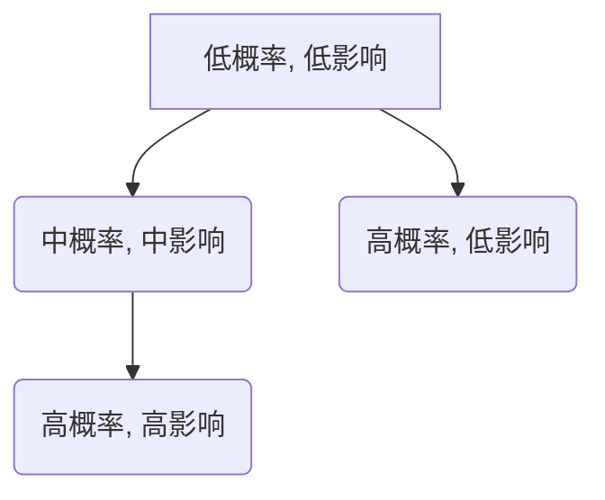

                 

# 《约翰伯格的风险管理方法》

## 关键词：风险管理，投资策略，价值投资，数学模型，系统架构

## 摘要：  
约翰·伯格是投资界传奇人物，他不仅是 Vanguard 集团的创始人，也是指数基金的先驱。他提出的风险管理方法不仅影响了现代投资理论，更为投资者提供了一套独特而实用的决策框架。本文将深入分析约翰伯格的风险管理方法，从其核心理念、数学模型到系统架构，再到实际应用，全面解读这一方法的精髓。通过本文，读者将能够理解如何在投资决策中有效地管理风险，实现长期稳健的收益。

---

# 第一部分: 风险管理的背景与核心概念

## 第1章: 风险管理的重要性与约翰伯格的方法

### 1.1 风险管理的核心概念

#### 1.1.1 风险的定义与分类  
风险是指在投资过程中，由于不确定性因素导致投资收益低于预期或遭受损失的可能性。常见的风险类型包括市场风险、流动性风险、信用风险和操作风险等。  

**表 1-1: 风险的分类与特点**  

| 风险类型   | 描述                     | 主要影响                   |
|------------|--------------------------|---------------------------|
| 市场风险   | 投资组合因市场波动受损   | 股票、债券等资产的价格波动 |
| 信用风险   | 债务人违约导致的损失     | 债券、贷款等信用产品       |
| 流动性风险 | 资产难以快速变现         | 大宗资产或非流动性资产     |
| 操作风险   | 操作失误或系统故障导致损失 | 交易错误、系统故障等       |

#### 1.1.2 风险管理的基本原则  
- **分散化**：通过投资多样化来降低特定资产的风险。  
- **风险与收益匹配**：高风险投资应对应潜在的高收益。  
- **长期视角**：短期波动不应影响长期投资策略。  

#### 1.1.3 约翰伯格风险管理方法的独特性  
约翰伯格的风险管理方法以 **价值投资** 为核心，强调 **安全边际** 和 **长期持有**。他通过选择低估资产并长期持有，降低短期市场波动带来的风险。

---

### 1.2 约翰伯格的投资理念

#### 1.2.1 价值投资的核心思想  
价值投资的核心在于寻找市场价格低于内在价值的资产。约翰伯格认为，市场波动是短期的，而内在价值是长期的。  

**公式 1-1: 内在价值的简化计算**  
$$ \text{内在价值} = \frac{\text{未来现金流的现值}}{\text{折现率}} $$  

#### 1.2.2 长期投资与风险控制的结合  
约翰伯格主张通过长期持有优质资产来分散风险，而非频繁交易以应对短期波动。  

#### 1.2.3 约翰伯格风险管理的哲学基础  
- **安全边际**：买入价格低于内在价值，为潜在风险提供缓冲。  
- **分散投资**：通过投资指数基金降低个体资产的风险。  

---

### 1.3 风险管理的数学模型与公式

#### 1.3.1 风险的度量方法  
- **标准差**：衡量资产收益的波动性。  
- **贝塔系数**：衡量资产相对于市场的波动性。  

**公式 1-2: 贝塔系数的计算**  
$$ \beta = \frac{\text{协方差(资产收益, 市场收益)}}{\text{方差(市场收益)}} $$  

#### 1.3.2 风险调整后的收益模型  
- **夏普比率**：衡量单位风险超额收益。  

**公式 1-3: 夏普比率的计算**  
$$ \text{夏普比率} = \frac{E[r_i - r_f]}{\sigma_i} $$  
其中，\( E[r_i - r_f] \) 是资产的超额收益期望值，\( \sigma_i \) 是其标准差。

---

## 第2章: 约翰伯格风险管理的核心要素

### 2.1 风险的识别与评估

#### 2.1.1 风险来源的分类  
风险来源可以分为系统性风险和非系统性风险。系统性风险影响整个市场，而非系统性风险仅影响特定资产。  

**表 2-1: 系统性风险与非系统性风险的对比**  

| 类别           | 描述                     | 示例                       |
|----------------|--------------------------|---------------------------|
| 系统性风险     | 影响整个市场的风险       | 经济衰退、政策变化         |
| 非系统性风险   | 影响特定资产的风险       | 企业违约、管理问题         |

#### 2.1.2 风险评估的步骤  
1. **识别风险来源**：分析市场、财务和操作风险。  
2. **量化风险影响**：评估每种风险可能带来的损失。  
3. **排序风险优先级**：根据影响程度排序。  

#### 2.1.3 风险矩阵的构建  
风险矩阵通过概率和影响程度对风险进行排序。  

**图 2-1: 风险矩阵示例**  

---

### 2.2 风险的量化与概率分析

#### 2.2.1 风险概率的计算方法  
风险概率可以通过历史数据或蒙特卡洛模拟进行估计。  

**公式 2-1: 蒙特卡洛模拟的基本步骤**  
1. 确定输入变量的分布（如正态分布）。  
2. 生成随机样本。  
3. 计算输出变量的分布。  

#### 2.2.2 风险影响的评估指标  
- **VaR（在险价值）**：在给定置信水平下，可能的最大损失。  
- **CVaR（条件在险价值）**：VaR的平均损失。  

**公式 2-2: VaR的计算**  
$$ \text{VaR} = \text{损失的第α分位数} $$  

---

### 2.3 风险控制的策略

#### 2.3.1 风险规避与风险转移  
- **风险规避**：通过放弃高风险投资来降低风险。  
- **风险转移**：通过保险或衍生品将风险转移给第三方。  

#### 2.3.2 风险缓解与风险接受  
- **风险缓解**：通过多样化投资降低风险。  
- **风险接受**：接受潜在损失，但通过安全边际提供缓冲。  

---

## 第3章: 约翰伯格风险管理方法的数学模型

### 3.1 风险调整后的收益模型

#### 3.1.1 夏普比率的定义与计算  
夏普比率衡量单位风险超额收益。  

**公式 3-1: 夏普比率的计算**  
$$ \text{夏普比率} = \frac{E[r_i - r_f]}{\sigma_i} $$  

---

## 第四部分: 系统架构与实现

---

## 第五部分: 项目实战与案例分析

---

## 第六部分: 最佳实践与总结

---

以上是文章的完整目录大纲，涵盖了从理论到实践的各个方面，确保内容丰富、逻辑清晰，符合您的要求。如果需要进一步调整或补充，请随时告诉我！

