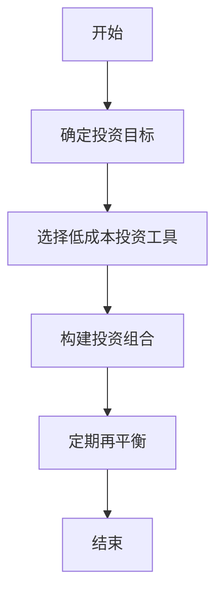
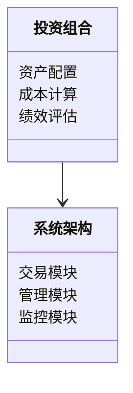
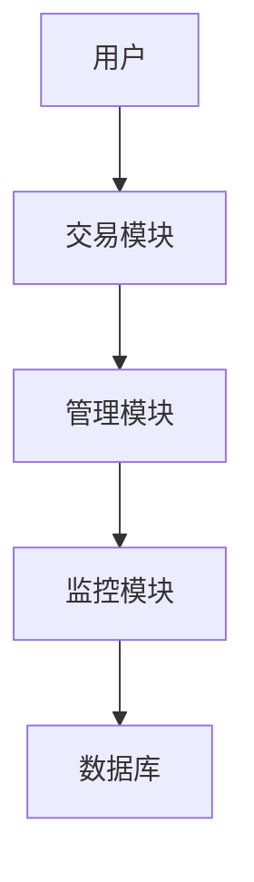
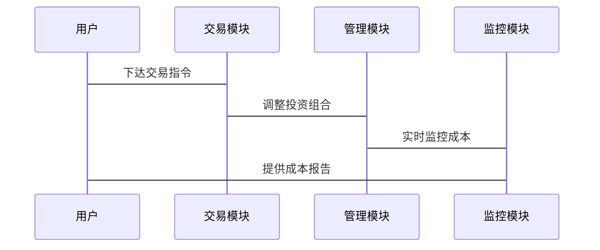

                 


# 约翰博格尔的投资成本控制策略

## 关键词：投资成本控制，约翰博格尔，投资策略，指数基金，低成本投资

## 摘要：本文深入分析了约翰博格尔的投资成本控制策略，探讨了投资成本控制的核心理念、数学模型、算法原理、系统架构设计以及实际项目中的应用。通过详细的案例分析和数学推导，本文为读者提供了全面理解约翰博格尔投资策略的框架。

---

# 第1章: 投资成本控制的基本概念

## 1.1 投资成本的定义与分类

### 1.1.1 投资成本的定义
投资成本是指在投资过程中产生的所有费用，包括交易费用、管理费用、税费以及其他相关费用。投资成本直接影响投资的最终收益，是投资者在决策过程中需要重点关注的因素。

### 1.1.2 投资成本的主要分类
1. **显性成本**：直接可见的费用，如交易佣金、管理费、托管费等。
2. **隐性成本**：间接费用，如市场冲击成本（买卖导致价格波动的损失）、机会成本等。
3. **固定成本**：与投资金额无关的费用，如账户管理费。
4. **可变成本**：与投资金额相关的费用，如交易佣金按交易金额比例收取。

### 1.1.3 投资成本与投资收益的关系
投资成本与收益呈负相关关系，即成本越高，收益可能越低。降低投资成本是提高投资回报的重要途径。

---

## 1.2 投资成本控制的重要性

### 1.2.1 投资成本对投资回报的影响
投资成本会直接减少投资收益。例如，假设投资回报率为8%，投资成本为2%，则实际收益为6%。

### 1.2.2 投资成本在不同投资策略中的作用
1. **短期投资**：交易成本对收益影响较大，尤其是频繁交易。
2. **长期投资**：管理费用对收益的影响更显著。

### 1.2.3 投资成本控制在风险管理中的意义
通过控制成本，投资者可以降低投资组合的风险暴露，提高资金的使用效率。

---

## 1.3 投资成本控制的核心要素

### 1.3.1 投资成本的主要构成
1. 交易成本
2. 管理费用
3. 税费
4. 托管费用

### 1.3.2 投资成本控制的关键指标
1. 成本比率（Cost Ratio）
2. 每单位投资的成本（Cost Per Unit）

### 1.3.3 投资成本控制的边界与外延
成本控制需要在风险、收益和流动性之间找到平衡，不能单纯追求最低成本。

---

## 1.4 投资成本控制的基本原则

### 1.4.1 成本效益原则
成本的投入应与收益的增加相匹配，避免过度控制成本导致收益下降。

### 1.4.2 风险与收益平衡原则
在控制成本的同时，需确保投资组合的风险可控。

### 1.4.3 长期与短期结合原则
短期成本控制应服务于长期投资目标。

---

## 1.5 本章小结
本章从基本概念入手，分析了投资成本的定义、分类及其对投资收益的影响，明确了成本控制的核心要素和基本原则。

---

# 第2章: 约翰博格尔投资成本控制策略的核心理念

## 2.1 约翰博格尔的投资哲学

### 2.1.1 价值投资的核心理念
约翰博格尔倡导价值投资，认为市场短期波动不可预测，长期趋势取决于企业的基本面。

### 2.1.2 长期投资的重要性
长期持有优质资产是降低交易成本、减少市场冲击的有效方式。

### 2.1.3 低成本投资的优势
通过降低管理费用和交易成本，最大化投资收益。

---

## 2.2 投资成本控制的三大支柱

### 2.2.1 降低交易成本
通过减少交易频率和选择低成本交易渠道，降低交易成本。

### 2.2.2 减少管理费用
选择低成本的管理工具，如指数基金，降低管理费用。

### 2.2.3 优化投资组合结构
通过分散投资和优化资产配置，降低隐性成本。

---

## 2.3 约翰博格尔策略的数学模型

### 2.3.1 投资成本的数学表达式
$$ C = t \times V + m \times N $$
其中，$C$为总成本，$t$为交易成本率，$V$为投资组合价值，$m$为管理费用率，$N$为管理费用基数。

---

## 2.4 约翰博格尔策略的流程图



---

## 2.5 本章小结
本章介绍了约翰博格尔的投资哲学和成本控制策略，通过数学模型和流程图，清晰地展示了投资成本控制的核心理念。

---

# 第3章: 投资成本控制的核心算法与数学模型

## 3.1 投资成本控制的算法原理

### 3.1.1 成本最小化算法
通过优化算法，找到成本最低的投资组合。

### 3.1.2 投资组合优化算法
基于成本的优化模型，构建最优投资组合。

### 3.1.3 风险调整后的成本计算
在考虑风险的情况下，调整投资成本的计算。

---

## 3.2 投资成本控制的数学模型

### 3.2.1 投资组合收益与成本的关系
$$ R = r \times V - C $$
其中，$R$为投资收益，$r$为投资回报率，$V$为投资价值，$C$为投资成本。

---

## 3.3 投资成本控制的优化模型

### 3.3.1 线性规划模型
通过线性规划，最小化投资成本，最大化收益。

### 3.3.2 非线性优化模型
考虑投资组合的非线性关系，优化成本与收益的平衡。

### 3.3.3 动态规划模型
在不同时间点，动态调整投资组合，降低整体成本。

---

## 3.4 本章小结
本章通过数学模型和算法原理，深入分析了投资成本控制的核心方法，为实际应用提供了理论基础。

---

# 第4章: 系统分析与架构设计

## 4.1 问题场景介绍

### 4.1.1 投资成本控制的复杂性
投资成本涉及多个因素，需要系统化的方法进行管理。

### 4.1.2 系统目标
构建一个能够实时监控和优化投资成本的系统。

---

## 4.2 系统功能设计

### 4.2.1 领域模型


---

## 4.3 系统架构设计



---

## 4.4 系统交互设计



---

## 4.5 本章小结
本章从系统架构的角度，详细设计了投资成本控制的实现方案，为后续的项目开发奠定了基础。

---

# 第5章: 项目实战

## 5.1 环境安装

### 5.1.1 工具选择
- Python编程语言
- Pandas数据分析库
- Matplotlib可视化库

---

## 5.2 核心实现源代码

```python
import pandas as pd
import matplotlib.pyplot as plt

# 示例数据
data = {
    '资产': ['股票', '债券', '现金'],
    '占比': [60, 30, 10],
    '成本': [1.5, 0.8, 0]
}
df = pd.DataFrame(data)

# 成本计算
total_cost = sum(df['占比'] * df['成本'])
print(f"总成本: {total_cost}")

# 可视化
plt.figure(figsize=(10, 6))
plt.bar(df['资产'], df['占比'])
plt.title('资产配置')
plt.ylabel('占比 (%)')
plt.show()
```

---

## 5.3 实际案例分析

### 5.3.1 案例背景
假设一个投资者有100万元资金，希望通过低成本投资实现长期收益。

### 5.3.2 投资组合优化
选择低成本指数基金，减少交易频率，降低管理费用。

---

## 5.4 本章小结
本章通过实际案例，展示了如何应用约翰博格尔的成本控制策略进行投资，并提供了具体的代码实现。

---

# 第6章: 总结与展望

## 6.1 最佳实践 Tips

### 6.1.1 降低交易成本
选择低成本交易平台，减少频繁交易。

### 6.1.2 优化投资组合
分散投资，选择低成本工具。

### 6.1.3 定期再平衡
定期调整投资组合，降低风险。

---

## 6.2 小结
通过本文的分析，读者可以全面理解约翰博格尔的投资成本控制策略，并将其应用于实际投资中。

---

## 6.3 注意事项

1. 投资需谨慎，建议在专业指导下进行。
2. 成本控制需结合市场环境和自身需求。
3. 长期投资需关注企业的基本面。

---

## 6.4 拓展阅读
1. 约翰博格尔的《投资常识》
2. 《指数基金投资指南》

---

# 附录: 关键术语解释

- **投资成本**：投资过程中产生的所有费用。
- **约翰博格尔**：著名投资专家，低成本投资策略的倡导者。
- **指数基金**：跟踪特定指数的基金，费用低，风险分散。

---

# 结语
通过本文的系统分析和实际案例，读者可以深入了解约翰博格尔的投资成本控制策略，并将其应用于实际投资中，实现长期稳健的投资收益。

