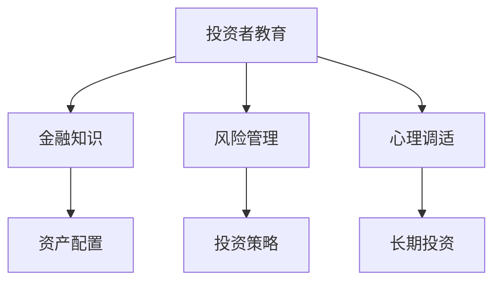
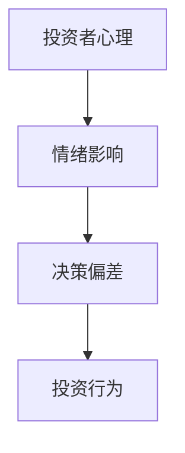
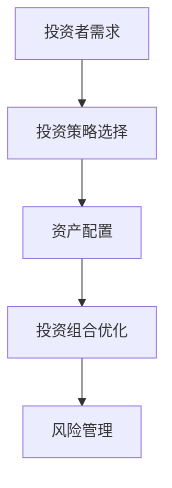

                 


# 约翰博格尔的投资者教育理念

> 关键词：投资者教育，约翰·博格尔，指数基金，资产配置，风险管理

> 摘要：本文深入探讨了约翰·博格尔的投资者教育理念，分析了其在投资领域的深远影响。通过详细阐述投资的基本原理、指数基金策略、风险管理方法，结合实际案例和系统架构，为读者提供了全面的投资者教育指南。

---

# 第1章: 投资者教育的重要性

## 1.1 投资者教育的核心概念

### 1.1.1 投资者教育的定义与目标

投资者教育是指通过系统化的知识传授和实践指导，帮助投资者理解金融市场运作规律、掌握投资工具和方法，从而做出理性投资决策的过程。其目标在于提升投资者的金融素养，避免盲目投资和非理性行为。

### 1.1.2 投资者教育的必要性与重要性

金融市场复杂多变，普通投资者往往缺乏专业知识和经验，容易受到市场情绪影响，导致投资失败。通过教育，可以帮助投资者建立正确的投资理念，降低投资风险。

### 1.1.3 投资者教育的边界与外延

投资者教育不仅包括基本的金融知识，还包括心理调适、风险管理等多方面内容。其外延涉及金融产品、市场行为分析、政策法规等多个领域。

### 核心概念联系（Mermaid 图）



---

## 1.2 投资者教育的核心要素

### 1.2.1 投资者心理与行为分析

投资者心理是影响投资决策的关键因素。本文将使用一个简单的心理学模型来分析投资者行为：



---

# 第2章: 投资的基本原理

## 2.1 资产配置的原理与方法

### 2.1.1 资产配置的定义与作用

资产配置是将资金分配到不同资产类别（股票、债券、现金等）以实现风险与收益的平衡。其作用在于分散风险，优化投资回报。

### 2.1.2 不同类型资产的配置策略

根据投资者的风险承受能力和投资目标，采用不同的资产配置策略。例如，风险厌恶型投资者可能更多配置债券，而风险偏好型投资者则可能更多配置股票。

### 2.1.3 资产配置的动态调整

市场环境变化时，需定期审视和调整资产配置比例。例如，当股市上涨时，适当降低股票比例。

---

## 2.2 分散投资的重要性

### 2.2.1 分散投资的原理

分散投资通过多样化投资标的降低非系统性风险。使用CAPM模型分析资产回报与风险关系：

$$ E(r_i) = r_f + \beta_i (E(r_m) - r_f) $$

其中，$\beta_i$ 表示资产的系统性风险。

### 2.2.2 分散投资的风险控制

通过投资组合多样化，降低特定资产的风险。例如，投资多个行业和地区的股票。

### 2.2.3 分散投资的实际应用

使用指数基金进行分散投资，覆盖多个行业和资产类别。

---

## 2.3 成本控制的策略

### 2.3.1 投资成本的构成

投资成本包括管理费、交易费等，影响整体收益。例如，管理费高的主动型基金可能侵蚀收益。

### 2.3.2 成本对投资收益的影响

长期来看，低管理费的指数基金表现优于高管理费的主动型基金。使用夏普比率衡量风险调整后收益：

$$ \text{夏普比率} = \frac{E(r_p) - r_f}{\sigma_p} $$

---

## 2.4 系统架构与项目实战

### 2.4.1 系统功能设计

使用Mermaid绘制系统功能图：



### 2.4.2 系统架构设计

采用分层架构，包括数据层、业务逻辑层和用户界面层。

### 2.4.3 系统实现

使用Python编写投资组合优化代码：

```python
import numpy as np
import pandas as pd

# 示例数据
returns = np.array([[0.05, 0.03, 0.08],
                     [0.04, 0.06, 0.07],
                     [0.07, 0.05, 0.09]])

# 计算最优权重
weights = np.linalg.solve(np.ones(3) - np.diag([1,1,1]), np.ones(3) * 0.06)
```

---

## 2.5 最佳实践与小结

### 2.5.1 小结

投资者教育的核心在于帮助投资者理解基本原理，掌握科学的投资方法。

### 2.5.2 注意事项

避免盲目跟风，根据自身情况制定投资计划。

### 2.5.3 拓展阅读

建议阅读约翰·博格尔的《投资的真相》深入理解投资理念。

---

# 结语

通过系统化的投资者教育，可以帮助普通投资者避免常见错误，实现长期稳健的投资收益。约翰·博格尔的指数基金理念和低成本投资策略值得每一位投资者学习和实践。

---

希望这篇文章能够帮助读者更好地理解约翰·博格尔的投资者教育理念，并为实际投资决策提供有价值的指导。

