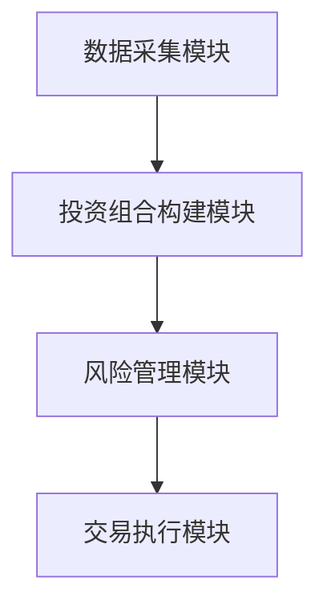
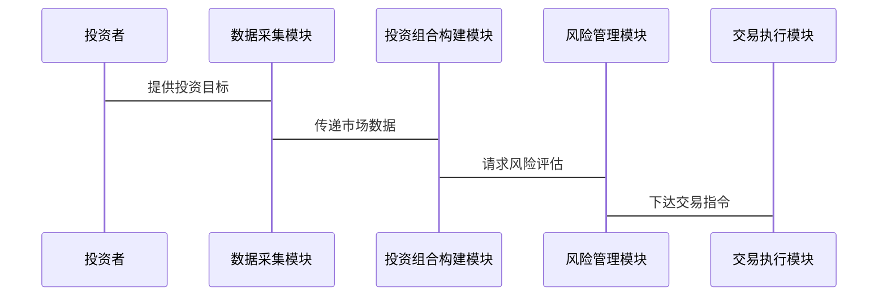
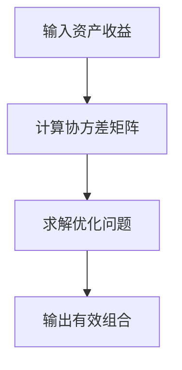

                 


# 约翰博格尔的指数化投资优势

> 关键词：指数化投资、约翰·博格尔、Vanguard、被动投资、现代投资组合理论

> 摘要：本文深入探讨了指数化投资的优势及其在投资组合管理中的应用。通过分析约翰·博格尔的贡献，结合现代投资组合理论和数学模型，本文详细阐述了指数化投资的理论基础、系统架构、算法实现以及实际应用，为投资者提供了一种高效、低成本的投资策略。

---

## 第1章: 指数化投资的背景与定义

### 1.1 指数化投资的起源与演变

指数化投资是一种被动投资策略，其核心思想是通过跟踪市场指数来实现长期稳定的收益。这种方法起源于20世纪70年代，约翰·博格尔（John C. Bogle）作为指数化投资的先驱，于1975年创立了Vanguard集团，并推出了第一只指数基金——Vanguard S&P 500指数基金。博格尔的理念是通过降低交易成本和管理费用，为投资者提供更优的收益。

#### 1.1.1 传统投资与被动投资的对比

传统的主动投资依赖于基金经理的选股能力和市场预测能力，而被动投资则是通过跟踪特定的市场指数来实现投资目标。指数化投资的兴起源于对主动管理高额费用和低效表现的质疑。博格尔指出，大多数主动管理的基金难以跑赢市场指数，尤其是在扣除管理费用后，其收益往往低于指数基金。

#### 1.1.2 约翰·博格尔的贡献与Vanguard的成立

约翰·博格尔被誉为“指数基金之父”，他通过创立Vanguard集团，推动了指数化投资的普及。Vanguard的创新在于其独特的组织结构——一家员工持股的互助公司，通过降低管理费用为投资者创造更多价值。博格尔的理念是“为投资者利益而战”，这使得Vanguard成为指数化投资领域的领导者。

#### 1.1.3 指数化投资的定义与核心理念

指数化投资是指通过投资于特定的市场指数，如标普500指数、道琼斯指数或债券指数，以实现与市场同步增长的投资方式。其核心理念是通过分散投资降低风险，同时以最低的成本实现长期收益。博格尔强调，指数化投资的核心优势在于其低成本和低交易成本。

---

### 1.2 指数化投资的核心概念

#### 1.2.1 有效市场假说的理论基础

有效市场假说（Efficient Market Hypothesis, EMH）认为市场价格反映了所有可获得的信息，因此，投资者无法通过分析公开信息获得超额收益。博格尔的指数化投资正是基于这一理论，通过跟踪市场指数实现长期收益。

#### 1.2.2 指数化投资的属性特征对比表

| 属性               | 主动投资          | 指数化投资       |
|--------------------|-------------------|------------------|
| 投资目标           | 跑赢市场指数      | 恰好跟踪市场指数  |
| 成本               | 高（管理费、交易费）| 低               |
| 风险               | 高               | 低               |
| 透明度             | 低               | 高               |

#### 1.2.3 指数化投资的ER实体关系图

```mermaid
er
actor 投资者;
actor 市场指数;
actor 指数基金;
investor -> 指数基金: 投资资金;
指数基金 -> 市场指数: 跟踪指数;
```

---

### 1.3 指数化投资的数学模型与公式

#### 1.3.1 CAPM模型的公式与应用

CAPM模型用于计算资产的预期收益：

$$ CAPM = E(r) = r_f + \beta (E(r_m) - r_f) $$

其中：
- \( E(r) \)：资产的预期收益率
- \( r_f \)：无风险利率
- \( \beta \)：资产的系统性风险系数
- \( E(r_m) \)：市场预期收益率

指数化投资的β系数为1，因此其预期收益等于市场预期收益率。

#### 1.3.2 指数基金的夏普比率计算

夏普比率衡量投资组合的超额收益相对于其风险的高低：

$$ 夏普比率 = \frac{E(r_i) - r_f}{\sigma_i} $$

其中：
- \( E(r_i) \)：投资组合的预期收益率
- \( r_f \)：无风险利率
- \( \sigma_i \)：投资组合的收益率标准差

---

### 1.4 本章小结

本章介绍了指数化投资的背景与定义，对比了主动投资与被动投资的核心差异，并通过有效市场假说和CAPM模型解释了指数化投资的理论基础。指数化投资的核心优势在于其低成本和长期稳定的收益。

---

## 第2章: 指数化投资的理论基础

### 2.1 有效市场假说的理论支持

#### 2.1.1 弱有效市场、强有效市场与半强有效市场的对比

| 市场类型               | 定义                     | 可能性       |
|------------------------|--------------------------|--------------|
| 弱有效市场             | 价格反映历史信息         | 较低         |
| 半强有效市场           | 价格反映公开信息         | 较高         |
| 强有效市场             | 价格反映所有信息         | 极低         |

博格尔认为，大多数市场接近半强有效市场，因此指数化投资是有效的。

#### 2.1.2 理论与实践的结合

通过实证研究发现，主动管理的基金往往难以跑赢市场指数，尤其是在扣除费用后，其表现更差。这为指数化投资的理论提供了实践支持。

---

### 2.2 现代投资组合理论的核心原理

#### 2.2.1 马科维茨的有效组合理论

马科维茨的有效组合理论认为，通过分散投资可以降低非系统性风险。指数化投资通过跟踪市场指数，实现了这一目标。

$$ 有效组合 = \argmin_w \sigma^2 \quad \text{subject to} \quad E(r) = w \cdot \mu $$

其中：
- \( \sigma^2 \)：投资组合的方差
- \( w \)：投资权重
- \( \mu \)：资产的期望收益率

#### 2.2.2 多因子模型的构建与应用

多因子模型（如Fama-French三因子模型）通过多个风险因子解释资产收益：

$$ E(r_i) = \alpha + \beta_1 F_1 + \beta_2 F_2 + \beta_3 F_3 + \epsilon $$

指数化投资可以通过跟踪多因子模型构建投资组合。

---

### 2.3 指数化投资的数学模型与公式

#### 2.3.1 指数基金的构建方法

指数基金的构建可以通过以下步骤：

1. 选择目标指数。
2. 计算各成分股的权重。
3. 购买并持有各成分股，定期再平衡。

#### 2.3.2 指数基金的跟踪误差计算

跟踪误差衡量指数基金与目标指数的偏离程度：

$$ 跟踪误差 = \sqrt{(实际收益 - 指数收益)^2} $$

---

### 2.4 本章小结

本章深入探讨了指数化投资的理论基础，包括有效市场假说和现代投资组合理论。指数化投资通过分散风险和低成本实现长期收益，其理论基础为投资决策提供了科学依据。

---

## 第3章: 指数化投资的系统架构与实现

### 3.1 指数化投资的系统架构设计

#### 3.1.1 系统功能模块划分

| 模块               | 功能描述                     |
|--------------------|------------------------------|
| 数据采集模块       | 收集市场数据                 |
| 投资组合构建模块   | 构建指数化投资组合           |
| 风险管理模块       | 计算风险指标                 |
| 交易执行模块       | 执行交易指令                 |

#### 3.1.2 系统架构的Mermaid图



---

### 3.2 系统接口设计与交互流程

#### 3.2.1 投资者与系统交互的序列图



---

### 3.3 项目实战: 指数基金的投资组合构建

#### 3.3.1 环境安装与数据准备

安装Python和相关库（如pandas、numpy、yfinance）：

```bash
pip install pandas numpy yfinance
```

#### 3.3.2 核心代码实现与解读

```python
import pandas as pd
import numpy as np
import yfinance as yf

# 下载指数数据
index_data = yf.download('^GSPC', start='2020-01-01', end='2023-12-31')

# 计算指数收益
index_data['Return'] = index_data['Close'].pct_change()

# 计算夏普比率
def sharpe_ratio(return_series, risk_free_rate=0.01):
    return (return_series.mean() - risk_free_rate) / return_series.std()

sharpe_ratio(index_data['Return'], 0.01)
```

---

### 3.4 本章小结

本章通过系统架构设计和项目实战，展示了指数化投资的具体实现过程。从数据采集到投资组合构建，再到风险管理，每一部分都通过代码实现，为投资者提供了可操作的指导。

---

## 第4章: 指数化投资的算法原理与实现

### 4.1 现代投资组合理论的算法实现

#### 4.1.1 马科维茨有效组合的求解方法

使用均值-方差优化模型：

$$ \text{minimize} \quad \sigma^2 $$
$$ \text{subject to} \quad E(r) = w \cdot \mu $$

其中：
- \( \sigma^2 \)：投资组合的方差
- \( E(r) \)：投资组合的预期收益率
- \( w \)：投资权重
- \( \mu \)：资产的期望收益率

#### 4.1.2 现代投资组合理论的Mermaid流程图



---

### 4.2 指数化投资的优化算法

#### 4.2.1 最小化跟踪误差的优化模型

$$ \text{minimize} \quad \sum_{i=1}^{n} (w_i - index_i)^2 $$
$$ \text{subject to} \quad \sum_{i=1}^{n} w_i = 1 $$

其中：
- \( w_i \)：投资组合的权重
- \( index_i \)：指数权重

---

### 4.3 项目实战: 指数基金的回测与分析

#### 4.3.1 数据回测

使用历史数据回测指数基金的表现：

```python
# 下载指数数据
index_data = yf.download('^GSPC', start='2000-01-01', end='2023-12-31')

# 计算累计收益
cumulative_return = (index_data['Close'] / index_data['Close'].iloc[0] - 1) * 100
```

---

### 4.4 本章小结

本章通过算法实现和项目实战，展示了指数化投资的优化过程。从均值-方差优化到跟踪误差最小化，每一部分都通过算法实现，为投资者提供了科学的决策依据。

---

## 第5章: 指数化投资的未来展望与风险管理

### 5.1 指数化投资的未来发展趋势

#### 5.1.1 指数化投资的全球化扩展

随着全球经济一体化，指数化投资将扩展到全球市场，涵盖更多资产类别和地域。

#### 5.1.2 指数化投资的技术进步

人工智能和大数据技术的应用将提升指数化投资的效率和精确度。

---

### 5.2 指数化投资的风险管理

#### 5.2.1 风险评估与控制

通过夏普比率和最大回撤等指标评估投资组合的风险。

#### 5.2.2 系统性风险与非系统性风险的应对

指数化投资通过分散投资降低非系统性风险，但无法规避系统性风险。

---

### 5.3 指数化投资的税务优化

通过优化税务策略，进一步提升指数化投资的收益。

---

### 5.4 本章小结

本章展望了指数化投资的未来发展趋势，并强调了风险管理的重要性。通过技术进步和优化策略，指数化投资将为投资者提供更优的收益。

---

## 第6章: 指数化投资的最佳实践与总结

### 6.1 指数化投资的最佳实践

#### 6.1.1 选择合适的指数基金

根据投资目标和风险承受能力选择合适的指数基金。

#### 6.1.2 定期再平衡

定期调整投资组合以保持与指数的一致性。

#### 6.1.3 长期持有

指数化投资适合长期投资，避免频繁交易。

---

### 6.2 总结与展望

指数化投资作为一种高效、低成本的投资策略，已在实践中证明了其优势。未来，随着技术的进步和市场的扩展，指数化投资将为更多投资者提供优质的收益。

---

## 参考文献

1. 博格尔, 约翰·C. (2010). *《指数基金投资策略》*.
2. Fama, E. F., & French, K. R. (1993). A three-factor model for the stock market. *Journal of Finance*.
3. Markowitz, H. (1952). Portfolio selection. *Journal of Finance*.

