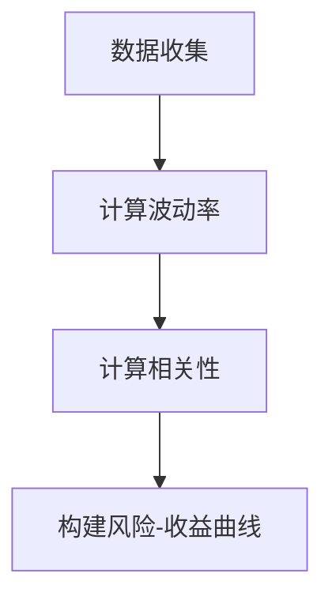

                 


# 约翰博格尔的普通投资者保护

> 关键词：投资者保护，风险管理，投资组合优化，CAPM，现代投资组合理论

> 摘要：本文深入探讨了约翰博格尔在普通投资者保护方面的贡献，重点分析了投资者保护的核心概念、算法原理、系统架构以及项目实战。通过详细讲解风险管理模型、投资组合优化算法和系统设计，为普通投资者提供实用的保护策略。

---

# 第1章: 投资者保护的核心概念

## 1.1 投资者保护的重要性

### 1.1.1 投资者保护的定义
投资者保护是指在金融市场中，通过法律、制度和风险管理手段，保护投资者的合法权益，避免因信息不对称、市场波动或其他外部因素导致的损失。

### 1.1.2 投资者保护的核心要素
投资者保护的核心要素包括：
1. **信息透明性**：确保投资者能够获得准确的投资产品信息。
2. **风险管理**：通过分散投资、设置止损等手段降低投资风险。
3. **合规性**：确保投资行为符合相关法律法规。

### 1.1.3 投资者保护的边界与外延
投资者保护的边界在于避免过度干预市场，同时确保投资者的基本权益。外延则包括从个人投资者到机构投资者的保护策略。

### 1.1.4 投资者保护的概念结构
通过ER图展示投资者保护的实体关系，包括投资者、投资产品、风险管理措施等核心要素。

```mermaid
er
   投资者
    ----|1..n| 投资产品
    投资者
    ----|1..n| 风险管理措施
    投资产品
    ----|1..n| 风险评估指标
```

---

## 1.2 投资者保护与风险管理的关系

### 1.2.1 风险管理的定义
风险管理是指通过识别、评估和应对潜在风险，以最小化其对投资目标的影响。

### 1.2.2 投资者保护与风险管理的联系
投资者保护依赖于有效的风险管理，而风险管理则是投资者保护的核心工具。

### 1.2.3 风险管理在投资者保护中的作用
1. **风险识别**：识别潜在的投资风险。
2. **风险评估**：量化风险对投资组合的影响。
3. **风险控制**：通过调整投资组合降低风险。

---

# 第2章: 投资者保护的算法原理

## 2.1 风险评估模型

### 2.1.1 风险评估的步骤
1. 收集投资产品的历史数据。
2. 计算资产的波动率和相关性。
3. 构建风险-收益曲线。



### 2.1.2 现代投资组合理论（MPT）
MPT通过优化投资组合的收益和风险比，实现风险最小化。

### 2.1.3 风险调整后的收益模型
通过CAPM计算风险调整后的收益。

---

## 2.2 投资组合优化算法

### 2.2.1 均值-方差优化
通过优化投资组合的期望收益和方差，找到最优投资组合。

### 2.2.2 资本资产定价模型（CAPM）
CAPM用于计算每个资产的预期收益，从而确定其在投资组合中的权重。

### 2.2.3 风险平价投资策略
将投资组合中的资产权重根据其风险贡献进行调整。

---

## 2.3 风险管理算法的实现

### 2.3.1 风险评估的数学模型
$$ \text{波动率} = \sqrt{\frac{1}{n-1}\sum_{i=1}^{n}(x_i - \bar{x})^2} $$

### 2.3.2 投资组合优化的数学公式
$$ \text{收益最大化} = \max_w \left( \mu^T w \right) $$
$$ \text{风险最小化} = \min_w \left( w^T \Sigma w \right) $$

---

# 第3章: 投资者保护的系统架构

## 3.1 投资管理系统功能设计

### 3.1.1 数据采集模块
负责收集市场数据和投资者信息。

### 3.1.2 风险评估模块
对投资产品进行风险评估和量化。

### 3.1.3 投资组合优化模块
根据风险评估结果，优化投资组合。

---

## 3.2 系统架构设计

### 3.2.1 分层架构设计
- **数据层**：存储市场数据和投资者信息。
- **业务逻辑层**：处理风险评估和投资组合优化。
- **用户界面层**：展示结果和交互界面。

### 3.2.2 微服务架构设计
- **数据服务**：提供数据接口。
- **风险评估服务**：提供风险评估功能。
- **投资组合优化服务**：提供投资组合优化功能。

---

## 3.3 系统接口设计

### 3.3.1 数据接口规范
定义API接口的输入和输出格式。

### 3.3.2 API接口设计
提供RESTful API接口，支持GET、POST等请求方式。

### 3.3.3 接口安全设计
使用JWT进行身份验证，确保接口安全。

---

# 第4章: 投资者保护的项目实战

## 4.1 环境安装与配置

### 4.1.1 Python环境安装
安装Python和必要的库（如Pandas、NumPy）。

### 4.1.2 数据库安装与配置
使用MySQL或MongoDB存储数据。

### 4.1.3 第三方库安装
安装Scipy、Plotly等库。

---

## 4.2 核心代码实现

### 4.2.1 数据处理代码
```python
import pandas as pd
data = pd.read_csv('market_data.csv')
```

### 4.2.2 风险评估代码
```python
def calculate_volatility(data):
    return data.std()
```

### 4.2.3 投资组合优化代码
```python
from scipy.optimize import minimize
def portfolio_optimization(data):
    n = len(data.columns)
    # 目标函数：最小化波动率
    def objective(w):
        return (w.T @ data.cov() @ w)**0.5
    # 约束条件：权重和为1
    constraints = [{'type': 'eq', 'fun': lambda w: sum(w)-1}]
    result = minimize(objective, [1/n]*n, constraints)
    return result.x
```

---

## 4.3 代码解读与分析

### 4.3.1 数据处理逻辑
对市场数据进行清洗和预处理，确保数据的准确性和完整性。

### 4.3.2 风险评估算法
通过计算波动率和相关性，评估投资产品的风险。

### 4.3.3 投资组合优化算法
通过优化模型，找到最优的投资组合。

---

## 4.4 实际案例分析

### 4.4.1 案例背景介绍
以股票和债券组合为例，分析投资组合的风险和收益。

### 4.4.2 数据分析与处理
对历史数据进行分析，计算各资产的期望收益和风险。

### 4.4.3 投资组合优化结果
通过优化模型，找到最优的资产配置比例。

---

# 第5章: 投资者保护的最佳实践

## 5.1 风险管理技巧

### 5.1.1 分散投资的重要性
通过投资不同资产类别降低风险。

### 5.1.2 定期资产配置调整
根据市场变化及时调整投资组合。

### 5.1.3 风险控制的注意事项
设置止损点，避免过度杠杆。

---

## 5.2 投资者心理与行为分析

### 5.2.1 投资者心理偏差
包括过度自信、从众心理等。

### 5.2.2 行为金融学对投资者保护的启示
理解投资者心理，制定更有效的保护措施。

### 5.2.3 心理因素对投资决策的影响
情绪化决策可能导致非理性投资行为。

---

## 5.3 投资者保护的合规性

### 5.3.1 相关法律法规
包括《证券法》《基金法》等。

### 5.3.2 合规性要求
确保投资行为符合法律法规。

### 5.3.3 合规性对投资者保护的意义
保障投资者权益，维护市场秩序。

---

# 第6章: 总结与展望

## 6.1 小结
通过本文的分析，我们了解了投资者保护的核心概念、算法原理和系统设计。

## 6.2 注意事项
投资者在实际操作中需注意风险管理，避免过度依赖单一策略。

## 6.3 拓展阅读
推荐相关书籍和文献，进一步深入学习投资者保护的知识。

---

# 结语

通过本文的详细讲解，我们希望读者能够更好地理解投资者保护的核心内容，并能够在实际投资中应用这些知识，保护自己的投资权益。

