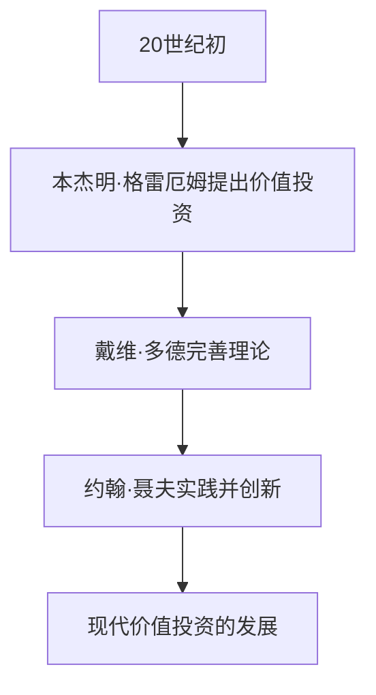
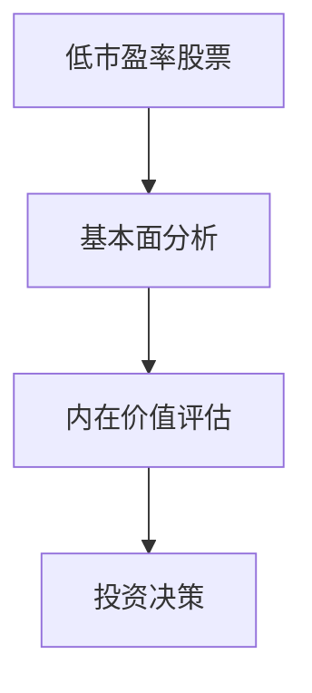
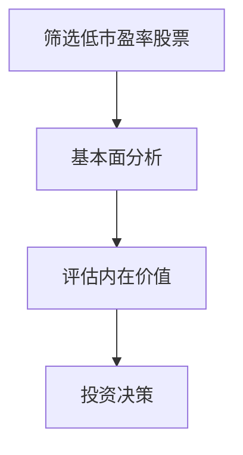
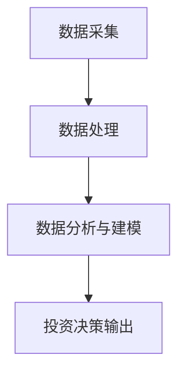
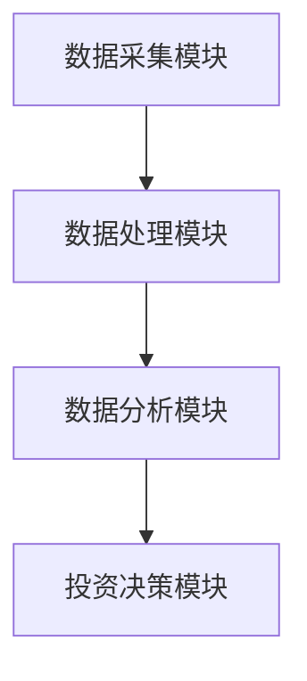
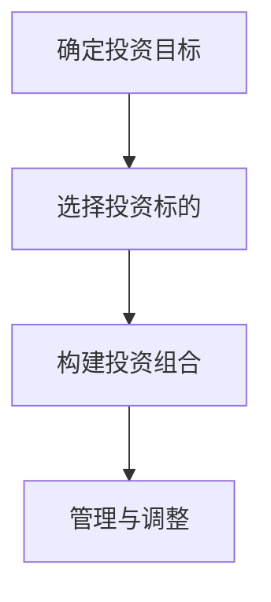
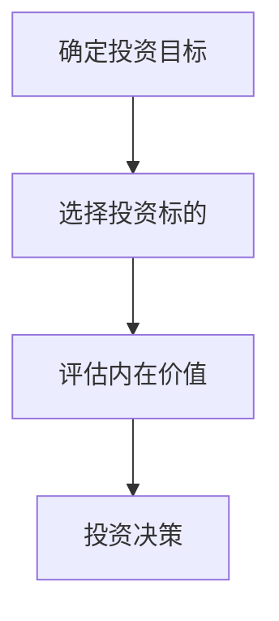

                 

# 《约翰·聂夫的价值投资实践经验》

---

## 关键词

- 价值投资  
- 约翰·聂夫  
- 投资策略  
- 市盈率模型  
- 投资组合优化  
- 股票分析  

---

## 摘要

本文系统地介绍了约翰·聂夫的价值投资实践经验，从其投资哲学、核心指标到具体的算法模型和系统架构，逐一进行了深入分析。通过结合数学模型、图表和实际案例，本文详细阐述了约翰·聂夫如何通过低市盈率策略筛选优质股票，并构建稳健的投资组合。文章还探讨了价值投资的系统实现和实战应用，为投资者提供了实用的指导和启示。

---

## 正文

### 第1章：价值投资的背景与核心理念

#### 1.1 价值投资的起源与发展

价值投资是一种以基本面分析为基础的投资策略，其核心在于寻找市场价格低于其内在价值的股票。这一理念起源于20世纪初，由本杰明·格雷厄姆和戴维·多德提出，并在后来的投资实践中不断完善。约翰·聂夫作为价值投资的践行者，将这一理念发扬光大，尤其是在低市盈率股票的投资上取得了显著成效。

##### 图1-1：价值投资的发展脉络

#### 1.2 约翰·聂夫的生平与投资哲学

约翰·聂夫（John Neff）是美国著名的投资经理人，曾管理着著名的“华盛顿投资公司”（Washington Investment Company）。他以低市盈率投资策略闻名，强调通过分析企业的财务数据，寻找那些市场价格低于其内在价值的股票。

##### 图1-2：约翰·聂夫的价值投资框架

### 第2章：价值投资的核心指标与分析框架

#### 2.1 价值投资的关键指标

价值投资的核心在于通过分析企业的财务数据，评估其内在价值。以下是几个关键指标的定义与应用：

##### 表2-1：价值投资的关键指标对比

| 指标         | 定义与应用                          |
|--------------|------------------------------------|
| 市盈率（P/E） | 用于评估股票的相对估值，低市盈率意味着股价可能被低估。 |
| 市净率（P/B） | 用于评估股票相对于其账面价值的估值，低市净率意味着股价可能被低估。 |
| 股东权益收益率（ROE） | 衡量企业盈利能力的重要指标，高ROE意味着企业盈利能力强。 |

##### 图2-1：市盈率模型的数学公式

$$ P/E = \frac{Price}{Earnings} $$

##### 图2-2：内在价值计算公式

$$ Intrinsic\ Value = \sum_{t=1}^{n} \frac{CF_t}{(1+r)^t} $$

其中：
- $CF_t$ 表示第 $t$ 年的现金流
- $r$ 表示折现率

#### 2.2 约翰·聂夫的投资筛选标准

约翰·聂夫在筛选股票时，通常关注以下几点：

##### 图2-3：约翰·聂夫的投资筛选流程

### 第3章：价值投资的数学模型与算法

#### 3.1 价值投资的核心算法

##### 图3-1：价值投资算法的数学模型

$$ \text{投资价值} = \frac{\text{内在价值}}{\text{市场价格}} $$

##### 图3-2：投资组合优化的数学模型

$$ \text{最大化 } \mu - \lambda \sigma $$

其中：
- $\mu$ 表示预期收益
- $\sigma$ 表示风险
- $\lambda$ 表示风险厌恶系数

#### 3.2 算法的实现与优化

##### 图3-3：价值投资算法的实现流程

### 第4章：价值投资的系统架构与实现

#### 4.1 投资决策系统的构建

##### 图4-1：投资决策系统的功能模块划分

##### 图4-2：投资决策系统的架构设计

#### 4.2 系统的实现细节

##### 图4-3：系统接口设计

### 第5章：价值投资的实战应用与案例分析

#### 5.1 实战策略的核心要素

##### 图5-1：投资组合构建的步骤

#### 5.2 约翰·聂夫的投资决策流程

##### 图5-2：投资决策流程图

---

## 结论

约翰·聂夫的价值投资实践为投资者提供了一种稳健的投资方法，尤其在低市盈率股票的投资上具有显著的优势。通过本文的分析，读者可以深入了解价值投资的核心理念、数学模型和系统架构，并能够在实际投资中应用这些策略。然而，投资者在实践中需要注意市场波动和企业基本面的变化，灵活调整投资策略，以实现长期稳健的投资回报。

---

## 最佳实践 Tips

1. **价值投资的核心在于基本面分析**，尤其是市盈率、市净率和股东权益收益率等关键指标。
2. **投资组合的构建需要考虑多样性和风险控制**，避免过度集中投资。
3. **持续学习和跟踪市场变化**，及时调整投资策略，以应对市场波动。

通过以上方法，投资者可以更好地践行约翰·聂夫的价值投资理念，并在实际操作中取得稳健的投资回报。

