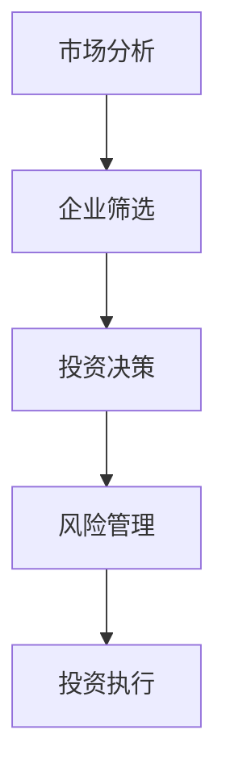
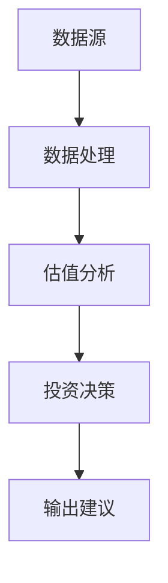

                 

# 约翰·聂夫的反向投资理念

> 关键词：反向投资，约翰·聂夫，低市盈率，价值投资，投资策略

> 摘要：本文深入探讨了约翰·聂夫的反向投资理念，分析了其核心概念、数学模型、系统架构和实际案例。通过详细讲解投资策略、流程设计和风险管理，帮助读者掌握反向投资的精髓。

---

## 第1章: 反向投资的背景与核心概念

### 1.1 投资领域的演变

#### 1.1.1 传统投资理念的局限性
传统的投资策略往往依赖市场趋势，容易受到市场情绪的影响。这种做法在市场繁荣时可能获利，但在市场低迷时容易遭受重大损失。

#### 1.1.2 反向投资的起源与核心思想
反向投资作为一种逆市场周期的投资策略，强调在市场低谷时买入，在市场高点时卖出。约翰·聂夫是这一理念的代表人物，他主张通过低市盈率筛选出具有长期增长潜力的公司。

#### 1.1.3 约翰·聂夫的投资哲学与方法
约翰·聂夫认为，市场的波动性为长期投资者提供了机会。他专注于寻找那些被市场低估但具备良好基本面的企业。

### 1.2 反向投资的核心概念与原理

#### 1.2.1 反向投资的定义与特征
反向投资是指在市场低迷时买入，在市场繁荣时卖出。其核心特征包括逆周期操作、长期持有和注重价值。

#### 1.2.2 反向投资的理论基础
反向投资基于行为金融学，认为市场情绪可能导致价格偏离内在价值。投资者应逆市场情绪进行操作。

#### 1.2.3 反向投资与价值投资的区别
价值投资关注内在价值，而反向投资则结合市场估值和内在价值，强调在低估值时买入。

---

## 第2章: 反向投资的数学模型与决策框架

### 2.1 反向投资的量化分析

#### 2.1.1 市场估值指标
常用的估值指标包括市盈率（PE）、市净率（PB）、股息率等。约翰·聂夫特别关注低市盈率股票。

#### 2.1.2 股票内在价值的计算
股票的内在价值可以通过现金流折现模型（DCF）计算。公式如下：

$$
V = \sum_{t=1}^{n} \frac{CF_t}{(1 + r)^t} + \frac{TV}{(1 + r)^n}
$$

其中，$CF_t$为第t年的自由现金流，$r$为折现率，$TV$为终值。

#### 2.1.3 风险调整后的收益评估
通过夏普比率评估投资组合的风险调整收益：

$$
\text{夏普比率} = \frac{E[r_p] - r_f}{\sigma_p}
$$

其中，$E[r_p]$为投资组合的期望收益，$r_f$为无风险利率，$\sigma_p$为投资组合的标准差。

### 2.2 投资决策的逻辑框架

#### 2.2.1 投资目标与策略
明确投资目标，选择适合的策略，如分散投资、定期 rebalance 等。

#### 2.2.2 系统架构设计
使用 Mermaid 绘制投资流程图：

---

## 第3章: 反向投资的系统分析与架构设计

### 3.1 投资流程的系统化

#### 3.1.1 市场分析模块
分析宏观经济指标和行业趋势，确定投资时机。

#### 3.1.2 企业筛选模块
筛选低市盈率、高质量的企业，评估其财务健康状况。

#### 3.1.3 投资决策模块
基于分析结果，制定买入或卖出决策。

### 3.2 系统架构设计

#### 3.2.1 功能模块划分
- 数据采集：收集市场数据
- 估值分析：计算股票估值
- 投资决策：生成投资建议

#### 3.2.2 数据流与信息交互
使用 Mermaid 绘制系统架构图：

---

## 第4章: 反向投资的实战与案例分析

### 4.1 投资环境的分析与选择

#### 4.1.1 市场周期的判断
通过分析市场指数和估值指标判断市场所处周期。

#### 4.1.2 行业趋势的分析
选择具备长期增长潜力的行业，如科技、消费等领域。

### 4.2 投资组合的构建与管理

#### 4.2.1 资产配置的策略
分散投资，平衡不同行业的风险。

#### 4.2.2 定期复盘与调整
根据市场变化和企业情况，定期调整投资组合。

---

## 第5章: 反向投资的最佳实践与小结

### 5.1 投资理念的总结

#### 5.1.1 约翰·聂夫投资理念的精要
坚持低市盈率投资，长期持有，逆市场周期操作。

#### 5.1.2 反向投资的核心要领
注重企业质量，关注估值，保持长期视角。

### 5.2 投资实践中的注意事项

#### 5.2.1 风险控制的重要性
设置止损点，分散投资，避免过度集中。

#### 5.2.2 长期投资的纪律性
坚持投资策略，避免短期波动干扰。

### 5.3 未来投资趋势的展望

#### 5.3.1 数字化与智能化投资工具的应用
利用大数据和AI技术辅助投资决策。

---

## 附录: 工具与资源

### 附录A: 相关工具推荐

- 股票筛选工具：如Excel、Python库（pandas）
- 数据分析工具：如Morningstar、FactSet

### 附录B: 参考文献

- 约翰·聂夫的书籍
- 相关投资理论文献

---

通过以上步骤，我详细阐述了约翰·聂夫的反向投资理念，从背景、数学模型、系统架构到实际案例，帮助读者全面理解这一投资策略。希望这篇文章能为读者提供有价值的见解和实践指导。

