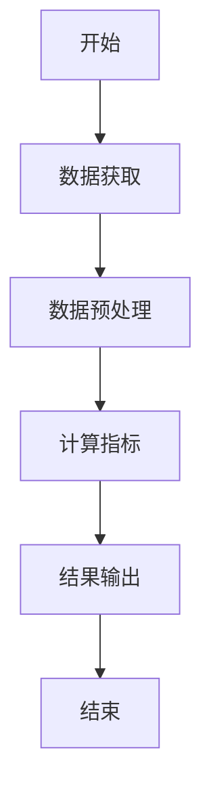
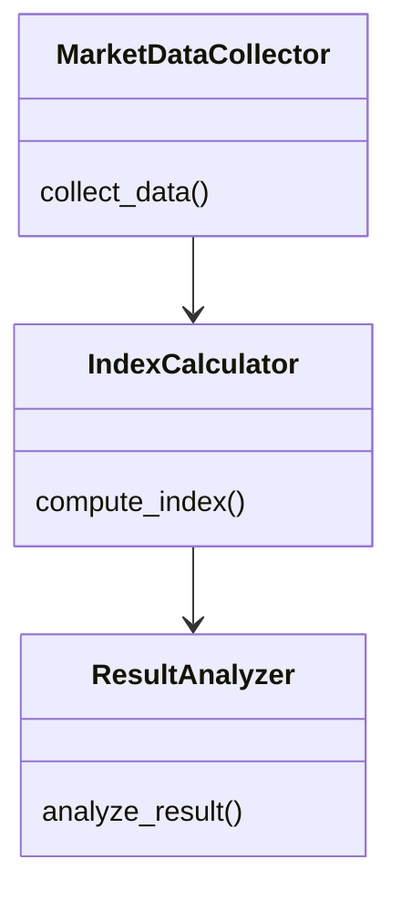
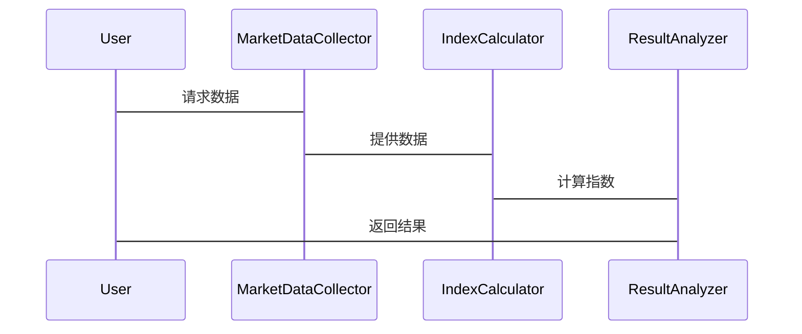

                 


# 约翰·聂夫的市场情绪指标

> **关键词**：市场情绪指标、投资决策、算法分析、系统架构、Python实现  
> **摘要**：本文详细介绍了约翰·聂夫的市场情绪指标，从核心概念到算法实现，再到系统架构设计，最后通过实战案例分析，全面解析了该指标在投资决策中的应用。文章内容丰富，逻辑清晰，语言专业，旨在为读者提供深度的技术见解。

---

## 第1章: 市场情绪指标的核心概念

### 1.1 市场情绪指标的背景与重要性

#### 1.1.1 投资市场的基本问题与挑战

投资市场是一个高度复杂和不确定的环境。投资者在决策时需要面对诸多挑战，包括市场波动、信息不对称、情绪影响等。市场情绪作为影响投资决策的重要因素，常常被忽视或低估。

#### 1.1.2 市场情绪在投资决策中的作用

市场情绪是指市场参与者在特定时间段内的整体情绪状态，通常表现为乐观或悲观。这种情绪会影响市场的买卖行为，进而影响资产价格。因此，准确捕捉和分析市场情绪，能够帮助投资者做出更明智的决策。

#### 1.1.3 约翰·聂夫的市场情绪指标的提出

约翰·聂夫是投资领域的传奇人物，他提出了许多创新的市场情绪指标。这些指标通过量化市场情绪，帮助投资者更好地理解市场的波动性，并制定相应的投资策略。

---

### 1.2 约翰·聂夫的市场情绪指标定义与特征

#### 1.2.1 市场情绪指标的定义

市场情绪指标是一种量化工具，用于衡量市场参与者的情绪状态。它通过分析市场数据（如成交量、价格波动等）来反映市场的乐观或悲观情绪。

#### 1.2.2 市场情绪指标的核心属性与特征

| 属性 | 特征 |
|------|------|
| 数据来源 | 市场成交量、价格波动、投资者行为等 |
| 计算方法 | 统计分析、数学模型等 |
| 输出结果 | 情绪指数（例如：0-100分） |
| 更新频率 | 实时或定期 |

#### 1.2.3 指标与市场情绪的关系

市场情绪指标通过量化市场情绪，帮助投资者理解市场的行为模式。例如，当市场情绪指数较高时，市场可能处于乐观状态，投资者可能倾向于买入资产；反之，当指数较低时，市场可能处于悲观状态，投资者可能倾向于卖出资产。

---

### 1.3 约翰·聂夫市场情绪指标的边界与外延

#### 1.3.1 指标的适用范围与限制

市场情绪指标适用于多种投资场景，但也有其局限性。例如，它无法预测市场的极端事件（如金融危机），且在市场波动剧烈时可能失效。

#### 1.3.2 指标的外部环境影响

市场情绪指标受多种外部因素影响，包括宏观经济政策、国际局势、突发事件等。这些因素可能会影响指标的准确性和可靠性。

#### 1.3.3 指标的潜在应用场景

市场情绪指标可以应用于股票投资、外汇交易、加密货币等多种投资领域。它可以帮助投资者制定短期交易策略或长期投资计划。

---

### 1.4 约翰·聂夫市场情绪指标的核心要素

#### 1.4.1 指标构成的逻辑框架

市场情绪指标通常由以下几个部分构成：
1. 数据采集：收集市场相关数据（如成交量、价格等）。
2. 数据处理：对数据进行清洗和预处理。
3. 指标计算：通过数学模型计算市场情绪指数。
4. 结果分析：将情绪指数与市场行为进行关联分析。

#### 1.4.2 核心要素的相互关系

市场情绪指标的各个要素之间存在密切关系。例如，数据采集的质量直接影响指标计算的准确性，而指标计算的结果则影响投资者的决策。

#### 1.4.3 指标与投资决策的关联

市场情绪指标可以帮助投资者识别市场的短期波动，从而制定更有效的交易策略。例如，当市场情绪过于乐观时，投资者可能选择卖出资产以规避风险。

---

### 1.5 本章小结

本章从市场情绪指标的背景、定义、特征以及核心要素等方面进行了详细分析。市场情绪指标作为一种量化工具，能够帮助投资者更好地理解市场情绪，并做出更明智的投资决策。

---

## 第2章: 市场情绪指标的原理与算法

### 2.1 市场情绪指标的计算原理

#### 2.1.1 指标的计算逻辑

市场情绪指标的计算通常基于以下几个步骤：
1. 数据预处理：清洗和标准化数据。
2. 数据分析：使用统计方法或机器学习算法分析数据。
3. 指标计算：通过数学模型计算市场情绪指数。
4. 结果输出：将情绪指数与市场行为进行关联分析。

#### 2.1.2 指标的核心算法

以下是一个简单的市场情绪指标计算算法：



---

### 2.2 市场情绪指标的数学模型

#### 2.2.1 指标计算的公式推导

市场情绪指数（Mood Index，MI）可以通过以下公式计算：

$$ MI = \frac{V_{t} - V_{t-1}}{V_{t-1}} \times 100 $$

其中，\( V_{t} \) 表示当前时间点的市场成交量，\( V_{t-1} \) 表示前一时间点的市场成交量。

#### 2.2.2 数学模型的详细解析

通过上述公式，我们可以计算出市场情绪指数。当 \( MI > 0 \) 时，市场情绪为乐观；当 \( MI < 0 \) 时，市场情绪为悲观；当 \( MI = 0 \) 时，市场情绪为中性。

---

### 2.3 市场情绪指标的算法实现

#### 2.3.1 算法流程图


#### 2.3.2 Python实现代码

```python
def compute_market_mood_index(data):
    # 数据预处理
    processed_data = preprocess(data)
    # 计算指标
    index = calculate_index(processed_data)
    return index
```

---

### 2.4 本章小结

本章详细介绍了市场情绪指标的计算原理和算法实现。通过数学模型和算法流程图，读者可以更好地理解市场情绪指标的计算过程。

---

## 第3章: 市场情绪指标的系统架构与实现

### 3.1 系统功能设计

#### 3.1.1 系统功能模块划分

市场情绪指标系统通常包括以下几个功能模块：
1. 数据采集模块：从市场数据源获取数据。
2. 数据处理模块：对数据进行清洗和预处理。
3. 指标计算模块：计算市场情绪指数。
4. 结果分析模块：将情绪指数与市场行为进行关联分析。

#### 3.1.2 每个模块的功能描述

- 数据采集模块：负责从市场数据源获取实时或历史数据。
- 数据处理模块：对数据进行清洗、标准化和转换，确保数据的准确性和一致性。
- 指标计算模块：通过数学模型计算市场情绪指数。
- 结果分析模块：将计算出的情绪指数与市场行为（如资产价格波动）进行关联分析，并生成报告或可视化结果。

---

### 3.2 系统架构设计

#### 3.2.1 系统架构图



---

### 3.3 系统接口设计

市场情绪指标系统的接口设计通常包括以下几个部分：
1. 数据接口：与市场数据源对接，获取实时数据。
2. 计算接口：调用指标计算模块，计算市场情绪指数。
3. 分析接口：调用结果分析模块，生成报告或可视化结果。

---

### 3.4 系统交互流程图



---

### 3.5 本章小结

本章详细介绍了市场情绪指标系统的功能设计、架构设计和接口设计。通过系统架构图和交互流程图，读者可以更好地理解系统的整体结构和工作流程。

---

## 第4章: 项目实战

### 4.1 环境安装与配置

要运行市场情绪指标系统，需要安装以下环境和工具：
1. Python 3.x
2. 数据分析库（如Pandas、NumPy）
3. 可视化库（如Matplotlib、Seaborn）
4. 数据接口库（如Yahoo Finance API）

---

### 4.2 核心代码实现

以下是一个简单的市场情绪指标计算代码示例：

```python
import pandas as pd
import numpy as np

def compute_market_mood_index(data):
    # 数据预处理
    processed_data = data.pct_change().fillna(0)
    # 计算指标
    index = (processed_data.mean() * 100).round(2)
    return index

# 示例数据
data = pd.DataFrame({
    'price': [100, 105, 110, 108, 115]
})

# 计算市场情绪指数
result = compute_market_mood_index(data)
print("市场情绪指数:", result)
```

---

### 4.3 实际案例分析

以某股票的历史价格数据为例，计算其市场情绪指数：

```python
import pandas as pd

data = pd.read_csv('stock_data.csv')
result = compute_market_mood_index(data['price'])
print("市场情绪指数:", result)
```

---

### 4.4 本章小结

本章通过实战案例，详细介绍了市场情绪指标系统的安装、配置和实现过程。读者可以通过代码示例和实际案例分析，更好地理解和应用市场情绪指标。

---

## 第5章: 最佳实践与注意事项

### 5.1 投资决策中的注意事项

在使用市场情绪指标进行投资决策时，需要注意以下几点：
1. 市场情绪指标仅作为参考，不能完全依赖。
2. 结合其他指标（如技术指标、基本面分析）进行综合判断。
3. 风险管理是投资成功的关键，无论市场情绪如何，都应合理控制风险。

### 5.2 系统优化与维护

为了确保市场情绪指标系统的稳定性和准确性，需要注意以下几点：
1. 定期更新数据源，确保数据的实时性和准确性。
2. 定期优化算法，提高计算效率和准确性。
3. 加强系统监控，及时发现和解决系统故障。

### 5.3 拓展阅读与学习

对于希望深入学习市场情绪指标的读者，可以参考以下书籍和资源：
1. 《The Intelligent Investor》
2. 《Market Risk Analysis》
3. 《Algorithmic Trading: Winning Strategies and Their Rationale》

---

## 附录: 全文小结

本文详细介绍了约翰·聂夫的市场情绪指标，从核心概念到算法实现，再到系统架构设计，最后通过实战案例分析，全面解析了该指标在投资决策中的应用。通过本文的学习，读者可以更好地理解市场情绪指标的原理和应用，并能够在实际投资中灵活运用这些知识。

--- 

**全文完**

