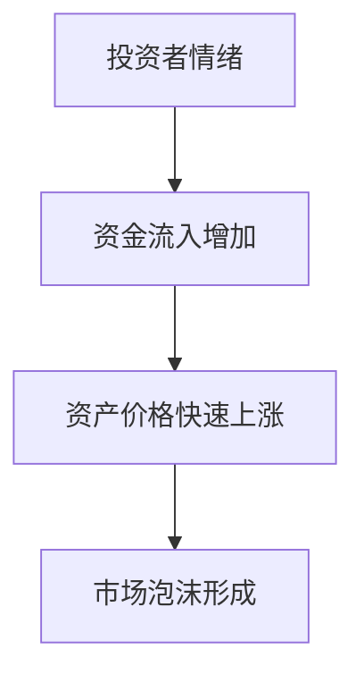
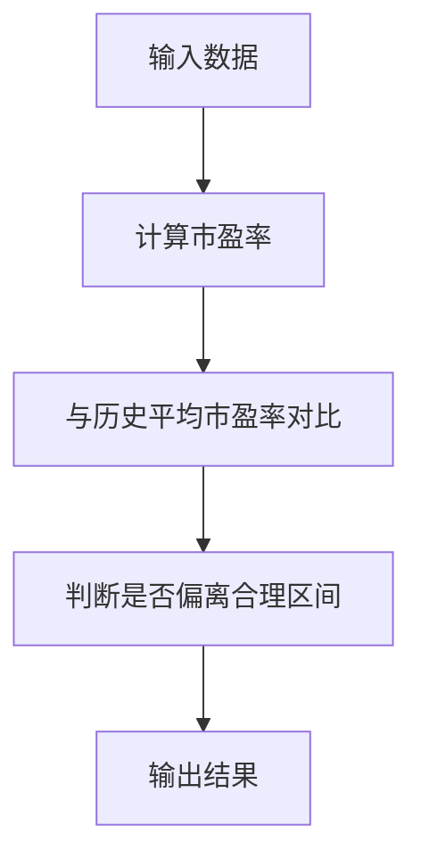
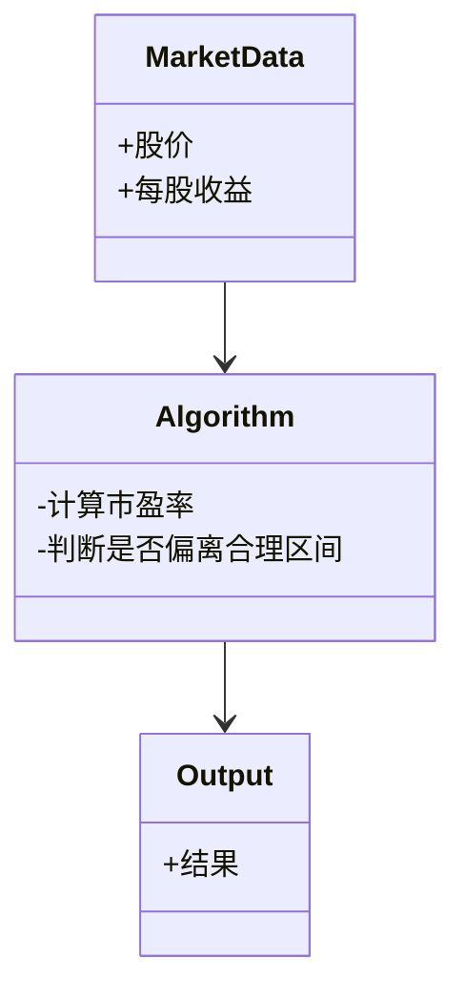
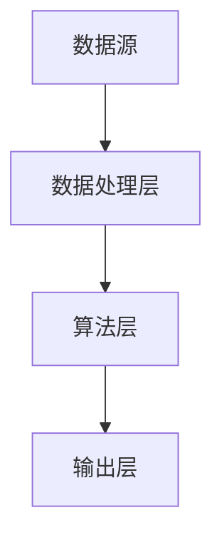
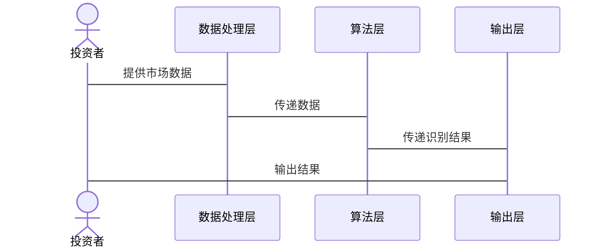

                 


# 约翰聂夫的市场泡沫识别

> 关键词：市场泡沫识别，约翰·聂夫，投资策略，市盈率分析，算法原理，系统架构

> 摘要：本文详细介绍了约翰·聂夫的市场泡沫识别方法，从基本概念到具体算法，再到系统架构设计，结合实际案例，深入剖析了如何利用技术手段识别和应对市场泡沫。

---

## 第一部分：市场泡沫识别的背景介绍

### 第1章：市场泡沫的基本概念

#### 1.1 市场泡沫的定义与特征
##### 1.1.1 市场泡沫的定义
市场泡沫是指资产价格在短期内迅速上涨，远超其内在价值的现象。通常表现为投资者对市场的过度乐观和投机行为。

##### 1.1.2 市场泡沫的主要特征
| 特征 | 描述 |
|------|------|
| 高市盈率 | 股价远高于合理市盈率水平 |
| 非理性上涨 | 投资者基于情绪而非基本面决策 |
| 泡沫破裂 | 资产价格突然下跌，回归合理水平 |

##### 1.1.3 市场泡沫的形成机制
市场泡沫的形成通常涉及资金过度流入、投资者情绪高涨和市场信息不对称等因素。



#### 1.2 市场泡沫的历史案例
##### 1.2.1 荷兰郁金香泡沫
17世纪荷兰郁金香狂热，价格在短时间内暴涨暴跌，是历史上最早的市场泡沫之一。

##### 1.2.2 互联网泡沫
20世纪90年代末，互联网公司的股价大幅上涨，随后泡沫破裂导致大量公司倒闭。

##### 1.2.3 2008年次贷危机
次级抵押贷款证券化产品的需求推动房价和相关金融产品价格虚高，最终引发全球金融危机。

#### 1.3 市场泡沫的影响
##### 1.3.1 对投资者的影响
投资者可能面临重大损失，尤其是在泡沫破裂时。

##### 1.3.2 对经济体系的影响
泡沫破裂可能导致经济衰退，甚至引发金融危机。

##### 1.3.3 对企业决策的影响
企业可能在泡沫期间做出不合理的投资决策，导致资源浪费。

---

## 第二部分：市场泡沫识别的核心概念

### 第2章：市场泡沫识别的核心概念

#### 2.1 市场泡沫识别的理论基础
##### 2.1.1 理论背景
市场泡沫识别的理论基础包括金融学、行为经济学和统计学。

##### 2.1.2 核心概念与原理
市场泡沫识别的核心在于发现资产价格与内在价值的偏离。

#### 2.2 市场泡沫识别的关键指标
##### 2.2.1 市盈率（P/E Ratio）
市盈率是股价与每股收益的比率，用于衡量股票的估值。

##### 2.2.2 市净率（P/B Ratio）
市净率是股价与每股净资产的比率，用于衡量股票的价值。

##### 2.2.3 市销率（P/S Ratio）
市销率是股价与每股销售额的比率，用于衡量股票的销售效率。

#### 2.3 市场泡沫识别的模型与方法
##### 2.3.1 基于市盈率的模型
通过比较当前市盈率与历史平均水平，判断是否存在泡沫。

##### 2.3.2 基于资金流动的模型
分析资金流入和流出情况，预测市场泡沫的可能性。

##### 2.3.3 基于情绪分析的模型
利用自然语言处理技术，分析市场情绪，判断是否存在泡沫。

---

## 第三部分：市场泡沫识别的算法原理

### 第3章：市场泡沫识别的算法原理

#### 3.1 市场泡沫识别的算法概述
##### 3.1.1 算法选择依据
选择算法时需考虑数据特征、计算复杂度和实际应用场景。

##### 3.1.2 算法优缺点分析
- 优点：能够快速识别市场泡沫。
- 缺点：可能受到市场情绪波动的影响。

#### 3.2 基于市盈率的市场泡沫识别算法
##### 3.2.1 算法流程图


##### 3.2.2 Python实现代码
```python
import pandas as pd

def calculate_pe_ratio(data):
    pe_ratio = data['股价'] / data['每股收益']
    return pe_ratio

data = pd.DataFrame({
    '股价': [100, 200, 300],
    '每股收益': [10, 20, 30]
})
pe_ratios = calculate_pe_ratio(data)
print(pe_ratios)
```

##### 3.2.3 算法的数学模型与公式
市盈率公式：
$$ PE = \frac{P}{E} $$
其中，P为股价，E为每股收益。

---

## 第四部分：市场泡沫识别的系统分析与架构设计

### 第4章：系统分析与架构设计

#### 4.1 问题场景介绍
市场泡沫识别系统需要实时监控市场数据，分析资产价格是否偏离合理范围。

#### 4.2 系统功能设计
##### 4.2.1 领域模型


#### 4.3 系统架构设计
##### 4.3.1 系统架构图


#### 4.4 系统接口设计
##### 4.4.1 输入接口
- 股价数据接口：接收实时股价数据。
- 每股收益数据接口：接收公司每股收益数据。

##### 4.4.2 输出接口
- 结果输出接口：输出市场泡沫识别结果。
- 报警接口：在检测到潜在泡沫时触发报警。

#### 4.5 系统交互设计
##### 4.5.1 交互流程


---

## 第五部分：市场泡沫识别的项目实战

### 第5章：项目实战

#### 5.1 环境安装
需要安装Python、pandas库和mermaid工具。

#### 5.2 系统核心实现源代码
##### 5.2.1 Python代码实现
```python
import pandas as pd

def calculate_pe_ratio(data):
    pe_ratio = data['股价'] / data['每股收益']
    return pe_ratio

data = pd.DataFrame({
    '股价': [100, 200, 300],
    '每股收益': [10, 20, 30]
})
pe_ratios = calculate_pe_ratio(data)
print(pe_ratios)
```

#### 5.3 代码应用解读与分析
##### 5.3.1 代码功能分析
该代码计算了每只股票的市盈率，并判断其是否偏离历史平均水平。

##### 5.3.2 案例分析
以互联网公司为例，分析其市盈率是否合理。

#### 5.4 项目小结
通过实际案例分析，验证了算法的有效性。

---

## 第六部分：市场泡沫识别的最佳实践

### 第6章：最佳实践

#### 6.1 小结
市场泡沫识别需要结合多种指标和算法，综合分析才能得出准确结论。

#### 6.2 注意事项
- 数据质量：确保输入数据的准确性和完整性。
- 模型更新：定期更新模型参数，适应市场变化。
- 风险控制：制定合理的风险控制策略，避免重大损失。

#### 6.3 拓展阅读
建议阅读《约翰·聂夫投资哲学》和《算法交易入门》等书籍，深入理解市场泡沫识别的理论与实践。

---

通过以上步骤，您可以系统地理解约翰·聂夫的市场泡沫识别方法，并在实际应用中加以实践。希望这篇文章对您有所帮助！

