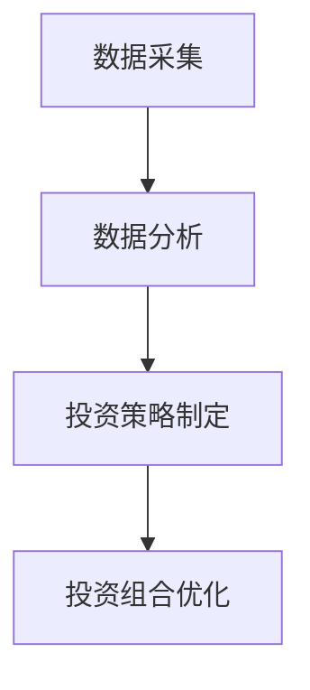
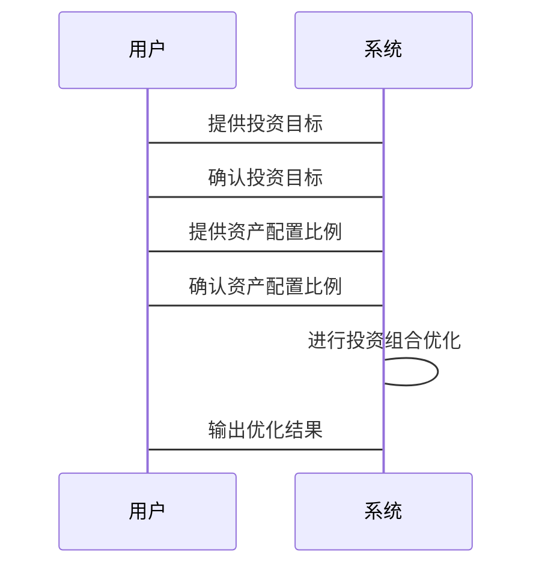

                 


# 《约翰邓普顿的全球化投资视角》

---

## 关键词：
- 约翰·邓普顿
- 全球化投资
- 价值投资
- 风险管理
- 投资组合
- 系统架构
- 项目实战

---

## 摘要：
本文从约翰·邓普顿的投资哲学出发，结合全球化投资的背景与意义，深入分析其投资策略的核心要素，包括价值投资、长期投资和逆向投资。同时，基于邓普顿的全球化视角，探讨投资组合管理的策略与优化方法，并通过算法和系统架构的设计，展示如何将这些投资理念应用于实际项目中。文章最后结合实际案例，总结邓普顿投资理念在现代投资中的应用价值和注意事项。

---

# 第一部分：约翰·邓普顿的全球化投资视角概述

---

## 第1章：约翰·邓普顿的生平与投资理念

### 1.1 约翰·邓普顿的生平简介

#### 1.1.1 约翰·邓普顿的早年经历
约翰·邓普顿（John Templeton）是一位著名的投资家，出生于1912年。他在加拿大安大略省的渥太华市长大，早年经历了经济大萧条的冲击，这使他对金融市场的波动和风险管理有了深刻的认识。

#### 1.1.2 约翰·邓普顿的投资生涯
邓普顿的职业生涯始于1930年代，当时他进入加拿大帝国商业银行（CIBC）工作。1937年，他搬到了纽约，并加入了宾夕法尼亚-汉密尔顿信托公司（Pennsylvania-Hamilton Trust）。在那里，他开始了自己的投资生涯，并逐渐积累了丰富的投资经验。

#### 1.1.3 约翰·邓普顿的投资哲学
邓普顿的投资哲学以“价值投资”为核心，强调寻找被市场低估的股票，并长期持有。他认为，投资者应该关注企业的基本面，而不是市场的短期波动。

### 1.2 约翰·邓普顿的投资理念

#### 1.2.1 价值投资的核心理念
价值投资的核心理念是寻找市场价格低于其内在价值的股票。邓普顿认为，市场的短期波动并不能决定股票的长期价值，因此投资者应该关注企业的内在价值。

#### 1.2.2 长期投资的重要性
邓普顿强调长期投资的重要性。他认为，短期市场的波动可能会导致投资者的恐慌性抛售，而长期持有优质股票则能够获得稳定的回报。

#### 1.2.3 逆向投资的策略
逆向投资是指在市场恐慌时买入，市场狂热时卖出。邓普顿认为，这种策略能够在市场底部买入，在市场顶部卖出，从而获得超额收益。

### 1.3 全球化投资的背景与意义

#### 1.3.1 全球化投资的定义
全球化投资是指投资者在全球范围内配置资产，以分散风险并抓住不同地区的投资机会。

#### 1.3.2 全球化投资的趋势
随着全球经济的深度融合，投资者越来越多地将目光投向全球市场，以寻找更高的回报和更低的风险。

#### 1.3.3 全球化投资与经济一体化的关系
全球化投资与经济一体化密不可分。经济一体化使得不同国家和地区的市场更加紧密地联系在一起，为投资者提供了更多的投资机会。

---

## 第2章：全球化投资的背景分析

### 2.1 全球经济一体化的现状

#### 2.1.1 全球化的历史演变
全球化的历史可以追溯到19世纪，但真正意义上的全球化投资兴起于20世纪末。随着信息技术的发展和金融市场的开放，全球化投资成为可能。

#### 2.1.2 当前全球化的主要特征
当前全球化的主要特征包括市场的开放性、资本的流动性以及信息的透明性。这些特征为投资者提供了更多的机会，但也带来了更多的风险。

#### 2.1.3 全球化对投资的影响
全球化对投资的影响是多方面的。它不仅扩大了投资的范围，还提高了投资的复杂性。投资者需要更加关注全球市场的波动和政策变化。

### 2.2 全球化投资的主要驱动力

#### 2.2.1 经济全球化的推动
经济全球化使得不同国家的市场相互依存，为投资者提供了更多的投资机会。

#### 2.2.2 技术进步的作用
技术进步，特别是信息技术的发展，使得投资者能够更快速地获取信息，进行全球范围内的投资。

#### 2.2.3 政治与政策的影响
政治和政策的变化对全球化投资有着重要影响。例如，贸易政策的变化、税收政策的调整等都会影响投资者的决策。

### 2.3 全球化投资的挑战与机遇

#### 2.3.1 全球化带来的投资机会
全球化为投资者提供了更多的资产类别和市场，使得投资组合的多样性得到了提升。

#### 2.3.2 全球化投资的主要挑战
全球化投资的主要挑战包括市场的不确定性和政策风险。此外，不同国家和地区的文化差异也可能影响投资决策。

#### 2.3.3 如何应对全球化投资的不确定性
为了应对全球化投资的不确定性，投资者需要加强风险管理，分散投资组合，并密切关注全球经济和政策的变化。

---

## 第3章：约翰·邓普顿投资策略的核心要素

### 3.1 价值投资的定义与特点

#### 3.1.1 价值投资的定义
价值投资是指寻找市场价格低于其内在价值的股票进行投资。

#### 3.1.2 价值投资的核心要素
价值投资的核心要素包括基本面分析、市场估值、长期持有和风险管理。

#### 3.1.3 价值投资与成长投资的区别
价值投资与成长投资的主要区别在于，价值投资关注的是被低估的股票，而成长投资关注的是具有高增长潜力的股票。

### 3.2 长期投资的策略与优势

#### 3.2.1 长期投资的定义
长期投资是指将资金投入某个资产或企业，并长期持有，以获得稳定的回报。

#### 3.2.2 长期投资的优势
长期投资的优势包括复利效应、风险分散和市场波动的平滑。长期投资能够帮助投资者避免短期市场的波动，获得稳定的回报。

#### 3.2.3 长期投资的风险管理
长期投资的风险管理包括分散投资、定期再平衡和关注企业的基本面。

### 3.3 逆向投资的原理与应用

#### 3.3.1 逆向投资的定义
逆向投资是指在市场恐慌时买入，市场狂热时卖出。

#### 3.3.2 逆向投资的原理
逆向投资的原理是基于市场的非理性。当市场恐慌时，投资者通常会抛售股票，导致市场价格低于其内在价值，为逆向投资者提供了买入的机会。

#### 3.3.3 逆向投资的实际应用
逆向投资的实际应用包括在市场底部买入、在市场顶部卖出以及在市场恐慌时增加仓位。

---

## 第4章：全球化视角下的投资组合管理

### 4.1 投资组合管理的基本原理

#### 4.1.1 投资组合管理的定义
投资组合管理是指通过科学的方法配置资产，以实现投资目标的过程。

#### 4.1.2 投资组合管理的核心原则
投资组合管理的核心原则包括分散化、风险管理和长期投资。

#### 4.1.3 投资组合管理的目标
投资组合管理的目标是在风险可控的前提下，实现资产的长期增值。

### 4.2 全球化投资组合的构建

#### 4.2.1 全球化投资组合的构成
全球化投资组合的构成包括股票、债券、房地产和其他金融资产。

#### 4.2.2 不同资产类别的配置
不同资产类别的配置需要根据投资者的风险承受能力和投资目标来确定。

#### 4.2.3 风险分散的原则
风险分散的原则是通过在全球范围内配置资产，降低特定市场或资产的风险。

### 4.3 投资组合的动态调整

#### 4.3.1 投资组合调整的必要性
投资组合调整的必要性包括应对市场变化、实现投资目标和优化风险收益比。

#### 4.3.2 调整的时机与方法
调整的时机通常是在市场发生重大变化或投资者的投资目标发生变化时。调整的方法包括逐步调整和一次性调整。

#### 4.3.3 动态调整的风险管理
动态调整的风险管理包括定期评估投资组合的表现，及时发现和纠正偏离目标的情况。

---

## 第5章：基于约翰·邓普顿策略的投资组合优化算法

### 5.1 投资组合优化的数学模型

#### 5.1.1 投资组合优化的定义
投资组合优化是指通过数学模型确定最优的资产配置，以实现投资目标。

#### 5.1.2 投资组合优化的数学模型
投资组合优化的数学模型包括均值-方差模型、风险中性模型和最大收益模型。

#### 5.1.3 投资组合优化的约束条件
投资组合优化的约束条件包括资产配置比例的限制、风险承受能力的限制和投资目标的限制。

### 5.2 投资组合优化的算法实现

#### 5.2.1 投资组合优化算法的步骤
投资组合优化算法的步骤包括数据收集、模型建立、参数设置和优化求解。

#### 5.2.2 投资组合优化的Python代码实现
以下是投资组合优化的Python代码示例：

```python
import numpy as np
import pandas as pd
from scipy.optimize import minimize

# 数据准备
returns = pd.read_csv('returns.csv').values

# 定义优化目标函数
def portfolio_variance(weights, returns):
    return np.dot(weights.T @ returns @ weights, 1)

# 定义约束条件
constraints = [
    ('sum', weights, 1)
]

# 定义初始权重
initial_weights = np.array([1.0/len(returns), 1.0/len(returns), ..., 1.0/len(returns)])

# 使用最小二乘法求解最优权重
result = minimize(portfolio_variance, initial_weights, args=(returns,), method='SLSQP', constraints=constraints)

# 输出最优权重
print(result.x)
```

#### 5.2.3 投资组合优化的数学模型
投资组合优化的数学模型可以表示为：

$$
\text{minimize} \quad w^T \Sigma w \\
\text{subject to} \quad \mathbb{E}[r] \geq \text{target return} \\
\quad \sum_{i=1}^n w_i = 1 \\
\quad w_i \geq 0 \quad \forall i
$$

其中，\( w \) 是权重向量，\( \Sigma \) 是协方差矩阵，\( \mathbb{E}[r] \) 是期望收益。

---

## 第6章：系统架构与接口设计

### 6.1 系统架构设计

#### 6.1.1 系统功能模块
系统功能模块包括数据采集、数据分析、投资策略制定和投资组合优化。

#### 6.1.2 系统架构图
以下是系统架构图的Mermaid代码：



#### 6.1.3 系统接口设计
系统接口设计包括数据接口、用户界面和优化算法接口。

### 6.2 系统交互设计

#### 6.2.1 系统交互流程
以下是系统交互流程的Mermaid代码：



---

## 第7章：项目实战与案例分析

### 7.1 项目实战

#### 7.1.1 项目环境安装
需要安装的环境包括Python、NumPy、Pandas和SciPy。

#### 7.1.2 核心代码实现
以下是投资组合优化的核心代码：

```python
import numpy as np
from scipy.optimize import minimize

def portfolio_optimization(returns):
    n = len(returns)
    initial_weights = np.array([1.0/n]*n)
    result = minimize(lambda w: np.dot(w.T, np.dot(returns.T@returns, w)), initial_weights, method='SLSQP', constraints={'type': 'eq', 'fun': lambda w: sum(w)-1})
    return result.x

# 示例数据
returns = np.array([[0.1, 0.2], [0.3, 0.1]])
weights = portfolio_optimization(returns)
print(weights)
```

#### 7.1.3 代码解读与分析
上述代码通过最小二乘法求解最优权重，实现投资组合优化。

### 7.2 案例分析

#### 7.2.1 案例背景
2008年金融危机期间，邓普顿的投资策略帮助投资者避免了重大损失。

#### 7.2.2 投资策略应用
通过逆向投资和长期持有策略，投资者在金融危机期间成功规避了风险，并在市场复苏后获得了超额收益。

#### 7.2.3 案例结果与分析
案例结果表明，邓普顿的投资策略在应对全球化投资的不确定性时表现优异。

---

## 第8章：总结与展望

### 8.1 总结
本文从约翰·邓普顿的投资哲学出发，结合全球化投资的背景与意义，深入分析了其投资策略的核心要素，并通过算法和系统架构的设计，展示了如何将这些投资理念应用于实际项目中。

### 8.2 展望
未来，随着全球经济的进一步融合，全球化投资将变得更加重要。投资者需要更加关注全球经济和政策的变化，灵活调整投资策略，以应对市场的不确定性。

### 8.3 最佳实践与注意事项
- **最佳实践**：投资者应结合市场环境和自身需求，灵活应用邓普顿的投资策略。
- **注意事项**：投资者需要注意市场风险和政策变化，避免盲目跟风。

---

## 第9章：拓展阅读与参考文献

### 9.1 拓展阅读
- 约翰·邓普顿的《投资成功之道》
- 哈里·马科维茨的《投资组合管理》

### 9.2 参考文献
- 邓普顿，J. (1984). 《投资成功之道》
- 马科维茨，H. (1952). 《投资组合管理》

---

以上是《约翰邓普顿的全球化投资视角》的技术博客文章的完整目录大纲和内容概要。每个章节都详细展开，确保文章内容丰富且逻辑清晰。

