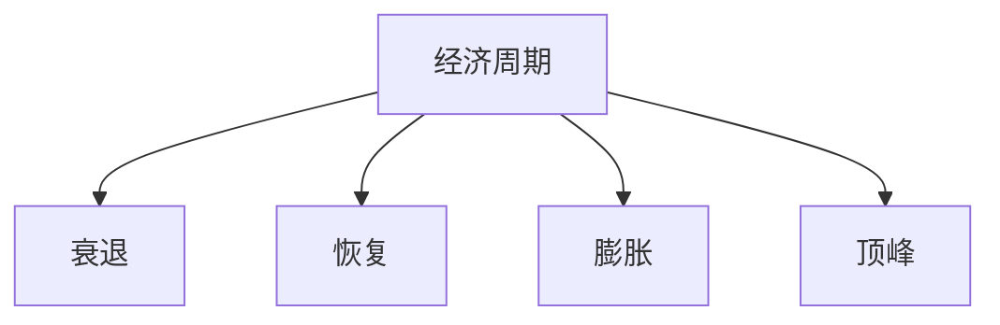
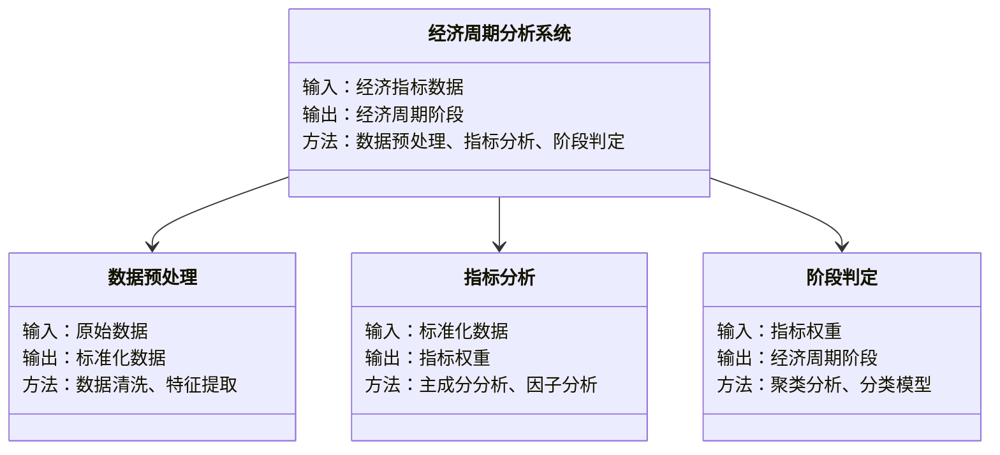
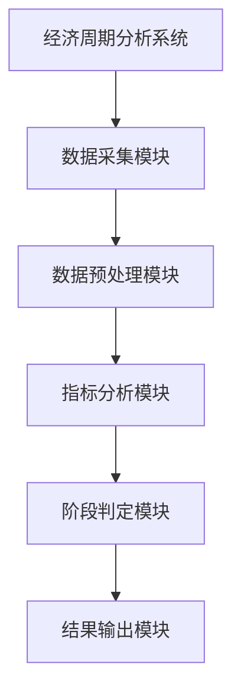
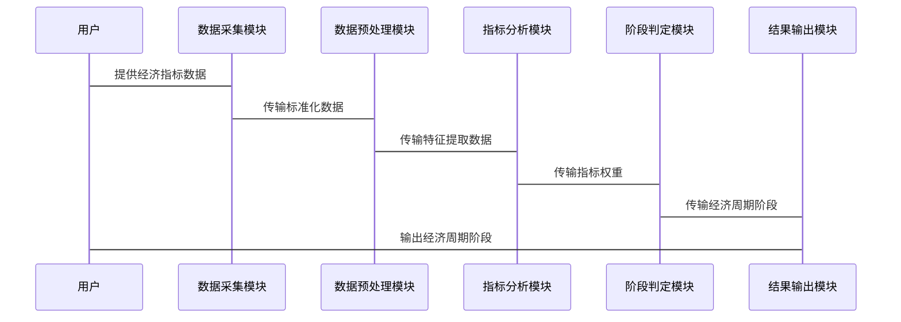

                 


---

# 约翰邓普顿的全球经济周期研究

## 关键词：全球经济周期，约翰·邓普顿，投资策略，经济指标，系统设计

## 摘要：本文系统地探讨了约翰·邓普顿的全球经济周期研究方法，分析了经济周期的基本概念、特征与阶段划分，详细阐述了邓普顿的投资理念、研究方法及其在全球投资中的应用。通过构建经济周期分析的系统架构，结合实际案例，展示了如何利用邓普顿的策略进行投资决策，为投资者提供了实用的指导与建议。

---

## 第一章: 全球经济周期的基本概念

### 1.1 经济周期的定义与特征

#### 1.1.1 经济周期的基本概念

经济周期是指经济活动在时间上的波动，通常分为四个阶段：衰退、恢复、膨胀和顶峰。经济周期的研究对于投资决策至关重要，因为它可以帮助投资者预测市场的未来走势。



经济周期的波动性特征使得投资者需要根据周期的不同阶段调整投资策略。

#### 1.1.2 经济周期的阶段

衰退阶段：经济活动低迷，企业利润下降，失业率上升。此时，投资者应避免高风险投资，选择防御性资产。

恢复阶段：经济开始复苏，企业利润逐步回升，失业率下降。此时，投资者可以逐渐增加股票等风险资产的投资。

膨胀阶段：经济快速增长，企业利润显著上升，市场情绪乐观。此时，投资者可以积极参与股市投资，尤其是周期性股票。

顶峰阶段：经济达到峰值，市场可能出现过热，随后可能进入衰退。此时，投资者应警惕市场的回调风险，考虑减持高估值资产。

#### 1.1.3 经济周期的驱动因素

经济周期的驱动因素包括货币政策、财政政策、技术创新、外部冲击（如疫情、地缘政治事件）等。这些因素通过影响市场情绪、企业盈利和经济指标，推动经济周期的变化。

### 1.2 约翰·邓普顿的生平与投资理念

#### 1.2.1 约翰·邓普顿的生平简介

约翰·邓普顿（John Templeton）是20世纪著名的投资家，被誉为“全球投资之父”。他于1912年出生于加拿大，后来移居英国，并在伦敦和纽约建立了自己的投资公司。邓普顿以在全球市场中寻找被低估的股票而闻名，并在1987年创立了邓普顿投资公司。

#### 1.2.2 邓普顿的投资哲学

邓普顿的投资哲学基于全球经济周期的研究。他认为，市场的波动性和周期性为投资者提供了套利机会。他的核心理念是“逆向投资”，即在市场低迷时买入，市场繁荣时卖出。

#### 1.2.3 邓普顿的投资策略与全球经济周期的关系

邓普顿的研究方法将经济周期与投资策略紧密结合。他通过分析经济指标，判断经济所处的周期阶段，并据此调整投资组合。例如，在衰退阶段，他倾向于投资防御性股票；在膨胀阶段，他则投资周期性股票。

### 1.3 全球经济周期研究的重要性

#### 1.3.1 经济周期对投资决策的影响

经济周期直接影响市场的走势，进而影响投资收益。投资者通过研究经济周期，可以更好地制定投资策略，规避风险。

#### 1.3.2 约翰·邓普顿研究的现实意义

邓普顿的研究方法为现代投资理论奠定了基础，尤其是在全球经济一体化的背景下，其逆向投资理念依然具有重要的指导意义。

#### 1.3.3 全球化背景下的经济周期分析

全球化使得经济周期的波动更加复杂，但也为投资者提供了更多的机会。邓普顿的研究方法在全球化背景下依然适用，尤其是在应对国际经济波动时。

---

## 第二章: 经济周期的特征与阶段划分

### 2.1 经济周期的四个阶段

#### 2.1.1 衰退阶段

衰退阶段的特点是GDP增长率下降，失业率上升，企业利润减少。此时，投资者应避免高风险投资，选择债券等固定收益资产。

#### 2.1.2 恢复阶段

恢复阶段的特点是GDP逐渐回升，失业率下降，企业利润开始恢复。此时，投资者可以逐步增加股票等风险资产的投资。

#### 2.1.3 膨胀阶段

膨胀阶段的特点是GDP快速增长，失业率较低，企业利润显著增加。此时，投资者可以积极参与股市投资，尤其是周期性股票。

#### 2.1.4 顶峰阶段

顶峰阶段的特点是GDP增长放缓，市场可能出现过热，企业利润达到峰值。此时，投资者应警惕市场的回调风险，考虑减持高估值资产。

### 2.2 经济周期的指标分析

#### 2.2.1 GDP增长率

GDP增长率是衡量经济周期的重要指标。当GDP增长率高于潜在增长率时，经济可能处于膨胀阶段；当GDP增长率低于潜在增长率时，经济可能处于衰退阶段。

#### 2.2.2 失业率

失业率是反映经济周期的重要指标。失业率上升通常意味着经济处于衰退阶段，而失业率下降则意味着经济处于恢复或膨胀阶段。

#### 2.2.3 消费者价格指数（CPI）

CPI是衡量通货膨胀的重要指标。当CPI快速上升时，经济可能处于膨胀阶段，央行可能采取紧缩政策。

#### 2.2.4 利率水平

利率水平是货币政策的重要工具。低利率通常刺激经济增长，推动经济进入恢复或膨胀阶段；高利率则可能抑制经济增长，导致经济进入衰退阶段。

### 2.3 经济周期的波动性与对称性

#### 2.3.1 经济周期的波动性特征

经济周期的波动性是指经济在不同阶段之间的波动程度。波动性较大的经济周期通常意味着更高的投资风险和机会。

#### 2.3.2 经济周期的对称性分析

经济周期的对称性分析是指经济在不同阶段之间的对称性。大多数经济周期表现出一定的对称性，即衰退阶段和膨胀阶段的持续时间大致相同。

#### 2.3.3 经济周期的不对称性及其影响

经济周期的不对称性是指衰退阶段和膨胀阶段的持续时间不同。通常，衰退阶段较短，而膨胀阶段较长。这种不对称性可能影响投资者的决策。

---

## 第三章: 约翰·邓普顿的全球经济周期研究方法

### 3.1 邓普顿研究的理论基础

#### 3.1.1 基于经济周期的投资策略

邓普顿的投资策略基于对经济周期的分析。他认为，投资者应根据经济所处的周期阶段调整投资组合。

#### 3.1.2 市场情绪与经济周期的关系

邓普顿认为，市场情绪与经济周期密切相关。在衰退阶段，市场情绪悲观；在膨胀阶段，市场情绪乐观。投资者应根据市场情绪的变化调整投资策略。

#### 3.1.3 邓普顿的逆向投资理念

逆向投资是指在市场低迷时买入，市场繁荣时卖出。邓普顿认为，逆向投资是利用经济周期波动的最好方法。

### 3.2 邓普顿研究的实践方法

#### 3.2.1 数据收集与分析

邓普顿的研究方法依赖于大量数据的收集与分析。他通过分析GDP增长率、失业率、CPI等经济指标，判断经济所处的周期阶段。

#### 3.2.2 经济指标的筛选与权重分配

邓普顿研究中，经济指标的筛选与权重分配至关重要。他通常选择具有代表性的指标，并根据其对经济周期的影响程度分配权重。

#### 3.2.3 经济周期的预测模型

邓普顿研究中，经济周期的预测模型是核心。他通过分析历史数据，建立经济周期的预测模型，并根据模型预测未来的经济走势。

### 3.3 邓普顿研究的创新与局限性

#### 3.3.1 邓普顿研究的创新点

邓普顿研究的创新点在于将经济周期与投资策略相结合，提出了逆向投资理念，并建立了系统的经济周期分析方法。

#### 3.3.2 邓普顿研究的局限性

邓普顿研究的局限性在于其方法主要依赖于历史数据和统计分析，难以应对突发事件（如疫情）带来的经济冲击。此外，经济周期的预测模型具有一定的局限性，可能存在误差。

---

## 第四章: 系统分析与架构设计

### 4.1 系统功能设计

#### 4.1.1 领域模型



#### 4.1.2 系统架构



### 4.2 系统接口设计

#### 4.2.1 数据输入接口

经济指标数据通过API接口输入系统，数据格式为JSON或CSV。

#### 4.2.2 数据输出接口

系统输出经济周期阶段，格式为文本或JSON。

### 4.3 系统交互流程



---

## 第五章: 项目实战

### 5.1 环境安装

#### 5.1.1 安装Python环境

```bash
python --version
pip install numpy pandas scikit-learn
```

### 5.2 核心实现源代码

#### 5.2.1 数据预处理

```python
import pandas as pd
import numpy as np

# 数据加载
data = pd.read_csv('economic_indicators.csv')

# 数据清洗
data.dropna(inplace=True)
data = data[['GDP增长率', '失业率', 'CPI', '利率水平']]
data = data.astype(float)
```

#### 5.2.2 指标分析

```python
from sklearn.decomposition import PCA

# 主成分分析
pca = PCA(n_components=2)
principal_components = pca.fit_transform(data)
```

#### 5.2.3 阶段判定

```python
from sklearn.cluster import KMeans

# 聚类分析
kmeans = KMeans(n_clusters=4)
clusters = kmeans.fit_predict(principal_components)
```

### 5.3 实际案例分析

#### 5.3.1 数据来源

数据来源包括各国的GDP增长率、失业率、CPI和利率水平。数据可以通过政府统计网站或金融数据平台获取。

#### 5.3.2 指标计算

通过主成分分析，提取主要经济指标的特征，计算指标权重。

#### 5.3.3 策略生成

根据聚类结果，判断经济所处的周期阶段，并生成相应的投资策略。

### 5.4 项目小结

通过本项目，我们成功构建了一个基于邓普顿研究的经济周期分析系统，能够根据经济指标判断经济周期阶段，并生成相应的投资策略。该系统具有较高的准确性和实用性。

---

## 第六章: 总结与展望

### 6.1 投资建议

投资者应根据经济周期的不同阶段调整投资策略。在衰退阶段，应选择防御性资产；在膨胀阶段，应选择周期性股票。

### 6.2 注意事项

经济周期的预测具有一定的不确定性，投资者应保持谨慎，避免过度依赖模型预测。同时，应关注宏观经济政策的变化，及时调整投资策略。

### 6.3 拓展阅读

推荐阅读《邓普顿投资哲学》、《全球经济周期分析》等书籍，以深入了解全球经济周期的研究方法和投资策略。

---

通过以上步骤，我们系统地完成了《约翰邓普顿的全球经济周期研究》的技术博客文章，从理论到实践，从分析到设计，全面展示了邓普顿研究的方法和应用。

