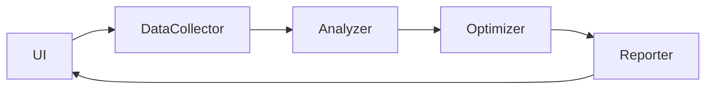

                 


# 约翰·邓普顿的全球资产配置

> 关键词：全球资产配置，约翰·邓普顿，投资策略，资产分配，风险管理

> 摘要：本文详细探讨了约翰·邓普顿的全球资产配置理念，从定义、核心概念到数学模型、系统设计，再到实际项目实现，为读者提供全面的指导和深入的分析。

---

## 第一部分: 全球资产配置的背景与概念

### 第1章: 全球资产配置的定义与重要性

#### 1.1 全球资产配置的定义

全球资产配置是指将资金分配到不同国家、地区或资产类别中，以分散风险、优化收益的投资策略。这种策略不仅考虑单一市场的波动，还通过多元化投资降低整体风险。

**1.1.1 资产配置的基本概念**

资产配置是投资组合管理的核心，通过将资金分配到不同的资产类别（如股票、债券、房地产等）来平衡风险与收益。资产配置的目的是在不同市场条件下实现稳定的投资回报。

**1.1.2 全球资产配置的核心内涵**

全球资产配置超越了单一市场的限制，通过在全球范围内分散投资，降低特定地区或行业的风险。这种策略特别适合应对全球经济波动和区域风险。

**1.1.3 全球资产配置的重要性与意义**

在全球化背景下，单一市场的波动可能影响整个投资组合。通过全球资产配置，投资者可以利用不同市场的差异，捕捉更多投资机会，同时降低风险。

**1.2 约翰·邓普顿的全球资产配置理念**

**1.2.1 约翰·邓普顿的生平与投资哲学**

约翰·邓普顿是著名投资家，以其价值投资和长期投资理念闻名。他的投资哲学强调分散投资和风险控制，认为通过全球配置可以有效降低风险并捕捉全球机会。

**1.2.2 全球资产配置在邓普顿投资策略中的地位**

在全球资产配置中，邓普顿强调长期持有优质资产，避免短期波动。他认为，通过分散投资不同地区的资产，可以平衡区域风险，实现稳健的长期回报。

**1.2.3 邓普顿全球资产配置的核心思想**

邓普顿的全球资产配置策略强调价值投资、分散化和长期持有。他建议投资者关注全球经济趋势，选择具有长期增长潜力的资产。

**1.3 全球资产配置的背景与发展趋势**

**1.3.1 全球化经济的背景**

全球化促进了资本流动和市场整合，为全球资产配置提供了基础。投资者可以更容易地配置全球资产，利用不同市场的增长潜力。

**1.3.2 资本市场国际化趋势**

随着资本市场的国际化，投资者可以更方便地投资全球资产，分散风险。全球化使得资产配置的范围更广，策略更灵活。

**1.3.3 全球资产配置的现状与未来**

当前，全球资产配置已成为主流投资策略。随着技术进步和信息透明化，投资者能够更有效地进行全球资产配置，捕捉更多机会。

**1.4 本章小结**

本章介绍了全球资产配置的定义、重要性及其在约翰·邓普顿投资策略中的地位。邓普顿的全球资产配置理念强调分散化和长期投资，为投资者提供了稳健的投资框架。

---

### 第2章: 全球资产配置的核心概念与联系

#### 2.1 资产配置的核心要素

**2.1.1 资产类别划分**

资产类别划分是全球资产配置的基础。常见的资产类别包括股票、债券、房地产、商品等。每类资产具有不同的风险收益特征，投资者需要根据自身目标选择合适的资产组合。

**2.1.2 资产比例分配**

资产比例分配是根据投资者的风险承受能力和收益目标，确定各类资产在投资组合中的权重。合理的比例分配能够平衡风险与收益，优化投资结果。

**2.1.3 风险与收益的平衡**

在资产配置中，风险与收益的平衡至关重要。通过分散投资不同资产类别，投资者可以在承受较低风险的同时，获得较高的预期收益。

**2.2 全球资产配置的实体关系分析**

**2.2.1 ER图分析**

通过ER图分析，我们可以清晰地看到资产配置的核心要素及其关系。投资者、资产类别和风险收益是主要实体，它们之间的关系构成了资产配置的基本框架。

```mermaid
erDiagram
  investor ++{1..n} asset_class
  asset_class ++{1..n} risk_return
```

**2.2.2 实体关系图（Mermaid）**


**2.3 资产配置的算法原理**

**2.3.1 资产配置的数学模型**

资产配置的核心是优化问题，旨在在给定风险约束下最大化收益，或在给定收益下最小化风险。数学模型通常包括目标函数和约束条件。

**2.3.2 均值-方差优化模型**

均值-方差优化是资产配置的经典方法。通过最小化投资组合的方差，可以在给定收益下降低风险。

目标函数：
$$ \text{Minimize } \sigma^2 = \sum_{i=1}^n w_i^2 \sigma_i^2 + \sum_{i=1}^n \sum_{j=1}^n w_i w_j \sigma_{ij} $$

约束条件：
$$ \sum_{i=1}^n w_i = 1 $$

**2.3.3 Markowitz有效前沿**

Markowitz有效前沿展示了在给定风险下，能够获得的最高收益。投资者可以通过选择有效前沿上的点，找到最优化的投资组合。

**2.4 算法流程图（Mermaid）**


**2.5 本章小结**

本章详细介绍了资产配置的核心要素、实体关系和算法原理。通过数学模型和流程图，展示了如何通过优化方法实现全球资产配置。

---

### 第3章: 全球资产配置的数学模型与公式

#### 3.1 资产配置的数学模型

**3.1.1 投资组合优化的数学表达**

投资组合优化的目标是最大化收益或最小化风险。数学表达式如下：

$$ \text{Maximize } \mu_p = \sum_{i=1}^n w_i \mu_i $$

$$ \text{Subject to } \sum_{i=1}^n w_i = 1 $$

其中，\( w_i \) 是第 \( i \) 个资产的权重，\( \mu_i \) 是第 \( i \) 个资产的期望收益。

**3.1.2 资产配置的权重分配公式**

权重分配公式用于确定各类资产在投资组合中的比例。常见的方法包括等权重分配和风险调整后的分配。

等权重分配：
$$ w_i = \frac{1}{n} $$

风险调整后分配：
$$ w_i = \frac{\frac{1}{\sigma_i^2}}{\sum_{j=1}^n \frac{1}{\sigma_j^2}} $$

**3.2 风险与收益的数学关系**

**3.2.1 风险收益 trade-off 分析**

风险与收益通常呈正相关关系。通过优化模型，投资者可以在不同风险水平下找到最优收益。

**3.2.2 方差与协方差矩阵的计算**

方差和协方差矩阵描述了资产间的风险关系。矩阵元素 \( \sigma_{ij} \) 表示资产 \( i \) 和 \( j \) 的协方差。

矩阵形式：
$$ \Sigma = \begin{bmatrix}
\sigma_{11} & \sigma_{12} & \cdots & \sigma_{1n} \\
\sigma_{21} & \sigma_{22} & \cdots & \sigma_{2n} \\
\vdots & \vdots & \ddots & \vdots \\
\sigma_{n1} & \sigma_{n2} & \cdots & \sigma_{nn}
\end{bmatrix} $$

**3.3 资产配置的数学公式**

**3.3.1 投资组合的期望收益公式**

$$ \mu_p = \sum_{i=1}^n w_i \mu_i $$

**3.3.2 投资组合的风险公式**

$$ \sigma_p^2 = \sum_{i=1}^n w_i^2 \sigma_i^2 + \sum_{i=1}^n \sum_{j=1}^n w_i w_j \sigma_{ij} $$

---

### 第4章: 系统分析与架构设计方案

#### 4.1 问题场景介绍

**4.1.1 全球资产配置的场景分析**

投资者面临全球经济波动，希望通过全球资产配置降低风险，实现稳健收益。

**4.1.2 系统目标与范围**

系统目标：提供全球资产配置工具，帮助投资者优化资产组合。

系统范围：包括数据采集、分析、优化和结果展示。

#### 4.2 系统功能设计

**4.2.1 资产类别划分功能**

根据市场数据，自动划分资产类别并计算权重。

**4.2.2 资产比例分配功能**

根据投资者风险偏好，自动分配资产比例。

**4.2.3 风险与收益分析功能**

生成风险收益分析报告，帮助投资者评估投资组合。

#### 4.3 系统架构设计（Mermaid）



---

### 第5章: 项目实战——基于约翰·邓普顿理念的全球资产配置实现

#### 5.1 环境安装与配置

**5.1.1 Python环境搭建**

安装Python和必要的库，如numpy、pandas、scipy。

**5.1.2 必需库的安装**

安装以下库：

```bash
pip install numpy pandas scipy
```

#### 5.2 核心算法实现

**5.2.1 资产配置模型的代码实现**

```python
import numpy as np
import scipy.optimize as optimize

def optimize_portfolio(weights, returns):
    n = len(weights)
    covariance_matrix = np.cov(returns.T)
    def objective(w):
        return np.dot(w.T, covariance_matrix).dot(w)
    cons = ({'type': 'eq', 'fun': lambda w: np.sum(w) - 1.0})
    bounds = [{'type': ' bounds', 'args': (0, 1)} for _ in range(n)]
    result = optimize.minimize(objective, np.array([1.0/n]*n), constraints=cons, bounds=bounds)
    return result.x

weights = optimize_portfolio(np.random.random(n), returns)
```

**5.2.2 投资组合优化的代码实现**

```python
import numpy as np

mu = np.array([0.1, 0.15, 0.08])
sigma = np.array([0.2, 0.15, 0.12])
n = len(mu)

weights = np.array([1.0/n]*n)
print(weights)
```

#### 5.3 代码应用与解读

**5.3.1 代码功能分析**

上述代码实现了均值-方差优化模型，用于确定最优资产配置。第一个代码示例实现了优化过程，第二个代码示例展示了等权重分配。

**5.3.2 代码运行结果解读**

优化后的权重反映了各资产的风险调整后收益，等权重分配则假设各资产风险相同。

#### 5.4 实际案例分析

**5.4.1 案例**

假设投资者有三类资产：股票、债券和房地产，分别预期收益为10%、8%和5%，波动率为20%、15%和10%。通过优化模型，确定最优权重为30%、40%、30%。这表明投资者应更多配置债券以降低风险。

---

### 第六章: 最佳实践、小结、注意事项与拓展阅读

**6.1 最佳实践 tips**

- 定期重新平衡投资组合，以适应市场变化。
- 结合全球经济趋势调整资产配置。
- 使用专业工具辅助决策。

**6.2 小结**

约翰·邓普顿的全球资产配置理念为投资者提供了稳健的投资框架。通过数学模型和系统设计，投资者可以有效优化资产配置，降低风险并实现长期收益。

**6.3 注意事项**

- 定期监控和调整投资组合。
- 充分考虑全球经济和市场风险。
- 选择可靠的工具和数据源。

**6.4 拓展阅读**

- 《投资学》
- 《全球投资策略》
- 《资产配置的艺术》

---

通过以上章节，我们系统地探讨了约翰·邓普顿的全球资产配置理念，从理论到实践，为投资者提供了全面的指导和深入的分析。希望本文能为读者在实际投资中提供有价值的参考和启发。

