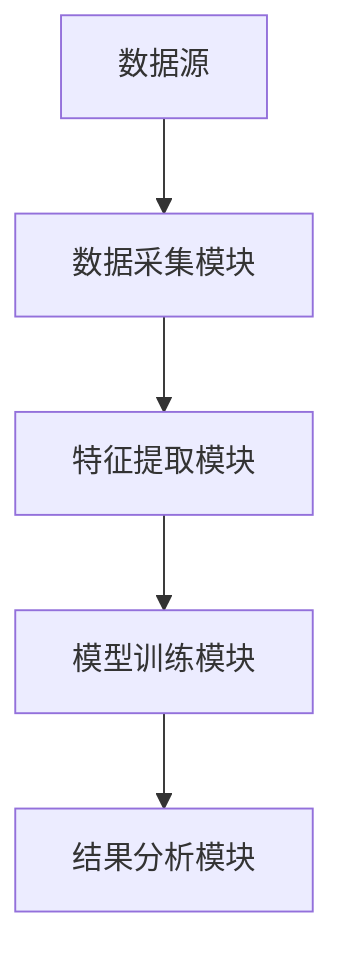

                 


# 经济形势恶化时特价股票的表现预测

## 关键词：经济形势、特价股票、股票预测、经济指标、市场情绪、机器学习、时间序列分析

## 摘要：本文深入探讨了在经济形势恶化时，特价股票的表现预测方法。通过分析经济指标、市场情绪和公司基本面等因素，结合时间序列分析和机器学习算法，构建了预测模型，并通过实际案例展示了如何利用这些模型进行投资决策。

---

## 第一部分: 经济形势恶化时特价股票的表现预测概述

### 第1章: 经济形势恶化对股票市场的影响

#### 1.1 经济形势恶化的定义与特征
- 经济周期的定义与阶段划分：
  - 经济周期通常分为衰退、萧条、复苏和繁荣四个阶段。衰退和萧条阶段属于经济恶化的情况。
  - 在衰退阶段，企业盈利能力下降，失业率上升，消费者信心减弱。
  - 在萧条阶段，经济活动几乎停滞，企业倒闭率上升，股市大幅下跌。

- 经济恶化对股市的传导机制：
  - 企业盈利下降导致股票估值降低。
  - 投资者信心下降引发抛售潮，进一步压低股价。
  - 利率政策变化（如降息）可能对股市产生短期提振作用，但长期影响取决于经济基本面。

#### 1.2 特价股票的定义与特点
- 特价股票的定义：
  - 特价股票是指价格远低于其内在价值的股票，通常被视为被市场低估的投资标的。
  - 这类股票可能由于市场恐慌或公司短期问题导致价格被压低，但具有长期增值潜力。

- 特价股票的特点：
  - 价格弹性大，波动性高。
  - 市场关注度低，流动性相对较弱。
  - 具有较高的风险溢价，回报率可能较高。

#### 1.3 特价股票表现预测的必要性与挑战
- 预测的必要性：
  - 帮助投资者在经济恶化时识别潜在投资机会。
  - 通过预测模型优化投资组合，降低风险。
  - 提供数据支持，帮助投资者做出理性决策。

- 预测的挑战：
  - 数据的稀缺性和不完整性。
  - 市场情绪的不可预测性。
  - 经济指标的滞后性和复杂性。

---

## 第二部分: 经济指标与股票市场的关联

### 第2章: 主要经济指标对股市的影响

#### 2.1 GDP与股市的关系
- GDP是衡量经济健康状况的重要指标，直接影响企业的盈利能力和投资者信心。
- 在经济衰退期间，GDP增速放缓，企业盈利下降，股市通常会受到抑制。
- 当GDP开始回升时，股市可能逐渐复苏。

#### 2.2 失业率对股市的影响
- 失业率上升通常意味着消费者支出减少，企业盈利下降，股市受到抑制。
- 失业率下降表明经济复苏，企业盈利改善，股市可能上升。
- 失业率与股市的关系并非线性，需结合其他经济指标综合分析。

#### 2.3 消费者价格指数（CPI）与股市的关联
- 高通胀可能导致央行加息，增加企业融资成本，抑制股市表现。
- 低通胀环境下，企业盈利压力较小，股市可能表现较好。
- 需结合实际经济政策和市场预期进行分析。

#### 2.4 利率政策对股市的影响
- 利率上升：增加企业融资成本，抑制投资，股市可能下跌。
- 利率下降：降低融资成本，刺激投资，股市可能上涨。
- 利率政策对股市的影响具有滞后性，需结合市场预期进行分析。

### 第3章: 财务指标与公司股票表现的关系

#### 3.1 营业收入与股票价格的关联
- 营业收入增长通常意味着公司经营改善，股价可能上升。
- 收入下降可能引发股价下跌，需结合利润情况综合分析。

#### 3.2 净利润对股票价值的影响
- 净利润是衡量公司盈利能力的核心指标，直接影响股票估值。
- 净利润增长通常带来股价上涨，但需考虑市场预期和行业平均水平。

#### 3.3 股东权益与股票稳定性分析
- 股东权益是公司资产净值的重要组成部分，高股东权益通常意味着公司财务稳健。
- 在经济恶化时，高股东权益的公司可能更具抗风险能力，股价波动较小。

---

## 第三部分: 市场情绪与股票价格预测

### 第4章: 市场情绪的定义与分类

#### 4.1 投资者情绪的分类
- 乐观情绪：投资者预期市场上涨，增加买入行为。
- 悲观情绪：投资者预期市场下跌，增加卖出行为。
- 中性情绪：投资者观望，交易量较低。

#### 4.2 市场情绪的量化指标
- 投资者信心指数（ICF）：反映投资者对市场的看法。
- 恐慌指数（VIX）：反映市场波动性和投资者情绪。
- 社会媒体情绪分析：通过社交媒体数据量化市场情绪。

#### 4.3 市场情绪对股票价格的影响
- 惶恐慌情绪可能导致股价短期大幅波动。
- 理性情绪反映市场的真实价值，长期驱动股价走势。

---

## 第四部分: 特价股票预测的数学模型与算法

### 第5章: 时间序列分析模型

#### 5.1 ARIMA模型的原理与应用
- ARIMA（自回归积分滑动平均模型）用于分析和预测时间序列数据。
- 模型假设：数据具有一定的趋势性和周期性。
- 应用：预测特价股票的价格走势。

#### 5.2 LSTM模型在时间序列预测中的应用
- LSTM（长短期记忆网络）是一种深度学习模型，擅长捕捉时间序列中的长期依赖关系。
- 优势：能够处理复杂的非线性关系，适合股票价格预测。

### 第6章: 机器学习算法在股票预测中的应用

#### 6.1 支持向量机（SVM）在股票分类中的应用
- SVM用于分类问题，可以预测股票价格的涨跌趋势。
- 优势：适用于高维数据，分类准确率高。

#### 6.2 随机森林在股票特征提取中的作用
- 随机森林是一种集成学习算法，用于特征重要性分析。
- 应用：识别影响股票价格的关键经济指标和市场情绪因素。

---

## 第五部分: 系统架构与实战分析

### 第7章: 系统架构设计

#### 7.1 系统功能设计
- 数据采集模块：收集经济指标、市场情绪和公司财务数据。
- 特征提取模块：提取关键特征，如GDP增速、失业率、CPI等。
- 模型训练模块：构建并训练预测模型，如ARIMA和LSTM。
- 结果分析模块：输出预测结果，并进行风险评估。

#### 7.2 系统架构图


### 第8章: 项目实战分析

#### 8.1 环境安装
- 安装Python和相关库（如pandas、numpy、keras、tensorflow）。

#### 8.2 核心实现代码
```python
import pandas as pd
from sklearn.model_selection import train_test_split
from sklearn.ensemble import RandomForestClassifier
from sklearn.metrics import accuracy_score

# 数据加载
data = pd.read_csv('stock_data.csv')
# 特征提取
X = data[['GDP', 'unemployment', 'CPI']]
y = data['stock_price']

# 数据分割
X_train, X_test, y_train, y_test = train_test_split(X, y, test_size=0.2)

# 模型训练
model = RandomForestClassifier()
model.fit(X_train, y_train)

# 模型预测
y_pred = model.predict(X_test)
print("准确率:", accuracy_score(y_test, y_pred))
```

#### 8.3 代码解读与分析
- 数据加载：从CSV文件中读取股票数据。
- 特征提取：选择GDP、失业率和CPI作为特征变量。
- 数据分割：将数据分为训练集和测试集。
- 模型训练：使用随机森林算法训练分类模型。
- 模型预测：对测试集进行预测，并计算准确率。

---

## 第六部分: 总结与展望

### 第9章: 总结与展望

#### 9.1 总结
- 本文探讨了经济形势恶化时特价股票的表现预测方法。
- 结合经济指标、市场情绪和机器学习算法，构建了预测模型。
- 通过实际案例展示了模型的应用和效果。

#### 9.2 展望
- 进一步优化预测模型，提高准确性。
- 探索更多经济指标和市场情绪因子，丰富模型输入。
- 研究多模型融合方法，提升预测性能。

---

## 第七部分: 最佳实践与注意事项

### 第10章: 最佳实践

#### 10.1 数据来源的选择
- 使用可靠的经济数据源，如政府统计机构和金融数据平台。
- 确保数据的完整性和准确性。

#### 10.2 模型调优技巧
- 通过网格搜索优化模型参数。
- 使用交叉验证评估模型性能。
- 定期更新模型，适应市场变化。

#### 10.3 投资策略建议
- 在经济恶化时，关注高股东权益的公司。
- 分散投资，降低风险。
- 结合技术分析和基本面分析，做出综合判断。

---

## 第八部分: 结语

### 8.1 结语
经济形势恶化时，特价股票的表现预测具有重要意义。通过本文的分析，读者可以更好地理解经济指标、市场情绪和机器学习算法在股票预测中的应用。希望本文能为投资者提供有价值的参考，帮助他们在复杂多变的市场中做出明智的投资决策。

---

## 第九部分: 拓展阅读

### 9.1 拓展阅读推荐
- 《The Intelligent Investor》：本杰明·格雷厄姆的经典投资著作，介绍价值投资理念。
- 《机器学习实战》：深入探讨机器学习算法的应用，包括股票预测。
- 《经济指标与金融市场》：分析主要经济指标对金融市场的影响。

---

通过本文的系统分析和实际案例，读者可以掌握经济形势恶化时特价股票的表现预测方法，并在实际投资中灵活运用。

