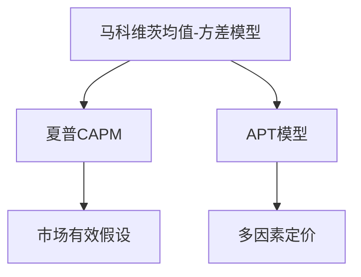
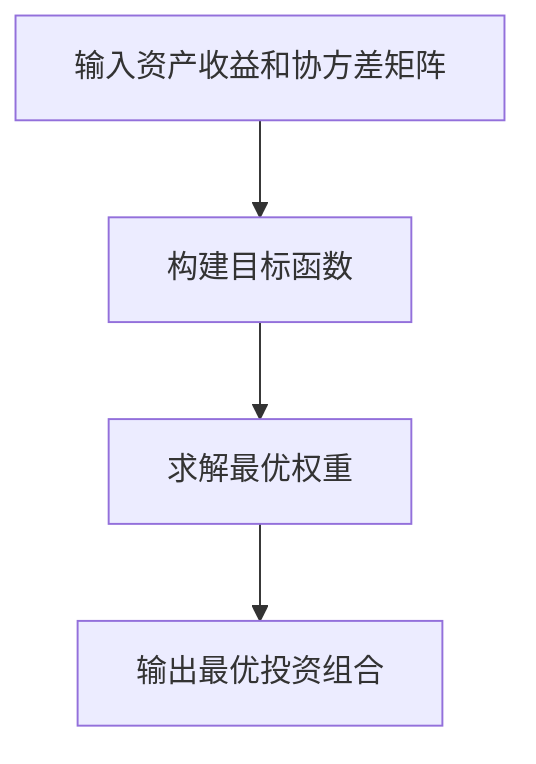
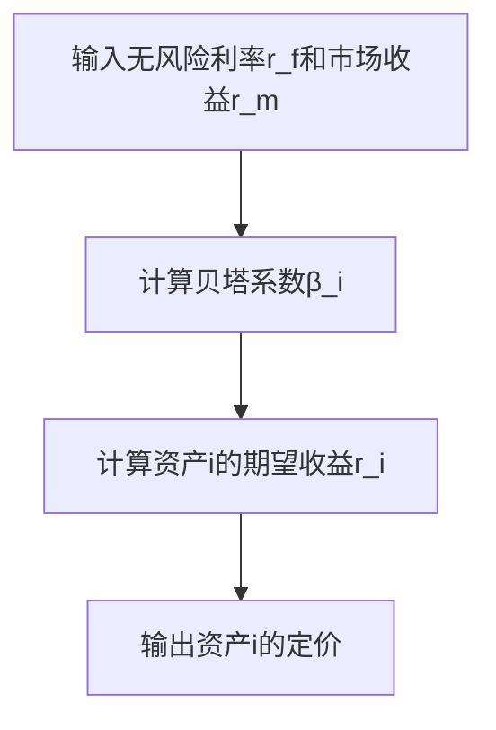
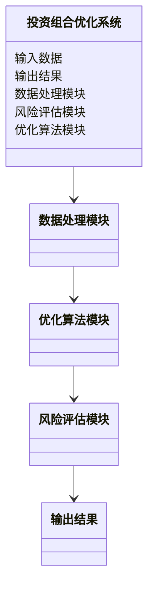
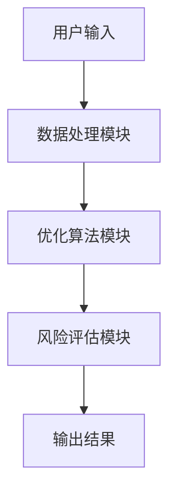
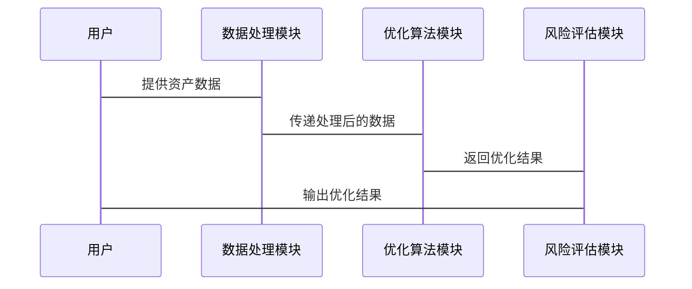

                 


# 综合四大师智慧：构建现代投资组合

> 关键词：投资组合优化、现代投资组合理论、马科维茨、夏普、CAPM、APT模型

> 摘要：本文将结合马科维茨、夏普、APT模型和CAPM模型的核心思想，系统地阐述如何构建现代投资组合。通过理论分析、算法实现和项目实战，全面解析投资组合优化的数学模型、系统架构和实际应用，帮助读者掌握投资组合优化的核心方法和技术。

---

# 第1章: 现代投资组合理论概述

## 1.1 投资组合理论的发展背景

### 1.1.1 投资组合的概念与定义
投资组合是指将一定数量的金融资产以一定比例结合在一起的投资方式。通过科学的资产配置，投资组合能够在风险和收益之间找到最佳平衡点。投资组合的核心目标是最大化收益、最小化风险或实现特定的投资目标。

### 1.1.2 现代投资组合理论的起源与演变
现代投资组合理论（MPT）由**哈里·马科维茨**于1952年提出，是金融学领域的里程碑式成果。马科维茨提出了均值-方差模型，首次将数学方法引入投资组合优化问题。随后，**威廉·夏普**提出了资本资产定价模型（CAPM），进一步完善了资产定价理论。**约翰·林德特·洛**提出了套利定价理论（APT），为投资组合优化提供了另一种思路。

### 1.1.3 投资组合管理的核心目标
投资组合管理的核心目标是在给定风险水平下实现最大收益，或在给定收益水平下实现最小风险。这需要结合市场环境、投资者风险偏好和资产特性进行综合分析。

---

## 1.2 四大师的理论与贡献

### 1.2.1 马科维茨的现代投资组合理论
马科维茨的**均值-方差模型**是投资组合优化的基石。该模型通过优化资产的期望收益和方差，构建最优投资组合。其核心思想是通过分散投资降低风险。

### 1.2.2 夏普的资产定价模型（CAPM）
**CAPM**模型通过引入市场风险的概念，量化资产的期望收益。CAPM假设市场是有效的，并且可以通过市场组合来解释资产的定价。

### 1.2.3 APT模型的提出与发展
**APT模型**由**约翰·里德·洛**提出，通过引入多个因素来解释资产收益。APT模型假设资产收益可以通过多个系统性因素来解释，而这些因素可以通过投资组合来分散。

### 1.2.4 风险溢价与市场效率的理论深化
四大师的理论共同奠定了现代投资组合理论的基础，尤其是在风险溢价和市场效率方面的研究，为投资组合优化提供了理论支持。

---

## 1.3 综合四大师智慧的必要性

### 1.3.1 不同理论的优缺点分析
| 理论 | 优点 | 缺点 |
|------|------|------|
| 均值-方差模型 | 全面考虑风险和收益 | 计算复杂，假设资产分布为正态分布 |
| CAPM | 简化资产定价问题 | 假设市场有效，忽略非系统性风险 |
| APT模型 | 考虑多个系统性因素 | 需要多个因素数据，计算复杂 |

### 1.3.2 综合理论的整合思路
综合四大师理论的核心在于结合多种方法，根据不同市场环境和资产特性选择最优模型。例如，在市场有效的情况下，CAPM和APT模型可以结合使用。

### 1.3.3 理论整合对投资实践的意义
通过综合四大师理论，投资者可以更好地理解资产风险和收益的动态关系，制定更科学的投资策略。

---

## 1.4 本章小结
本章通过介绍四大师的理论，分析了投资组合优化的核心思想。综合运用这些理论，可以更好地应对复杂的市场环境。

---

# 第2章: 投资组合优化的核心概念

## 2.1 投资组合优化的数学模型

### 2.1.1 均值-方差模型的数学表达
均值-方差模型的目标是最小化投资组合的方差，即风险，同时满足收益和约束条件。

$$ \text{目标函数：} \min \sigma^2 $$
$$ \text{约束条件：} \sum w_i r_i = \mu, \sum w_i = 1 $$

其中，$w_i$ 是资产i的权重，$r_i$ 是资产i的期望收益，$\mu$ 是目标收益。

### 2.1.2 风险与收益的量化方法
风险可以通过方差或标准差量化，收益可以通过期望收益量化。马科维茨模型通过优化方差和收益的权衡，找到最优解。

### 2.1.3 约束条件的设定与处理
常见的约束条件包括权重非负、总权重为1、收益不低于目标收益等。这些约束条件可以通过拉格朗日乘数法处理。

---

## 2.2 核心概念对比分析

### 2.2.1 不同投资组合模型的对比表格
| 模型 | 核心思想 | 适用场景 |
|------|----------|----------|
| 均值-方差模型 | 优化风险和收益 | 资产数量较少 |
| CAPM | 资产定价 | 市场有效 |
| APT模型 | 多因素定价 | 资产数量较多 |

### 2.2.2 Mermaid流程图：四大师理论的关系图


---

## 2.3 理论联系实际的思考

### 2.3.1 理论在实际投资中的应用边界
理论模型假设市场有效、资产收益符合正态分布等，实际投资中需要考虑模型的适用性和假设的合理性。

### 2.3.2 理论与市场的动态适应性
投资组合优化需要结合市场动态调整模型和参数，以适应实际市场环境。

---

## 2.4 本章小结
本章通过数学模型和对比分析，深入探讨了投资组合优化的核心概念和理论基础。

---

# 第3章: 投资组合优化的算法原理

## 3.1 马科维茨均值-方差模型的算法实现

### 3.1.1 算法流程图：马科维茨模型的优化步骤


### 3.1.2 Python代码实现：均值-方差模型的优化

```python
import numpy as np
from scipy.optimize import minimize

# 示例数据
n_assets = 3
mu = np.array([0.1, 0.2, 0.15])  # 期望收益
sigma = np.array([[0.2, 0.05, 0.05],
                   [0.05, 0.3, 0.07],
                   [0.05, 0.07, 0.2]])

# 目标函数：最小化方差
def objective(w):
    return np.dot(w.T, np.dot(sigma, w))

# 约束条件：权重和为1，收益不低于目标收益
def constraint(w, mu, target_mu=0.15):
    return np.dot(w, mu) - target_mu

# 初始权重
w0 = np.array([1/3, 1/3, 1/3])

# 求解优化问题
cons = {'type': 'eq', 'fun': lambda w: constraint(w, mu)}
bounds = [(0, 1) for _ in range(n_assets)]

result = minimize(objective, w0, constraints=cons, bounds=bounds)
print("最优权重：", result.x)
print("最小方差：", result.fun)
```

---

## 3.2 CAPM模型的数学推导与应用

### 3.2.1 CAPM公式的详细推导
CAPM模型假设资产收益可以分解为系统性风险和非系统性风险。公式为：

$$ r_i = r_f + \beta_i (r_m - r_f) $$

其中，$r_i$ 是资产i的期望收益，$r_f$ 是无风险利率，$\beta_i$ 是资产i的贝塔系数，$r_m$ 是市场期望收益。

### 3.2.2 Mermaid流程图：CAPM模型的计算流程


---

## 3.3 APT模型的扩展与应用

### 3.3.1 APT模型的数学表达
APT模型假设资产收益可以表示为多个因素的线性组合：

$$ r_i = \alpha_i + \beta_{i1}f_1 + \beta_{i2}f_2 + \dots + \beta_{ik}f_k + \epsilon_i $$

其中，$f_j$ 是因素j的收益，$\epsilon_i$ 是特异风险。

### 3.3.2 Python代码实现：APT模型的应用示例

```python
import numpy as np

# 示例数据
n_assets = 2
n_factors = 1
beta = np.array([[1.5], [1.0]])  # 贝塔系数
factors_return = np.array([0.1])  # 因子收益

# 计算资产收益
mu = np.zeros((n_assets, 1))
for i in range(n_assets):
    mu[i] = beta[i] * factors_return[0]

print("资产收益：", mu)
```

---

## 3.4 算法的比较与选择

### 3.4.1 不同算法的优缺点对比
| 算法 | 优点 | 缺点 |
|------|------|------|
| 均值-方差模型 | 全面考虑风险和收益 | 计算复杂 |
| CAPM | 简化资产定价问题 | 假设市场有效 |
| APT模型 | 考虑多个系统性因素 | 需要多个因素数据 |

### 3.4.2 算法选择的实践建议
根据市场环境和资产特性选择合适的模型。例如，在市场有效的情况下，优先选择CAPM；在需要考虑多个因素的情况下，选择APT模型。

---

## 3.5 本章小结
本章通过算法实现和模型对比，深入探讨了投资组合优化的核心算法和技术。

---

# 第4章: 投资组合优化的系统架构设计

## 4.1 系统功能设计

### 4.1.1 投资组合优化模块的功能需求
- 输入：资产收益数据、协方差矩阵、目标收益
- 输出：最优投资组合权重、最小风险或最大收益

### 4.1.2 数据处理模块的设计
- 数据清洗：处理缺失值和异常值
- 数据转换：将数据转换为适合模型输入的格式

### 4.1.3 风险评估模块的实现
- 计算投资组合的方差、标准差等风险指标
- 生成风险评估报告

---

## 4.2 系统架构图

### 4.2.1 领域模型mermaid类图


### 4.2.2 系统架构mermaid架构图


---

## 4.3 系统接口设计

### 4.3.1 输入接口
- 接口名称：`输入资产数据`
- 接口描述：接收资产收益和协方差矩阵
- 输入参数：`assets_data`, `cov_matrix`

### 4.3.2 输出接口
- 接口名称：`输出优化结果`
- 接口描述：返回最优投资组合权重和风险指标
- 输出参数：`optimal_weights`, `risk_metrics`

---

## 4.4 系统交互mermaid序列图



---

## 4.5 本章小结
本章通过系统架构设计，展示了投资组合优化的实现过程和接口设计。

---

# 第5章: 项目实战——构建现代投资组合

## 5.1 环境安装与配置

### 5.1.1 安装Python和相关库
- Python版本：3.8+
- 相关库：NumPy、SciPy、Matplotlib

```bash
pip install numpy scipy matplotlib
```

---

## 5.2 核心实现源代码

### 5.2.1 投资组合优化的Python实现

```python
import numpy as np
from scipy.optimize import minimize

# 示例数据：资产收益和协方差矩阵
mu = np.array([0.1, 0.2, 0.15])  # 期望收益
cov = np.array([[0.2, 0.05, 0.05],
                [0.05, 0.3, 0.07],
                [0.05, 0.07, 0.2]])

# 目标函数：最小化方差
def objective(w):
    return np.dot(w.T, np.dot(cov, w))

# 约束条件：权重和为1，收益不低于目标收益
def constraint(w, mu, target_mu=0.15):
    return np.dot(w, mu) - target_mu

# 初始权重
w0 = np.array([1/3, 1/3, 1/3])

# 求解优化问题
cons = {'type': 'eq', 'fun': lambda w: constraint(w, mu)}
bounds = [(0, 1) for _ in range(3)]

result = minimize(objective, w0, constraints=cons, bounds=bounds)
print("最优权重：", result.x)
print("最小方差：", result.fun)
```

### 5.2.2 风险评估代码

```python
import numpy as np

# 示例数据：资产收益和协方差矩阵
mu = np.array([0.1, 0.2, 0.15])
cov = np.array([[0.2, 0.05, 0.05],
                [0.05, 0.3, 0.07],
                [0.05, 0.07, 0.2]])

# 计算方差和标准差
variance = np.trace(cov)
std_dev = np.sqrt(variance)

print("方差：", variance)
print("标准差：", std_dev)
```

---

## 5.3 代码应用解读与分析

### 5.3.1 投资组合优化代码解读
- 输入：资产收益和协方差矩阵
- 输出：最优投资组合权重和最小方差
- 实现步骤：
  1. 定义目标函数：最小化方差
  2. 定义约束条件：权重和为1，收益不低于目标收益
  3. 使用SciPy的`minimize`函数求解优化问题

### 5.3.2 风险评估代码解读
- 输入：协方差矩阵
- 输出：方差和标准差
- 实现步骤：
  1. 计算协方差矩阵的迹，得到方差
  2. 计算方差的平方根，得到标准差

---

## 5.4 实际案例分析

### 5.4.1 案例背景
假设我们有三个资产，其期望收益和协方差矩阵如下：

$$ \mu = [0.1, 0.2, 0.15] $$
$$ \Sigma = \begin{bmatrix} 0.2 & 0.05 & 0.05 \\ 0.05 & 0.3 & 0.07 \\ 0.05 & 0.07 & 0.2 \end{bmatrix} $$

目标是构建一个投资组合，收益不低于0.15，同时最小化风险。

### 5.4.2 解析过程
1. 使用均值-方差模型求解最优权重。
2. 计算投资组合的方差和标准差。
3. 比较不同权重下的风险和收益，选择最优解。

---

## 5.5 项目小结
本章通过实际案例，展示了如何使用Python代码实现投资组合优化和风险评估。

---

# 第6章: 综合四大师智慧的最佳实践

## 6.1 小结

### 6.1.1 综合四大师理论的意义
通过综合四大师理论，我们可以更好地理解资产风险和收益的动态关系，制定更科学的投资策略。

---

## 6.2 注意事项

### 6.2.1 理论与实际的差距
理论模型假设市场有效、资产收益符合正态分布等，实际投资中需要考虑这些假设的合理性。

### 6.2.2 风险管理的重要性
投资组合优化的核心目标是降低风险，因此在实际操作中需要特别注意风险管理。

---

## 6.3 拓展阅读

### 6.3.1 推荐书籍
- 《投资学》（作者：滋维·博迪）
- 《金融工程与风险管理》（作者：约翰·C·赫里）

### 6.3.2 推荐博客和技术文章
- 《投资组合优化的数学模型与算法实现》
- 《CAPM与APT模型的比较与应用》

---

## 6.4 本章小结
综合运用四大师理论，可以制定更科学的投资策略，同时需要注意理论与实际的差距，加强风险管理。

---

# 第7章: 总结与展望

## 7.1 总结
通过综合四大师理论，我们可以构建现代投资组合，实现收益与风险的最佳平衡。本文从理论到实践，详细探讨了投资组合优化的核心方法和技术。

---

## 7.2 展望
未来，随着人工智能和大数据技术的发展，投资组合优化将更加智能化和个性化。我们需要结合新技术，进一步完善投资组合优化的方法和工具。

---

## 7.3 本章小结
本文通过系统地分析和实践，展示了如何综合运用四大师理论构建现代投资组合。未来的研究可以结合新技术，进一步提升投资组合优化的效果。

---

# 附录: 代码与数据

## 附录A: 投资组合优化的完整代码
```python
import numpy as np
from scipy.optimize import minimize

# 示例数据
mu = np.array([0.1, 0.2, 0.15])  # 期望收益
cov = np.array([[0.2, 0.05, 0.05],
                [0.05, 0.3, 0.07],
                [0.05, 0.07, 0.2]])

# 目标函数：最小化方差
def objective(w):
    return np.dot(w.T, np.dot(cov, w))

# 约束条件：权重和为1，收益不低于目标收益
def constraint(w, mu, target_mu=0.15):
    return np.dot(w, mu) - target_mu

# 初始权重
w0 = np.array([1/3, 1/3, 1/3])

# 求解优化问题
cons = {'type': 'eq', 'fun': lambda w: constraint(w, mu)}
bounds = [(0, 1) for _ in range(3)]

result = minimize(objective, w0, constraints=cons, bounds=bounds)
print("最优权重：", result.x)
print("最小方差：", result.fun)
```

## 附录B: 数据处理与可视化
```python
import numpy as np
import matplotlib.pyplot as plt

# 示例数据
mu = np.array([0.1, 0.2, 0.15])  # 期望收益
cov = np.array([[0.2, 0.05, 0.05],
                [0.05, 0.3, 0.07],
                [0.05, 0.07, 0.2]])

# 计算方差和标准差
variance = np.trace(cov)
std_dev = np.sqrt(variance)

print("方差：", variance)
print("标准差：", std_dev)

# 可视化协方差矩阵
plt.imshow(cov, cmap='hot', interpolation='nearest')
plt.colorbar()
plt.title('Covariance Matrix')
plt.show()
```

---

# 结束语
感谢您的阅读！希望通过本文，您能够系统地了解如何综合运用四大师理论构建现代投资组合，并掌握实际操作的方法和技术。如果需要进一步探讨或交流，请随时联系我。

--- 

（本文完）

