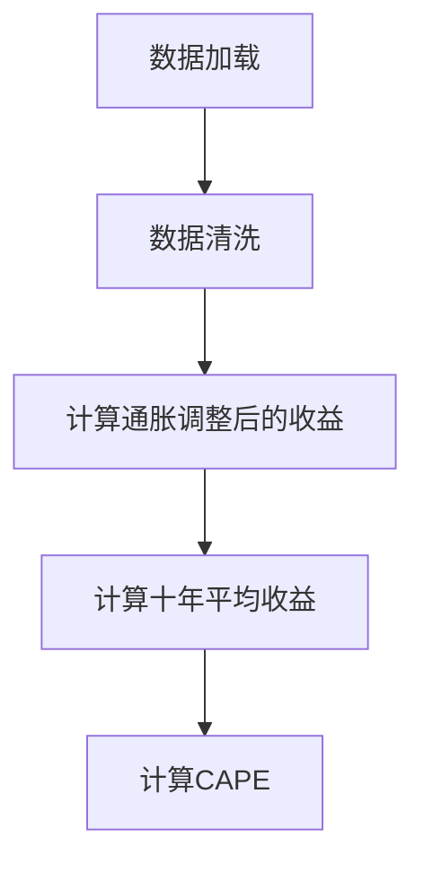
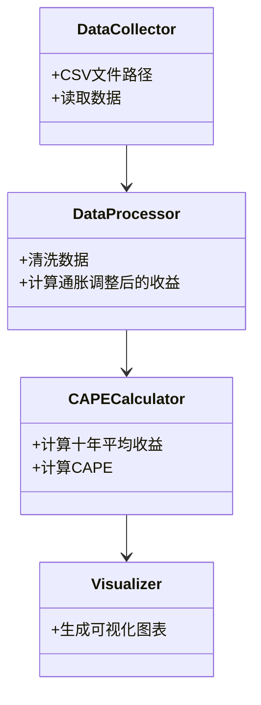

                 


# 罗伯特·希勒的周期性调整市盈率(CAPE)指标

> 关键词：周期性调整市盈率, 市场估值, 罗伯特·希勒, 经济指标, 投资分析

> 摘要：本文深入探讨了罗伯特·希勒提出的周期性调整市盈率(CAPE)指标，分析其定义、计算方法、经济理论基础及实际应用。通过详细讲解CAPE的数学模型、算法实现和系统架构，结合具体案例，展示了如何利用该指标进行市场估值和投资决策。

---

## 第一部分: 引言

### 第1章: 研究背景与意义

#### 1.1 传统市盈率的局限性
- **问题背景**：传统市盈率（P/E）仅基于最近一个财年的净利润计算，无法反映长期市场波动和经济周期的影响。
- **市场波动的挑战**：市盈率在市场泡沫或衰退时可能失真，难以提供可靠的长期估值参考。
- **希勒的贡献**：罗伯特·希勒提出CAPE，通过十年平均通胀调整后的收益，解决了传统市盈率的局限性。

#### 1.2 研究目标与方法
- **目标**：分析CAPE的定义、公式及其在市场估值中的应用。
- **方法**：结合实证分析和数学推导，验证CAPE的有效性。

---

## 第二部分: 周期性调整市盈率(CAPE)的定义与公式

### 第2章: 定义与公式

#### 2.1 市盈率的基本概念
- **定义**：市盈率=股票价格/每股收益（EPS）。
- **公式**：P/E = Stock Price / Earnings Per Share。

#### 2.2 希勒CAPE的提出
- **定义**：CAPE=股票价格/过去十年平均通胀调整后的每股收益。
- **公式**：CAPE = Stock Price / (Average Earnings Per Share * Inflation Adjuster)。

#### 2.3 与传统市盈率的对比
- **计算差异**：CAPE使用十年平均收益，传统市盈率使用单年收益。
- **适用场景**：CAPE适用于长期估值，传统市盈率适用于短期分析。

---

## 第三部分: 希勒CAPE的经济理论基础

### 第3章: 经济理论与数学模型

#### 3.1 市场估值与长期收益分析
- **长期收益**：CAPE通过十年平均收益，反映市场周期性波动。
- **公式推导**：CAPE考虑通胀调整，确保收益的真实性和可比性。

#### 3.2 消费者价格指数(CPI)与通胀调整
- **CPI定义**：衡量一篮子商品和服务的价格变化。
- **通胀调整**：将历史收益调整为当前购买力，消除通胀影响。

#### 3.3 市场周期性波动的理论基础
- **周期性波动**：市场受经济周期影响，CAPE能捕捉长期趋势。
- **应用价值**：CAPE在市场泡沫识别中表现优异。

---

## 第四部分: 希勒CAPE的数学模型与公式

### 第4章: 数学推导与实证分析

#### 4.1 数学模型
- **CAPE公式**：CAPE = P / (E1 + E2 + ... + E10) * 1/10，其中E为通胀调整后的收益。
- **通胀调整**：使用CPI指数调整历史收益，确保可比性。

#### 4.2 实证分析
- **数据来源**：使用标普500指数的历史数据。
- **分析结果**：CAPE在预测市场泡沫中的有效性。

---

## 第五部分: 希勒CAPE的算法实现与代码解析

### 第5章: 数据处理与算法实现

#### 5.1 数据收集与预处理
- **数据清洗**：处理缺失值和异常值。
- **数据格式转换**：将历史收益和CPI数据转化为可计算格式。

#### 5.2 算法实现
- **Python代码**：读取数据、计算通胀调整后的收益、计算CAPE。

```python
import pandas as pd
import numpy as np

# 加载数据
data = pd.read_csv('sp500_data.csv')

# 计算通胀调整后的收益
inflation_adjusted_earnings = data['Earnings'] / data['CPI'].cumprod()

# 计算过去十年平均收益
ten_year_avg = inflation_adjusted_earnings.rolling(10).mean()

# 计算CAPE
cape = data['Price'] / ten_year_avg
```

#### 5.3 算法流程图


---

## 第六部分: 系统分析与架构设计

### 第6章: 系统架构与实现

#### 6.1 系统功能设计
- **需求分析**：用户需要计算CAPE并进行市场估值。
- **功能模块**：数据采集、数据处理、CAPE计算、结果可视化。

#### 6.2 系统架构设计


#### 6.3 接口设计
- **输入接口**：读取CSV文件。
- **输出接口**：生成CAPE值和可视化图表。

---

## 第七部分: 项目实战

### 第7章: 实战案例分析

#### 7.1 环境安装
- **Python环境**：安装pandas、numpy、matplotlib。

#### 7.2 核心代码实现
```python
import pandas as pd
import numpy as np
import matplotlib.pyplot as plt

# 数据加载与清洗
data = pd.read_csv('sp500_data.csv').dropna()

# 计算通胀调整后的收益
inflation_adjusted = data['Earnings'] / data['CPI'].cumprod()

# 计算十年平均收益
ten_year_avg = inflation_adjusted.rolling(10).mean()

# 计算CAPE
cape = data['Price'] / ten_year_avg

# 可视化
plt.figure(figsize=(10, 6))
plt.plot(cape.index, cape.values, label='CAPE')
plt.xlabel('Year')
plt.ylabel('CAPE Value')
plt.title('Periodic Adjusted Earnings Price Ratio')
plt.legend()
plt.show()
```

#### 7.3 案例分析
- **案例背景**：分析标普500指数的CAPE值。
- **分析结果**：识别市场泡沫和低估区域。

---

## 第八部分: 总结与展望

### 第8章: 总结

#### 8.1 最佳实践
- **数据处理**：确保数据的准确性和完整性。
- **代码优化**：使用并行计算加速数据处理。

#### 8.2 小结
- **核心要点**：CAPE通过长期平均收益和通胀调整，提供可靠的市场估值。
- **注意事项**：结合其他指标进行综合分析。

#### 8.3 拓展阅读
- **相关文献**：罗伯特·希勒的《非理性繁荣》。
- **其他指标**：学习Shiller R、市净率等估值指标。

---

通过以上结构，我们可以系统地理解希勒的CAPE指标，并在实际投资分析中应用。

