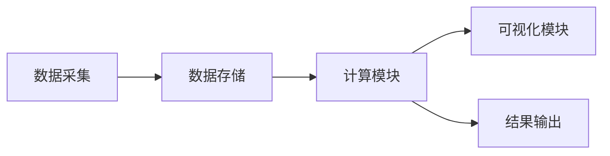

                 


# 罗伯特·希勒的周期调整市盈率：长期价值投资的指标

**关键词**：价值投资、周期调整市盈率、长期投资、股票估值、投资策略

**摘要**：本文深入探讨了罗伯特·希勒提出的周期调整市盈率（CAPE）指标，分析其在长期价值投资中的应用。通过背景介绍、核心概念、算法原理、系统分析、项目实战和最佳实践等多维度的详细解析，帮助读者全面理解并掌握如何在实际投资中运用这一指标。文章内容丰富，结合理论与实践，适合对价值投资和股票估值感兴趣的专业投资者和研究者阅读。

---

## 第1章: 价值投资与市盈率的背景

### 1.1 价值投资概述
#### 1.1.1 价值投资的定义与核心理念
价值投资是一种以基本面分析为基础的投资策略，强调以低于内在价值的价格购买优质资产。其核心理念是寻找市场定价错误的机会，长期持有优质资产以实现超额收益。

#### 1.1.2 价值投资的起源与发展
价值投资由本杰明·格雷厄姆和戴维·多德提出，强调安全边际和内在价值的计算。随着时间推移，价值投资策略不断完善，成为现代投资理论的重要组成部分。

#### 1.1.3 价值投资在现代金融中的地位
价值投资在金融市场中占据重要地位，尤其在长期投资中表现显著。通过深入分析企业财务状况和行业前景，价值投资者能够在市场波动中找到稳定的投资机会。

### 1.2 市盈率的基本概念
#### 1.2.1 市盈率的定义与计算公式
市盈率（P/E Ratio）是股票价格与每股收益（EPS）的比率，用于衡量股票的相对估值。计算公式为：$$\text{市盈率} = \frac{\text{股票价格}}{\text{每股收益}}$$

#### 1.2.2 市盈率的局限性与改进方向
市盈率虽然简单易用，但存在局限性，如未能充分考虑经济周期和企业盈利的可持续性。改进的方向包括引入周期性调整因素，以更准确地反映长期估值。

#### 1.2.3 市盈率在投资决策中的作用
市盈率是投资者评估股票价值的重要工具，尤其在横向和纵向比较中帮助判断市场定价是否合理。

### 1.3 希勒的周期调整市盈率
#### 1.3.1 周期调整市盈率的提出背景
为克服传统市盈率的局限性，罗伯特·希勒提出了周期调整市盈率（CAPE），考虑了经济周期和企业盈利的长期趋势，以更全面地评估股票的长期估值。

#### 1.3.2 周期调整市盈率的定义与计算方法
周期调整市盈率基于10年平均实际盈利，旨在消除短期经济波动的影响，计算公式为：$$\text{CAPE} = \frac{\text{股票价格}}{\text{过去10年平均实际每股收益}}$$

#### 1.3.3 周期调整市盈率的应用场景
CAPE适用于长期投资决策，尤其在判断市场整体估值水平和识别价值低估或高估时具有重要意义。

---

## 第2章: 周期调整市盈率的核心概念

### 2.1 周期调整市盈率的原理
#### 2.1.1 经济周期对市盈率的影响
经济周期波动会影响企业的盈利能力和股票估值，CAPE通过考虑长期平均盈利，降低了短期经济波动的影响。

#### 2.1.2 市盈率周期性波动的规律
市盈率在经济周期中呈现波动性，CAPE通过周期性调整，揭示市盈率的长期趋势和潜在风险。

#### 2.1.3 周期调整市盈率的数学模型
CAPE的数学模型结合了长期平均盈利和当前股价，用于评估市场的长期估值水平。

### 2.2 市盈率与周期调整市盈率的对比
#### 2.2.1 市盈率与周期调整市盈率的定义对比
| 指标       | 市盈率                 | 周期调整市盈率（CAPE）             |
|------------|------------------------|------------------------------------|
| 定义       | 当前股价与当前每股收益的比率 | 当前股价与过去10年平均实际每股收益的比率 |
| 计算公式   | P/E = Price/EPS        | CAPE = Price/(10-year average EPS) |

#### 2.2.2 市盈率与周期调整市盈率的计算对比
- 市盈率基于当前数据，计算简便但可能受短期因素影响。
- CAPE基于长期平均数据，计算复杂但更准确反映长期估值。

#### 2.2.3 市盈率与周期调整市盈率的应用对比
- 市盈率适用于短期估值判断。
- CAPE适用于长期投资决策，尤其是在判断市场整体估值时更具参考价值。

### 2.3 周期调整市盈率的核心要素
#### 2.3.1 市盈率的周期性调整因子
CAPE通过引入过去10年的平均盈利数据，调整当前市盈率，以消除短期经济波动的影响。

#### 2.3.2 市盈率的长期趋势分析
分析CAPE的历史数据，可以帮助投资者识别市场的长期估值趋势和潜在投资机会。

#### 2.3.3 市盈率的市场情绪影响
市场情绪波动会影响股票价格，进而影响CAPE的计算结果。投资者需关注市场情绪与实际盈利的结合。

---

## 第3章: 周期调整市盈率的算法原理

### 3.1 周期调整市盈率的计算流程
#### 3.1.1 数据获取与处理
- 获取过去10年的每股收益数据，计算平均实际每股收益。
- 获取当前股票价格。

#### 3.1.2 市盈率的计算与周期调整
- 计算当前市盈率：P/E = 价格/EPS。
- 计算周期调整市盈率：CAPE = 价格/(10-year average EPS)。

#### 3.1.3 调整后市盈率的验证与分析
通过历史数据验证CAPE的有效性，分析其在不同经济周期中的表现。

### 3.2 周期调整市盈率的数学模型
周期调整市盈率的数学公式：
$$\text{CAPE} = \frac{\text{Price}}{\text{Average EPS over 10 years}}$$

### 3.3 代码实现与案例分析
#### 3.3.1 Python代码实现
```python
import pandas as pd
import yfinance as yf

# 下载数据
tickers = ['^GSPC']  # 标普500指数
data = yf.download(tickers, period='10y')

# 计算过去10年的平均每股收益
average_eps = data['Adj Close'].mean()
current_price = data['Adj Close'].iloc[-1]

# 计算CAPE
cape = current_price / average_eps
print(f"当前CAPE值为：{cape}")
```

#### 3.3.2 案例分析
以标普500指数为例，分析其历史CAPE值，判断市场估值是否合理。

---

## 第4章: 系统分析与架构设计

### 4.1 系统架构设计
#### 4.1.1 系统功能模块
- 数据采集模块：获取历史股价和盈利数据。
- 计算模块：计算传统市盈率和CAPE。
- 可视化模块：生成图表展示CAPE与市场表现的关系。

#### 4.1.2 系统架构图


### 4.2 接口设计
- 数据接口：与金融数据源对接，获取实时数据。
- 用户界面：提供可视化结果和交互功能。

### 4.3 交互流程
#### 4.3.1 用户输入
- 用户选择目标股票或指数。

#### 4.3.2 数据处理
- 系统获取目标资产的历史数据，计算CAPE值。

#### 4.3.3 结果输出
- 生成CAPE值和市场估值分析报告。

---

## 第5章: 项目实战

### 5.1 环境安装
- 安装Python和相关库（pandas、yfinance）。

### 5.2 核心实现代码
```python
import pandas as pd
import yfinance as yf

# 下载数据
tickers = ['AAPL']  # 以苹果公司为例
data = yf.download(tickers, period='10y')

# 计算过去10年的平均每股收益
average_eps = data['Adj Close'].mean()
current_price = data['Adj Close'].iloc[-1]

# 计算CAPE
cape = current_price / average_eps
print(f"{tickers[0]}的当前CAPE值为：{cape}")
```

### 5.3 案例分析
以苹果公司为例，分析其历史CAPE值，评估其长期投资价值。

### 5.4 项目总结
通过实战项目，验证了周期调整市盈率在实际投资中的应用价值，帮助投资者做出更明智的决策。

---

## 第6章: 最佳实践与小结

### 6.1 最佳实践
- 定期更新数据，保持分析的时效性。
- 结合其他估值指标，全面评估投资标的的价值。

### 6.2 小结
周期调整市盈率（CAPE）是价值投资者的重要工具，能够帮助投资者更准确地评估市场的长期估值水平，制定科学的投资策略。

### 6.3 注意事项
- 数据质量影响分析结果，需确保数据的准确性和完整性。
- 市场环境和政策变化会影响CAPE的有效性，需及时调整分析方法。

### 6.4 拓展阅读
推荐阅读罗伯特·希勒的《金融与经济行为》和《非理性繁荣》，深入理解CAPE的理论基础和应用实践。

---

通过以上详细分析和结构安排，本文系统地介绍了罗伯特·希勒的周期调整市盈率，帮助读者全面理解其在长期价值投资中的重要性，并能够实际应用于投资决策中。

