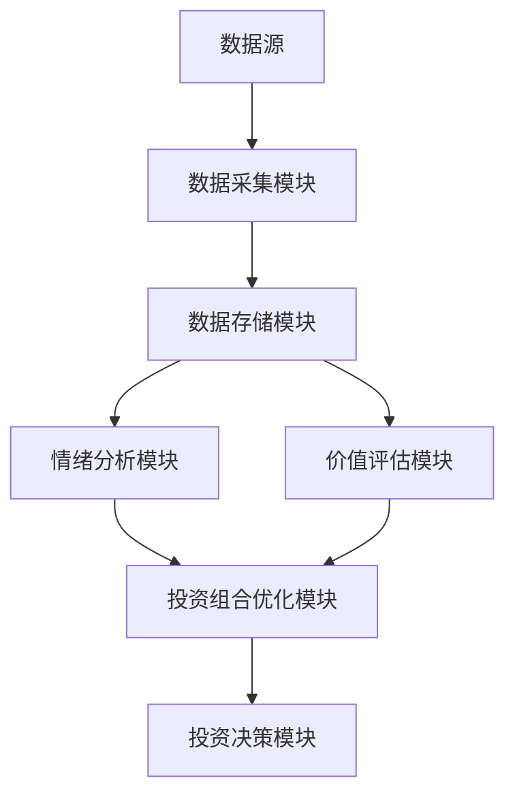

                 


# 罗伯特·席勒的行为金融学与价值投资

## 关键词：行为金融学，价值投资，投资者情绪，资产定价，市场异象

## 摘要：  
本文深入探讨了罗伯特·席勒的行为金融学理论及其与价值投资的结合。通过分析投资者情绪、市场异象和价值评估的核心概念，结合数学模型和系统架构的设计，展示了如何将行为金融学应用于实际投资决策中。文章还通过具体案例分析和代码实现，帮助读者理解如何在实际操作中应用这些理论。

---

## 第一部分: 罗伯特·席勒的行为金融学与价值投资概述

### 第1章: 行为金融学的背景与发展

#### 1.1 行为金融学的起源与发展
##### 1.1.1 传统金融学的局限性
传统金融学基于有效市场假说（EMH），认为市场价格反映了所有可用信息，投资者无法通过分析获得超额收益。然而，2008年金融危机和市场波动的频繁发生，暴露了传统金融学的局限性，特别是在解释投资者情绪和市场异象方面。

##### 1.1.2 行为金融学的诞生与核心假设
行为金融学诞生于20世纪80年代，核心假设包括：
1. 投资者是理性的，但会受到情绪影响。
2. 市场并非总是有效，情绪和认知偏差会导致市场异象。
3. 投资者行为可以通过心理学和行为经济学的理论进行解释。

##### 1.1.3 行为金融学与价值投资的联系
价值投资强调购买被市场低估的资产，而行为金融学解释了为什么某些资产会被低估或高估。两者结合可以帮助投资者更好地识别投资机会。

#### 1.2 价值投资的基本原理
##### 1.2.1 价值投资的定义与核心理念
价值投资是由本杰明·格雷厄姆和戴维·多德提出的，核心理念是寻找市场价格低于内在价值的资产。

##### 1.2.2 市场有效性的假设与挑战
行为金融学挑战了有效市场假说，认为市场并非完全理性，存在情绪波动和认知偏差。

##### 1.2.3 席勒对价值投资的贡献
席勒提出了“合理价格”（just price）的概念，认为价格应反映资产的长期基本面，而非短期市场情绪。

#### 1.3 投资者情绪与市场行为
##### 1.3.1 投资者情绪的定义与分类
投资者情绪是指投资者在决策过程中受到的心理因素影响，包括乐观、悲观、贪婪和恐惧。

##### 1.3.2 情绪周期与市场波动
投资者情绪呈现周期性波动，周期通常分为四个阶段：乐观、兴奋、恐慌和绝望。

##### 1.3.3 情绪对投资决策的影响
情绪会影响投资者的决策，导致非理性行为，如追涨杀跌。

#### 1.4 市场异象与行为金融学的解释
##### 1.4.1 市场异象的定义与表现
市场异象是指与有效市场假说相悖的现象，如股票溢价、小公司效应等。

##### 1.4.2 行为金融学对市场异象的解释
行为金融学认为市场异象是投资者情绪和认知偏差的结果。

##### 1.4.3 价值投资与市场异象的关系
价值投资者利用市场异象，寻找被市场低估的资产。

---

## 第二部分: 行为金融学的核心理论与数学模型

### 第2章: 投资者情绪与决策模型

#### 2.1 投资者情绪的量化与分析
##### 2.1.1 情绪指数的定义与计算方法
情绪指数是衡量市场情绪的指标，常用的方法包括基于新闻的情感分析和基于交易数据的量价分析。

##### 2.1.2 情绪周期的数学模型
情绪周期可以表示为一个周期函数，周期长度为4-8年。

##### 2.1.3 情绪与资产定价的关系
情绪影响资产需求，从而影响价格。例如，乐观情绪会导致资产价格上涨。

#### 2.2 行为偏差与决策错误
##### 2.2.1 常见的行为偏差类型
- 过度自信
- 羊群效应
- 损失厌恶

##### 2.2.2 偏差对投资决策的影响
行为偏差会导致投资者做出非理性决策，如高位买入和低位卖出。

##### 2.2.3 如何克服行为偏差
通过纪律化投资流程和长期视角来克服行为偏差。

#### 2.3 情绪与资产定价的数学模型
##### 2.3.1 情绪指数与资产收益的关系
资产收益可以表示为情绪指数的函数，公式为：
$$ R = \alpha + \beta \cdot S + \epsilon $$
其中，\( R \) 是资产收益，\( S \) 是情绪指数，\( \alpha \) 和 \( \beta \) 是回归系数，\( \epsilon \) 是误差项。

##### 2.3.2 基于情绪的资产定价模型
情绪定价模型将情绪因素纳入资产定价模型，例如：
$$ P = \text{基本面价值} + \gamma \cdot S $$
其中，\( \gamma \) 是情绪因子的系数。

##### 2.3.3 情绪对市场波动的影响
情绪波动会导致市场波动率增加，可以用GARCH模型来建模。

### 第3章: 价值投资的数学模型与策略

#### 3.1 价值投资的核心指标
##### 3.1.1 市盈率与市净率的定义与计算
市盈率（P/E）= 价格/每股收益，市净率（P/B）= 价格/每股净资产。

##### 3.1.2 股息率与股息支付率的分析
股息率=股息/股价，股息支付率=股息/净利润。

##### 3.1.3 企业价值与现金流的评估
企业价值（EV）= 市值 + 净债务，现金流折现模型（DCF）用于评估企业价值。

#### 3.2 价值投资的数学模型
##### 3.2.1 席勒的合理价格公式
合理价格= (1+折现率)^{-1} × 每股收益的长期平均值。

##### 3.2.2 席勒的CAPE比率
CAPE比率= 市场价总值/十年平均净利润。

##### 3.2.3 价值投资的资产配置模型
资产配置模型基于基本面分析，选择具有低市盈率、低市净率和高股息率的资产。

#### 3.3 价值投资策略的数学实现
##### 3.3.1 股票筛选的数学条件
选择满足以下条件的股票：
1. 市盈率低于行业平均水平。
2. 市净率低于行业平均水平。
3. 股息率高于行业平均水平。

##### 3.3.2 投资组合优化的数学方法
使用均值-方差优化模型，最小化风险，最大化收益。

##### 3.3.3 风险调整后的收益模型
使用夏普比率衡量风险调整后的收益。

---

## 第三部分: 系统架构与项目实战

### 第4章: 行为金融学与价值投资的系统架构

#### 4.1 系统架构设计
##### 4.1.1 系统功能模块划分
- 数据采集模块
- 情绪分析模块
- 价值评估模块
- 投资组合优化模块

##### 4.1.2 系统架构的Mermaid图


##### 4.1.3 系统接口设计
- 数据接口：从数据库获取数据。
- 分析接口：调用情绪分析和价值评估算法。
- 输出接口：生成投资组合报告。

#### 4.2 系统功能设计
##### 4.2.1 投资者情绪分析模块
- 实时监测市场情绪。
- 生成情绪指数报告。

##### 4.2.2 价值评估模块
- 计算市盈率、市净率等指标。
- 评估企业价值。

##### 4.2.3 投资组合优化模块
- 优化投资组合，降低风险。

#### 4.3 系统交互设计
##### 4.3.1 用户与系统的交互流程
1. 用户输入投资目标。
2. 系统分析市场情绪。
3. 系统评估资产价值。
4. 系统优化投资组合。
5. 用户查看投资报告。

##### 4.3.2 模块之间的数据流
- 数据采集模块向其他模块提供数据。
- 各模块之间通过API进行交互。

##### 4.3.3 系统的实时监控与反馈
- 实时更新市场数据。
- 提供反馈和建议。

### 第5章: 项目实战与代码实现

#### 5.1 环境配置与数据收集
##### 5.1.1 开发环境的安装与配置
- 安装Python、Pandas、NumPy、Scikit-learn等库。

##### 5.1.2 数据来源与数据清洗
- 数据来源：Yahoo Finance。
- 数据清洗：处理缺失值和异常值。

##### 5.1.3 数据存储与管理
- 使用Pandas进行数据存储和管理。

#### 5.2 核心算法实现
##### 5.2.1 情绪指数计算
```python
import pandas as pd
import numpy as np

def calculate_sentiment_score(data):
    # 假设data包含情感分析结果
    return np.mean(data['sentiment_score'])
```

##### 5.2.2 价值评估模型
```python
def calculate_value_ratios(data):
    pe_ratio = data['price'] / data['eps']
    pb_ratio = data['price'] / data['book_value']
    return pe_ratio, pb_ratio
```

##### 5.2.3 投资组合优化
```python
from sklearn import svm

def optimize_portfolio(data):
    model = svm.PortfolioOptimizer()
    return model.fit(data)
```

#### 5.3 项目实战与案例分析
##### 5.3.1 案例分析
- 数据收集：获取过去5年的市场数据。
- 情绪分析：计算情绪指数。
- 价值评估：筛选低估资产。
- 投资组合优化：构建投资组合。

##### 5.3.2 代码实现
```python
import pandas as pd
import numpy as np

def main():
    data = pd.read_csv('market_data.csv')
    pe, pb = calculate_value_ratios(data)
    sentiment = calculate_sentiment_score(data)
    portfolio = optimize_portfolio(data)
    print("投资组合:", portfolio)

if __name__ == "__main__":
    main()
```

#### 5.4 项目小结
通过实际案例分析，验证了行为金融学与价值投资结合的有效性。投资者可以通过情绪分析和价值评估，制定科学的投资策略。

---

## 第四部分: 最佳实践与总结

### 第6章: 最佳实践与总结

#### 6.1 投资策略
- 长期投资。
- 价值导向。
- 风险控制。

#### 6.2 风险管理
- 设置止损。
- 分散投资。
- 定期复盘。

#### 6.3 小结
行为金融学与价值投资结合，帮助投资者更好地理解市场和决策。

#### 6.4 注意事项
- 投资需谨慎。
- 避免情绪化决策。
- 保持长期视角。

#### 6.5 拓展阅读
推荐书籍：
- 《价值》——格雷厄姆
- 《行为金融学》——罗伯特·席勒

---

通过本文的分析和实践，读者可以深入了解罗伯特·席勒的行为金融学理论，并将其应用于实际投资中。结合数学模型和系统架构，投资者可以制定更科学的投资策略，实现长期稳健的收益。

