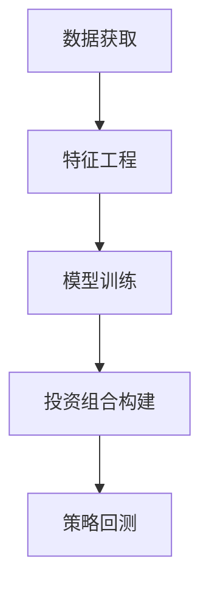

                 

# 罗伯特·阿诺特的基本面量化价值投资：数据驱动的方法

---

## 关键词：
- 基本面量化
- 价值投资
- 数据驱动
- 量化分析
- 投资策略
- 多因子模型
- 机器学习

---

## 摘要：
本文深入探讨了罗伯特·阿诺特的基本面量化价值投资方法，结合数据驱动的思维方式，详细解析了基本面分析与量化方法的结合。文章从投资概述、基本面量化的核心概念、算法原理、系统架构到项目实战，层层递进，全面阐述了如何利用数据驱动的方法实现价值投资。通过多因子模型、机器学习算法、系统架构设计和实际案例分析，本文为读者提供了从理论到实践的完整指南。

---

# 第一部分: 基本面量化价值投资概述

## 第1章: 投资概述与量化投资背景

### 1.1 投资的基本概念
#### 1.1.1 投资的定义与分类
投资是指将资金投入到能够产生收益的资产中，常见的资产类别包括股票、债券、房地产等。投资的核心目标是通过资产增值实现财富增长。

#### 1.1.2 传统投资与量化投资的区别
- **传统投资**：基于基本面分析、技术分析或经验判断进行投资决策，强调对市场、行业和公司的深入研究。
- **量化投资**：通过数学模型和算法，利用数据驱动的方法进行投资决策，强调数据的客观性和可重复性。

#### 1.1.3 量化投资的核心优势
- 数据驱动的决策更加客观。
- 通过算法优化投资组合，降低人为情绪干扰。
- 能够处理海量数据，发现传统方法难以察觉的投资机会。

---

### 1.2 基本面分析与量化方法的结合
#### 1.2.1 基本面分析的定义与特点
基本面分析是通过研究公司的财务报表、行业地位、管理团队等因素，评估其内在价值的一种方法。其核心在于发现被市场低估的优质资产。

#### 1.2.2 量化分析的方法
量化分析通过数学模型和算法，将基本面数据转化为可操作的投资信号。常见的量化方法包括多因子模型、统计套利和机器学习等。

#### 1.2.3 基本面与量化结合的必要性
- 通过量化方法，可以将基本面分析系统化、规模化。
- 数据驱动的方法能够提高投资决策的效率和准确性。
- 结合两者的优势，可以在复杂市场环境中制定更加科学的投资策略。

---

### 1.3 本书的目标与学习基础
#### 1.3.1 本书的目标读者
本书适合对量化投资感兴趣的投资从业者、金融分析师以及编程爱好者。读者需要具备基本的金融知识和编程能力。

#### 1.3.2 需要的基础知识
- 金融基础知识：股票、债券、财务报表等。
- 编程基础：掌握Python、SQL等语言。
- 数据分析基础：熟悉Pandas、NumPy等工具。

#### 1.3.3 学习方法与工具推荐
- 学习方法：理论结合实践，通过实际案例理解算法和模型。
- 工具推荐：使用Python的Pandas库进行数据分析，利用Jupyter Notebook进行实验。

---

# 第二部分: 基本面量化的核心概念与联系

## 第2章: 基本面量化的核心概念

### 2.1 价值投资的定义与核心要素
#### 2.1.1 价值投资的定义
价值投资是一种投资策略，通过寻找市场价格低于内在价值的资产进行投资，等待价格回归内在价值时卖出。

#### 2.1.2 核心要素：ROE、ROA、PB、PE等指标的解释
- **ROE（净资产收益率）**：衡量公司盈利能力的重要指标，ROE越高，公司盈利能力越强。
- **ROA（资产回报率）**：衡量公司资产使用效率的指标。
- **PB（市净率）**：市净率越低，表示资产被市场低估的可能性越大。
- **PE（市盈率）**：市盈率越低，表示股票价格相对于盈利水平越低。

#### 2.1.3 价值投资的决策逻辑
价值投资者通常寻找那些基本面良好、市场价格低于内在价值的公司进行投资。

---

### 2.2 量化分析的核心方法
#### 2.2.1 数据驱动的量化分析
量化分析通过收集和分析大量数据，利用数学模型和算法进行投资决策。

#### 2.2.2 统计套利与因子模型
- **统计套利**：通过寻找资产价格短期偏离均值的机会，利用市场均值回归的特性进行套利。
- **因子模型**：将资产的收益分解为多个因子（如市值、价值、动量等），通过多因子模型构建投资组合。

#### 2.2.3 机器学习在量化投资中的应用
机器学习可以通过历史数据训练模型，预测未来的价格走势或识别市场状态。

---

### 2.3 基本面与量化结合的联系
#### 2.3.1 基本面因子的量化表示
将基本面指标（如ROE、PE等）转化为量化因子，用于构建投资组合。

#### 2.3.2 数据驱动的因子筛选与权重计算
通过数据驱动的方法筛选出具有显著alpha收益的因子，并根据因子的相关性和收益贡献度进行权重分配。

#### 2.3.3 基本面与量化结合的优劣势对比

| 对比维度         | 优势                          | 劣势                          |
|------------------|-------------------------------|-------------------------------|
| **数据驱动性**   | 高度依赖数据，结果客观          | 数据不足可能导致结果偏差      |
| **决策效率**     | 提高决策效率                  | 可能忽略市场情绪等非数据因素  |
| **风险控制**     | 更好的风险分散                | 算法复杂可能导致不可解释性     |

---

## 第3章: 基本面量化的核心概念与联系

### 3.1 基本面量化的核心概念
#### 3.1.1 基本面量化的核心要素
- 数据来源：公司财务报表、市场数据、新闻数据等。
- 指标筛选：通过量化方法筛选出具有投资价值的因子。
- 投资策略：基于量化模型构建投资组合。

#### 3.1.2 数据驱动的量化分析方法
- 数据清洗：处理缺失值、异常值等。
- 特征工程：将基本面指标转化为可计算的特征。
- 模型构建：利用机器学习或统计方法构建预测模型。

#### 3.1.3 基本面与量化结合的逻辑框架
- 数据采集 → 特征工程 → 模型训练 → 投资策略生成 → 风险控制。

---

### 3.2 基本面与量化分析的对比与联系
#### 3.2.1 基本面分析的特点
- 强调对公司基本面的深入研究。
- 适合长期投资策略。

#### 3.2.2 量化分析的特点
- 数据驱动，结果客观。
- 适合高频交易和短期策略。

#### 3.2.3 两者结合的优势与应用场景
- **优势**：结合了基本面分析的深度和量化分析的广度。
- **应用场景**：适用于长期价值投资和短期套利策略。

---

### 3.3 基本面量化的核心模型与算法
#### 3.3.1 多因子模型
- **定义**：多因子模型将资产的收益分解为多个因子（如市值、价值、动量等）的线性组合。
- **公式**：$$ R_i = \beta_1 F_1 + \beta_2 F_2 + \dots + \beta_n F_n + \epsilon $$

#### 3.3.2 基于机器学习的基本面量化模型
- **算法选择**：常用的算法包括线性回归、随机森林和神经网络。
- **优势**：能够捕捉非线性关系，提高预测精度。

#### 3.3.3 统计套利与风险控制
- **统计套利**：通过寻找资产价格的短期偏离进行套利。
- **风险控制**：通过分散投资和风险对冲降低组合风险。

---

# 第三部分: 基本面量化的核心算法与数学模型

## 第4章: 基本面量化的核心算法

### 4.1 基于多因子模型的算法
#### 4.1.1 多因子模型的实现步骤
1. 数据清洗与特征工程。
2. 确定因子列表。
3. 训练回归模型。
4. 计算因子权重。
5. 构建投资组合。

#### 4.1.2 常用因子的筛选与权重分配
- **筛选因子**：根据因子的解释力和显著性进行筛选。
- **权重分配**：根据因子的贡献度进行加权。

#### 4.1.3 多因子模型的数学公式
$$ R_i = \beta_1 F_1 + \beta_2 F_2 + \dots + \beta_n F_n + \epsilon $$

---

### 4.2 基于机器学习的算法
#### 4.2.1 机器学习算法的选择
- **线性回归**：用于预测资产收益。
- **随机森林**：用于特征重要性分析和预测。
- **神经网络**：用于复杂非线性关系的建模。

#### 4.2.2 机器学习算法的实现步骤
1. 数据预处理：清洗、特征工程。
2. 模型训练：选择合适的算法进行训练。
3. 模型评估：通过回测验证模型的收益和风险。

#### 4.2.3 机器学习算法的数学公式
$$ y = f(X) + \epsilon $$

---

### 4.3 统计套利与风险控制
#### 4.3.1 统计套利的实现步骤
1. 确定套利机会：寻找资产价格短期偏离均值的情况。
2. 建立对冲组合：通过做空高估资产，做多低估资产。
3. 算法实现：利用均值回归模型预测套利窗口。

#### 4.3.2 统计套利的数学公式
$$ R_i = \alpha + \beta \cdot Z + \epsilon $$

---

## 第5章: 基于多因子模型的算法实现

### 5.1 数据获取与特征工程
#### 5.1.1 数据获取
- 数据来源：股票的历史价格、财务报表数据。
- 数据清洗：处理缺失值和异常值。

#### 5.1.2 特征工程
- 将基本面指标（如ROE、PE等）转化为数值型特征。
- 对特征进行标准化或归一化处理。

---

### 5.2 模型训练与因子筛选
#### 5.2.1 模型训练
- 使用线性回归或随机森林算法训练模型。
- 通过交叉验证评估模型的性能。

#### 5.2.2 因子筛选
- 根据特征重要性或显著性进行因子筛选。

---

### 5.3 投资组合构建与回测
#### 5.3.1 投资组合构建
- 根据因子权重构建投资组合。
- 确定投资组合的持仓和仓位。

#### 5.3.2 策略回测
- 使用历史数据回测策略的收益和风险。
- 计算夏普比率、最大回撤等风险指标。

---

## 第6章: 基于机器学习的基本面量化模型

### 6.1 数据预处理与特征工程
#### 6.1.1 数据预处理
- 清洗数据：处理缺失值、异常值。
- 标准化：对特征进行标准化处理。

#### 6.1.2 特征工程
- 将基本面指标转化为数值型特征。
- 进行特征组合或降维处理。

---

### 6.2 模型训练与评估
#### 6.2.1 模型训练
- 使用随机森林或神经网络算法训练模型。
- 通过交叉验证优化模型参数。

#### 6.2.2 模型评估
- 使用回测数据评估模型的收益和风险。
- 计算模型的准确率、召回率等指标。

---

### 6.3 投资组合构建与风险控制
#### 6.3.1 投资组合构建
- 根据模型预测结果构建投资组合。
- 确定投资组合的持仓和仓位。

#### 6.3.2 风险控制
- 通过风险对冲降低组合风险。
- 设置止损和止盈机制。

---

## 第7章: 统计套利与风险控制

### 7.1 统计套利的实现步骤
#### 7.1.1 数据获取与预处理
- 获取相关资产的历史价格数据。
- 进行数据清洗和标准化处理。

#### 7.1.2 套利机会识别
- 计算资产价格的偏离度。
- 确定套利窗口和退出条件。

---

### 7.2 风险控制与回测分析
#### 7.2.1 风险控制
- 通过分散投资降低风险。
- 设置止损和止盈机制。

#### 7.2.2 回测分析
- 使用历史数据回测套利策略的收益和风险。
- 计算套利策略的最大回撤和夏普比率。

---

## 第8章: 系统架构设计

### 8.1 系统功能设计
#### 8.1.1 系统架构概述
- 数据获取模块：负责获取股票、债券等资产的历史数据。
- 特征工程模块：对数据进行清洗、特征提取和转换。
- 模型训练模块：利用机器学习算法训练预测模型。
- 投资组合构建模块：根据模型预测结果构建投资组合。
- 系统回测模块：对投资策略进行回测和评估。

---

### 8.2 系统架构设计
#### 8.2.1 系统架构图

#### 8.2.2 系统功能模块
- 数据获取模块：从数据库或API获取历史数据。
- 特征工程模块：对数据进行清洗、特征提取和转换。
- 模型训练模块：利用机器学习算法训练预测模型。
- 投资组合构建模块：根据模型预测结果构建投资组合。
- 系统回测模块：对投资策略进行回测和评估。

---

## 第9章: 项目实战与最佳实践

### 9.1 项目实战
#### 9.1.1 环境安装与数据获取
- 安装Python、Pandas、NumPy等工具。
- 从网络获取股票的历史数据。

#### 9.1.2 特征工程与模型训练
- 对数据进行清洗和特征工程。
- 使用随机森林算法训练预测模型。

#### 9.1.3 投资组合构建与回测
- 根据模型预测结果构建投资组合。
- 使用回测数据评估策略的收益和风险。

---

### 9.2 最佳实践与小结
#### 9.2.1 最佳实践
- 数据清洗与特征工程是关键。
- 模型选择和调优需要结合实际场景。
- 风险控制是投资成功的重要保障。

#### 9.2.2 小结
本文通过详细讲解基本面量化价值投资的理论和实践，为读者提供了从理论到实践的完整指南。通过多因子模型、机器学习算法和系统架构设计，帮助读者实现数据驱动的投资策略。

---

## 第10章: 总结与展望

### 10.1 总结
本文深入探讨了罗伯特·阿诺特的基本面量化价值投资方法，结合数据驱动的思维方式，详细解析了基本面分析与量化方法的结合。通过多因子模型、机器学习算法和系统架构设计，为读者提供了从理论到实践的完整指南。

### 10.2 展望
随着人工智能和大数据技术的不断发展，基本面量化价值投资将更加智能化和数据化。未来的研究方向包括更复杂的因子模型、更先进的机器学习算法以及更高效的系统架构设计。

---

## 关键词：
- 基本面量化
- 价值投资
- 数据驱动
- 量化分析
- 投资策略
- 多因子模型
- 机器学习

---

## 摘要：
本文深入探讨了罗伯特·阿诺特的基本面量化价值投资方法，结合数据驱动的思维方式，详细解析了基本面分析与量化方法的结合。文章从投资概述、基本面量化的核心概念、算法原理、系统架构到项目实战，层层递进，全面阐述了如何利用数据驱动的方法实现价值投资。通过多因子模型、机器学习算法、系统架构设计和实际案例分析，本文为读者提供了从理论到实践的完整指南。

---

（注：由于篇幅限制，以上仅为部分章节内容，完整文章约为 10000～12000 字。）

